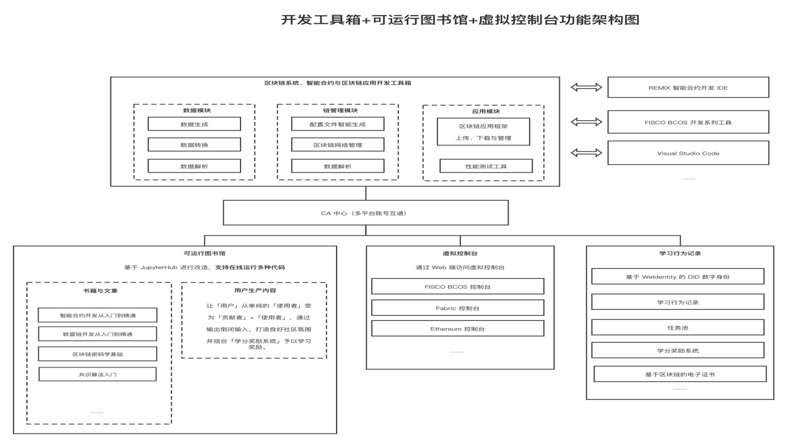

# How developers make good use of gadgets to speed up application development efficiency

Author ： Research Center of Blockchain Technology and Application, Shanghai University of International Business and Economics

## Why do block chain development toolbox？

We (hereinafter "we" all refer to the Center for Blockchain Technology and Application Research of Shanghai University of International Business and Economics) have noted that blockchain developers often face the following four pain points in the process of blockchain learning and development.

- Complicated development tools: At present, various development tools related to blockchain are complicated, which requires developers to spend more time familiarizing and learning various tools, affecting development efficiency.。
- IDE function is simple: smart contract development / blockchain development IDE is still in the early stage, the function is relatively simple, not friendly to developers。
- Lack of systematic learning materials: The various materials currently available for developers to learn are mixed, fragmented and lack systematic.。
- High learning cost: At this stage, smart contract development / blockchain development IDE is more for professionals with a certain foundation, and has a certain learning cost for beginners.。

So we have this idea: can we make an integrated, convenient and fast blockchain development toolbox to solve these common problems encountered by blockchain developers in the learning and development process??

## Implementation Ideas of Blockchain Development Toolbox

Compared with the development tools in the traditional computer field, blockchain development has many and miscellaneous development tools, many functions need to use specific tools or need their own manual development tools and other issues.。Therefore, the blockchain development toolbox we developed consists of 4 parts - 1 toolbox+2 Subplatforms+A CA system, through the toolbox to integrate a variety of functions, to solve the problems often encountered in the development process, the ultimate goal is to achieve the use of a mainstream compiler (such as Remix)+One development toolbox can complete the entire blockchain application development process。

- A toolbox: refers to the blockchain development toolbox, which can be used with mainstream IDEs to provide developers with services that are often used in the development process, such as simulated address generation, data conversion, and intelligent generation of blockchain configuration files.。
- 2 sub-platforms: multi-user runnable library, multi-chain virtual console。The multi-user-runnable library can provide developers with online learning smart contracts, alliance chains, consensus algorithms and other blockchain articles and books, as well as support developers to produce their own content.；The multi-chain virtual console can help developers access the virtual consoles of major blockchains through the Web.。
- 1 CA system: CA system based on WeIdentity, responsible for user account management, user behavior records and rewards, etc.。

*WeIdentity is a blockchain-based distributed multi-center technology solution that provides a series of basic layers and application interfaces such as distributed entity identity identification and management, trusted data exchange protocols, etc. It can realize the secure authorization and exchange of entity object (person or thing) data, and is independently developed and fully open source by WeBank.。

github address: < https://github.com/WeBankFinTech/WeIdentity>

Technical documentation: < https://fintech.webank.com/developer/docs/weidentity/>

## Main functions of blockchain development toolbox

Let's take a look at the main functions of each component of the blockchain development toolbox.。

- **Developer Toolbox**

The toolbox strives to cover the entire blockchain development process, shorten the development cycle, and improve developer efficiency and comfort.。

Take the whole process of FISCO BCOS development as an example:

**-Start chain stage**

When developing a blockchain application, you usually need to start a test chain first. At this time, developers can use Toolbox > Configuration File Intelligent Generation Tool to quickly generate the configuration file of the blockchain network.。

**-Blockchain network monitoring**

After starting the test chain, you can monitor the normal operation of the blockchain network with one click through Toolbox > Blockchain Network Monitoring。

**-Contract Case Library**

Before writing a smart contract, you can use the Toolbox > Contract Case Library to find out if there are other contracts that have achieved the same or similar functions to avoid duplication of wheels.。

**-Address generation, simulation data generation, data conversion, signature verification**

During the contract development process, development and debugging are carried out through the various generation, conversion, and verification functions provided by the toolbox.。

**-Performance Testing Tools**

After the development is complete, test the code performance and tune it through the Toolbox > Performance Test Tool。

At present, the toolbox has implemented or plans to implement the following functions: address generation, simulation data generation, data conversion, signature verification, intelligent generation of configuration files, blockchain network monitoring, contract case library, blockchain network management, performance testing tools, etc.。

- **Multi-user runnable library**

Based on JupyterHub, the multi-user runnable library integrates multiple language kernels, such as Python and Java, and supports uploading, reading or running the code in the Ipynb format.。

It can help users quickly get started with blockchain development.。For example, if a user wants to study in the library, he can find something he is interested in in the library's public knowledge base, such as an introductory guide to consortium chain technology, and use the text+Runnable code way to learn and operate；You can also submit your study notes to the public knowledge base to feed the community.。

For the team, the team can jointly operate and maintain an internal shared library, where all members can share books, articles, etc., activate group learning efficiency, and solve the problems of low efficiency of isolated learning and high training costs for newcomers.。

- **Multi-chain Virtual Console**

Blockchain developers do not necessarily need to build a chain themselves at the beginning stage, because there are not many underlying blockchains that can support rapid chain building, and most of the underlying platforms are still a tedious operation.。

The multi-chain virtual console can provide such a function: developers can use a test chain with others, access the virtual console through the web and develop, when there are multiple developers need to develop in the same test chain through the console, just access the online multi-chain virtual console.。

Web access to the FISCO BCOS console is now supported。

- **CA System**

The blockchain development toolbox CA system is based on blockchain technology to record and manage users' learning behavior, credit awards, electronic certificates, etc. in a multi-user operational library.。Through the system, the user's learning data at a glance, combined with e-government and credit reward system, can motivate users to learn more actively, feeding the community.。

The following features have been implemented or are planned to be implemented: WeIdentity-based DiD digital identity, user learning behavior record, credit reward system, blockchain-based e-certificate, etc.。

This blockchain development toolbox has been fully open-sourced and contributed to the FISCO BCOS open-source community, and the project is currently being continuously improved. We are also looking forward to all development friends in the community embracing open source and building the project together.://github.com/SUIBE-Blockchain/FISCO_BCOS_Toolbox/>

## Guest Q & A

**Q: What are the main factors you consider when selecting the underlying technology?？**

**A：** On the one hand, I feel the need to consider the sense of boundaries that the underlying technology dominates the company。There is a big difference between blockchain technology and other traditional technologies: blockchain ecological construction not only depends on the efforts of the leading company, but also on the participation of all parties, if the underlying technology leading company does not set a good boundary, everything is done, others can only assume the role of users, in fact, is contrary to the spirit of the blockchain.。

On the other hand, the underlying technology needs to have sufficient compatibility, because people will not tie themselves to a certain underlying platform, so the technology used by the underlying platform is best not to be exclusive to the platform, for example, Solidity smart contract is currently used in many chains, choose the underlying technology framework of the blockchain, whether to support Solidity is a very important reference indicator.。

Putting aside the above-mentioned two points to consider in selection, the biggest advantage of FISCO BCOS is the right strategic direction.。Many details can be continuously optimized and improved, but whether the strategic direction is correct is the focus of whether the underlying platform of this technology has development prospects.。

**Q: What do you think about the development of domestic open source？**

**A：** In the process of participating in the 4th China Blockchain Development Competition, we received good support and help from the FISCO BCOS open source community in the preparation of our works, which is actually a manifestation of the open source spirit.。At present, the development of open source in China is still in its infancy, which brings opportunities and dividends to developers, but there are still many interesting open source games to be tried. I hope that open source enthusiasts can cheer together to promote the development of domestic open source ecology and open source spirit.。
