# Ansible for FISCO BCOS + Webase-deploy efficiently builds enterprise-level production environment alliance chain
Author ： Wuque ｜ Xi'an R & D Center of Shenzhen Yingxing Chain Alliance Software Engineering Co., Ltd

## 1 Background Introduction
If a worker wants to do a good job, he must first sharpen his tools. I have the artifact in my hand！

### 1.1 Ansible for FISCO BCOS
Ansible for FISCO BCOS provides an ansible-playbook that automates the generation of enterprise profiles。The environment of 2 groups, 3 institutions and 6 nodes can generate configurations within 30 seconds (except the download time), which greatly simplifies the difficulty of deployment and avoids errors that are prone to manual configuration。

[Github Access Address](https://github.com/newtouch-cloud/ansible-for-fisco-bcos)

[Gitee Community Developers Provide Access Address](https://gitee.com/hailong99/ansible-for-fisco-bcos)

Gitee community developers provide source code download address https://gitee.com/hailong99/ansible-for-fisco-bcos.git

```
git clone https://gitee.com/hailong99/ansible-for-fisco-bcos.git
```

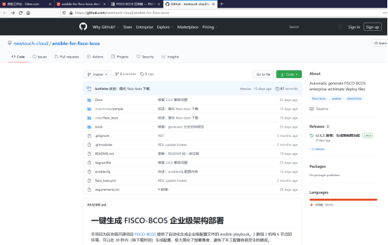

### 1.2 Webase-deploy
Deploying WeBASE with one click allows you to quickly build a WeBASE console environment on the same machine, facilitating users to quickly experience the WeBASE management platform。One-click deployment and construction: Node (FISCO-BCOS 2.0+), management platform (WeBASE-Web), node management subsystem (WeBASE-Node-Manager), node front subsystem (WeBASE-Front), signature service (WeBASE-Sign)。Among them, the construction of the node is optional, you can choose to use the existing chain or build a new chain through the configuration。

[Github Access Address](https://github.com/WeBankFinTech/WeBASE)

One-click download command
```
wget https://github.com/WeBankFinTech/WeBASELargeFiles/releases/download/v1.4.2/webase-deploy.zip
```
Gitee community developers provide source code download address https://gitee.com/hailong99/WeBASE.git

```
git clone https://gitee.com/hailong99/WeBASE.git
```


## 2 Experimental architecture design
### 2.1 Network topology design


## 3 Environmental preparation
### 3.1 Hardware preparation
Server A:
IP  192.168.9.11

System Centos8.3

Server B:
IP  192.168.9.207

System Centos7.6

Two servers in the same LAN, network access to each other is normal。

### 3.2 Software preparation
Both servers have basic components installed such as: OpenSSL, Java8, Python3, Git, Vim, etc。

Server A:
Database MySQL

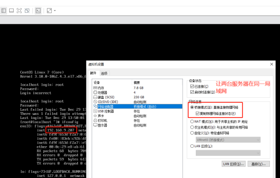


## 4 Use the Ansible tool to link
### 4.1 Download Ansible

```
git clone https://gitee.com/hailong99/ansible-for-fisco-bcos.git
```


### 4.2 Install Ansible
Follow the installation instructions in GitHub Access


```
python3 get-pip.py
```

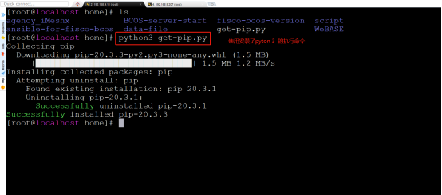

```
cd ansible-for-fisco-bcos/
pip install --user -U -r requirements.txt
```


```
pip install --user -U ansible
```


### 4.3 Alliance chain initialization
Copy an inventory configuration。Suppose the new environment is'my_inventory'。
```
cp -R inventories/sample inventories/my_inventory
```

### 4.4 Editing the init.yml Configuration File
```
nano inventories/my_inventory/group_vars/init.yml
或
vim inventories/my_inventory/group_vars/init.yml
```
After the field experiment path is: inventories / my _ inventory / group _ vars / all / init.yml


Edit chain attributes according to actual business requirements, such as binary file version, whether to generate console, and whether to generate SDK。The notes in the document are clearly written, combined with business understanding。


Edit the chain attributes according to the actual needs of the business, such as: organization, node, group。The notes in the document are clearly written, combined with business understanding。


### 4.5 Generate Architecture Diagram


```
ansible-playbook -i inventories/my_inventory/hosts.ini fisco_bcos.yml -t archimate
```

Relationship between institutions and groups:

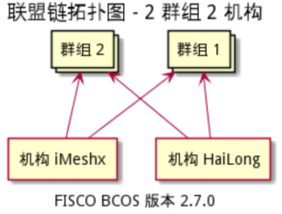

Configuration Diagram Generated by Institution iMeshx:


Configuration Diagram Generated by Institution HaiLong:


### 4.6 Generate the underlying files of the alliance chain

``` 
cd /home/ansible-for-fisco-bcos/
ansible-playbook -i inventories/my_inventory/hosts.ini fisco_bcos.yml
```


Generated Configuration Information

Note that after the command is executed, the node _ list.yml file will show that the organization and group have not been initialized. If you need to execute the command again, the group and organization have been initialized。


According to the configuration information, the underlying file of the alliance chain has been generated


### 4.7 Running Alliance Chain Underlying Services on Production Server

#### 4.7.1 Package overall organization documents first

```
cd /home/ansible-for-fisco-bcos/inventories/my_inventory/deploy
tar -zcf agency_HaiLong.tar.gz agency_HaiLong/
tar -zcf agency_iMeshx.tar.gz agency_iMeshx/
```


#### 4.7.2 Upload the packaged files to the corresponding alliance chain production server
```
cp -r agency_iMeshx.tar.gz /home/
```


192.168.9.207 The server is uploaded directly with the ssh terminal tool and moved to the planned path。


#### 4.7.3 Decompress the packaged organization file on the production server
```
tar -xf agency_iMeshx.tar.gz
```


#### 4.7.4 Start Node
```
cd /home/agency_iMeshx/fisco_deploy_agency_iMeshx
./start_all.sh
```

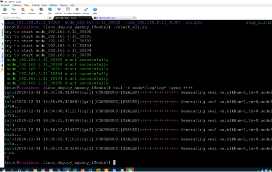

192.168.9.11 View consensus on server
```
cd /home/agency_iMeshx/fisco_deploy_agency_iMeshx
tail -f node*/log/log* |grep ++++
```


192.168.9.207 Start Node View Consensus on Server


So far, our two servers have completed the construction of the chain using the Ansible for FISCO BCOS artifact, in which the tool automatically completes the commands for generating and copying many files, which is very simple and efficient ^ _ ^!

## 5 Use the Webase-deploy tool to build Webase
The underlying service of the alliance chain already exists and needs to be managed by Webase
### 5.1 Install webase-deploy

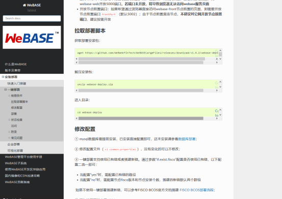

#### 5.1.1 Download webase-deploy
```
wget https://github.com/WeBankFinTech/WeBASELargeFiles/releases/download/v1.4.2/webase-deploy.zip
```


#### 5.1.2 Unzip webase-deploy
```
unzip webase-deploy.zip
```


### 5.2 Configure webase

#### 5.2.1 Configure each subsystem version information and database information
Edit the configuration file: / home / webase-deploy / common.properties
Follow the official tutorial and configuration file prompts to configure the subsystem version information and database information respectively。


#### 5.2.2 Configure the port number, encryption method, existing chain, certificate path and chain program version of each subsystem


#### 5.2.3 Document adjustment
(1) Copy / home / agency _ iMeshx / script / gm to / home / agency _ iMeshx / meta / sdk

(2) Copy / home / agency _ iMeshx / meta / sdk to the node directory / home / agency _ iMeshx / fisco _ deploy _ agency _ iMeshx

(3) Copy the three certificates under meta / sdk / to webase-front / conf(You need to execute the installation command to download the webase-front file before you can copy it successfully)

#### 5.2.4 Configuring Nginx
configure the proxy ip address and port number of nginx according to the plan


#### 5.2.5 Configure webase-front (you need to run the installation command to download the webase-front file before configuring)
The default IP address of SDK is 127.0.0.1, which needs to be changed to 192.168.9.11 and then saved


### 5.3 Installation and deployment
#### 5.3.1 Execute installation commands

```
cd /home/webase-deploy
python3 deploy.py installAll
```


Note: the database initialization of webase-node-mgr is very important, the first run must choose y


View log information as prompted when errors are found。

## 6 Function test
### 6.1 Access Address: 192.168.9.11:5000


Administrator password update required for initial login

### 6.2 Viewing Group Information


### 6.3 Viewing Node Information Consensus Status

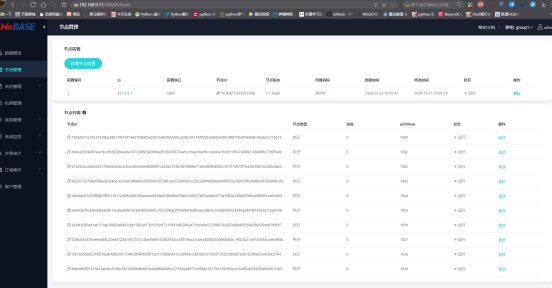

### 6.4 Viewing System Version Information


### 6.5 Adding Test Users
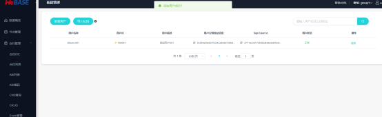

### 6.6 Contract compilation is normal


### 6.7 Normal contract deployment


### 6.8 Normal trading


### 6.9 Simplified Chinese Chain Normal


### 6.10 Home page information statistics normal


### 6.11 Node monitoring is normal


### 6.12 Node information of group 2 is normal


### 6.13 Group 2 users added normally
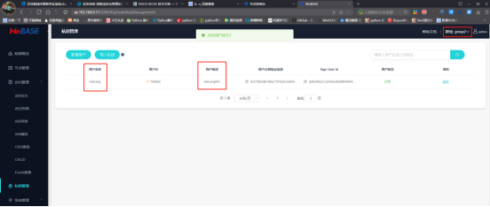

### 6.14 Group 2 Data Uplinking and Query Normal


### 6.15 Console usage is normal


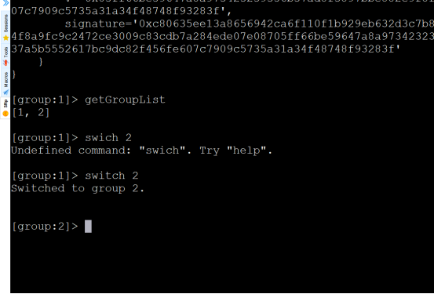

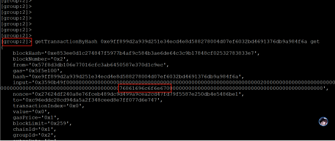


So far, we have completed the management and functional testing of the alliance chain using webase-deploy, and we are done！^_^ 。


## 7 Development Perception

#### The way of heaven, the damage is more than enough to make up for the deficiency, is the false victory, the deficiency is more than enough to win！

#### Do not take small steps, not even a thousand miles,

#### If you don't accumulate small streams, you can't become a river or a sea！

#### False public opinion horse, non-profit also, but to thousands of miles,

#### False boat, non-energy water also, and the river！

#### A gentleman is born different, good and false in things！


