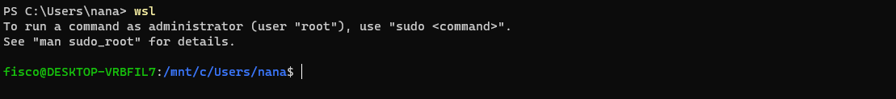
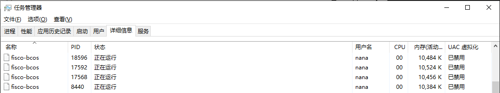

# Windows based on wsl / wsl2-10 Building the Fisco-Bcos blockchain tips

Author ： Huang Yi （ Sichuan Everything Digital Technology Co., Ltd. ） ｜ FISCO BCOS Developer

## I: Overview

Recently, some friends in the FISCO community mentioned that because of certain restrictions, can only use the Windows platform for development, hope to have a Windows-based Fisco-Bcos Deployment Tutorial。Just @ power Lin Xuanming's teacher C# The SDK is also maturing, so I wrote this article in the hope of making it easier to deploy the Fisco development environment on Windows。

This paper describes the adoption of**Linux Subsystem for Windows(wsl/wsl2)**, in Windows-10 No dual system / virtual machine burden on platform to build Fisco-Bcos process and experience, then you can combine the development of Visual Studio and Fisco to build a more comfortable Windows development environment.。

wsl and wsl2 are completely different in the underlying implementation, see https for differences://docs.microsoft.com/zh-cn/windows/wsl/compare-versions。

Based on the performance and compatibility of the first generation of WSL using Linux middleware translation, we recommend that you use lightweight Hyper-based-v wsl2, for not wanting to use hyper-v's friends, can only use wsl, at least at this stage has not been found to have compatibility problems。

Because the steps for building a fisco are identical, this article will first build a fisco stand-alone 4-node blockchain on the wsl, and then switch to the wsl2 installation console to show that the two can be switched at any time.。


## II: Configuration requirements

Hardware:
```
The CPU of the home machine level is enough, the memory reaches more than 8GB, 16GB is recommended+, Considering that wsl can only be installed on the system disk, try to have 50G+Free system disk space。
```

Software:
```
Operating System: Windows 10 Professional / Enterprise (version 1903+), or Windows Server 2019 (version 1709+）。
Other tools: If you want to use .Net Sdk, we recommend Visual Studio 2019 Community and Visual Studio Code that are free and support .Net5。
```

## 3: Install wsl / wsl2 and linux distribution subsystem on Windows 10 (Ubuntu 20.04 LTS as an example)

Open PowerShell as an administrator


Type the following command to open wsl / wsl2 support

```powershell
dism.exe /online /enable-feature /featurename:Microsoft-Windows-Subsystem-Linux /all /norestart
dism.exe /online /enable-feature /featurename:VirtualMachinePlatform /all /norestart
```


After successful enablement, restart the computer, download and install the wsl2 kernel update package

Link: < https://wslstorestorage.blob.core.windows.net/wslblob/wsl_update_x64.msi>

Open the Microsoft Store, download and install the Ubuntu 20.04 LTS subsystem

Link: < https://www.microsoft.com/store/apps/9n6svws3rx71>


After installation, start Ubuntu 20.04 at least once, at which time the account password of the initial user will be required


After the setup is complete, type the following command in Powershell to view the Linux distribution package

```powershell
wsl --list --verbose
```


You can see that Ubuntu is now using wsl version 1. Next, you will install and configure fisco on this system and demonstrate how to switch to wsl2。

## Four: Based on wsl in the ubuntu20.04 subsystem to build a single 4 node

It is officially recommended to use Windows Termintal for operation. You can also use the shell or powershell that comes with Windows. Download link: < https://aka.ms/terminal>

Open the terminal and type directly

```powershell
wsl
```

Enter the ubuntu subsystem, as shown in the figure below



Here you can see one of the features of wsl: you can directly access files in the NTFS file system.(The starting position is located at c:\Users)and can call windows applications with the .exe suffix。

In the development period, for ease of management, you can put the FICO under the NTFS file system, such as "My Documents," but do not configure it in a production environment, the Linux subsystem access across file systems will reduce performance.。

Because it is a local subsystem, no network configuration is required. Refer to [Building the First Blockchain Network](../../installation.md)Quickly deploy a single-machine 4-node FICO blockchain

```bash
cd ~
sudo apt install -y openssl curl
cd ~ && mkdir -p fisco && cd fisco
curl -#LO https://github.com/FISCO-BCOS/FISCO-BCOS/releases/download/v2.9.1/build_chain.sh && chmod u+x build_chain.sh
bash build_chain.sh -l 127.0.0.1:4 -p 30300,20200,8545
```

Final output All Completed


Next start the fisco node and observe the log output

```bash
bash nodes/127.0.0.1/start_all.sh
tail -f nodes/127.0.0.1/node0/log/log*  | grep +++
```


At the same time, since we are using wsl-1. You can view the 4-node linux process fisco in the task manager-bcos and its resource usage



By right-clicking the process, you can quickly locate the home directory of the Ubuntu subsystem.**Do not modify any files in this directory in Windows**To access the home of wsl, enter:\ wsl $in the address bar of the explorer

## Five: switch between wsl and wsl2

This section describes how to switch between wsl and wsl2, all tutorials in this book apply to both wsl and wsl2, you can switch wsl version at any step and continue the tutorial

First stop the fisco node you just started and exit the Ubuntu subsystem

```bash
bash nodes/127.0.0.1/stop_all.sh
exit
```

Next, switch the startup mode of the Ubuntu system to wsl2

```powershell
wsl --set-version Ubuntu-20.04 2
```

Waiting for system transition


Start the FICO node you just installed again and observe the output

```bash
wsl
cd ~/fisco && bash nodes/127.0.0.1/start_all.sh
tail -f nodes/127.0.0.1/node0/log/log*  | grep +++
```


Similarly, you can switch back to WSL by using the following code after you stop FICO

```powershell
wsl --set-version Ubuntu-20.04 1
```

## Six: Install the FICO console

Please refer to [Building the First Blockchain Network] for installation tutorial.(../../installation.md)In the installation console section, this article tries to make a brief integration introduction.

Since the source of the Ubuntu subsystem is abroad, the download speed of jdk will be slow for domestic users.

```bash
sudo chmod 777 /etc/apt/sources.list
notepad.exe /etc/apt/sources.list
```

If Notepad shows that the source file directory cannot be found, use the following code
```bash
sudo chmod 777 /etc/apt/sources.list
sudo vim /etc/apt/sources.list
```

Replace the entire file with

```
deb http://mirrors.aliyun.com/ubuntu/ focal main restricted universe multiverse
deb-src http://mirrors.aliyun.com/ubuntu/ focal main restricted universe multiverse
deb http://mirrors.aliyun.com/ubuntu/ focal-security main restricted universe multiverse
deb-src http://mirrors.aliyun.com/ubuntu/ focal-security main restricted universe multiverse
deb http://mirrors.aliyun.com/ubuntu/ focal-updates main restricted universe multiverse
deb-src http://mirrors.aliyun.com/ubuntu/ focal-updates main restricted universe multiverse
deb http://mirrors.aliyun.com/ubuntu/ focal-proposed main restricted universe multiverse
deb-src http://mirrors.aliyun.com/ubuntu/ focal-proposed main restricted universe multiverse
deb http://mirrors.aliyun.com/ubuntu/ focal-backports main restricted universe multiverse
deb-src http://mirrors.aliyun.com/ubuntu/ focal-backports main restricted universe multiverse
```

Save and Close, sequentially

```bash
sudo apt update && sudo apt install -y default-jdk
cd ~/fisco && curl -LO https://github.com/FISCO-BCOS/console/releases/download/v2.9.2/download_console.sh && bash download_console.sh
cp -n console/conf/config-example.toml console/conf/config.toml
cp -r nodes/127.0.0.1/sdk/* console/conf/
cd ~/fisco/console && bash start.sh
```

After startup, you will see the following screen and the console deployment is successful


## 7: Using csharp-sdk Visual Studio development example

This article uses @ power teacher's csharp-sdk and its tutorials, thanks to the hard work of power teacher。

git address: < https://github.com/FISCO-BCOS/csharp-sdk>

Tutorial address: < https://www.bilibili.com/video/BV1av41147Lo>

### 1. Establish new project, introduce C#-SDK

Open vs2019, build a console project based on .net core 3.1, open the nuget package controller, and search for "fiscobcos"


Select the FISCOBCOS. CSharpSdk package to install to the project


### 2. Compile the sample contract HelloWorld

Compile the project and create a contracts folder in the project output directory


Switch to Terminal and copy the HellowWorld.sol contract in the console you just downloaded to the contracts folder you just created.

```bash
cp ~ / fisco / console / contracts / consolidation / HellowWorld.sol [your contracts directory]
```

Open HelloWorld.sol with vscode, install the solidity plugin and switch to version 0.4.25


Press F5 to compile the contract. The bin folder will be generated under contracts, and the compiled HelloWorld.bin and HelloWorld.abi will be generated.

### 3. Interaction with FICO

Modify Program.cs as follows

```C#
using System;
using FISCOBCOS.CSharpSdk;
using FISCOBCOS.CSharpSdk.Dto;
using FISCOBCOS.CSharpSdk.Utis;

namespace FiscoSdkTest
{
    class Program
    {
        static void MakeAccount()
        {
            var account = AccountUtils.GeneratorAccount("testAdmin");
            var accountString = account.ToJson();
            Console.WriteLine($"Generate account information:\ n{accountString}\n---------------");
        }

        static void Main(string[] args)
        {
            MakeAccount();
        }
    }
}
```

Compile and execute, observe the output


Use the private key of the account to deploy the HelloWorld contract. Modify the code as follows

```C#
using System;
using FISCOBCOS.CSharpSdk;
using FISCOBCOS.CSharpSdk.Dto;
using FISCOBCOS.CSharpSdk.Utils;
using FISCOBCOS.CSharpSdk.Utis;

namespace FiscoSdkTest
{
    class Program
    {
        static void MakeAccount()
        {
            var account = AccountUtils.GeneratorAccount("testAdmin");
            var accountString = account.ToJson();
            Console.WriteLine($"Generate account information:\ n{accountString}\n---------------");
        }

        static void DeployContract(string privateKey)
        {

            var contractService = new ContractService("http://127.0.0.1:8545", BaseConfig.DefaultRpcId, BaseConfig.DefaultChainId, BaseConfig.DefaultGroupId, privateKey);
            string binCode = "";
            string abi = ";";
            FileUtils.ReadFile(Environment.CurrentDirectory + "\\contracts\\bin\\" + "HelloWorld.bin", out binCode);
            FileUtils.ReadFile(Environment.CurrentDirectory + "\\contracts\\bin\\" + "HelloWorld.abi", out abi);
            var result = contractService.DeployContract(binCode, abi);
            Console.WriteLine($"Deployment contract result:\ n{result}");
        }

        static void Main(string[] args)
        {
            string privateKey = args[0];
            DeployContract(privateKey);
        }


    }
}
```

Compile and execute, observe the output


Next, let's look at the results of the transaction that just deployed the contract and modify the code as follows

```C#
using System;
using FISCOBCOS.CSharpSdk;
using FISCOBCOS.CSharpSdk.Utis;

namespace FiscoSdkTest
{
    class Program
    {
        static void TestGetTranscationResult(string txHash,string privateKey)
        {
            var contractService = new ContractService("http://127.0.0.1:8545", BaseConfig.DefaultRpcId, BaseConfig.DefaultChainId, BaseConfig.DefaultGroupId, privateKey);
            var result = contractService.GetTranscationReceipt(txHash);
            Console.WriteLine($"Query transaction results:\ n{result.ToJson()}");
        }

        static void Main(string[] args)
        {
            string txHash = args[0];
            string privateKey = args[1];
            TestGetTranscationResult(txHash,privateKey);
        }
    }
}
```

You can see the receipt of this transaction, the return code is 0x0, and the deployed contract address is 0x1fc600d62388602620bb52c1fe6eea579b65d498


Switch to the console in the previous section and try calling HelloWorld's get

```bash
call HelloWorld 0x1fc600d62388602620bb52c1fe6eea579b65d498 get
```

The results are as follows


At this point, using Visual Studio to federate csharp on Windows-The local development of FICO by SDK has come to an end. About charp-For more information about the SDK, see the links at the beginning of this section.

