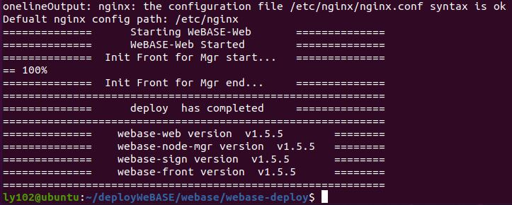

# Deploy WeBASE Management Platform with One Click

Author ： WANG Cunqi ｜ Shandong Business Vocational College

## I: Preface

WeBASE (WeBank Blockchain Application Software Extension) is a set of common components built between blockchain applications and FISCO BCOS nodes。

Building a WeBASE Management Platform Including Nodes (FISCO-BCOS 2.0+), management platform (WeBASE-Web), node management subsystem (WeBASE-Node-Manager), node front subsystem (WeBASE-Front), signature service (WeBASE-Sign)。Among them, the construction of the node is optional, you can choose to use the existing chain or build a new chain through the configuration。

## II: Description of environment

### 1. Required Tools

|  Tools| Version|
| :-----: | ------------------ |
|  Java   | Oracle JDK 8 to 14|
|  MySQL  | MySQL - 5.6 and above|
| Python  | Python3.6 and above|
| PyMySQL |                    |

### 2. Current system


## Three: download tools

In order to facilitate management, we first create a deployWeBASE folder and enter the cd to operate under the deployWeBASE folder。


### 1. Install Oracle JDK(Not an Open JDK)

#### ①. Create a folder to manage java

Install versions of Oracle Java 8 to 13 and place the downloaded jdk in the java directory

What I downloaded here is [jdk-13.0.2 _ linux-x64 _ bin.tar.gz](https://www.oracle.com/java/technologies/javase/jdk13-archive-downloads.html "Download Oraclejdk")。


#### ②. Decompress the installation package

```linux
tar -zxvf jdk-13.0.2_linux-x64_bin.tar.gz
```


#### ③. Configure the java home environment

Modify the ~ / .bashrc configuration file

```linux
vim ~/.bashrc
```

After opening, enter the following three sentences into the file and save to exit

```
export JAVA_HOME=/home/ly102/deployWeBASE/java/jdk-13.0.2
export PATH=$JAVA_HOME/bin:$PATH
export CLASSPATH=.:$JAVA_HOME/lib/dt.jar:$JAVA_HOME/lib/tools.jar
```

#### ④. Refresh configuration

```linux
source ~/.bash_profile
```

#### ⑤. Verify successful configuration

```linux
java -version
```


### 2. Install mysql5.6

```linux
sudo apt-get install software-properties-common
sudo add-apt-repository 'deb http://archive.ubuntu.com/ubuntu trusty universe'
sudo apt-get update
sudo apt install mysql-server-5.6
sudo apt install mysql-client-5.6
sudo systemctl start mysql
sudo systemctl enable mysql
```

To the fourth step there will be problems, you can learn from this article to solve

[ubantu installs mysql 5.6 dependency problem solving _ nvidia-docker depends on sysv-rc(&gt;= 2.88dsf-24) | file-r-CSDN Blog](https://blog.csdn.net/qq_33388707/article/details/126540762)

Verify

```linux
mysql --version
```


### 3. Install python3

```linux
/ / Add warehouse, enter to continue
sudo add-apt-repository ppa:deadsnakes/ppa
/ / Install Python
sudo apt-get install -y python3.6
sudo apt-get install -y python3-pip
```

Verify

```linux
python3 --version
```


### 4. Install PyMySQL

Python3.6 and above, PyMySQL dependency package must be installed

```linux
sudo pip3 install PyMySQL
```


Now we have the tools we need

## Four: build WeBASE management platform

### 1. Create a folder to manage the WeBASE management platform

```linux
mkdir  webase
```

### 2. Enter the WeBASE directory and obtain the download installation package

```linux
 cd webase/ && wget https://osp-1257653870.cos.ap-guangzhou.myqcloud.com/WeBASE/releases/download/v1.5.5/webase-deploy.zip
```

### 3. Decompress the installation package and enter the decompressed directory

```linux
unzip webase-deploy.zip && cd webase-deploy
```

### 4. Modify the configuration

```linux
vim common.properties
```

Change these two places to your own database user and password。


I'm using the default chain here. If you want to deploy using an existing chain, you need to modify the

if.exist.fisco change no to yes

fisco.dir is modified to its own node path

Modify the three port numbers node.p2pPort, node.channelPort, and node.rpcPort to the port number corresponding to the node


### 5. Deploy and launch

```linux
python3 deploy.py installAll
```



### 6. Visits


The default account is admin and the default password is Abcd1234

Also access the WeBASE-Front front platform