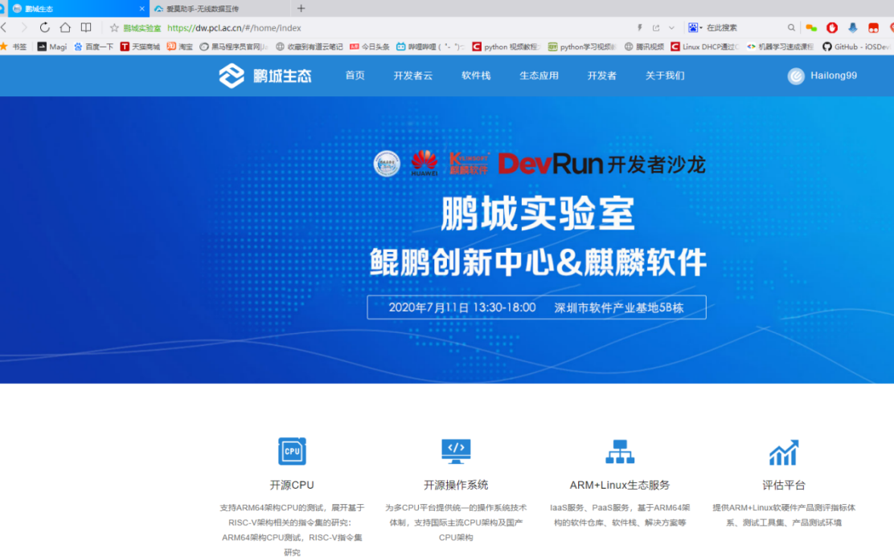

# Compiling and Running FISCO on Kunpeng Platform-BCOS 2.6.0

## One: Apply for the Kunpeng server (there are already Kunpeng servers that have skipped this step)

### 1. REGISTRATION

Open [Pengcheng Laboratory official website](https://dw.pcl.ac.cn/#/home/index) For account registration, the registration process needs to fill in the real name, work unit, email, after receiving the activation email, you need to manually click the activation link address to activate the account


### 2. Login

After logging in to the registered account, click"Developer Cloud" Button


### 3. Fill in the application order

Fill it yourself in the page that opens"Demand Request" Orders, planning hardware configuration, system version, and how long to use according to your actual project needs


### 4. Wait for notification

After the demand order is submitted, wait for official approval, and you will receive an email notification of the approval results after the approval is completed.


### 5. Pass the application

Log in to the Kunpeng server to view the server information, and the Kunpeng server is now ready.


## Two: install basic software in Kunpeng server

### 1. Update Software

Take Centos as an example, use yum to update (this process will download the update package, please keep the network open and wait patiently)
```.
yum update
```


### 2. Install basic dependencies

```
sudo yum install -y epel-release centos-release-scl
sudo yum install -y openssl-devel openssl cmake3 gcc-c++ git flex patch bison gmp-static devtoolset-7
```

### 3. Install Kunpeng version jdk-1.8
 * Install JDK
 From [Oracle](https://www.oracle.com/technetwork/java/javase/downloads/jdk8-downloads-2133151.html) Download JDK-1.8


 * Extract files into / usr / local
```
tar -xf jdk-8u261-linux-arm64-vfp-hflt.tar.gz  -C /usr/local/
```


 * Setting environment variables
```
vim /etc/profile

/ / Add at the end of the file:
export JAVA_HOME=/usr/local/jdk1.8.0_261
export PATH=$JAVA_HOME/bin:$PATH

/ / Validate variables
source /etc/profile
```


## Three: compile FISCO-BCOS source code

### 1. Download Compile Dependencies

 * FISCO compilation depends on many files, and it will be slow to download them directly from git, so here you download the corresponding dependencies from gitee first, and then copy them directly when compiling.
```
cd
git clone https://gitee.com/FISCO-BCOS/LargeFiles.git
```

### 2. Download source code

 * Cloning FISCO BCOS Code

```bash
git clone https://gitee.com/FISCO-BCOS/FISCO-BCOS.git
```

### 3. Perform precompilation

```
cd FISCO-BCOS
git checkout master-2.0
mkdir -p build && cd build

/ / CentOS Please execute this command, other systems do not need
source /opt/rh/devtoolset-7/enable

cmake3 .. -DARCH_NATIVE=on
```

### 4. Perform compilation

 * Execute make, execute to download the file here will appear Caton, here directly ctrl+ c Cancelled
```
# make
Scanning dependencies of target jsoncpp
[  0%] Creating directories for 'jsoncpp'
[  0%] Performing download step (download, verify and extract) for 'jsoncpp'
-- Downloading...
   dst='/root/FISCO-BCOS/deps/src/jsoncpp-1.7.7.tar.gz'
   timeout='none'
-- Using src='https://github.com/open-source-parsers/jsoncpp/archive/1.7.7.tar.gz'
-- verifying file...
       file='/root/FISCO-BCOS/deps/src/jsoncpp-1.7.7.tar.gz'
-- Downloading... done
-- extracting...
     src='/root/FISCO-BCOS/deps/src/jsoncpp-1.7.7.tar.gz'
     dst='/root/FISCO-BCOS/deps/src/jsoncpp'
```

### 5. Copy the dependency package to the appropriate directory.

```
/ / If prompted whether to override, enter y
cp ${HOME}/LargeFiles/libs/* ${HOME}/FISCO-BCOS/deps/src
```

### 6. Continue compiling

 * The first compilation speed is relatively slow, need to wait patiently
```
cd ${HOME}/FISCO-BCOS/build
make
```

### 7 Solve the error of compiling GroupSigLib

 * During the compilation process, if the problem of compiling GroupSigLib fails, an error will be reported.
```
[ 24%] Performing configure step for 'GroupSigLib'
-- GroupSigLib configure command succeeded.  See also /root/FISCO-BCOS/deps/src/GroupSigLib-stamp/GroupSigLib-configure-*.log
[ 25%] Performing build step for 'GroupSigLib'
CMake Error at /root/FISCO-BCOS/deps/src/GroupSigLib-stamp/GroupSigLib-build-RelWithDebInfo.cmake:49 (message):
  Command failed: 2

   'make'

  See also

    /root/FISCO-BCOS/deps/src/GroupSigLib-stamp/GroupSigLib-build-*.log


make[2]: *** [CMakeFiles/GroupSigLib.dir/build.make:115：../deps/src/GroupSigLib-stamp/GroupSigLib-build] Error 1
```

 * Workaround:
```
cp /usr/share/automake-1.13/config.guess ${HOME}/FISCO-BCOS/deps/src/GroupSigLib/deps/src/pbc_sig/config.guess
```

### 8. View the compilation results.

 * Compile completion effect


 * View the version number of the compilation result
```
# cd bin
# ./fisco-bcos -v
FISCO-BCOS Version : 2.6.0
Build Time         : 20200810 09:17:18
Build Type         : Linux/g++/RelWithDebInfo
Git Branch         : master-2.0
Git Commit Hash    : a2c2cd3f504a101fbc5e97833ea0f4443b68098e
```

## Four: Kunpeng Platform Runs 2 Groups 3 Institutions 6 Nodes Bottom FISCO-BCOS Alliance Chain Service

### 1. Create a directory for storing binary executable files at the bottom of the alliance chain

```
cd
mkdir bin
```

### 2. Copy the compiled fisco.-bcos file to the created directory

```
cp ${HOME}/FISCO-BCOS/build/bin/fisco-bcos bin
```

### 3. Download the build _ chain.sh script

```
curl -LO https://github.com/FISCO-BCOS/FISCO-BCOS/releases/v2.9.1/build_chain.sh && chmod u+x build_chain.sh
```

### 4. Run one key to build the bottom layer FISCO of 2 groups, 3 institutions and 6 nodes-BCOS Consortium Chain Service Script

```
#  ./build_chain.sh -l 127.0.0.1:4 -p 30300,20200,8545 -e bin/fisco-bcos
```

### 5. Script running completion effect

```
# ./build_chain.sh -l 127.0.0.1:4 -p 30300,20200,8545 -e bin/fisco-bcos
Checking fisco-bcos binary...
Binary check passed.
==============================================================
Generating CA key...
==============================================================
Generating keys and certificates ...
Processing IP=127.0.0.1 Total=4 Agency=agency Groups=1
==============================================================
Generating configuration files ...
Processing IP=127.0.0.1 Total=4 Agency=agency Groups=1
==============================================================
[INFO] FISCO-BCOS Path : bin/fisco-bcos
[INFO] Start Port      : 30300 20200 8545
[INFO] Server IP       : 127.0.0.1:4
[INFO] Output Dir      : /root/nodes
[INFO] CA Path         : /root/nodes/cert/
==============================================================
[INFO] Execute the download_console.sh script in directory named by IP to get FISCO-BCOS console.
e.g.  bash /root/nodes/127.0.0.1/download_console.sh -f
==============================================================
[INFO] All completed. Files in /root/nodes
```

### 6. Start Node

```
cd nodes/127.0.0.1/
./start_all.sh
```

### 7. View Node Status

```
# ps -aux |grep fisco
root     17241  1.1  0.7 729792 31168 pts/1    Sl   17:32   0:00 /root/nodes/127.0.0.1/node2/../fisco-bcos -c config.ini
root     17242  1.0  0.7 729792 31360 pts/1    Sl   17:32   0:00 /root/nodes/127.0.0.1/node0/../fisco-bcos -c config.ini
root     17243  1.0  0.7 729792 31168 pts/1    Sl   17:32   0:00 /root/nodes/127.0.0.1/node3/../fisco-bcos -c config.ini
root     17244  1.1  0.7 729408 31296 pts/1    Sl   17:32   0:00 /root/nodes/127.0.0.1/node1/../fisco-bcos -c config.ini
```

### 8. View consensus status

```
# tail -f node*/log/*|grep ++
info|2020-09-04 17:34:19.452001|[g:1][CONSENSUS][SEALER]++++++++++++++++ Generating seal on,blkNum=1,tx=0,nodeIdx=2,hash=40f8c3c5...
info|2020-09-04 17:34:18.449782|[g:1][CONSENSUS][SEALER]++++++++++++++++ Generating seal on,blkNum=1,tx=0,nodeIdx=1,hash=85ab01ec...
info|2020-09-04 17:34:17.446976|[g:1][CONSENSUS][SEALER]++++++++++++++++ Generating seal on,blkNum=1,tx=0,nodeIdx=0,hash=d7d2cfa2...
info|2020-09-04 17:34:20.454172|[g:1][CONSENSUS][SEALER]++++++++++++++++ Generating seal on,blkNum=1,tx=0,nodeIdx=3,hash=87efbeb5...
info|2020-09-04 17:34:21.456586|[g:1][CONSENSUS][SEALER]++++++++++++++++ Generating seal on,blkNum=1,tx=0,nodeIdx=0,hash=4a9c4f2d...
info|2020-09-04 17:34:22.459794|[g:1][CONSENSUS][SEALER]++++++++++++++++ Generating seal on,blkNum=1,tx=0,nodeIdx=1,hash=d1dd4738...
```

## Five: Installation of FISCO on Kunpeng platform-BCOS Console

(The console program depends on java)-1.8 You need to install the Kunpeng version (arrch64) of java in advance.-1.8

```bash
# Download Console
$ curl -#LO https://github.com/FISCO-BCOS/console/releases/download/v2.9.2/download_console.sh && bash download_console.sh
$ cd console

# Copy Certificate
cp ~/nodes/127.0.0.1/sdk/* conf

# Modify Profile
# If there is no port conflict, copy the configuration file directly. Otherwise, modify the network.peers configuration item in config.toml to the corresponding channel port.
$ cp conf/config-example.toml conf/config.toml
```

**Start Console**

```
# cd ~/console/ && bash start.sh
=============================================================================================
Welcome to FISCO BCOS console(2.6.1)!
Type 'help' or 'h' for help. Type 'quit' or 'q' to quit console.
 ________ ______  ______   ______   ______       _______   ______   ______   ______
|        |      \/      \ /      \ /      \     |       \ /      \ /      \ /      \
| $$$$$$$$\$$$$$|  $$$$$$|  $$$$$$|  $$$$$$\    | $$$$$$$|  $$$$$$|  $$$$$$|  $$$$$$\
| $$__     | $$ | $$___\$| $$   \$| $$  | $$    | $$__/ $| $$   \$| $$  | $| $$___\$$
| $$  \    | $$  \$$    \| $$     | $$  | $$    | $$    $| $$     | $$  | $$\$$    \
| $$$$$    | $$  _\$$$$$$| $$   __| $$  | $$    | $$$$$$$| $$   __| $$  | $$_\$$$$$$\
| $$      _| $$_|  \__| $| $$__/  | $$__/ $$    | $$__/ $| $$__/  | $$__/ $|  \__| $$
| $$     |   $$ \\$$    $$\$$    $$\$$    $$    | $$    $$\$$    $$\$$    $$\$$    $$
 \$$      \$$$$$$ \$$$$$$  \$$$$$$  \$$$$$$      \$$$$$$$  \$$$$$$  \$$$$$$  \$$$$$$

=============================================================================================
[group:1]>
```

## Six: Kunpeng platform sends transactions through the console

 * View FISCO Version
```
[group:1]> getNodeVersion
{
    "Build Time":"20200904 14:43:15",
    "Build Type":"Linux/g++/RelWithDebInfo",
    "Chain Id":"1",
    "FISCO-BCOS Version":"2.6.0",
    "Git Branch":"master-2.0",
    "Git Commit Hash":"a2c2cd3f504a101fbc5e97833ea0f4443b68098e",
    "Supported Version":"2.6.0"
}
```


 * Deploy and invoke contracts
```
[group:1]> deploy HelloWorld
transaction hash: 0xa71f136107389348d5a092a345aa6bc72770d98805a7dbab0dbf8fe569ff3f37
contract address: 0xd22aa109bc0708ad016391fa5188e18d35b16434

[group:1]> call HelloWorld 0xd22aa109bc0708ad016391fa5188e18d35b16434 set "asfdas"
transaction hash: 0x72f4f8c980fd0d63d57bdbcc89d6b82dda79e301f25a65f0f49726105184b596

[group:1]> call HelloWorld 0xd22aa109bc0708ad016391fa5188e18d35b16434 get
asfdas
```
