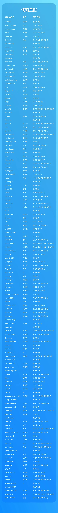
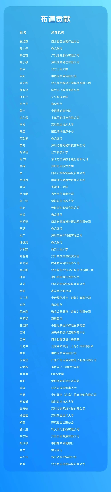
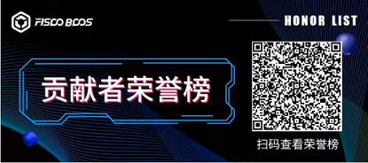

## 2. Contributors

-----
**Year 2023| FISCO BCOS Contributor List**

Author: Little Assistant

In 2023, the world is changing, and science and technology are changing with each passing day。FISCO BCOS adheres to the belief in blockchain technology, bringing together more than 5,000 enterprises and institutions and more than 100,000 individual members to build co-governance and share, creating a more active and prosperous open source alliance chain ecosystem。

Over the past year, a large number of open source contributors have joined us to support the development of FISCO BCOS open source in many directions, from code, tools, solutions and sermons。More than 100 small partners contribute code to FISCO BCOS, bringing a more robust and powerful FISCO BCOS to the community；More than ten teams contribute tool components and solutions to the open source community, further enriching open source ecological components and application cases；More than 60 partners have become the "tap water" of FISCO BCOS, and have spontaneously exported technical interpretations, operational practices and application cases to promote FISCO BCOS as community preachers。

We have compiled the FISCO BCOS Contributor Honor Roll 2023, and thank you for your enthusiastic participation and active contributions！

Grow up, root down。Power from the community is a solid base to support FISCO BCOS technology leadership and ecological prosperity。We believe that a more dynamic and prosperous blockchain industry is coming。Looking forward to more small partners to join us and build a better future for blockchain。

The following list is ranked in no particular order. If there are any errors or omissions, please contact your assistant [FISCOBCOS010] to improve。

### Code contribution

Code contribution refers to the contribution made around the FISCO BCOS project and the code repository of the community eco-project, including but not limited to submitting PR to modify the source code, contributing new code, building technical documents, etc。

### Tool Contribution
On the basis of FISCO BCOS, community developers continue to explore and develop a variety of practical components and tools to facilitate the development process and expand the platform functions。At present, these tools have all been open source and contributed to the community developers to use, greatly reducing the application development threshold and cost。

**Project Name: WeCross-BCOS3-Stub**

Contributors: iFLYTEK Co., Ltd., Weizhong Bank

Core participants: David Zhan, Fang Yang, Han Linbo, Guo Rui

Project Introduction:

WeCross-BCOS3-Stub is a plug-in used by WeCross to adapt to FISCO BCOS v3.0 and above, successfully implementing cross-chain adaptation of FISCO BCOS v3.0 and above。
https://github.com/WeBankBlockchain/WeCross-BCOS3-Stub

**Project Name: SmartDev-Contract Smart Contract Library Component**

Contributors: Ningxia Weijiao Technology Co., Ltd., Guangdong University of Technology, Xiamen Hash Technology Co., Ltd., Shenzhen Vocational and Technical University, Jiangxi Normal University, Beijing Galohuayu Technology Co., Ltd., Beijing North Information Technology Co., Ltd., Chongqing Vocational College of Electronic Engineering, Shenzhen Vocational and Technical University, Shenzhen Vocational College of Information Technology, Hunan Vocational College of Science and Technology。

Core participants: Zhang Sheng, Chen Xun, Li Qilong, Jin Wei, Lin Bin, Zhang Yuhao, Wang Jiangyu, Liu Wuyang, He Hongkun, Gao Ye, Xiang Jianxiong, Du Xiaomin, Yuan Jiajia, Peng Tiansong, Luo Jiacheng, Xiao Jingxiong。

Project Introduction:

In order to allow more developers to participate in the optimization of smart contract library components, the community launched the "Task Challenge" campaign。In the first and second quarters of 2023, the activities respectively solicited contracts such as "factoring financing of supply chain financial receivables," "high inquiry of historical blocks," "type conversion contract," "time lock operation," "multi-party voting," "transparent supervision and voting solution of block chain funds," "game of fighting monsters and upgrading up to the game," "bicycle sharing case," "adding code comments to contracts," "innovative solutions in the public domain。
https://github.com/WeBankBlockchain/SmartDev-Contract

### Programme contribution
In the 2023 Shenzhen International Finance and Technology Competition and many other authoritative blockchain competitions, many excellent entries based on FISCO BCOS have emerged。In the open source spirit of giving back to the community, the participants contributed to these solutions, providing a useful reference for community users to learn about blockchain。

**Program name: AI4C - AIGC-oriented creation of cultural digital product operation platform**

Core participants: Yu Zhenqi, Hu Xin, Sun Yan, Yang Guoming

At present, AIGC cultural creation faces many problems, such as the difficulty of storing and checking massive materials, the untrustworthy reasoning under the chain, the difficulty of protecting product copyright, and the opaque distribution of benefits。In order to solve the above problems, the team built a copyright operation platform for AIGC creation of cultural digital products。The platform integrates six key functions, such as trusted copyright identification, to realize the whole process of cultural and digital copyright services。Carry out research on on-chain storage retrieval and off-chain trusted extension technology, and design a cultural digital product operation plan。The platform and FISCO BCOS blockchain have been developed and deployed, and trusted computing hardware is used to support the privacy calculation and reasoning acceleration of the generative model。
https://github.com/FISCO-BCOS/hackathon/pull/81/files

**Program name: FISCO BCOS-based federated learning platform**

Core participants: Ma Haobin, Su Bingquan

The platform innovatively integrates federated learning with blockchain technology to enable efficient and secure business processes。Innovation Proposed Serial+The parallel federated learning method subtly enhances the diversity of training data, reduces the pressure on data storage, and protects privacy and security to the greatest extent。The system uses a combination of FISCO BCOS multi-group deployment and Ribbon load balancing to significantly improve the processing efficiency and throughput of blockchain services。Using RocketMQ to achieve peak shaving to ensure the stability of the system；At the same time, the model file and the file index are stored separately to achieve the function of the large amount of data file on the chain certificate。Realize node trusted authentication through public and private key files, providing a security cornerstone for the entire system。
https://github.com/FISCO-BCOS/hackathon/pull/87/files

**Scheme Name: Integrated Supply Chain Carbon Footprint System Based on Blockchain**

Core participants: Deng Yitian, Liang Haotian, Wang Weijie, Xuan Haojun, Ren Xuhao

Traditional supply chain vendors usually store carbon footprint data in their own local databases, resulting in the inability to circulate database data between different supply chain vendors, making it difficult to synchronize carbon footprint data。This work proposes a "blockchain-based supply chain carbon footprint unified system"。The system consists of three key technologies, including a blockchain-oriented fine-grained access control technology, an on-chain, off-chain hybrid storage architecture, and an efficient on-chain, off-chain collaboration mechanism。The system enables synchronization and consistency of data across supply chain vendors, helping companies achieve their "dual carbon" goals。
https://github.com/FISCO-BCOS/hackathon/pull/89/files

**Scheme name: second-hand tide play trading platform based on blockchain and emotional sustenance**

Core participants: Lu Longji, Gao Tao, Wu Jiaheng, Yuan Yao, Lin Jiaer

The project aims to build a more credible, efficient, safe and warm second-hand trendy trading platform, enhance the user experience through emotional storage and original rights confirmation, use blockchain technology to keep emotional stories forever, protect original content, reduce fraud and malicious behavior in the transaction process, and promote the healthy development of the second-hand trading market。The innovation of this project is to make emotions generate value and protect the rights and interests of the original creators. At the beginning of the project, in the promising second-hand trading market, the project focused on the special category of second-hand trendplay, linking the emotions of buyers and sellers with stories and commodities to resonate: allowing sellers to sell their goods at higher prices through emotional assignment；At the same time for the most emotional needs of buyers, to provide emotional consumption place。
https://github.com/FISCO-BCOS/hackathon/pull/80/files

**Scheme Name: Ask Chain - ESG Rating System Based on Blockchain**

Core participants: Zheng Huiwen, Zhong Nanhai, Li Zhiyuan

In the context of sustainable development, ESG assessment has become an important indicator of corporate sustainability。However, there is a lack of a unified, transparent and efficient ESG evaluation platform in the current market。Existing assessment tools often face problems such as inconsistent scoring standards, opaque data, easy tampering, and process redundancy, which not only affects the fairness of the assessment, but also increases the operating costs of the enterprise。Therefore, the development of a blockchain-based ESG scoring system aims to provide enterprises with a reliable, transparent and easy-to-operate ESG assessment solution, which has significant advantages in terms of cost efficiency and is suitable for use by enterprises of all sizes, assessment agencies and relevant regulatory agencies。
https://github.com/FISCO-BCOS/hackathon/pull/83/files

**Scheme Name: Carbon Road - Blockchain-based Carbon Asset Management and Trusted Trading Scheme**

Core participants: Zhang Fan, Song Yu, Xiao Yitao, Wang Qingnan, Shen Tongbo

Aiming at the pain points in the process of carbon data collection, access certification, carbon asset trading and carbon data management, this scheme formulates the project solution, which provides an integrated scheme for breaking the barriers of carbon market asset trading, supporting diversified carbon asset trading business, multi-market transaction data fusion analysis, carbon asset trading and management through the technical advantages of carbon emission trusted automatic collection, multi-subject low-cost access certification, efficient and credible carbon asset trading, and carbon data dynamic authorization management。This project uses the FISCO BCOS v3.0 blockchain architecture, the front end uses VUE, and the back end uses core development tools such as SpringBoot to implement an integrated platform for blockchain-based carbon asset management and trusted trading。
https://github.com/FISCO-BCOS/hackathon/pull/92/files

**Scheme name: WeTender - ESG governance model for project bidding between government and enterprises for the construction of "four good rural roads."**

Core participants: Ding Yujia, Dai Yukun, Chen Weiquan, Xiong Yujia, Sheng Yuan

WeTender is a blockchain data information management platform based on the underlying open source platform of FISCO BCOS, which is suitable for project bidding between the government and enterprises to build the "Four Good Rural Roads," giving full play to the immutability and traceability of blockchain technology and supporting smart contracts, and is committed to solving the trust problem in the construction of the "Four Good Rural Roads."。
https://github.com/FISCO-BCOS/hackathon/pull/86/files

**Scheme name: Anonymous voting system based on FISCO BCOS**

Core participants: Chen Mingyuan, Lin Zejun, Ye Litao, Lu Yuhao, Zhang Shijie

Building an anonymous weighted voting system based on the FISCO BCOS blockchain platform, giving full play to the non-tamperability, traceability and support for smart contracts of blockchain technology, and is committed to solving the problems of traditional voting systems controlled by centralized institutions, not open and transparent, not supporting weighted voting and privacy。
https://github.com/FISCO-BCOS/hackathon/pull/91/files

**Program name: wisdom to promote agriculture - from the net to the chain, "Red Star Apple" characteristic agricultural products holding a key "certificate" traceability**

Core participants: Bai Qili, Li Yile, Gao Huiwen, Chen Guocui, Chang Jiaxuan

The traceability system of intelligent agricultural characteristic agricultural products is an Internet of Things platform that integrates Internet of Things, cloud computing, data analysis and blockchain technology to perceive, analyze, predict and control the agricultural environment and transportation。Blockchain is a technical solution that combines digital, cryptography, Internet and computer programming technologies to collectively maintain a reliable database in a decentralized and trusted manner。First of all, relying on various sensor nodes deployed in the agricultural production site to collect real-time online monitoring of growth conditions and other real-time data, through the websocket long connection to collect data transmitted to the FISCO BCOS blockchain network cloud blockchain computing center, and through storage and encryption to ensure the security and visibility of the data running the alliance chain on the hard disk, the formation of the actual crop from planting to transportation of the whole process of visualization, through AI analysis to provide。
https://github.com/FISCO-BCOS/hackathon/pull/90/files

### Sermon Contribution

In addition to code contributions and tool contributions, there is also a category of contributors who do not hesitate to share FISCO BCOS-based development experience and technical / industrial perspectives in various channels, giving the FISCO BCOS open source community a stronger and longer-term vitality and influence, and encouraging more people to participate in ecological co-construction。

Sermon contributions include but are not limited to sharing FISCO BCOS related technologies in various activities, writing articles or compiling video parsing FISCO BCOS related technologies, etc。Preaching channels are not limited. If there are any omissions in the contribution list, please contact your assistant and let us know。

### Description of source of contribution data
The list of contributors is mainly collected from the FISCO BCOS code repository in GitHub and the code repositories of community ecological projects such as FISCO BCOS Toolbox and WeBankBlockchain. The statistical period is from January 1, 2023 to December 31, 2023. If there are any omissions or suggestions for improvement, please contact the assistant [FISCOBCOS010] for feedback。

Scan the code to view the quarterly contributor list

