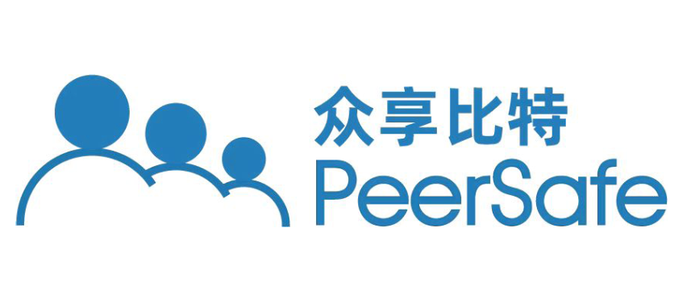
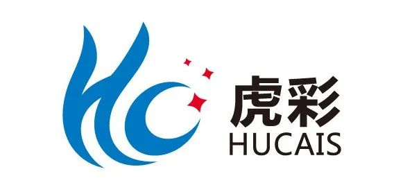
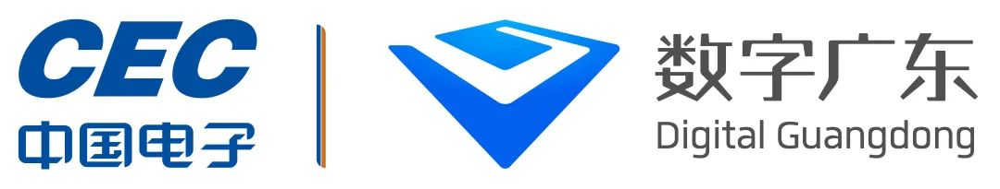
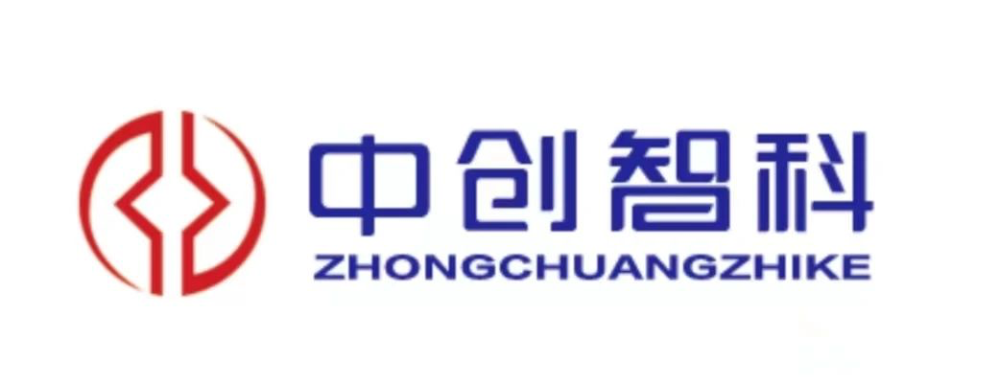

# 4. Partners

----

**FISCO BCOS Partners**

Author: Little Assistant

In order to better promote the blockchain landing industry, cultivate more professionals for the industry, and help the blockchain ecology flourish, the FISCO BCOS Partner Program for the industry long-term recruitment of "industrial application partners," "talent cultivation partners" and "ecological development partners."。

Industrial application partners aim to help blockchain technology to be better applied and promote the development of blockchain industry；Talent cultivation partners will join hands with FISCO BCOS open source community to carry out curriculum research and development, talent cultivation and talent certification based on FISCO BCOS open source blockchain technology, help build a blockchain talent cultivation system, and provide professional skills for industrial development；Ecological development partners will work with FISCO BCOS open source community to build a blockchain open source ecology, leading the high-quality development of the industry with solid basic technology support。

Since the launch of the FISCO BCOS Partner Program, many partners have actively applied。By 2023, there are 50 certified FISCO BCOS partners (35 industrial application partners, 13 talent cultivation partners and 2 ecological development partners), which play an important role in promoting the industrial application of FISCO BCOS and helping the development of blockchain industry。
Certified partners are announced as follows, welcome to add a small assistant [FISCOBCOS010] to understand and sign up to join the program。

### FISCO BCOS Industrial Application Partner

(The following is sorted by the first letter of the company name)

**Beijing Copyright Home Technology Development Co., Ltd**

Beijing Copyright Home Technology Development Co., Ltd. and FISCO BCOS to provide digital copyright services, the development of the copyright blockchain system in conjunction with copyright regulatory agencies, judicial institutions, the National Timing Center, CA and other copyright to provide copyright confirmation, piracy monitoring, copyright protection and copyright trading and other one-stop comprehensive copyright services, to achieve the creation of rights, use of rights, discovery of rights！

**Beijing Zhongxiang Bit Technology Co., Ltd**

Founded in July 2014, Beijing Zhongxiang Bit Technology Co., Ltd. is one of the first technology-driven companies engaged in the development of blockchain underlying platforms and application cases in China, providing blockchain products and integrated solutions services to many customers at home and abroad based on FISCO BCOS。
Zhongxiang Bit is a national high-tech enterprise, Beijing "specialized and special new" small and medium-sized enterprises, 2021 Beijing intellectual property demonstration unit, won the 2022 / 2021 Beijing private enterprise small and medium-sized top 100, 2021 / 2020 / 2019 KPMG China leading financial technology 50 enterprises, 2020 / 2019 Zhongguancun gazelle enterprises and other honors。

**Radio and Television Express Group Co., Ltd**

Founded in 1999, Radio and Television Express is a state-controlled high-tech listed company (securities code:002152), the main business covers intelligent finance, public safety, transportation, government affairs, cultural tourism, new retail and education and other fields, together with FISCO BCOS to provide global customers with competitive intelligent terminals, operational services and big data solutions。

The company started from domestic financial self-service equipment, relying on the advantages of scene landing ability, technology research and development, supply chain and so on accumulated over the years, implementing the new development concept, focusing on the two main lines of financial technology and urban intelligence, in the fields of intelligent finance, intelligent transportation, intelligent security, intelligent convenience, etc., to enable the upgrading of traditional industries with science and technology。In overseas markets, the company has established 9 global branches, and its products and services have entered more than 100 countries and regions around the world。In the face of a new wave of science and technology, Radio and Television Express will continue to accelerate the deep integration of cutting-edge information technologies such as blockchain, artificial intelligence, big data and the Internet of Things with the real economy, and contribute to the construction of the Smart Greater Bay Area and "Digital China."。

**Guangzhou One Chain Block Chain Technology Co., Ltd**

Guangzhou One Chain Blockchain Technology Co., Ltd. focuses on blockchain technology products and industry application solutions, with more than 10 soft patents, successfully applied FISCO BCOS in the "audit supervision" scenario of government and enterprises, and launched the "blockchain data tamper-proof platform."。
The platform is committed to "making the world's data credible and free of fraud," and has successfully landed in the audit and supervision scenarios of GAC Honda, China Merchants Expressway, Anjubao and other customers。

**Tiger Color Group Limited**

Hucai Group Co., Ltd. was founded in 1989, is a set of digital printing, puree beer, smart wedding three business segments in one of the group enterprises, with dozens of member enterprises, covering the tiger color printing art, Taishan puree beer, fresh lemon smart wedding three brands。Headquartered in Dongguan National High-tech Development Zone Songshan Lake。 

Based on the company's digital and industrial Internet strategy, Hucai established the Hucai Blockchain Innovation and Application Center in 2020, developing blockchain technology as one of the company's five core capabilities for industrial Internet。Based on FISCO BCOS, Hucai has built a large number of industrial blockchain applications from marketing, logistics, shopping malls to content, including small tiger intelligence marketing, capacity chain, exchange mall, content ecological platform, unified transaction settlement platform and printing chain platform, has been widely used in the actual business of Hucai, serving more than one million partners and users。

**Jinan Spring Chain Haiwo Digital Technology Co., Ltd**

Jinan Spring Chain Haiwo Digital Technology Co., Ltd. is a company specializing in RegTech(Regulatory Technology)The high-tech enterprises in the sub-sector, established by well-known scholars in the blockchain field, blockchain technology experts certified by the Ministry of Industry and Information Technology and talents in the field of financial science and technology, are one of the first commercial blockchain companies in China to enter the government pilot catalogue, and are key partners of blockchain for large enterprises such as Aerospace Information, People's Online and Shandong Digital Publishing。

The company has joined hands with FISCO BCOS to provide one-stop blockchain application solutions, and has launched products such as chain-linked gold service platform, tamper-proof comparative review system, special fund supervision, blockchain super-integrated machine, shared bicycle management, community digital epidemic prevention, distributed big data sharing, etc., and has won many domestic blockchain event awards。

**Value Internet (Guangzhou) Blockchain Technology Co., Ltd**

Value Internet (Guangzhou) Blockchain Technology Co., Ltd. ("Value Internet" or "Value++"), established in 2017, focuses on the research and development and sales of blockchain-related technologies and products. By building a data exchange and circulation platform based on blockchain technology, integrating advanced technologies such as blockchain, privacy and security computing, cloud computing, and artificial intelligence, it builds a platform for data exchange, transaction, circulation and sharing between enterprises, solves mutual trust in enterprise data and free circulation and exchange of data, activates enterprises' sleeping data, realizes data aggregation and sublimation, and helps。

**Jiangsu Anhuang Lingyu Technology Co., Ltd**

Jiangsu Anhuang Lingyu Technology Co., Ltd. was established in August 2017, the company focuses on the application scenarios of blockchain, and works with FISCO BCOS to provide a number of solutions and services such as IoT security services, blockchain products, and trusted security service capability output。Committed to becoming the industry's leading provider of blockchain solutions and services to help government and enterprise digital transformation。

Anhuang Lingyu was awarded the title of Blockchain Filing Enterprise by the National Cyberspace Administration of China in November 2020, and was successfully selected as an innovator in IDC's blockchain digital depository field in May 2021。

**Beijing North Information Technology Co., Ltd**

Beijing North Information Technology Co., Ltd. [Stock Code: 002987] As a leading financial technology service provider, it provides software and information technology services to customers, mainly financial institutions, and empowers enterprises in their digital construction。Led by big data, cloud computing, artificial intelligence, blockchain, privacy computing and 5G applications, the company deeply couples cutting-edge technology with financial business scenarios and becomes a new engine for industry development。

Beijing North has built a universal blockchain public service platform based on FISCO BCOS, which has core modules such as blockchain distributed ledger, encryption algorithm, data storage, network protocol, consensus mechanism, smart contract, application API interface, etc。The platform supports business information chaining, financial transactions, contract documents and financial data depository services, optimizes business processes and improves system operational efficiency。The platform supports financial industry applications and can be used in supply chain finance, bill management, cross-border settlement, payroll and other scenarios。Using encryption algorithms, public and private key systems, consensus algorithms, timestamps and other technologies, the platform can issue financial blockchain certificates to enhance financial security, and the relevant invention patents have been granted by the State Intellectual Property Office。

**iFLYTEK Corporation Limited**

iFLYTEK Co., Ltd. is a national software enterprise specializing in intelligent voice and language technology, artificial intelligence technology research, software and chip product development, voice information services and e-government system integration。In 2008, iFLYTEK was listed on the Shenzhen Stock Exchange。

iFLYTEK is committed to building a new blockchain infrastructure based on blockchain for digital identity, public data sharing and intelligent perception for governments, industries and users, realizing the full interconnection of data elements, solving the trusted circulation of data across regions, industries and systems, and promoting the transformation of the digital economy。The company has joined hands with FISCO BCOS to provide blockchain infrastructure platforms and blockchain application solutions, and has launched open alliance chain services, certification traceability platforms, copyright protection systems, supply chain finance financing platforms, etc。

**Nanjing Anlian Data Technology Co., Ltd**

Nanjing Anchan Data Technology Co., Ltd. is a professional and leading blockchain company in China, with research and development direction covering blockchain, big data analysis and other fields, and has successfully applied FISCO BCOS in logistics, finance, traceability, certificate storage and other business scenarios, greatly reducing the development cost of blockchain application layer。

**Xiamen Hash Technology Co., Ltd**

Xiamen Hash Technology Co., Ltd. was established in April 2018, affiliated to Beijing Hash Digital Road Group, is the director unit of Zhongguancun Beijing Green Carbon Sink Research Institute, is committed to the development and service of carbon sink industry chain and ecological value of the green ecological technology company。

The company insists on independent innovation and mastery of its own core technology, takes GEP as the breakthrough point, and builds a number of national, provincial and municipal ecological value development and carbon neutral systems based on the underlying blockchain platform FISCO BCOS。Turn digital "green water and green mountains" into real value "golden mountains and silver mountains," and provide full-chain ecological value services for local government agencies and financial resources。

**Entropy Chain Technology (Fujian) Co., Ltd**

Entropy Chain Technology (Fujian) Co., Ltd. is a comprehensive service provider focusing on industrial digital applications。In 2017, the company took the lead in laying out blockchain technology, building a leading blockchain industry ecological service platform, and providing advanced blockchain solutions for the digital development of the industry。It has its own technical solutions for blockchain supply chain finance, agricultural traceability, distributed commerce, data storage and data assetization。As the first president unit of Fujian Blockchain Association and the only operator designated by BSN Fujian Blockchain Backbone Network, Entropy Chain Technology brings together the world's leading blockchain industry resources and has professional practical application and market development service capabilities。

**shanghai jiuyu software system co ltd**

Shanghai Jiuyu Software System Co., Ltd. was established in 2013. It is a professional software development and system integration enterprise jointly invested by Shanghai Jiushi Company and Shanghai Public Transport Card Co., Ltd。

Together with FISCO BCOS, Shanghai Jiuyu has first-class technology in card-based business, mobile payment, urban public transport "all-in-one card," "one-ticket transfer" fund clearing and clearing, intelligent terminals, data services and other industries around the two core technologies of payment clearing and consumption exchange；The company integrates industry knowledge, application development, system integration, operation management, project implementation and value-added services, adheres to the development strategy of "independent innovation, own brand, based in Shanghai, radiation around," and provides customers with industry solutions, system integration services and machine sales in financial electronics, social information and other industries。The company has obtained 23 software copyrights and 17 software product certification certificates in the past 5 years。

**SHANGHAI CARBON INFORMATION TECHNOLOGY CO., LTD**

Shanghai Carbon Information Technology Co., Ltd. is a carbon-neutral digital financial technology company。The company has been deeply involved in the financial digital service industry for a long time, and has strong capabilities in software and small program development, digitization and operation management。

At present, the company's strategy focuses on "carbon-neutral digitalization" and "collaborative low-carbon," and is committed to providing fast and convenient carbon emission reduction and carbon-neutral services for governments and enterprises through the SaaS platform, as well as helping the construction and operation of carbon inclusion system, low-carbon data credit enhancement and other diversified services。

Based on the underlying blockchain platform FISCO BCOS, the company has built a low-carbon chain service platform, providing new practical ideas for enabling low-carbon emission reduction through science and technology。Carbon technology partners include a number of low-carbon field of professional institutions, service customers include a number of large companies and a number of large and medium-sized conference。

**Shanghai Wanglian Information Technology Co., Ltd**

Shanghai Wang Chain Information Technology Co., Ltd. was established in 2016, is a high-speed growth of national high-tech enterprises, the State Ministry of Industry and Information Technology Blockchain Key Laboratory member units, headquartered in Shanghai, in Ningbo, Hefei, Changsha, Xi'an, Jakarta, Singapore has branches。In 2018, it was listed in the "Top 100 Chinese Blockchain Enterprises List" of the Ministry of Industry and Information Technology's CCID Blockchain；In 2020, it was awarded the "Top 10 Innovative Companies in Asia"；In 2022, it was selected as the "2022 China Top 100 Industrial Blockchain"。

Relying on data center operations and cloud computing, Wanglian Technology has developed its own cloud management platform and cloud operating system to provide cutting-edge high-tech solutions to customers around the world, including smart agriculture, blockchain traceability, supply chain finance, industrial Internet, edge computing, meta-cosmic model rendering, high-speed distributed storage, autonomous organization management and other application scenarios, and has successfully served hundreds of customers in dozens of industries including aviation, government, finance, energy, agriculture, medical care,。
Wang Chain Technology and FISCO BCOS have always maintained a good cooperative relationship, based on FISCO BCOS developed the VoneBaaS blockchain infrastructure service platform；The company also continues to participate in community building and has been on the FISCO BCOS contribution list many times。

**Shanghai Xinzhi Software Co., Ltd**

Founded in 1994, Shanghai Xinzhi Software Co., Ltd. is a leading software service provider in China。Headquartered in Shanghai, the company has set up branches in Beijing, Shenzhen, Dalian, Chongqing, Chengdu, Gui'an, Wuhan, Tokyo and other places。In December 2020, Xinzhi Software officially landed on the A-share board, ushering in a new chapter of development for the company。

Relying on more than 20 years of practical experience in serving the financial industry and based on the research and development capabilities of the four basic laboratories of cloud computing, big data, artificial intelligence and blockchain, the company provides financial customers with comprehensive information solutions including channels, cores, data and management to meet the needs of financial customers to achieve intelligence, security compliance and business diversification。At the same time, the company's related products and services have been widely used in telecommunications, medical, automotive and many other fields, including China Taibao, China Life, PICC, Bank of Communications, Construction Bank, China UnionPay, China Telecom, Shanghai Automobile, Fosun Group and many other high-quality customers。

**Shanghai Xinyi Technology Co., Ltd**

Shanghai Xinyi Technology Co., Ltd. is a medical blockchain and big data leader located in the Shanghai Blockchain Ecological Valley, and is a core member and technical support unit of the National Health Commission and the medical blockchain in Shanghai, Shandong, Hubei, Zhejiang, Sichuan, Jiangxi and other provinces and cities；It is also a partner of many enterprises and mainstream platforms such as many health care big data centers。

Xinyi Technology provides FISCO BCOS blockchain technical support for the construction of a number of medical platforms, including "Xinyi Chain Electronic Medical Record Folder Application," "Blockchain-based Commercial Insurance Settlement and Audit Support Service," "Blockchain-based Quality Service and Supervision Platform for the Circulation of Chinese Herbal Pieces," etc。The company participated in Guangzhou National Laboratory, Shanghai Shenkang, National Health and Medical Big Data (North) Center, a number of specialized disease banks and science and technology big data platform construction, covering nearly 100 specialized disease banks。

**Sheung Waihu Information Technology Co., Ltd**

Shanghai Haihu Information Technology Co., Ltd. is a high-tech enterprise with blockchain technology as its core, focusing on blockchain technology and digital asset services. In 2018, it passed the functional test of the blockchain system of the Ministry of Industry and Information Technology, and participated in the preparation of the Blue Book of Blockchain and Blockchain Technology Security Standards of the Ministry of Industry and Information Technology。Apply FISCO BCOS to digitize agriculture, ensure the identity and data credibility of digital agriculture subjects, and help enterprises, governments, banks and other institutions to share trusted data。

**Shenzhen Hanlan Block Chain Real Estate Co., Ltd**

Shenzhen Hanlan Blockchain Real Estate Co。

**China Carbon Green Letter Technology (Shenzhen) Co., Ltd**

Founded on May 17, 2018, China Carbon Lvxin Technology (Shenzhen) Co., Ltd. is a national high-tech enterprise under China Carbon Neutral Development Group that focuses on the dual-carbon economy with blockchain。

Green letter technology for the industry to create cross-organizational collaboration, drive value consensus, refine digital assets of the financial level trusted collaboration network - Green letter chain。By reducing the threshold and cost of using blockchain technology, we will promote more enterprises and individuals around the world to establish digital credit based on blockchain, realize business innovation and connect green finance。

**Shenzhen Xinguodu Digital Technology Co., Ltd**

Shenzhen Xinguodu Digital Technology Co., Ltd. was established in 2016, is a listed company Xinguodu shares(300130) Company。Relying on digital technology capabilities, Xindu Digital Branch has formed four core business segments: digital government and enterprises, digital credit, digital security and digital employment, mainly providing data governance, data products, data application development, data asset operation, data security and other services。

Adhering to the mission of "data asset operator," taking big data, artificial intelligence and blockchain technology as the core, Xinguodu Digital Science Co., Ltd. cooperates with FISCO BCOS in the fields of blockchain underlying platform and privacy computing, providing data analysis, platform technology, blockchain products and operation services, providing comprehensive solutions for digital services for governments, financial institutions and state-owned enterprises, and is committed to contributing to the construction of social integrity system。

**Gold Public Service (Qingdao) Co., Ltd**

Digital Gold Public Service (Qingdao) Co., Ltd. is a digital financial technology enterprise, a digital RMB pilot landing institution and a member of the standard group, with business in the fields of green, low-carbon and digital finance。The company is deeply involved in technology research and development, product innovation, operation expansion, resource synergy and ecological construction services in the process of digital RMB pilot promotion, providing "scenarios" for governments, enterprises and financial institutions to access the digital RMB system and carry out digital RMB activities+技术+Service "support to promote digital financial technology ecological construction and industrial upgrading。

The company has joined hands with FISCO BCOS to launch scenario-based solutions around the field of personal carbon inclusion, including the use of blockchain for trusted data storage, to solve the problem of multi-party trust of data；Link the participants of carbon inclusion to build an open, co-created and credible carbon inclusion alliance chain ecology。

**Digital Guangdong Network Construction Co., Ltd**

As a digital government construction and operation center in Guangdong Province and a secondary electronic institution in China, Digital Guangdong Network Construction Co., Ltd. adheres to the public welfare, basic, platform and security positioning of digital government, focuses on digital government public services, infrastructure, platform construction, security protection and other main responsibilities, strongly supports the high-quality economic and social development of Guangdong Province, vigorously promotes the modernization of the governance system and governance capacity, and makes important contributions to actively exploring the Guangdong path of Chinese。The company currently has nearly 3,000 employees, of whom more than 70% are technical。

Digital Guangdong has now built a provincial and municipal integration of government cloud platform, a network sharing platform and public support platform, continue to consolidate the foundation of digital government, and built a series of important achievements in digital government reform and construction, such as Guangdong provincial affairs, Guangdong business communication, Guangdong government service network, "one network management" Guangdong governance platform, Guangdong fair, etc., fully supporting Guangdong digital government reform and construction in the forefront of the country, in improving people's livelihood services, optimizing。Digital Guangdong will join hands with FISCO BCOS to continuously explore the application scenarios of blockchain in the field of smart government affairs。

**Sichuan Hongxin Software Co., Ltd**

Sichuan Hongxin Software Co., Ltd. is one of the flagship enterprises of Sichuan Changhong. After more than ten years of rapid development, it has become a high-tech enterprise with four core capabilities, focusing on the research and development, consulting and implementation of cutting-edge IT technology in the three major business areas of smart enterprises, smart cities and military-civilian integration。Taking advantage of its advantages in the field of smart home, Changhong has joined hands with FISCO BCOS to establish a trusted Internet of Things. Hongxin Software undertakes the identity authentication module and uses the FISCO BCOS certificate authentication system to improve the group / node access verification mechanism in the Internet of Things and provide a trusted data base for cross-brand smart home scenarios。

**Sichuan Everything Digital Creation Technology Co., Ltd**

Sichuan Everything Digital Innovation Technology Co., Ltd. is a new economic enterprise with scientific and technological innovation capabilities。The core product of the enterprise, CoT Network, is an autonomous and controllable multi-elastic network computing system that integrates blockchain distributed computing and edge computing technologies to provide blockchain systems and applications, multi-computing software and hardware products, blockchain services, and consulting and implementation of overall industry solutions for various industries and scenarios。At present, Sichuan Everything based on FISCO BCOS has landed community intelligent governance and service, intelligent party building and other direction application cases。

The core team of the company is composed of overseas returned experts and managers of the world's top 500 enterprises, with a number of intellectual property rights and high-quality partners。

**Taikang Pension Insurance Co., Ltd**

Taikang Pension Insurance Co., Ltd. is a national, joint-stock professional pension insurance company jointly funded by Taikang Life Insurance Co., Ltd. and Taikang Asset Management Co., Ltd。The business scope covers three major areas: group insurance, enterprise annuity and personal pension insurance。At present, 23 branches and 9 enterprise annuity centers have been established nationwide。

As one of the five professional pension insurance companies in China, Taikang Pension has always pursued the development strategy of "specialization, standardization and internationalization," joined hands with Taikang Assets, relying on Taikang Life's 17 years of rich experience in employee benefits and supplementary pension insurance management, and adhering to the business strategy of "customer-centric, value-oriented, strong employee welfare and large annuity," and is committed to providing enterprises and employees with the best professional life insurance, injury accident insurance。Taikang Pension has landed multiple applications based on FISCO BCOS, and will continue to work with FISCO BCOS to explore more solutions for insurance health management scenarios in the future。

**WANGAO INFORMATION TECHNOLOGY CO., LTD**

Wangao was established in 2014 and Zhuhai Branch was established in 2015 to provide long-term, stable and sufficient human resources guarantee for Macao. Wangao team is divided into different businesses and is responsible for special management。The technical R & D team is stable and experienced in projects, aiming to provide customers with better technical advice and development services。

At present, the company has received FISCO BCOS professional training personnel have 8 people, and plans to let more personnel to accept FISCO BCOS professional training。Wangao focuses on mobile and data application development. During the 2019 epidemic, it successfully used FISCO BCOS technology to develop Macao health codes for the Macao government to respond to the epidemic, and helped Guangdong and Macao achieve cross-border mutual recognition of health codes in May 2020。So far, the Guangdong-Macao health code cross-border mutual recognition system has served hundreds of millions of customs clearance。

**Wuhan Chain Times Technology Co., Ltd**

Wuhan Chain Times Technology Co., Ltd. and FISCO BCOS to solve the blockchain application development "last mile" problem, the research and development of the "inBC blockchain depository service system" to format and coordinate the data on the chain, to achieve blockchain depository one-click touch；"Falcon Zero Code Development Platform" can efficiently complete system construction and deployment through graphical drag and drop, parameter configuration, etc。

**Wuhan Lingshengwang Chain Technology Co., Ltd**

Wuhan Lingshengwang Chain Technology Co., Ltd. was established in November 2018 as the secretary-general unit of Wuhan Blockchain Association, formerly known as Feiwang Technology Blockchain Division。The company is the leading domestic blockchain+Smart city digital rights service provider, around the "smart chain city" construction, in government affairs, Internet of Things, data security and other aspects of the creation and landing of a series of products and solutions, including FISCO BCOS-based development of the "chain tax pass" is the first blockchain project in the field of tax governance in the country；"Ming Chef Liang Zao Block Chain Internet of Things Platform" was selected as a new information consumption demonstration project of the Ministry of Industry and Information Technology in 2020。

At the same time, the company was approved to become a talent capability evaluation agency in key areas of industry and information technology (blockchain), and has obtained 15 blockchain-related soft works and declared 8 patents。

**Epay Payments Limited**

Established in 2003, Epay is the first third-party payment institution to obtain the Payment Business License of the People's Bank of China。In 2006, Yibao established the B-side industry payment model to provide enterprise customers with one-stop digital transaction service solutions integrating technology, products and services。At present, Epay has served more than one million merchants, covering aviation, tourism, retail, energy, automotive, Internet 3.0, cross-border, finance, government, local life and many other industries head customers, business scale in the forefront of the industry。

Based on FISCO BCOS, the company has hatched a fast non-Caton transaction-level alliance chain, the billion chain, which pioneered the payment node contract rules and introduced credibility nodes to ensure the permanent retention and credible circulation of digital assets。By building a technical base focusing on the Web3.0 economic system, we will continue to provide enterprise customers with fast, safe and stable on-chain transaction solutions, build an open alliance chain of ecological integration, and lead the upgrade and leap of Web3.0 trusted ecology。

**Yi Lianzhong Information Technology Co., Ltd**

Yi Lianzhong Information Technology Co., Ltd. is a listed company in the field of domestic people's livelihood information services。Since its establishment in 2000, Yi Lianzhong has kept in mind the corporate mission of "Let the world have no sad life," driven by big data, focusing on "medical security, health, human resources and social security" and other livelihood areas, providing a full range of overall solutions and products and technical service system。The company makes full use of technologies such as big data, blockchain and artificial intelligence to continuously develop and improve product innovation capabilities and promote digital innovation in its main business。

**Zhejiang Tianyan Weizhen Network Technology Co., Ltd**

Zhejiang Tianyan Weizhen Network Technology Co., Ltd. is the country's leading rural revitalization digital service overall solution provider, successfully applied FISCO BCOS in the whole process of agricultural traceability, is currently integrating blockchain and Internet of Things technology research and development of intelligent agricultural cloud platform, explore blockchain+Agricultural Finance Application Scenarios。

**CHINA TOWER COMPANY LIMITED**

China Tower Co., Ltd. is a large state-owned communications infrastructure service enterprise promoted by the State Council。Mainly engaged in communication towers and other base station supporting facilities and high-speed rail subway public network coverage, large indoor distribution system construction, maintenance and operation, while relying on unique resources to provide information applications and intelligent power exchange, backup, charging and other energy application services to the community, is China's mobile communication infrastructure construction "national team" and 5G new infrastructure "main force," is the world's largest communication infrastructure service provider。
China Tower was selected as one of the Fortune Global Future 50 (ranked 22nd) and Global Digital Economy 100 (ranked 71st) in 2019, and was named the "Most Valuable Listed Company" of the China Securities Golden Bauhinia Award for three consecutive years from 2018 to 2020。

China Tower focuses on independent and controllable blockchain technology research and development, with FISCO BCOS development capabilities, is building a blockchain management platform based on FISCO BCOS open source technology。China Tower is also committed to blockchain application research, carrying out the "blockchain+The research results of "Taxation" won the first prize of the first "State-owned Enterprise Digital Scene Innovation Professional Competition" sponsored by SASAC, and the business model received attention from all walks of life and authoritative media reports at home and abroad。

**CICC Data (Wuhan) Supercomputing Technology Co., Ltd**

Founded in 2016, CICC Data (Wuhan) Supercomputing Technology Co., Ltd. is located in Wuhan National Network Talent and Innovation Industry Base. It is a high-tech enterprise mainly based on data center outsourcing and operation and maintenance services to carry out cloud computing, blockchain, network and information security, supercomputing, system integration and other information technology services。

Companies work with FISCO BCOS to provide the country's leading secure data base and trusted data services。Based on the underlying technology of cloud computing and blockchain, the company built the CICC data cloud chain platform, which provides users with integrated services for the development, deployment and application of data centers, cloud computing, big data and blockchain, and was named the digital economy pilot demonstration project of the Hubei Provincial Development and Reform Commission in 2022 and selected as the "Top Ten Excellent Application Cases of Blockchain in Hubei Province in 2022."。

### FISCO BCOS Talent Development Partner

(The following is sorted by the first letter of the company name)

**Babbitt College**

Babbitt is a leading domestic blockchain information and technology service provider, which has developed into an ecological platform integrating information content, offline activities, training, incubators, investment and blockchain technology application。Babbitt College is a brand of education and training under Babbitt. It works together with FISCO BCOS to build a blockchain talent highland and deliver high-quality blockchain talents to the society。

**Beijing Bailiandaojie Education Technology Co., Ltd**  

Bo Chain Education is a leading domestic blockchain and digital education talent service organization, selected by the Ministry of Industry and Information Technology in key areas of talent evaluation and capacity improvement task-taking unit, together with FISCO BCOS launched the "Blockchain Engineering Technology Series Certification Course," students through the certification examination can obtain a national blockchain technology certificate。

**Beijing Zhigu Xingtu Education Technology Co., Ltd**

Zhigu Xingtu is a cutting-edge science and technology industry-education integration institution with an international vision, providing blockchain technology solutions, while providing universities with laboratory co-construction, professional co-construction and industrial college co-construction services around cutting-edge technology (blockchain, artificial intelligence and other technologies)。

Most of the team members are from Silicon Valley in the United States and have mature new technology research and development capabilities, including the accumulation of blockchain underlying technology。At the same time, the product and research team has a wealth of experience in the education industry, and the advisory team comes from Stanford University, Carnegie Mellon University and other well-known universities。Relying on the strong industry-university-research resources of Silicon Valley and global industrial partners, Zhigu Star Map closely follows the industrial development trend, promotes the progress of higher education with new technologies, and strives to cultivate comprehensive talents with international vision and practical ability。

**Guangdong Zhongchuang Wisdom Technology Co., Ltd**

Guangdong Zhongchuang Wisdom Technology Co., Ltd. was established in 2018 and is engaged in the business of integrating production and education in the digital economy。The company is an industry-education integration enterprise assessed by the Guangdong Provincial Development and Reform Commission and the vice-chairman unit of the Guangdong Industry-Education Integration Promotion Association, with the positioning of experts in the integration of industry and education in the digital economy。Through its own advantageous resources and strong integration ability, Zhongchuang Zhike develops the business of integrating production and education in the digital economy, and provides the best solution for the professional construction and personnel training of various colleges and universities in Guangdong Province。Including: blockchain, big data, artificial intelligence, innovation, network security, industrial Internet six areas, and Guangdong Province released on July 8 this year, "Guangdong Province Digital Economy Development Guidelines" in the focus of the development of digital economy emerging industries are highly compatible。

Zhongchuang joined hands with FISCO BCOS to support the 2022 Ministry of Education blockchain national training program project, supported the Shenzhen Municipal Bureau of Human Resources and Social Security blockchain application operator competition, at the same time, is also the Guangdong Provincial Department of Human Resources and Social Security blockchain application operator competition only technical support unit, Guangdong Provincial Department of Education blockchain technology application competition only technical support unit。

**Teaching Chain Technology (Shenzhen) Technology Co., Ltd**

Education Chain Technology (Shenzhen) Co., Ltd. is a leading international provider of blockchain education and training products and application solutions, committed to building vocational education and training infrastructure in the digital age。Teaching chain technology focuses on the professional services of blockchain talent development, providing innovative topic declaration, discipline and professional co-construction, blockchain training courses, national blockchain talent skill level certification training, training tour camps and teacher training and other services。

Adhering to the vision of "let every blockchain practitioner have a senior skill title," the teaching chain technology has released the "blockchain application operator" vocational training materials, undertook a number of domestic blockchain application operator vocational training, its blockchain online training platform has been filed by the Ministry of Industry and Information Technology。The application system based on FISCO BCOS has protected the copyright of more than 8,000 blockchain courses, and is also a blockchain professional certification partner in Guangdong, Hainan, Zhejiang, Shanghai, Anhui and other provinces and cities across the country。

**Linker International Consulting (Beijing) Co., Ltd** 

Chain People International Service G, B, C, is China's leading blockchain industry talent comprehensive service provider, three ministries blockchain talent certification service provider, the Ministry of Industry and Information Technology Talent Exchange Center blockchain industry talent research institute operator, with academician scientists talent pool, practitioner talent pool and teacher talent pool。FISCO BCOS blockchain has been trained in public classes at universities, blockchain development engineers (weekend classes), and online classes on "Enterprise Alliance Chain Principles and Applications."。

**Nanjing Bingwei Information Technology Co., Ltd**

Nanjing Bingwei Information Technology Co., Ltd. focuses on the construction of engineering practice capacity of block chain, artificial intelligence and big data new engineering specialty。Cooperate with world-renowned industrial enterprises, take the job skills demand as the design starting point, provide colleges and universities with a pan-IT field of professional curriculum resources, take the real business case realization process as the blueprint, provide colleges and universities with case data, experimental training manuals and experimental training environment, and form a mixed teacher with college teachers to provide students with professional skills training and teaching services, is the "Internet."+A comprehensive talent training solution provider in the field of "education" to help colleges and universities build a new ecology of industry-university integration。

The company insists on promoting teaching and learning by competition, and actively participates in university-related competitions。In 2023, the joint micro-public blockchain as a technical support unit to support the "China University Student Computer Design Contest - Blockchain Application and Development" track, around FISCO BCOS and its surrounding components of the track proposition。At present, the company has had in-depth cooperation with more than 100 universities across the country。

**Qianhai Fengchuang Blockchain (Shenzhen) Co., Ltd**

Founded in December 2016, Fengchuang Blockchain is an early established and rapidly developing blockchain training and consulting service company in China. At present, the company has a complete, efficient and mature operation team, and is one of the most professional and authoritative blockchain education and operation teams in China。

At present, the company has trained the first phase of the blockchain industry product managers, blockchain financial industry engineers and other industry leaders, students in Shandong, Shanxi, Henan, Hebei, Anhui, Jiangsu, Zhejiang, Guangdong, Hunan, Hubei, Beijing, Shanghai and other 25 provinces (municipalities), covering the traditional industry in the senior management, blockchain enthusiasts, fresh college students, etc。

**Shenzhen Diankuan Network Technology Co., Ltd**

Shenzhen Dian Kuan Network Technology Co., Ltd. is an educational technology company dedicated to assisting universities to realize interdisciplinary construction, mainly in the field of financial technology to assist universities to cultivate "financial+Science and technology "compound talent。The company provides courses, training systems, professional construction solutions and co-construction of financial science and technology industry colleges for related majors in colleges and universities。Based on its own research and development of course products and training system products, Diankuan has researched over 400 hours of financial technology-related courses and developed 6 sets of industry training systems to assist universities in economic management, mathematical statistics, financial engineering and financial mathematics to achieve financial technology talent training services。

Together with FISCO BCOS, the company has landed the BCW v1.0 blockchain programming practice platform for the training of blockchain professionals in universities, which is used for blockchain expertise learning and smart contract programming practice。The innovation project CERX Research Resource Exchange Platform is under development, which is a distributed research asset exchange network based on FISCO BCOS blockchain technology, with the goal of creating a data asset flow platform for data, algorithmic models, papers and courses between universities, and the company's chief architect has been awarded FISCO BCOS MVP of the Year for his contributions to the community。

**Shenzhen Fire Chain Education Technology Co., Ltd**

Shenzhen Fire Chain Education Technology Co., Ltd., referred to as "Fire Chain Technology," is a company focusing on the ecological construction of the blockchain industry, the output of blockchain core technology and education, with the domestic leading industry technology and teaching level。

The company's main products and businesses include providing blockchain technical support and consulting services to the government, building a blockchain ecosystem, and empowering the local economy；Export technical services for enterprises and institutions, leading or participating in DApps development；Cooperate with major universities across the country to establish blockchain colleges, open blockchain majors, and recruit students for the society。

**Shenzhen Vocational and Technical College**

Shenzhen Vocational and Technical College will start the blockchain technology application major in 2019, and recruit students from all over the country, with FISCO BCOS domestic open source blockchain as the main technology line, set up blockchain and digital economy research institute and FISCO BCOS blockchain talent cultivation SIG, deepen the cultivation of blockchain deployment operation and maintenance, smart contract programming, engineering project development and other capabilities, and provide high-quality technical and skilled personnel for the blockchain industry。A number of students have won more than 10 awards in various national and provincial blockchain competitions, and 2 of them have won FISCO BCOS annual MVP。

**Tencent Education Tengshi College**

Tengshi College is a college under Tencent Education, providing comprehensive and up-to-date education and talent training solutions, and effectively promoting the Ministry of Education's ambitious goal of "world-class universities and first-class disciplines" and "characteristic high-level vocational schools and majors," covering courses in ten major areas such as blockchain, artificial intelligence and big data。Beginning last year, Tengshi College and FISCO BCOS launched extensive cooperation in the field of training。

**Southwest Forestry University**

Southwest Forestry University has built Yunnan Province Supply Chain Management Blockchain Engineering Research Center and Yunnan Province University Supply Chain Management Blockchain Innovation Team, and has undertaken a number of national projects and provincial and ministerial-level major projects in the field of blockchain, and its research and development of a secure and controllable blockchain basic service platform "Xilin Chain" has been applied in cross-border trade, digital tobacco, supply chain and green food traceability and other fields。The center and team work with FISCO BCOS to provide blockchain products, technology research and development, and talent training services to help governments and enterprises in their digital transformation。

"Xilin Chain" passed the seventh batch of domestic blockchain information service filings of the State Cyberspace Administration of China in March 2022, and passed the "Blockchain System Function Test" of the China Institute of Electronic Technology Standardization and the China National Accreditation Committee for Conformity Assessment (CNAS) certification in May 2022

### FISCO BCOS Eco-Development Partners

**Beijing Blockchain Technology Application Association**

Beijing Blockchain Technology Application Association is China's first blockchain application association, officially launched in 2016, is registered in the civil affairs department in accordance with the law, in the Beijing Investment Promotion Service Center to guide the establishment of non-profit professional social organizations。Based on the principle of "policy guidance, theoretical research, scenario application, capital access and technology practice," the association uses rich social resources to build a blockchain ecosystem integrating government, industry, academia, research and application with domestic first-class universities and research institutes, well-known domestic and foreign enterprises and core member units, aiming to gather industry resources through blockchain, promote the development of blockchain through cross-border integration, and promote the innovation and development of advanced technologies。
The Association has joined hands with FISCO BCOS to carry out cooperation in blockchain industry competitions, ecological exchanges, personnel training and other aspects to promote the application of technological achievements, create a good ecology for industrial development, and accelerate the vigorous development of blockchain。

**Sichuan Blockchain Industry Association**

The Sichuan Blockchain Industry Association is a social organization registered with the Sichuan Provincial Civil Affairs Department under the guidance of the Sichuan Provincial Department of Economy and Information Technology。The association was established to promote the integration and development of Sichuan blockchain and the real economy, strengthen the cooperation and contact between industry enterprises, institutions and individuals, accelerate the application of blockchain technology, develop Sichuan blockchain industry, actively promote local enterprises to explore domestic and foreign markets, and play the role of the association as a link to promote the good development of blockchain industry in Sichuan Province。

Shuxin Chain is a regional blockchain infrastructure under the guidance of Sichuan Provincial Department of Economy and Information Technology, organized by Sichuan Blockchain Industry Association, and jointly constructed and operated by blockchain-related practitioners and application institutions in the province。The association will join hands with the FISCO BCOS open source community to create a win-win blockchain industry ecology through multi-party collaboration。

**Recommended reading:**

[FISCO BCOS partner program officially launched, hot recruitment](https://mp.weixin.qq.com/s/BXiNVs-OBY3AD13NI8gF_Q)

[FISCO BCOS Partner Announcement](https://mp.weixin.qq.com/s/JAm14f7LzHO8gDRe_LXjbw)

[Announcements| FISCO BCOS adds 9 new partners](https://mp.weixin.qq.com/s/p7Mv3X18h6099sHpfoOVJg)

[Announcements| FISCO BCOS adds 6 new partners](https://mp.weixin.qq.com/s/TI_M5pbBhb0utu0jf6e3hA)
