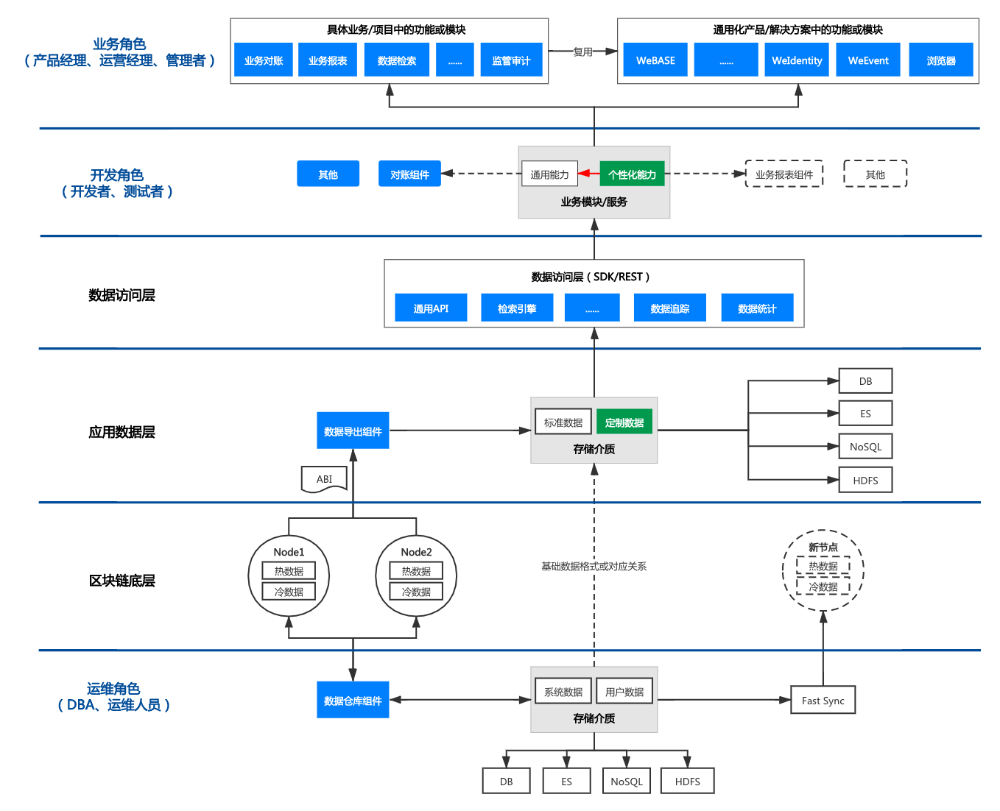
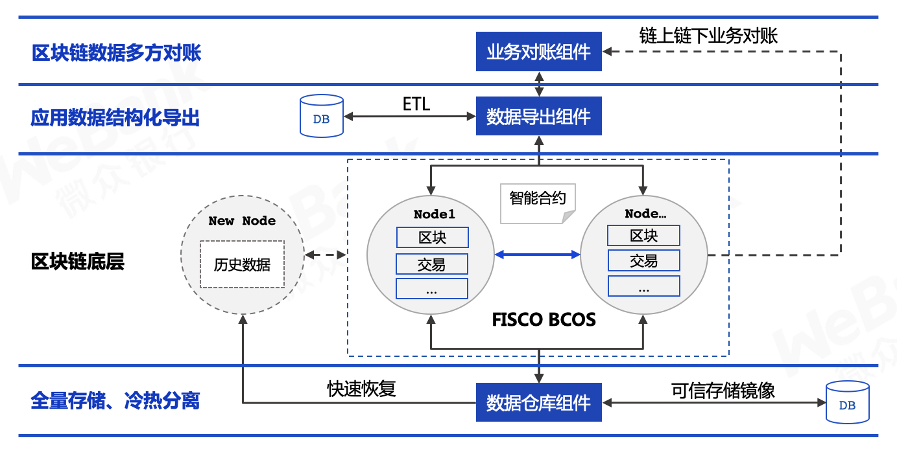
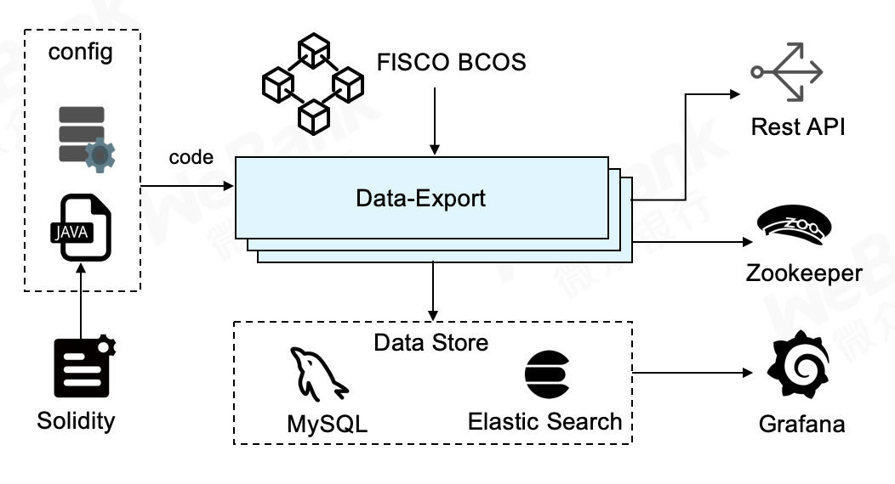
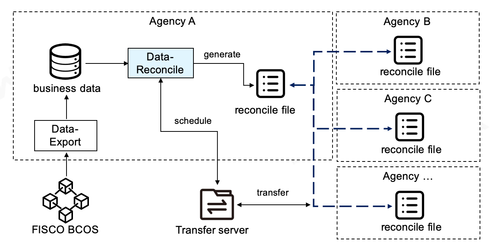

# Common Components for Data Governance

Tags: "WeBankBlockchain-Data" "Data Governance" "" Common Components "" Data Export "" Data Warehouse "" Data Reconciliation "

----

## Component positioning

The full name of the data governance generic component is WeBankBlockchain-Data data governance generic component, which is a stable, efficient and secure blockchain data governance component solution that can seamlessly adapt to the underlying platform of FISCO BCOS blockchain。
It consists of the Data Export component(Data-Export), Data Warehouse Components(Data-Stash)Data Reconciliation Component(Data-Reconcile)These three independent, pluggable, flexible assembly components, out of the box, flexible and convenient, easy to secondary development。
    
These three components provide key capabilities in data governance such as blockchain data mining, tailoring, scaling, trusted storage, extraction, analysis, auditing, reconciliation, and supervision from three aspects: the underlying data storage layer, the smart contract data parsing layer, and the application layer。
WeBankBlockchain-Data has been implemented and used in finance, public welfare, traceability of agricultural and animal husbandry products, judicial deposit certificate, retail and other industries。

## Design Objectives

Between the bottom layer of blockchain and blockchain applications, there is a gap between blockchain technology, business and products, and there are many challenges such as the difficulty of expanding blockchain data, the difficulty of querying and analyzing data on the chain, and the lack of universal product or component support in typical scenarios。

Friends in the community often ask:
The disk of the blockchain node server is almost full, what should I do?？
How to query data in smart contracts in batches？
I would like to inquire how to check all transactions sent by an account？
What is the blockchain reconciliation solution for WeBank and is there a universal solution?？
……

Why do powerful blockchains still have these problems?？

First of all, with the "explosive" growth of blockchain data, the chain has accumulated hundreds of millions of transactions, several tons of data, node servers gradually can not meet the storage needs of transaction data, simply expand the node storage space not only high development costs, high hardware costs, but also in the process of data expansion due to high technical requirements, easy to cause systemic risks, and can not solve the problem once and for all。On the other hand, a large amount of transaction cold data is not only a waste of space, but also affects the performance of blockchain nodes to block and execute transactions。

Secondly, due to the specific chain storage structure of the blockchain, the data on the chain can only be obtained and called through the smart contract interface, which is not only inefficient, but also with the increase of the data on the chain, its query and computing performance gradually decreases, unable to meet the demands of big data analysis and complex queries, such as the need to retrieve all contracts that have been deployed on the chain。Data export solutions based on specific scenarios require specific development for smart contracts due to the large differences in smart contracts, which are costly and cannot be reused。

Finally, blockchain-based trusted data lacks common products and reusable components, and there are similar needs between some scenarios, such as business reconciliation, blockchain browser, business analysis, regulatory audit, etc。There is a lot of duplication of development between different projects, which is time-consuming and laborious, while developers of blockchain applications need to go through a steep learning curve to complete their work goals, which may also introduce various risks in development and testing。

WeBankBlockchain-Data provides key data governance capabilities such as blockchain data mining, tailoring, scaling, trusted storage, extraction, analysis, auditing, reconciliation, and supervision from multiple levels, including the underlying data storage layer, smart contract data parsing layer, and application layer, to meet the needs of the entire data governance process development scenario, as shown in the following figure:

The blockchain data passes through the multi-party consensus of the blockchain consensus node and is not modified once generated。

In the operation and maintenance layer, the historical block data of the blockchain can be exported by the data warehouse component in whole or in part to the local。As a trusted storage image, the exported data is only valid locally, and modifications will not affect the consensus on the chain。We recommend that users establish management methods to limit changes to local data。

In the application data layer, the data export component supports exporting source data, preliminary parsing, and contract-based parsing of multidimensional data。All participants can deploy their own export service as a trusted data source for local queries or analytics。

At the business layer, the business reconciliation component supports internal and external reconciliation of off-chain business data within the organization。

## Component Introduction
Currently, WeBankBlockchain-Data consists of the data warehouse component(Data-Stash)Data Export Components(Data-Export)Data Reconciliation Component(Data-Reconcile)It consists of three independent, pluggable, and flexibly assembled components. More functions and solution sub-components will be provided according to business and scenario requirements。

### WeBankBlockchain-Data-Stash Data Warehouse Components
Provides FISCO BCOS node data expansion, backup and tailoring capabilities。
The binlog protocol can be used to synchronize the data of the underlying nodes of the blockchain. It supports resumable transmission, data trust verification, and fast synchronization mechanism。

Please refer to
- [Github address](https://github.com/WeBankBlockchain/Data-Stash)
- [Gitee Address](https://gitee.com/WeBankBlockchain/Data-Stash)
- [Documentation](https://data-doc.readthedocs.io/zh_CN/latest/docs/WeBankBlockchain-Data-Stash/index.html)
- [Quick Start](https://data-doc.readthedocs.io/zh_CN/latest/docs/WeBankBlockchain-Data-Stash/quickstart.html)

### WeBankBlockchain-Data-Export Data Export Component
Supports exporting on-chain data to structured storage such as MySQL to solve complex query, analysis and processing problems of blockchain data。
Personalized business data can be exported in real time with simple configuration and no development required, transforming bare data into standardized, structured, ordered and visualized high-value data。

Please refer to
- [Github address](https://github.com/WeBankBlockchain/Data-Export)
- [Gitee Address](https://gitee.com/WeBankBlockchain/Data-Export)
- [Documentation](https://data-doc.readthedocs.io/zh_CN/latest/docs/WeBankBlockchain-Data-Export/index.html)
- [Quick Start](https://data-doc.readthedocs.io/zh_CN/latest/docs/WeBankBlockchain-Data-Export/install.html)
    
### WeBankBlockchain-Data-Reconcile Data Reconciliation Component
Provide reconciliation solutions for blockchain data。
Flexible configuration, no need to develop, support custom reconciliation data and reconciliation format, support scheduled reconciliation and trigger reconciliation, reconciliation processing module can be pluggable and expandable。

Please refer to
- [Github address](https://github.com/WeBankBlockchain/Data-Reconcile)
- [Gitee Address](https://gitee.com/WeBankBlockchain/Data-Reconcile)
- [Documentation](https://data-doc.readthedocs.io/zh_CN/latest/docs/WeBankBlockchain-Data-Reconcile/index.html)
- [Quick Start](https://data-doc.readthedocs.io/zh_CN/latest/docs/WeBankBlockchain-Data-Reconcile/install.html)

## Usage Scenarios

Enterprise-level blockchain applications involve multiple roles, such as business roles, operators, development roles, and operation and maintenance roles。For blockchain data, each specific role has different data governance demands。WeBankBlockchain-Data abstracts and designs the corresponding components to meet the needs of different roles for data governance from the three dimensions of blockchain underlying node data maintenance, application data processing, and business data application。

### Scenario 1: Node data maintenance

Data warehouse component Data-Stash is a lightweight, high-security, and high-availability component for blockchain node data processing, mainly for operation and maintenance personnel and developers。

Data backup: Data-Stash can back up the data of blockchain nodes in quasi-real time through the Binlog protocol, and the blockchain nodes can cut and separate hot and cold data according to the actual situation, which solves the problem of node expansion and reduces development and hardware costs on the basis of ensuring data security and trustworthiness。While solving the problem of node expansion, it can make the node "light load," which can not only reduce the cost of node space, but also effectively improve the performance of node execution transactions。

Data synchronization: For new nodes that join the blockchain network, you can use Data-Stash to quickly synchronize the data of the blockchain network with the cooperation of the Fisco Sync tool to ensure that the nodes participate in the "work" of the blockchain network as quickly as possible, reducing the waste of time caused by new nodes waiting for data synchronization。

### Scenario 2: Application Data Processing

Data-Export provides standard exported blockchain data and customized data automatically generated based on intelligent analysis of smart contract code, stored in storage media such as MySQL and ElasticSearch, mainly for developers。

Complex query and analysis: The existing blockchain is not very friendly to query functions, and on-chain computing is very valuable. Data-Export supports exporting blockchain data stored on the chain to a distributed storage system under the chain。Developers can deploy contract accounts, events, functions and other data based on the exported basic data of the blockchain system, perform secondary development, customize the logic of complex queries and data analysis, and quickly realize business requirements。For example, developers can perform statistics and correlation query analysis on transaction details based on business logic, develop various anti-money laundering and audit supervision reports, and so on。

Blockchain data visualization: Data-Export automatically generates Grafana configuration files, enabling blockchain data visualization without development。Blockchain data visualization can not only be used as a tool for blockchain data inventory, data viewing, and operational analysis, but also can be used in the application development, debugging, and testing phases to improve R & D experience and efficiency in a visible and accessible way。In addition, Data-Export provides Restful APIs for external system integration。The operation and maintenance personnel can monitor the status of the business system in real time through Grafana, and the business personnel can obtain the real-time progress of the business on the integrated business background system。

The data export subsystem of the blockchain middleware platform WeBASE has been integrated with Data-Export, and at the same time, Data-Export can also be independently integrated with the underlying blockchain to flexibly support business needs, and has been stable and safe in dozens of production systems so far。

Today, as a key component of blockchain data governance, Data-Export is released in open source form and perfected by community partners to adapt to more usage scenarios and create more functions。

### Scenario 3: Business Data Application

At the business level, data reconciliation is one of the most common scenarios in blockchain trading systems。Based on the development and practical experience of several blockchain DAPP applications, we have packaged and developed the data reconciliation component Data-Reconcile, which provides a universal data reconciliation solution based on the blockchain smart contract ledger, and provides a set of dynamically extensible reconciliation framework, which supports customized development, mainly for developers, and provides services for business personnel。

Internal enterprise reconciliation: Data-Reconcile supports reconciliation between internal enterprise systems, such as between data on the blockchain and off-chain business systems。Developers can use Data-Reconcile to quickly carry out secondary development, accounting and comparing business system data with on-chain data, ensuring the reliability and operational security of internal business system data。

Inter-Enterprise Reconciliation: Data-Reconcile helps developers quickly build inter-agency reconciliation applications。For example, during settlement, Enterprise A regularly exports its own business system transaction data as reconciliation files and sends them to the file storage center。Enterprise B can use Data-Reconcile to regularly pull enterprise A reconciliation files, and cooperate with Data-Export to reconcile with the data on the chain within the enterprise。Data-Reconcile improves the efficiency of reconciliation while ensuring the credibility of reconciliation results, enabling quasi-real-time reconciliation。

To sum up, WeBankBlockchain-Data is a stable, efficient and secure three-dimensional blockchain data governance solution, which aims to provide a series of independent, pluggable and flexible components to deal with and deal with the problem of massive data in the blockchain, bringing users a more convenient, simple, low-cost and lightweight user experience, thus promoting the development of blockchain data governance。

