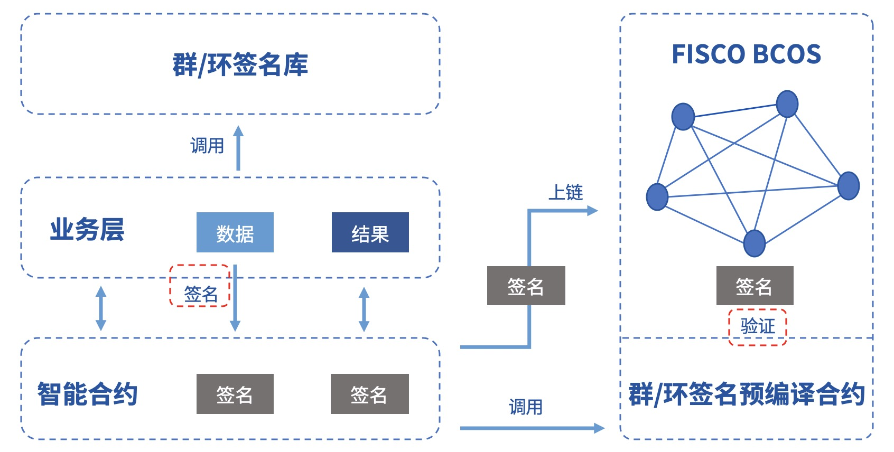

# Using the Group / Ring Signed Contract Interface

Tags: "Privacy Contract" "Privacy Protection" "Contract Development" "Ring Signature" "

----
Privacy protection is a major technical challenge for the alliance chain。In order to protect on-chain data, protect the privacy of alliance members, and ensure the effectiveness of supervision, FISCO BCOS [pre-compiled contract](https://fisco-bcos-doc.readthedocs.io/zh_CN/latest/docs/develop/precompiled/index.html)The form of the integrated group / ring signature verification function, providing a variety of privacy protection means.。

The document briefly introduces the group / ring signature algorithm and related application scenarios and provides a reference for the call method.。

## 1 Introduction to the algorithm

**group signature**

group signature(Group Signature)It is a relatively anonymous digital signature scheme that protects the identity of the signer, where the user can sign the message in place of their group, and the verifier can verify that the signature is valid, but does not know which group member the signature belongs to.。At the same time, users cannot abuse this anonymity because the group administrator can open the signature through the group master's private key, exposing the signature's attribution information.。Features of a group signature include:

- Anonymity: Group members use group parameters to generate signatures, others can only verify the validity of the signature, and know that the signer belongs to the group through the signature, but cannot obtain the signer's identity information.；
- Non-forgeability: only group members can generate valid verifiable group signatures；
- Non-linkability: Given two signatures, it is impossible to tell if they are from the same signer；
- Traceability: In the case of regulatory intervention, group owners can obtain the signer's identity by signing.。

**ring signature**

ring signature(Ring Signature)Is a special group signature scheme, but with complete anonymity, that is, there is no administrator role, all members can actively join the ring, and the signature cannot be opened.。The characteristics of ring signatures include:

- Non-forgery: No other member of the ring can forge a true signer's signature；
- Complete anonymity: no group owner, only ring members, others can only verify the validity of the ring signature, but no one can obtain the signer's identity information。

## 2 Functional components

The FISCO BCOS group / ring signature module provides the following functional components:

- Group / Ring [Signature Library](https://github.com/FISCO-BCOS/group-signature-lib), provides a complete group / ring signature algorithm c++Interface

- Group / Ring Signature Precompiled Contracts: Provide group / ring signature verification interface。

FISCO BCOS provides users with examples of group / ring signature development, including:

- Group / ring signature server: Provides complete group / ring signed RPC services。[GitHub source code](https://github.com/FISCO-BCOS/group-signature-server)[Gitee source code](https://gitee.com/FISCO-BCOS/group-signature-server)

- Group / Ring Signing Client: Call the RPC service to sign the data, and provide signature on the chain and on-chain verification and other functions.。[GitHub source code](https://github.com/FISCO-BCOS/group-signature-client)[Gitee source code](https://gitee.com/FISCO-BCOS/group-signature-client)

The sample framework is shown in the following figure. Please refer to [Client Guide Github Link](https://github.com/FISCO-BCOS/group-signature-client)or [Client Guide Gitee Link](https://gitee.com/FISCO-BCOS/group-signature-client)。


## 3 Application scenarios

Businesses with signer identity concealment requirements can use this module to achieve related functions.。The signer signs the data by calling the group / ring signature library, links the signature, and the business contract verifies the signature by calling the group / ring signature precompiled contract, and returns the verification result to the business layer.。If it is a group signature, the supervisor can also open the specified signature data to obtain the signer's identity.。The specific process is shown in the following figure:



Due to its natural anonymity, group / ring signatures have a wide range of applications in scenarios where the identity of participants needs to be concealed, such as anonymous voting, anonymous auctions, anonymous auctions, etc., and can even be used to implement anonymous transfers in the blockchain UTXO model.。At the same time, because the group signature is traceable, it can be used in scenarios that require regulatory intervention, and the regulator acts as the group owner or entrusts the group owner to reveal the identity of the signer.。


## 4. Pre-compiled contract interface.

**The precompiled contract addresses for group signature verification and ring signature verification are as follows:**

| Address| Function| Source code|
| ------ | ---- | ----------------------- |
| 0x5004 | group signature| GroupSigPrecompiled.cpp |
| 0x5005 | ring signature| RingSigPrecompiled.cpp  |


**The group / signature verification interface is as follows:**

- group signature

  ```cpp
  // GroupSigPrecompiled.sol
  pragma solidity ^0.4.25;
  contract GroupSigPrecompiled{
      /**
      * Group Signature Verification Interface
      * @tparam signature: group signature
      * @tparam message: Plaintext message corresponding to group signature
      * @param gpkInfo: Group Information
      * @param paramInfo: Group meta information
      * @return int: Error code, 0 means no exception occurred; -51700 indicates group signature verification failed; -50101 indicates that an illegal group signature verification interface was called.
      *         bool: Group signature verification result. False indicates that the verification fails. True indicates that the verification succeeds.
      */
  		function groupSigVerify(string signature, string message, string gpkInfo, string paramInfo) public constant returns(int, bool);
  }
  ```

- ring signature

  ```cpp
  // RingSigPrecompiled.sol
  pragma solidity ^0.4.25;
  contract RingSigPrecompiled{
        /**
        * Ring Signature Verification Interface
        * @tparam signature: ring signature
        * @tparam message: The plaintext message corresponding to the ring signature.
        * @param paramInfo: Ring Information
        * @return int: Error code, 0 means no exception occurred; -51800 indicates that ring signature verification failed; -50101 indicates that an illegal ring signature verification interface was called.
        *         bool: The result of ring signature verification. False indicates that the verification fails. True indicates that the verification succeeds.
        */
       function ringSigVerify(string signature, string message, string paramInfo) public constant returns(int, bool);
  }
  ```