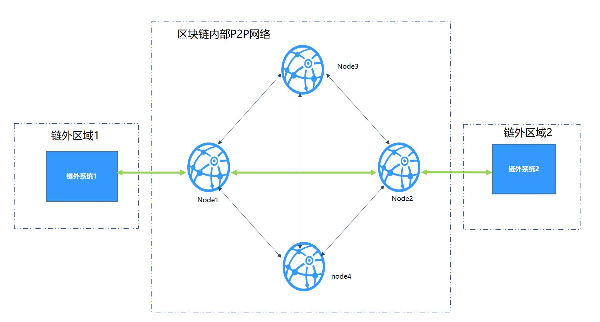
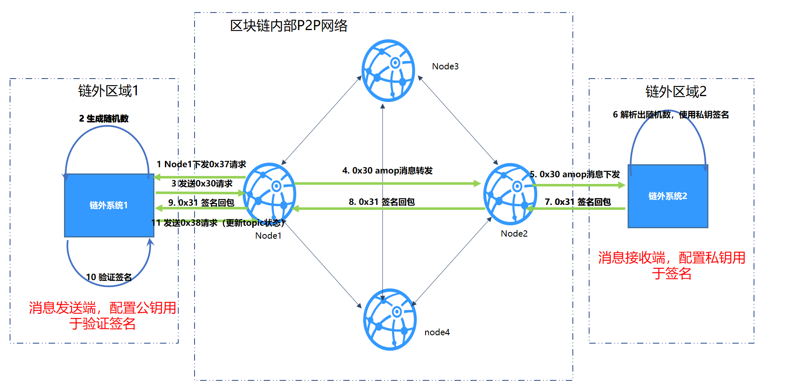

# 20. On-chain information transfer protocol AMOP

Tags: "AMOP" "Messenger on Chain" "Private Topics" "Certification Process" "

----
## Introduction to On-Chain Messenger Protocol

The Advanced Messages Onchain Protocol (AMOP) system is designed to provide a secure and efficient message channel for the consortium chain. All institutions in the consortium chain can use AMOP to communicate as long as they deploy blockchain nodes, whether they are consensus nodes or observation nodes. AMOP has the following advantages:
- Real-time: AMOP messages do not rely on blockchain transactions and consensus, and messages are transmitted in real time between nodes with a latency of milliseconds。  
-Reliable: When AMOP messages are transmitted, all feasible links in the blockchain network are automatically searched for communication, as long as at least one link is available between the sending and receiving parties, the message is guaranteed to be reachable。  
- Efficient: AMOP message structure is simple, efficient processing logic, only a small amount of CPU occupation, can make full use of network bandwidth。  
- Security: AMOP all communication links using SSL encryption, encryption algorithm can be configured, support authentication mechanism。
-Easy to use: When using AMOP, no additional configuration is required in the SDK。

Please refer to [Java SDK AMOP] to use the AMOP function(../sdk/java_sdk/amop.md).

## logical architecture


Taking the typical IDC architecture of a bank as an example, the regional overview:

- Off-chain area: the business service area inside the organization. The business subsystems in this area use the blockchain SDK to connect to the blockchain nodes。  
- Blockchain P2P network: This area deploys blockchain nodes of various institutions. This area is a logical area. Blockchain nodes can also be deployed inside institutions。


## Common Topics

AMOP's messaging is based on the topic (Topic) subscription mechanism, where the subscriber first subscribes to a topic, and the sender sends a message to the topic, which the subscriber receives。

**Send method and content**

In total, two modes of transmission are supported:

* **Unicast**Send randomly only to subscribers of a specified topic。
* **Multicast**Send to all subscribers of the specified topic。

Send content:

* **Text Message**
* **File**


## Private Topics

Under normal configuration, any recipient who subscribes to a topic can receive messages pushed by the sender。However, in some scenarios, the sender only wants a specific recipient to receive the message and does not want unrelated recipients to listen to the topic arbitrarily。In this scenario, you need to use the private topic function。

**Private Topics**: For a specific topic, the sender configures the public key of the desired recipient, and only the subscriber corresponding to the public key can receive the message of the private topic。

The Private Topics feature is new since FISCO BCOS 2.1.0。The use process is as follows:

-1: Receiver uses [Generate Public-Private Key Script](./account.md)Generate a public-private key file, keep the private key, and give the public key to the producer。
-2: Refer to the configuration case to match the configuration file。Start the receiving end and the sending end to send and receive messages。

```eval_rst
.. important::
    Note: Currently, AMOP private topics only support non-state secret algorithms. Therefore, when generating public and private key files, use non-state secret tools to generate them。
```

**Certification process for private topics**

Assume that off-chain system 1 is the topic message sender (message sender) and off-chain system 2 is the topic subscriber (message receiver)。The certification process for private topics is as follows:



-1: The off-chain system 2 connects to Node2 and claims to subscribe to T1. Node2 adds T1 to the topic list and adds 1 to seq。Simultaneously synchronize seq to other nodes every 5 seconds。
-2: After receiving the seq, Node1 compares the local seq with the synchronized seq and finds that there is an inconsistency, then obtains the latest topic list from Node2 and updates the topic list to the p2p topic list. For private topics that have not yet been authenticated, the status is set to Pending Authentication。Node1 traversal list。For each private topic to be certified, do the following:
  -2.1: Node1 pushes messages to Node1(Message type 0x37), request off-chain system 1 to initiate the private topic authentication process。
  -2.2: After receiving the message, the off-chain system 1 generates a random number and uses the amop message(Message type 0x30)Send the message out and listen back for the packet。
  -2.3: Messages pass through the off-chain system 1-->Node1-->Node2-->The route of the off-chain system 2, which resolves the random number after receiving the message and signs the random number with the private key。
  - 2.4: Signature package(Message type 0x31)Through out-of-chain system 2 ->Node2-->Node1->The route of the off-chain system 1, after the off-chain system 1 receives the signature packet, parses the signature and verifies the signature using the public key。
  -2.5: After the signature is verified by the out-of-chain system 1, the message is sent(Message type 0x38)request the node to update the topic status (authentication success or authentication failure)。
-3: If the authentication is successful, after a message from the off-chain system reaches Node1, Node1 will forward the message to Node2, and Node2 will push the message to the off-chain system 2。


**Send method and content**

Same private topics support unicast and multicast, send text and files。


## error code

-99: Failed to send the message. After AMOP attempts to pass through all links, the message cannot be sent to the server. It is recommended to use the 'seq' generated during sending to check the processing of each node on the link。
-100: After attempting to pass through all links between blockchain nodes, the message cannot be sent to the node that can receive the message. Like the error code '99', it is recommended to use the 'seq' generated at the time of sending to check the processing of each node on the link。
-101: The blockchain node pushes a message to the Sdk, and after trying to pass through all links, it fails to reach the Sdk end. Like the error code '99', it is recommended to use the 'seq' generated during sending to check the processing of each node on the link and the Sdk。
-102: Message timeout, it is recommended to check whether the server correctly handles the message and whether the bandwidth is sufficient。
-103: The AMOP request sent by the SDK to the node is rejected due to the bandwidth limit of the node。

