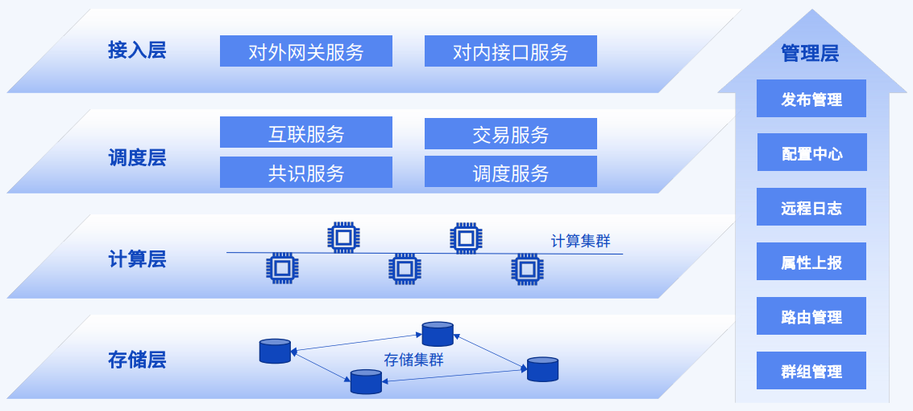
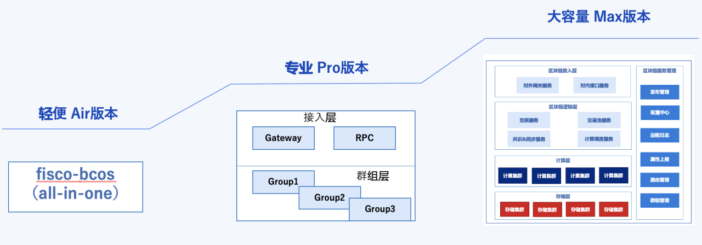

# 1. System Architecture

Tags: "Design" "Architecture"

----------

FISCO BCOS 3.x version adopted**Microservices Modularization**Design architecture, the overall system includes five aspects: access layer, scheduling layer, computing layer, storage layer and management layer.。The following describes the functional design of each layer。

- **access layer**The access layer is mainly responsible for the blockchain.**The ability to connect**, including the "external gateway service" that provides P2P capabilities and the "internal gateway service" that provides SDK access.。In the system of the alliance chain, the "external gateway service" manages the entrance and exit of the organization's external connection and is responsible for the security certification at the organization level.。The "internal gateway service" provides access to clients (applications) within the organization.。Both gateway services can be scaled in parallel, deployed in multiple locations, and load-balanced to meet high availability requirements.。
***

- **scheduling layer**: The scheduling layer is the "brain center" system for the operation and scheduling of the blockchain kernel and is responsible for the entire blockchain system.**operation scheduling**, including network distribution scheduling, transaction pool management, consensus mechanism, calculation scheduling and other modules.。Among them, the network distribution module is mainly to realize the interconnection communication function with the access layer and handle the message distribution logic.；Trading pool management is mainly responsible for the receipt of transactions, signature verification, elimination and other functions.；The consensus mechanism is responsible for transaction sequencing, block packaging, and distributed consensus on block results to ensure consistency.；The calculation scheduling completes the scheduling processing of transaction verification (the core is the verification of smart contracts), and realizes parallel verification, which is the key to the throughput of the entire system.。

***

- **calculation layer**Mainly responsible for:**Transaction Validation**The transaction decoding needs to be executed in the contract virtual machine to obtain the transaction execution result.。Transaction verification is the core of the entire blockchain, especially for blockchain systems based on smart contracts, and the calculation of transaction verification can cost a lot of CPU overhead.。Therefore, it is very important to realize the parallel expansion of transaction verification calculation through clustering mode.。

***

- **Storage Tier**: The storage layer is responsible for**Drop Disk Storage**The storage layer focuses on how to support the storage of massive amounts of data, using distributed storage clusters to achieve scalable storage capacity.。The distributed storage industry already has many stable and reusable open source components (such as TiKV), and this layer will reuse mature components.。

***

- **Management**: The management is implemented for each module of the entire blockchain system.**visual management**platform, including management functions such as deployment, configuration, logging, and network routing。The FISCO BCOS 3.x system architecture is built based on the open-source microservice framework Tars, and the capabilities of this layer reuse the mature Tars.-Framework Management Components。

FISCO BCOS 3.x uses a microservices architecture, but also supports**Flexible split combination**microservices modules, thereby building different morphologies of service patterns, including "**Lightweight Air version**”、“**Pro Edition**"和"**Large Capacity Max Edition**”。

- **Lightweight Air Edition**: Adopting all-in-The one encapsulation mode compiles all modules into a binary (process), a process is a blockchain node, including all functional modules such as network, consensus, access, etc., using local RocksDB storage。It is suitable for beginners, functional verification, POC products, etc.。

***

- **Pro Edition**It consists of two access layer services: RPC and Gateway, and multiple blockchain node services. One node service represents a group, and the storage uses local RocksDB. All nodes share access layer services. The two access layer services can be extended in parallel.。It is suitable for production environments with controllable capacity (within T level) and can support multi-group expansion.。

***

- **Large Capacity Max Edition**: Consists of all services at each layer, each service can be independently extended, storage adopts distributed storage TiKV, management adopts Tars-Framework Services。It is suitable for scenarios where massive transactions are linked and a large amount of data needs to be stored on disk.。

