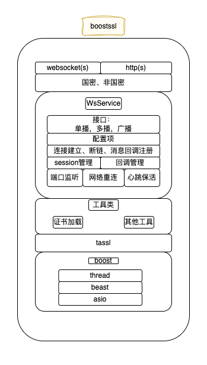

# 19. Public network component BoostSSL.

Tags: "network components" "boostssl"

----

'boostssl 'is'fisco-Bcos' provides a public network component, built-in http, websocket two protocols, support for state-secret, non-state-secret SSL connection, in 'FISCO-BCOS 3.0 'used in multiple modules。

## 1. 目标

- Support state secret, non-state secret SSL connection
- Support HTTP protocol
- Support for WebSocket protocol
- Simple, easy-to-use interface

## 2. 设计



## 3. Interface

To be added

## 4. 使用

**Source Path:**

- <https://github.com/FISCO-BCOS/bcos-boostssl>
- <https://gitee.com/FISCO-BCOS/bcos-boostssl>

**Support System:**

- `CentOS 7.2+`
- `Ubuntu 18.04+`
- `Windows 10`
- `macOS 12`

**Dependent installation:**

- `CentOS`:
  `yum install -y epel-release centos-release-scl openssl-devel openssl cmake3 gcc-c++ git flex patch bison gmp-static devtoolset-7 wget`
  
- `Ubuntu`:
  `apt install -y g++ libssl-dev openssl cmake git build-essential autoconf texinfo flex patch bison libgmp-dev zlib1g-dev automake libtool wget`
  
- `macOS`:
  `brew install wget openssl@1.1 git flex bison gmp`
  
- `Windows`:
  - [Visual Studio 2017](https://docs.microsoft.com/en-us/visualstudio/releasenotes/vs2017-relnotes)or [Visual Studio 2019](https://docs.microsoft.com/en-us/visualstudio/releases/2019/release-notes)
  - [perl](https://www.activestate.com/products/perl/)
  - [nasm](https://www.nasm.us/pub/nasm/releasebuilds/2.15.05/win64/)

**Compile:**

- 'Linux 'Compile

```shell
# source /opt/rh/devtoolset-7/enable # centos execution

cd bcos-boostssl
mkdir build && cd build
cmake ../ -DBUILD_SAMPLE=ON  # Centos uses cmake3, BUILD _ SAMPLE to compile the sample program of the sample directory.
```

- 'macOS 'Compile

```shell
cd bcos-boostssl
mkdir build && cd build
cmake ../ -DBUILD_SAMPLE=ON # BUILD _ SAMPLE indicates the sample program for compiling the sample directory
```

- 'Windows' Compile

```shell
# cmake
cmake -G "Visual Studio 15 2017" -A x64 ../ -DHUNTER_CONFIGURATION_TYPES=Release -DCMAKE_WINDOWS_EXPORT_ALL_SYMBOLS=ON

# Compile
MSBuild bcos-boostssl.sln /p:Configuration=Release /p:Platform=x64
```

## 5. Case

`bcos-boostssl 'in' FISCO-Use in BCOS ':

- `bcos-cpp-sdk`: Use 'boostssl' as the client to connect to the node 'rpc', see:
  - [github](<https://github.com/FISCO-BCOS/bcos-cpp-sdk/blob/3.2.0/bcos-cpp-sdk/SdkFactory.cpp#L82>)
  - [gitee](<https://gitee.com/FISCO-BCOS/bcos-cpp-sdk/blob/3.2.0/bcos-cpp-sdk/SdkFactory.cpp#L82>)
- `FISCO-BCOS rpc 'module: Use 'boostssl' as the server to provide 'RPC' services for both the 'http' and 'websocket' protocols. For more information, see:
  - [github](<https://github.com/FISCO-BCOS/FISCO-BCOS/blob/v3.2.0/bcos-rpc/bcos-rpc/RpcFactory.cpp#L310>)
  - [gitee](<https://gitee.com/FISCO-BCOS/FISCO-BCOS/blob/v3.2.0/bcos-rpc/bcos-rpc/RpcFactory.cpp#L310>)
