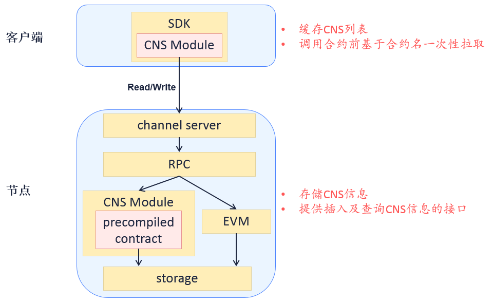
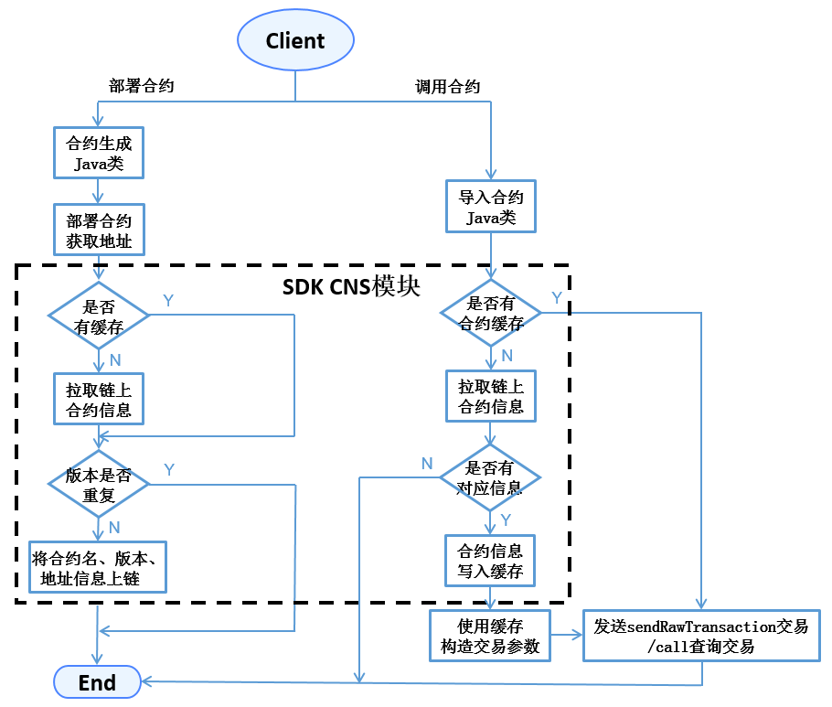

# 17. Contract Naming Service CNS

Tags: "Contract Naming Service" "CNS Table Structure"

----

## 注意

CNS service only in 'FISCO BCOS 2.+Version 'can be used in' FISCO BCOS 3.+Version 'has been deprecated and is managed in a more friendly tree contract directory. For more information, see [Contract File System BFS](./contract_directory.md)

**Migration Instructions:** Due to the abandonment of the CNS interface, BFS contains the functions of the CNS and also provides the corresponding adaptation interface.。You can change the original CNS service interface to the BFS interface. The interface corresponds to the following table:

| Method Name| CNSService                                                      | BFSService                                                    |
|--------------------------------|-----------------------------------------------------------------|---------------------------------------------------------------|
| Create a mapping between a contract name and a contract address| insert(string name, string version, string address,string abi); | link(string name, string version, string address,string abi); |
| Get the address of the corresponding name and version| selectByNameAndVersion(string name,string version);             | readlink(string path);                                        |
| Traverse all versions of contract name| selectByName(string name);                                      | list(string path);                                            |
| Contract Address| 0x1004                                                          | 0x100e                                                        |

## Overview

The process of invoking an Ethereum smart contract includes:

1. Preparation of contracts；
2. Compile the contract to get the contract interface abi description.；
3. Deploy the contract to get the contract address.；
4. Encapsulate the abi and address of the contract, and call the contract through tools such as SDK.。

As can be seen from the contract call process, the contract abi and the contract address must be prepared before the call.。This use of the following problems:

1. The contract abi is a long JSON string, and the caller does not need to directly sense it.；
2. The contract address is a magic number of 20 bytes, which is inconvenient to remember. If it is lost, the contract will be inaccessible.；
3. After the contract is redeployed, one or more callers need to update the contract address；
4. It is not convenient for version management and contract gray scale upgrade.。

In order to solve the above problems and provide callers with a good smart contract invocation experience, FISCO BCOS proposes**CNS Contract Naming Service**。

## noun explanation

- **CNS**(Contract Name Service) By providing a record of the mapping between the contract name and the contract address on the chain and the corresponding query function, it is convenient for the caller to call the contract on the chain by memorizing the simple contract name.。
- **CNS information**For contract name, contract version, contract address and contract abi
- **CNS Table**Used to store CNS information

## Advantages of CNS compared with the original calling method of Ethereum

- Simplify contract invocation；
- Contract upgrade is transparent to callers and supports contract grayscale upgrade。

## Benchmarking ENS

ENS (Ethereum Name Service) , Ethereum Name Service。

ENS functions like our more familiar DNS(Domain Name Service)Domain name system, but provides not an Internet URL, but will Ethereum(Ethereum)The contract address and wallet address are expressed as xxxxxx.eth for accessing the contract or transferring money。Compared to the two:

- The address types mapped by ENS include contract address and wallet address. CNS can support this. When the address type is wallet address, the contract abi is empty.。
- ENS has auction function, CNS does not need support。
- ENS supports multi-level domain names, CNS does not need to support。

## Module Architecture



< center > CNS architecture < / center >

## Core Process

The process for calling an SDK deployment contract and calling the contract is as follows:



< center > SDK deployment contract and call contract process < / center >

- When deploying a contract, the SDK generates the Java class corresponding to the contract, calls the deploy interface of the class to publish the contract to obtain the contract address, and then calls the CNS contract insert interface to link the CNS information。
- When calling a contract, the SDK introduces the Java class of the contract and loads the instantiated。The load loading interface can pass in the contract address (the original Ethereum method) or the combination of the contract name and the contract version (CNS method). When the SDK processes the CNS method, the contract address is obtained by calling the CNS module to query the information on the chain.。
- For contract invocations without a version number, the SDK implements the default invocation of the latest version of the contract.。
- The abi information of the contract on the chain is an optional field.。

## Data Structure

### CNS table structure

CNS information is stored in system tables, with separate ledgers。The CNS table is defined as follows:

<table border="3">
<tr bgcolor="#CDCDCD">
  <td><center>Field</center></td>
  <td><center>Type</center></td>
  <td><center>Null</center></td>
  <td><center>Key</center></td>
  <td><center>Expain</center></td>
</tr>
< tr > < td > name < / td > < td > string < / td > < td > No < / td > < td > PRI < / td > < td > contract name, where name and version are joint primary keys < / td > < / tr >
< tr > < td > version < / td > < td > string < / td > < td > No < / td > < td > < / td > < td > contract version, name and version are joint primary keys < / td > < / tr >
< tr > < td > address < / td > < td > string < / td > < td > No < / td > < td > < / td > < td > contract address < / td > < / tr >
< tr > < td > abi < / td > < td > string < / td > < td > YES < / td > < td > < / td > < td > contract abi < / td > < / tr >
< tr > < td > _ status _ < / td > < td > string < / td > < td > No < / td > < td > < / td > < td > Distributed storage common field, "0" can be deleted with "1" < / td > < / tr >
</table>

### Contract Interface

```
pragma solidity ^0.4.2;
contract CNS
{
    function insert(string name, string version, string addr, string abi) public returns(uint256);
    function selectByName(string name) public constant returns(string);
    function selectByNameAndVersion(string name, string version) public constant returns(string);
}
```

- The CNS contract is not exposed to the user. It is the interface between the SDK and the underlying CNS table.。
- The insert interface provides the function of uploading CNS information. The four parameters of the interface are contract name, contract version version, contract address addr, and contract ABI information abi.。The SDK call interface needs to determine whether the combination of name and version is duplicated with the original database record, and only on the premise that it is not duplicated can the chain transaction be initiated.。When a node executes a transaction, the precompiled logic will Double Check and discard the transaction if it finds duplicate data.。The insert interface only increases and does not change the contents of CNS tables.。
- The selectByName interface parameter is the contract name name, which returns all different version records based on the contract in the table.。
- The selectByNameAndVersion interface parameter is the contract name and contract version version, which returns the unique address of the contract version in the table.。

#### Update CNS table mode

**Precompiled Contracts**Is the FISCO BCOS underlying through C++An efficient smart contract implemented for the configuration and management of system information at the bottom of FISCO BCOS.。After the introduction of the precompiled logic, the FISCO BCOS node executes the transaction as follows.

The CNS contract is a pre-compiled contract type, and the node will pass the built-in C.++Code logic implements insert and query operations on CNS tables without EVM execution, so CNS contracts only provide function interface descriptions and no function implementations。**Preset precompiled address of CNS contract to 0x1004。**

#### Contract interface return example

The string returned by the selectByName and selectByNameAndVersion interfaces is in JSON format, as shown in the following example:
```json
[
    {
        "name" : "Ok",
        "version" : "1.0",
        "address" : "0x420f853b49838bd3e9466c85a4cc3428c960dde2",
        "abi" : "[{\"constant\":false,\"inputs\":[{\"name\":\"num\",\"type\":\"uint256\"}],\"name\":\"trans\",\"outputs\":[],\"payable\":false,\"type\":\"function\"},{\"co
nstant\":true,\"inputs\":[],\"name\":\"get\",\"outputs\":[{\"name\":\"\",\"type\":\"uint256\"}],\"payable\":false,\"type\":\"function\"},{\"inputs\":[],\"payable\":false,\
"type\":\"constructor\"}]"
    },
    {
        "name" : "Ok",
        "version" : "2.0",
        "address" : "0x420f853b49838bd3e9466c85a4cc3428c960dde2",
        "abi" : "[{\"constant\":false,\"inputs\":[{\"name\":\"num\",\"type\":\"uint256\"}],\"name\":\"trans\",\"outputs\":[],\"payable\":false,\"type\":\"function\"},{\"co
nstant\":true,\"inputs\":[],\"name\":\"get\",\"outputs\":[{\"name\":\"\",\"type\":\"uint256\"}],\"payable\":false,\"type\":\"function\"},{\"inputs\":[],\"payable\":false,\
"type\":\"constructor\"}]"
    }
]
```

## SDK_API

SDK developers can use the following two interfaces in 'org.fisco.bcos.web3j.precompile.cns' to implement CNS registration and query functions。

### registerCns
- Description: public TransactionReceipt registerCns(String name, String version, String addr, String abi)
- Function: on the chain contract information
- Parameters: name - contract name, version - contract version, addr - contract address, abi - contract abi
- Return: the receipt of the up-chain transaction, which contains the up-chain result information and error information (if any).

### resolve
- Description: public String resolve(String contractNameAndVersion)
- Function: Query contract address based on contract name and contract version
- Parameter: contractNameAndVersion - contract name+Contract Version Information
- Return: The contract address. If there is no contract information of the specified version, the interface throws an exception.
- (contractNameAndVersion by ':'to split the contract name and contract version, when the contract version is missing, the SDK default call uses the latest version of the contract to query

Note:
1. Before calling the interface, convert the sol contract into a Java class and place the generated Java class and abi and bin files in the correct directory. For more information, see [Web3SDK](../sdk/java_sdk.md)；
2. Examples of the use of the two interfaces can be found in [ConsoleImpl.java](https://github.com/FISCO-BCOS/console/blob/master-2.0/src/main/java/console/contract/ConsoleContractImpl.java)DeployByCNS and callByCNS interface implementations in。

## Operating tools

The console provides the functions of deploying contracts, invoking contracts, and querying existing contracts based on contract names. For the console user manual, please refer to [here](../operation_and_maintenance/console/console_commands.md)。

The commands provided by the console include:

- deployByCNS: Deploying Contracts Through the CNS
- callByCNS: Invoking Contracts Through the CNS
- queryCNS: Query CNS table information based on contract name and contract version number (optional parameters)
