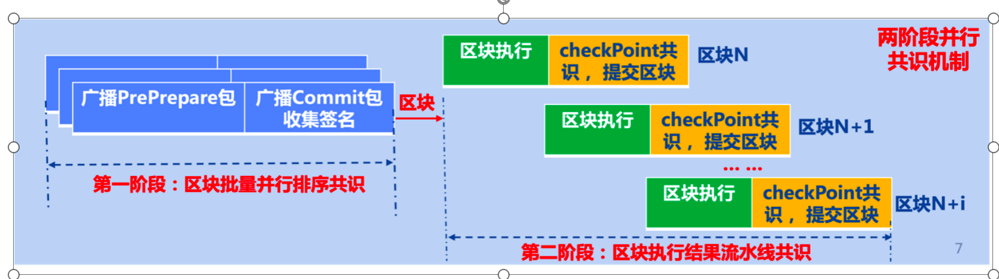

# Two-Phase PBFT

Tag: "consensus" "" BFT ""

----------

```eval_rst
.. note::
   The implementation of the FISCO BCOS 3.x consensus module is located in the repository 'bcos-pbft <https://github.com/FISCO-BCOS/bcos-pbft>`_
```

In order to ensure the security and performance of the blockchain system, the current consortium blockchain system generally uses the Byzantine consensus algorithm.。However, since each block header of the chain blockchain system must contain the hash of the parent block and the execution result of the current block, on the one hand, the block consensus must be carried out serially.(That is, the consensus on the Nth block must be reached at the beginning of the consensus on the Nth block.+Completed before 1 block)On the other hand, blockchain consensus is tightly coupled with block execution and submission (that is, the entire block consensus process must include block execution and block submission steps), and block execution cannot be performed in parallel during low CPU usage such as block packaging and broadcast consensus message packets, which seriously reduces the efficiency of system resources and reduces the performance of the blockchain system.。

In order to solve the performance problem of the serial consensus of the current blockchain system, FISCO BCOS 3.x proposes a two-stage parallel Byzantine consensus algorithm, which divides the consensus of the blockchain system into two stages: the consensus of the block batch parallel sorting and the consensus of the block execution result pipeline, and the two stages can be carried out in parallel.。Block batch parallel sorting consensus and block execution result pipeline consensus both support parallel consensus on multiple blocks, thus improving blockchain throughput。

The block batch parallel sorting consensus is responsible for sorting the transactions received in the transaction pool and generating unexecuted and sorted blocks in parallel.；Block Execution Results Pipeline Consensus Perform pipeline consensus on block execution results and submit blocks with successful consensus。

The two stages of block batch parallel sorting consensus and block execution result pipeline consensus can be carried out in parallel.；And both stages can agree on multiple blocks at the same time.


The following figure shows the architecture of the two-stage parallel Byzantine consensus algorithm. The whole system mainly includes two parts: block batch sorting parallel consensus and block execution result pipeline consensus.



## 1. Block batch parallel sorting consensus process.

In this phase, the PBFT consensus algorithm is used to package the transactions in the transaction pool into multiple blocks and agree on these blocks in parallel to produce sorted, unexecuted blocks, with the current block height of the blockchain set at h.

(1) Leader packages several blocks from the trading pool, set to '{block(i), block(i+1), …, block(i+N)}', and place these blocks into the consensus pre-preparation pre-Prepare message packet, resulting in '{PrePrepare(i), PrePrepare(i+1), …, PrePrepare(i+N)}', each prepared message packet contains the packet index, view information, packaged chunks, and the packet signature, that is,' PrePrepare(i) = {i, view, block(i), sig}`;

(2) The leader broadcasts the generated multiple pre-prepared message packets to all other consensus nodes at the same time, and other consensus nodes receive the consensus pre-prepared message packet 'PrePrepare(i) = {i, view, block(i), sig}After that, verify the validity of the message package, the main verification includes:

- Verify that the prepared message packet has been received locally

- Verify the validity of the message package index i: i must be greater than the current blockchain height h and less than '(h + waterMarkLimit)',' waterMarkLimit 'is a parameter used to limit the number of blocks that can be agreed at the same time to ensure the stability of the blockchain system；

- Verify the validity of the view 'view': the view must not be less than the view of the current node；

- Verify the validity of the signature 'sig': calculate the hash of the index, view, and 'view'(i, view, block(i))', and use the hash as plaintext, take out the Leader's public key to verify the validity of the signature' sig '；

(3) After the other nodes verify the success of the prepared message package, add it to the local cache and broadcast the 'Prepare' message package to all other nodes(i) = {i, view, blockHash(i), sig}', where i is the index of the message packet, which corresponds to the prepared message packet index one by one, view is the node view when the message packet is sent,' blockHash(i)'is the hash of the block contained in the received prepared message packet, and 'sig' is the node pairs'{i, view, blockHash(i)}'s signature；

(4) Other nodes receive Prepare message package 'Prepare(i) = {i, view, blockHash(i), sig}After that, verify the validity of the message packet, the verification steps include:
- Verify the validity of Prepare message package index i: index i must be greater than the current block height h of the blockchain and less than '(h + waterMarkLimit)`

- Verify the validity of the view: the view must not be less than the current view of the blockchain node

- Verify the validity of the signature sig: calculate the message package hash(i)=hash(i, view, blockHash(i))'and with 'hash(i)'As clear text, use the public key of the message packet sending node to verify the validity of the signature sig.

(5) If the Prepare message packet passes the verification, the node places the message packet in the local cache. After the node collects two-thirds of the Prepare message packets, the node enters the pre-Commit stage, broadcast the commit message package to all other nodes CommitReq(i) = {i, view, blockHash(i), sig}where i is the index of the packet, view is the current view, blockHash(i)is the hash of block i, and sig is the signature of the packet;

(6) The other node received the commit message package 'CommitReq(i) = {i, view, blockHash(i), sig}'After that, verify the validity of the message package, the verification steps include:
- Verify the validity of i of the submitted message packet index: index i must be greater than the current block height h of the blockchain and less than '(h + waterMarkLimit)`

- Verify the validity of the view: 'view' must not be less than the current view of the blockchain node

- Verify the validity of the signature sig: calculate the message package hash(i)=hash(i, view, blockHash(i))'and with 'hash(i)'As clear text, use the public key of the message packet sending node to verify the validity of the signature sig.

(7) When submitting a message package CommitReq(i)After the verification is passed, the node adds the message packet to the local cache. When the node collects two-thirds of the submitted message packets, it takes out the block from the preprocessed message packet.(i)and commit it to the store。

Repeat steps 2 to 7 for all preprocessed message packets generated in step 1 to complete the parallel sorting consensus of N blocks。

## 2. Block execution result pipeline consensus

The parallel sorting consensus generates N deterministic blocks that are put into the block queue, denoted as' BlockQueue ={block(i), block(i+1),…,block(i+N)}', the second stage consensus continuously takes out the unexecuted blocks from the block queue for execution, and carries out pipeline consensus on the block execution results, the specific steps are as follows:

- The consensus engine fetches unexecuted blocks from the block queue, denoted as' block(i), and put it into the execution engine for execution, and the status of the execution result is recorded as'checkPoint(i)', its corresponding hash is recorded as' checkPointHash(i)`

- After the block is executed, the node generates a checkpoint message package 'CheckPointReq(i) = {i, checkPointHash(i), sig}', where i is the block height,' checkPointHash(i)'is the hash of the block execution result, sig is the signature of the message packet, and broadcasts the checkpoint message packet to all nodes

- Checkpoint Message Packet 'CheckPointReq received by another node(i) = {i, checkPointHash(i), sig}', verify the validity of the signature, and if the signature verification passes, the message package is placed in the local cache.；

- When a node collects two-thirds of the checkpoint packets from different consensus nodes that have the same local execution results, it is considered that all consensus nodes have the block execution results' checkPointHash(i)'If an agreement is reached, the result status will be executed 'checkPoint(i)'Submit to storage and update blockchain status to latest。

When the block'block(i)'After execution, block '(i+1)'can be block-based '(i)The state of 'is executed and the block'(i)'The executed block hash is used as the parent block hash to generate a new execution result 'checkPoint(i+1)'and continue to repeat the above steps based on the block execution results for the first(i+1)Consensus on block execution results。

In addition, while sorting the block batch consensus, the block execution result pipeline consensus can be carried out in parallel, optimizing the efficiency of system resource utilization and improving the consensus performance of the blockchain system.。The two-stage parallel Byzantine consensus requires that the minimum number of nodes is not less than 4 nodes. At the same time, in order to ensure performance, it is recommended that no more than 100 nodes be used.。
