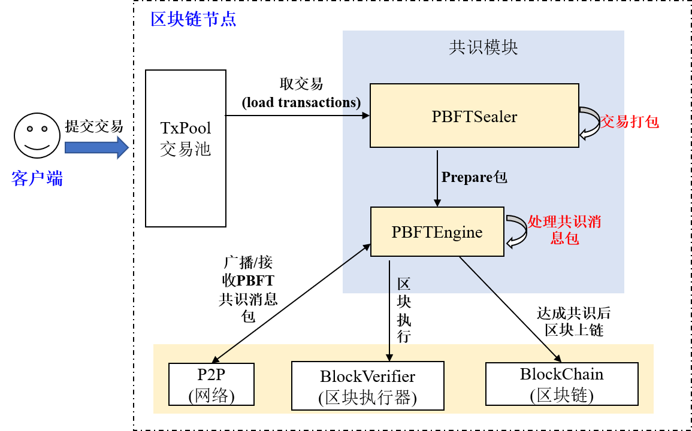
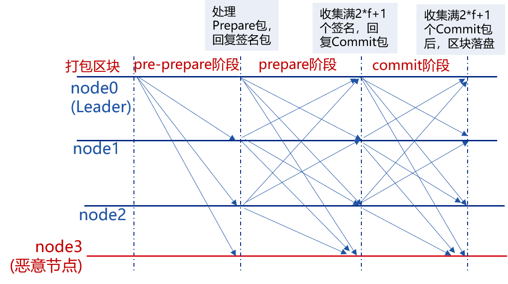
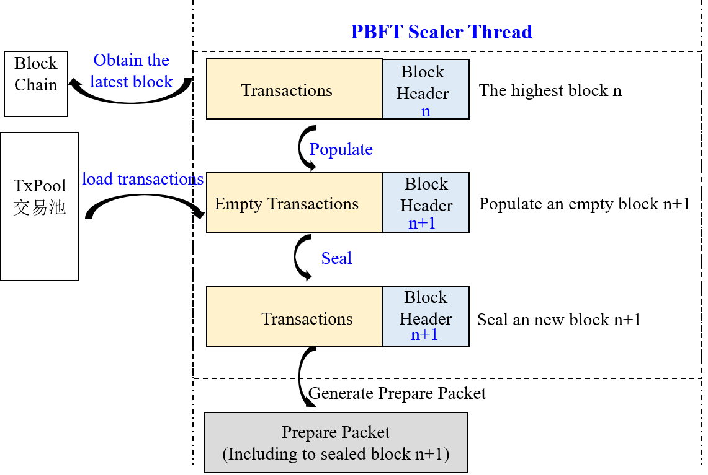

# PBFT

Tags: "PBFT" "Consensus Algorithm" "Design Scheme"

----

**PBFT**(Practical Byzantine Fault Tolerance)Consensus algorithms can do evil at a few nodes(such as forged messages)In the scenario, it uses cryptographic algorithms such as signature, signature verification, and hash to ensure tamper-proof, forgery-proof, and non-repudiation in the messaging process, and optimizes the work of previous people to reduce the complexity of the Byzantine fault-tolerant algorithm from the exponential level to the polynomial level(3\*f+1)In a system of nodes, as long as there are not less than(2\*f+1)If a non-malicious node works properly, the system can achieve consistency, e.g., a 7-node system allows 2 nodes to have Byzantine errors。

FISCO BCOS blockchain system implements PBFT consensus algorithm。

## 1. Important concepts

Node type, node ID, node index and view are key concepts of PBFT consensus algorithm。For basic concepts of blockchain systems, please refer to [Key Concepts](../../tutorial/key_concepts.md)。

### 1.1 Node type

- **Leader/Primary**: Consensus node, responsible for packaging transactions into blocks and block consensus, each round of consensus process has and only one leader, in order to prevent the leader from forging blocks, after each round of PBFT consensus, will switch the leader；

- **Replica**: Replica node, which is responsible for block consensus. There are multiple Replica nodes in each round of consensus. The process of each Replica node is similar；

- **Observer**: The observer node, which is responsible for obtaining the latest block from the consensus node or the replica node, and after executing and verifying the block execution result, the resulting block is on the chain。

where Leader and Replica are collectively referred to as consensus nodes。

### 1.2 Node ID & & Node Index

In order to prevent nodes from doing evil, each consensus node in the PBFT consensus process signs the messages it sends and checks the signatures of the received message packets, so each node maintains a public-private key pair, the private key is used to sign the messages it sends, and the public key is used as the node ID to identify and check the signatures。

> **Node ID** : Consensus node signature public key and consensus node unique identifier, usually a 64-byte binary string, other nodes use the node ID of the message packet sender to verify the message packet

Considering that the node ID is very long, including this field in the consensus message will consume part of the network bandwidth, FISCO BCOS introduces a node index, each consensus node maintains a public consensus node list, and the node index records the position of each consensus node ID in this list:

> **node index** : The position of each consensus node ID in this list of common node IDs

### 1.3 View(view)

The PBFT consensus algorithm uses view to record the consensus status of each node, and the same view node maintains the same list of Leader and Replicas nodes。When the leader fails, a view switch occurs. If the view switch is successful(At least 2\*f+1 node reaches the same view), select a new leader based on the new view, and the new leader starts to block, otherwise continue to switch views until most of the nodes in the network(Greater than or equal to 2\*f+1)Achieve consistent view。

In the FISCO BCOS system, the formula for calculating the leader index is as follows:

```bash
leader_idx = (view + block_number) % node_num
```

The following figure simply shows' 4(3*f+1, f=1)'Node FISCO BCOS system, third node(node3)For the Byzantine node case, the view switching process:


- The first three rounds of consensus: node0, node1, and node2 are leaders, and the number of non-malicious nodes is equal to '2*f+1 ', node normal out of block consensus；

-The fourth round of consensus: node3 is the leader, but node3 is the Byzantine node, node0-node2 did not receive the block packaged by node3 within the given time, triggering the view switch, trying to switch to 'view _ new = view+1 'of the new view, and broadcast the viewchange package to each other, the nodes are collected all over the view' view _ new'(2*f+1)After 'viewchange package', switch your view to 'view _ new' and calculate a new leader；

- For the fifth round of consensus: node0 is leader, continue to pack out blocks。

### 1.4 Consensus Message

The PBFT module mainly includes**PrepareReq, SignReq, CommitReq, and ViewChangeReq**Four consensus messages:

- **PrepareReqPacket**: A request packet containing blocks, which is generated by the leader and broadcast to all Replica nodes. After receiving the Prepare packet, the Replica node verifies the PrepareReq signature, executes the block, and caches the block execution result to prevent the Byzantine node from doing evil and ensure the finality of the block execution result；

- **SignReqPacket**: The signature request with the block execution result, which is generated by the consensus node that has received the Prepare packet and executed the block. The SignReq request contains the hash of the block after execution and the signature of the hash, which are respectively recorded as SignReq.block _ hash and SignReq.sig(That is, the block execution result)consensus；

- **CommitReqPacket**: The submission request used to confirm the block execution result, which is collected by the full '(2*f+1)'A block _ hash is generated from nodes that have the same SignReq request from different nodes. CommitReq is broadcast to all other consensus nodes, and the other nodes are fully collected'(2*f+1)'After the same block _ hash and CommitReq from different nodes, the latest block cached by the local node is linked；

- **ViewChangeReqPacket**: View switching request, when leader cannot provide normal service(Such as abnormal network connection, server downtime, etc)The other consensus node will actively trigger the view switch, with the view that the node is about to switch to in ViewChangeReq(toView, plus one for the current view), a node collects full(2*f+1)After 'views equal toView, ViewChangeReq from different nodes, the current view is switched to toView。

These four types of message packets contain roughly the same fields, which are common to all message packets as follows:

| Field Name| Field Meaning|
| ------ | ------ |
| Field Name| Field Meaning|
| idx | Current Node Index|
| packetType | Request Package Type(Includes PrepareReqPacket / SignReqPacket / CommitReqPacket / ViewChangeReqPacket) |
| height | Height of blocks currently being processed(Generally, the height of the local block is increased by one) |
| blockHash | Hash of block currently being processed|
| view | View in which the current node is located|
| sig | Signature of the current node to blockHash|

The PrepareReqPacket type message packet contains information about the block being processed:

| Message Package Type| Field Name|Field Meaning|
| ------ | ------ | ----- |
| PrepareReqPacket | block | Block data that all consensus nodes are consensus|

## 2. System framework

The system framework is as follows:



PBFT consensus mainly includes two threads:

- PBFTSealer: The PBFT package thread, which is responsible for fetching transactions from the transaction pool and encapsulating the packaged blocks into PBFT Prepare packages, which are handed over to PBFTEngine for processing；

- PBFTEngine: PBFT consensus thread, receiving PBFT consensus message packets from PBFTSealer or P2P network, block verifier(Blockverifier)Responsible for starting the block execution, completing the consensus process, writing the consensus block to the blockchain, and deleting the transactions that have been chained from the transaction pool after the block is chained。

## 3. Core processes

PBFT consensus mainly includes three stages: Pre-prepare, Prepare, and Commit:

- **Pre-prepare**: Responsible for executing blocks, generating signature packets, and broadcasting the signature packets to all consensus nodes；
- **Prepare**: responsible for collecting signature packages, a node collects full '2*f+1 'after the signature package, indicating that it has reached the state of being able to submit blocks, start broadcasting the Commit package；
- **Commit**Is responsible for collecting Commit packages, a node collects full '2*f+Commit the latest locally cached block to the database。



The following figure details the specific processes at each stage of the PBFT:


### 3.1 leader packing block

In the PBFT consensus algorithm, consensus nodes take turns to issue blocks, and each round of consensus has only one leader packed block, and the leader index uses the formula '(block_number + current_view) % consensus _ node _ num 'calculated。

After the node calculates that the current leader index is the same as its own index, it starts packing blocks。Block packaging is mainly completed by the PBFTSealer thread. The main work of the Sealer thread is shown in the following figure:



- **Generate new empty blocks**: Through the blockchain(BlockChain)Get the current highest block and generate a new empty block based on the highest block(Set the parent hash of the new block to the highest block hash, set the timestamp to the current time, and clear the transaction)；

- **Package transactions from a transaction pool**: After generating a new empty block, get the transaction from the transaction pool and insert the obtained transaction into the generated new block；

- **Assemble new block**: After the Sealer thread is packaged into the transaction, the packager of the new block(Sealer Field)Set up your own index and calculate the transactionRoot for all transactions based on the packaged transactions；

- **Generate Prepare package**: Encode the assembled new block into the Prepare packet and broadcast it to all consensus nodes in the group through the PBFTEngine thread. After other consensus nodes receive the Prepare packet, they start the three-stage consensus。

### 3.2 Pre-prepare Phase

After receiving the Prepare package, the consensus node enters the pre-prepare phase. The main workflow in this phase includes:

- **Prepare package legality judgment**It is mainly used to determine whether the Prepare package is a duplicate and whether the parent hash of the block included in the Prepare request is the highest block hash of the current node(Prevention of bifurcation)Is the block height of the block included in the Prepare request equal to the highest block height plus one；

- **Caching legal Prepare packages**: If the Prepare request is valid, it is cached locally to filter duplicate Prepare requests；

- **Empty Block Judgment**If the number of transactions in the block included in the Prepare request is 0, the empty block view switch is triggered, the current view is increased by one, and the view switch request is broadcast to all other nodes；

- **Execute blocks and cache block execution results**: If the number of transactions in the block included in the Prepare request is greater than 0, the executor is called to execute the block and the executed block is cached；

- **Generate and broadcast signed packages**: Generates and broadcasts a signature packet based on the executed block hash, indicating that the node has completed block execution and verification。

### 3.3 Prepare Phase

After the consensus node receives the signed package, it enters the Prepare phase. The main workflow of this phase includes:

- **Signature Package Legality Judgment**The hash of the signature package is the same as the block hash cached in the pre-prepare phase. If the hash is not the same, the request is determined to be a future block signature request(The future block is generated because the processing performance of this node is lower than that of other nodes, and the previous round of consensus is still in progress. The condition for determining the future block is that the height field of the signature package is greater than the highest local block plus one)If the request is not a future block, it is an illegal signature request, and the node directly rejects the signature request；

- **Caching Legally Signed Packages**: The node caches valid signed packages；

- **Determine whether the signature packet cache corresponding to the block cached in the pre-prepare phase reaches' 2*f+1 ', if the collected full signature package, broadcast Commit package**If the number of signature packets corresponding to the block hash cached in the pre-prepare phase exceeds' 2*f+1 ', it means that most nodes have executed the block, and the execution results are consistent, indicating that the node has reached the state where the block can be submitted, and starts to broadcast the Commit package；

- **If a full signature package is collected, the Prepare package cached in the pre-prepare phase is backed up**To prevent Commit phase blocks from exceeding '2 before they are committed to the database*f+1 'node down, these nodes start again after the block, resulting in blockchain fork(The latest blocks of the remaining nodes are different from the highest blocks of these nodes)You also need to back up the Prepare package cached in the pre-prepare phase to the database. After the node restarts, the backup Prepare package is processed first。


### 3.4 Commit Phase

After receiving the Commit packet, the consensus node enters the Commit phase. The workflow of this phase includes:

- **Commit Package Legality Judgment**This function determines whether the hash of the Commit packet is the same as the hash of the block cached in the pre-prepare phase after execution. If the hash is not the same, it continues to determine whether the request is a future block Commit request(The future block is generated because the processing performance of this node is lower than that of other nodes, and the previous round of consensus is still in progress. The condition for determining the future block is that the height field of the Commit is greater than the highest local block plus one)If the request is not a future block, it is an illegal Commit request. The node directly rejects the request；

- **Caching legitimate Commit packages**The node caches the valid Commit package；

- **Determine whether the Commit packet cache corresponding to the block cached in the pre-prepare phase reaches' 2*f+1 ', if full Commit packets are collected, the new block is dropped**If the number of Commit requests corresponding to the block hash cached in the pre-prepare phase exceeds' 2*f+1 ', it means that most nodes have reached the committable block state, and the execution results are consistent, then call the Blockchain module to write the block cached in the pre-prepare phase to the database；

### 3.5 View switching processing flow

When PBFT three-phase consensus times out or a node receives an empty block, PBFTEngine attempts to switch to a higher view(The view to switch to toView plus one)and triggers the ViewChange processing flow；When the node receives the ViewChange package, it also triggers the ViewChange process:

- **Determine if the ViewChange package is valid**: The block height value included in a valid ViewChange request must not be less than the highest block height of the current node, and the view must be larger than the current node view；

- **Cache Valid ViewChange Packages**Prevents the same ViewChange request from being processed multiple times, and also serves as a statistical basis for determining whether a node can switch views；

- **Collecting ViewChange Packages**: If the view included in the received ViewChange package is equal to the view toView to be switched to of this node and the collection of this node is full '2*f+1 'ViewChange package from different nodes whose view is equal to toView, it means that more than two-thirds of the nodes need to switch to toView view, and switch the current view to toView。
