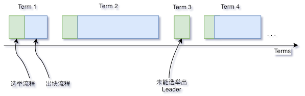

# Raft

Tags: "Raft" "Consensus Algorithm" "Design Scheme"

----
## 1 Noun explanation

### 1.1 Raft
Raft (Replication and Fault Tolerant) is a consistency protocol that allows network partitioning (Partition Tolerant), which ensures that there are(N+1)/ 2 (Round up) The consistency of the system when the nodes are working properly. For example, in a five-node system, two nodes are allowed to have non-Byzantine errors, such as node downtime, network partitioning, and message latency。Raft is easier to understand than Paxos and has been proven to provide the same fault tolerance and performance as Paxos(https://raft.github.io/)and [dynamic presentation](http://thesecretlivesofdata.com/raft/)。

### 1.2 Node type

In the Raft algorithm, each network node can only have one of the following three identities:**Leader**、**Follower**以及**Candidate**, of which:
* **Leader**: Mainly responsible for interacting with the outside world, elected by the Follower node, in each consensus process there is and only one Leader node, the Leader is fully responsible for taking out transactions from the transaction pool, packaging transactions to form blocks and putting the block on the chain；
* **Follower**: Synchronize based on the Leader node, and hold an election to select a new Leader node when the Leader node expires；
* **Candidate**The temporary identity that the follower node has when running for Leader。

### 1.3 Node ID & Node Index
In the Raft algorithm, each network node will have a fixed and globally unique ID used to indicate the identity of the node (usually a 64-byte number), which is called the node ID；At the same time, each consensus node also maintains a public consensus node list, which records the ID of each consensus node, and its position in this list is called the node index。

### 1.4 Term of office
The Raft algorithm divides time into tenure terms of indeterminate length, where Terms are consecutive numbers。Each term starts with an election, and if the election is successful, the current leader is responsible for the block, and if the election fails and a new single leader is not elected, a new term is opened and the election is restarted。



## 1.5 Message
In the Raft algorithm, each network node communicates by sending messages, and the current Raft module includes four messages:**VoteReq**、**VoteResp**、**Heartbeat**、**HeartbeatResp**, where:
* **VoteReq**Vote request, which is actively sent by the Candidate node and used to request votes from other nodes in the network to run for the Leader；
* **VoteResp**: The voting response, which is used to respond to the voting request after the node receives the voting request, and the response content is to agree or reject the voting request；
* **Heartbeat**: Heartbeat, which is sent out by the leader node actively and has two functions:(1) Used to maintain the identity of the leader node. As long as the leader can always send heartbeats and other nodes respond, the leader identity will not change；(2) Block data replication. When the leader node successfully packages a block, it encodes the block data into a heartbeat to broadcast the block. After receiving the heartbeat, other nodes decode the block data and put the block into their own buffer；
* **HeartbeatResp**: Heartbeat response. After the node receives the heartbeat, it is used to respond to the heartbeat. In particular, when a heartbeat containing block data is received, the hash of the block will be included in the heartbeat response；

The fields common to all messages are shown in the following table:

| Field Name| Field Meaning|
| --------- | ---------------------------- |
| idx       | Self-node index|
| term      | The tenure of the previous node|
| height    | Block height of the highest block held by the current node|
| blockHash | Hash of the highest block held by the previous node|

The fields specific to each message type are shown in the following table:
<table border="1" cellspacing="0" cellpadding="0">
<thead>
  <tr>
    <td>Message type</td>
    <td>Field Name</td>
    <td>Field Meaning</td>
  </tr>
</thead>
<tr>
  <td rowspan="3" align="left">VoteReq</td>
  <td>candidate</td>
  <td>Candidate's own node index</td>
</tr>
<tr>
    <td>lastLeaderTerm</td>
    <td>The Term of the last Leader that Candidate has seen, and its detailed role is described in Section 3.1.2</td>
</tr>
<tr>
  <td>lastBlockNumber</td>
  <td>The block height of the latest block that Candidate has seen, and its role is detailed in Section 3.1.2</td>
</tr>
<tr>
  <td rowspan="2" align="left">VoteResp</td>
  <td>voteFlag</td>
  <td>The response flag to the voting request is used to mark whether the voting request is approved or not, and if it is rejected, the reason for the rejection is also specifically marked, as detailed in Section 3.1.2</td>
</tr>
<tr>
  <td>lastLeaderTerm</td>
  <td>The block height of the latest block seen by the node receiving the VoteReq, for details, see Section 3.1.2</td>
</tr>
<tr>
  <td rowspan="3" align="left">Heartbeat</td>
  <td>leader</td>
  <td>Node index of the leader node that issued the heartbeat</td>
</tr>
<tr>
  <td>uncommitedBlock</td>
  <td>When the Leader node prepares to submit a new block, it first encodes the block data into this field and broadcasts it through the heartbeat, as detailed in Section 3.2</td>
</tr>
<tr>
  <td>uncommitedBlockNumber</td>
  <td>The block height corresponding to uncommitedBlock. See Section 3.2 for details</td>
</tr>
<tr>
  <td rowspan="1" align="left">HeartbeatResp</td>
  <td>uncommitedBlockHash</td>
  <td>When receiving the uncommitedBlock data sent by the leader, the node writes the hash (fingerprint) corresponding to the uncommitedBlock in the heartbeat response and sends it back to the leader, indicating that the node has received the block data to be submitted by the leader and has written it to the local cache. See Section 3.2 for details</td>
</tr>
</table>

## 2 System framework
The system framework is shown in the following figure:


* Raft Sealer: responsible for taking out transactions from the transaction pool, packaging them into blocks, and sending them to Raft Engine for consensus。After blockchain, Raft Sealer is responsible for deleting the blockchain transaction from the transaction pool；
* Raft Engine: responsible for consensus at the consensus node, will reach consensus on the blockchain。

## 3 Core processes

### 3.1 Node state transition
The transition relationships between node types are shown in the following figure, and each form of state transition is described in the following sections


#### 3.1.1 Elections
Heartbeat mechanism used in Raft consensus module to trigger Leader election。When the node starts, the node automatically becomes Follower and the Term is set to 0。As long as the Follower receives a valid Heartbeat or RequestVote message from the Leader or Candidate, it will remain in the Follower state if the Follower is within a period of time (this period of time is called***Election Timeout***) If it does not receive the above message, it will assume that the current Leader of the system has been deactivated, then add its own Term and convert it to Candidate, and start a new round of Leader election process. The process is as follows:
1. Follower increases the current Term and converts it to Candidate；
2. Candidate will vote for itself and broadcast RequestVote to other nodes to request a vote；
3. The Candidate node remains in the Candidate state until one of the following three situations occurs:(1)The node wins the election；(2) While waiting for the election, Candidate received Heartbeat from other nodes；(3) Pass*Election Timeout*No leader was elected。Raft algorithm uses a random timer method to avoid the average division of node votes to ensure that most of the time only one node will time out to enter the Candidate state and get the votes of most nodes to become Leader。

#### 3.1.2 Voting
After receiving a VoteReq message, the node selects different response strategies based on the message content:
1. ***VoteReq's Term is less than or equal to its own Term***

    * If the node is a Leader, the voting request is rejected. After receiving this response, Candidate will abandon the election and change to Follower, and increase the voting timeout；
    * If the node is not a Leader:
        * If VoteReq's Term is less than its own Term, it rejects the vote request, and if Candidate receives more than half of the response, it indicates that it is outdated, at which point Candidate will abandon the election and change to Follower and increase the voting timeout；
        * If VoteReq's Term equals its own Term, the vote request is rejected and nothing is done with the vote request。For each node, only one Candidate can be voted on a first-come, first-served basis, thus ensuring that at most only one Candidate is selected as the Leader in each round of elections。

2. ***VoteReq's lastLeaderTerm is less than its own lastLeaderTerm***

    Each node will have a lastLeaderTerm field that represents the term of the last leader that the node has seen, and lastLeaderTerm can only be updated by Heartbeat。If the lastLeaderTerm in VoteReq is less than its own lastLeaderTerm, it indicates that there is a problem for the leader to access the Candidate. If the Candidate is in an isolated network environment, it will continue to raise voting requests, so it needs to interrupt its voting request, so the node will reject the voting request at this time。

3. ***VoteReq's lastBlockNumber is less than its own lastBlockNumber***

    Each node will have a lastBlockNumber field indicating the block height of the latest block the node has seen。During the block release process, block replication occurs between nodes (see Section 3.2 for details). During the block replication process, some nodes may receive newer block data but some do not, resulting in inconsistent lastBlockNumbers for different nodes。In order for the system to agree, it is necessary to require the node to vote for the node with the newer data, so in this case the node will reject the vote request。

4. ***Node is the first vote***

    In order to prevent Follower from re-initiating the election due to network jitter, it is stipulated that if the node is voting for the first time, it will directly reject the voting request and set its firstVote field to the node index of the Candidate。

5. ***The voting request was not rejected in steps 1 to 4***

   Agree to the vote request。

#### 3.1.3 Heartbeat Timeout
When the Leader becomes a network island, the Leader can send a heartbeat, and the Follower can receive a heartbeat, but the Leader cannot receive a heartbeat response. In this case, the Leader already has a network exception at this time, but because the heartbeat packet can be sent out all the time, the Follower cannot switch states for selection, and the system stagnates。In order to avoid the second situation, the heartbeat timeout mechanism is set in the module. Each time the leader receives a heartbeat response, it will record accordingly. Once the record is not updated after a period of time, the leader will give up the leader identity and switch to the follower node。

### 3.2 Block replication
The Raft protocol strongly relies on the availability of the leader node to ensure the consistency of cluster data, because data can only be transferred from the leader node to the follower node。After Raft Sealer submits block data to the cluster leader, the leader sets the data to the uncommitted state, and then the leader node will concurrently copy the data to all follower nodes in the form of additional data in the Heartbeat and wait for the response to be received. After ensuring that more than half of the nodes in the network have received the data, the block data is written to the underlying storage, and the block data status has entered the committed state。After that, the Leader node broadcasts the block data to other Follower nodes through the Sync module. The flowchart of block replication and submission is shown in the following figure:

```eval_rst
.. mermaid::

  sequenceDiagram
    participant Sealer
    participant Leader
    participant Follower

    Sealer->>Leader: Packing transactions into blocks, blocking itself
    Leader->>Follower: Encoding blocks as RLP encoding sent with heartbeat packets
    Note right of Follower: decoding the heartbeat packet,<br/>And the decoded block<br/>Write to cache
    Follower->>Leader: Send ACK
    loop collect ACK
      Leader->>Leader: Check if most nodes have received a block copy
    end
    Leader->>Sealer: Unblock
    Leader->>Leader: Execution Block
    Leader->>Leader: Discard transactions that are already on the chain

```

The verification conditions for RaftSealer to verify whether the transaction can be packaged currently include:(1) Is Leader；(2) Whether there are peers that have not yet completed synchronization； (3) Whether the uncommitBlock field is empty. Packing is allowed only if all three conditions are met。
