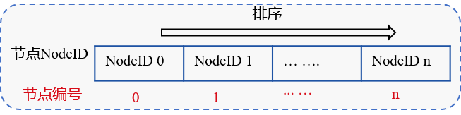

# rPBFT

Tags: "rPBFT" "consensus algorithm"

----
## Blockchain Consensus Dilemma

### POW class algorithm

The POW algorithm is not suitable for alliance chain scenarios with large transaction throughput and low transaction latency requirements due to the following characteristics.
- Low performance: 10 minutes out of a block, transaction confirmation delay of one hour, power consumption
- No Final Consistency Guarantee
- Low throughput

### Consensus Algorithm Based on Distributed Consistency Principle

Consensus algorithms based on the principle of distributed consistency, such as BFT and CFT consensus algorithms, have the advantages of second-level transaction confirmation delay, final consistency, high throughput, and no power consumption.。

However, the complexity of these algorithms is related to the size of the nodes, and the size of the network that can be supported is limited, which greatly limits the size of the alliance chain nodes.。

In summary, FISCO BCOS v2.3.0 proposes the rPBFT consensus algorithm, which aims to minimize the impact of node size on the consensus algorithm while preserving the high performance, high throughput, high consistency, and security of BFT-like consensus algorithms.。

## rPBFT consensus algorithm

### Node Type

- Consensus member: the node that executes the PBFT consensus process, with the authority to take turns out blocks
- Validation node: does not execute the consensus process, verifies whether the consensus node is legal, block validation, after several rounds of consensus, will switch to the consensus node

### core thought


The rPBFT algorithm selects only a number of consensus nodes for each round of consensus process, and periodically replaces the consensus nodes according to the block height to ensure system security, including two system parameters:

- 'epoch _ sealer _ num ': the number of nodes participating in the consensus process in each round of consensus. You can dynamically configure this parameter by issuing transactions on the console.
- `epoch_block_num`: The consensus node replacement cycle. To prevent the selected consensus nodes from being associated with each other, the rPBFT replaces a consensus node for each epoch _ block _ num block. You can dynamically configure this parameter by issuing transactions on the console.

These two configuration items are recorded in the system configuration table. The configuration table mainly includes three fields: configuration keyword, configuration corresponding value, and effective block height. The effective block height records the latest effective block height of the latest configuration value. For example, set 'epoch _ sealer _ num' and 'epoch _ block _ num' to 4 and 10000 respectively in a 100-block transaction. The system configuration table is as follows:

key | value | _enable_num_ |
:-: | :-: | :-: |
epoch_sealer_num | 4 | 101 |
epoch_block_num | 10000| 101 |


### algorithm flow

#### **Determine each consensus node number IDX**

Sort the NodeIDs of all consensus nodes, as shown in the following figure. The NodeID index after the nodes are sorted is the consensus node number:



#### **chain initialization**

During chain initialization, rPBFT needs to select 'epoch _ sealer _ num' consensus nodes to participate in consensus among consensus members. Currently, the initial implementation is to select the index from 0 to 'epoch _ sealer _ num'.-1 'node participates in the previous' epoch _ block _ num 'block consensus。


#### **The consensus member node runs the PBFT consensus algorithm.**

The selected 'epoch _ sealer _ num' consensus member nodes run the PBFT consensus algorithm to verify node synchronization and verify the blocks generated by the consensus of these consensus member nodes.

- Checked block signature list: Each block must contain at least two-thirds of the consensus members' signatures
- Verify the execution result of the block: the execution result of the local block must be consistent with the execution result recorded by the consensus committee in the block header.

#### **Dynamic replacement of consensus committee list**

To ensure system security, the rPBFT algorithm removes a node from the consensus member list as a validation node and adds a validation node to the consensus member list after each 'epoch _ block _ num' block, as shown in the following figure.


In the current implementation of the rPBFT algorithm, the consensus member list nodes are replaced by validation nodes in turn. If the current ordered consensus committee node list is' CommitteeSealersList 'and the total number of consensus nodes is' N ', then after the consensus' epoch _ block _ num 'blocks, the' CommitteeSealersList [0] 'will be removed from the consensus member list and added to the index'(CommitteeSealersList[0].IDX + epoch_sealer_num) Validation node for% N 'to consensus member list。Round 'i' replacement cycle, remove 'CommitteeSealersList [i% epoch _ sealer _ num]' from the list of consensus members and add the index as'(CommitteeSealersList[i%epoch_sealer_num].IDX + epoch_sealer_num) Validation node for% N 'to consensus member list。


#### **Node restart**

After the node is restarted, the rPBFT algorithm needs to quickly determine the consensus member list. Since 'epoch _ block _ num' can be dynamically updated through the console, you need to obtain the consensus member list in conjunction with the latest configuration of 'epoch _ block _ num'. The main steps are as follows:

**Calculating the consensus period rotatingRound**
  
  If the current block height is' blockNum 'and the effective block height of' epoch _ block _ num 'is' enableNum ', the consensus period is:
  `rotatingRound = (blockNumber - enableNum) / epoch_block_num`

**Determine the starting node index of the consensus member.**: 'N 'is the total number of consensus nodes, indexed from'(rotatingRound * epoch_block_num) % N 'to'(rotatingRound * epoch_block_num + epoch_sealer_num) Nodes between% N 'belong to consensus member nodes

### Analysis of rPBFT Algorithm

- Network Complexity: O(epoch_sealer_num * epoch_sealer_num), regardless of node size, and is more scalable than the PBFT consensus algorithm
- Performance: can be confirmed in seconds, and because the complexity of the algorithm is independent of the number of nodes, the performance attenuation is much less than PBFT
- Consistency and availability requirements: at least two-thirds of the consensus member nodes need to work properly before the system can reach a normal consensus.
- Security: The VRF algorithm will be introduced in the future to randomly and privately replace consensus members to enhance the security of consensus algorithms.


## rPBFT Network Optimization

### Prepare Package Broadcast Optimization

To further improve the broadcast efficiency of Prepare packages in bandwidth-limited scenarios, FISCO BCOS v2.3.0 implements Prepare package tree broadcast on the basis of rPBFT, as shown in the following figure:


- According to the consensus node index, a complete n-tree is formed.(The default is 3)
- After the leader generates the Prepare packet, it forwards the Prepare packet to all its subordinate child nodes along the tree topology.

**Advantage**： 
- Faster propagation speed than gossip, no redundant message packets
- Divide and conquer, each node out of the bandwidth is O(1), strong scalability

**Disadvantages**: The intermediate node is a single point and requires additional fault tolerance strategies


### Fault tolerance scheme based on state packet

```eval_rst
.. note::

    Stateful packet-based fault-tolerant policy only takes effect when Prepare packet tree broadcast is turned on
```

To ensure that the Prepare packet can reach each node when the node is disconnected and the tree broadcast is turned on, rPBFT introduces a fault tolerance mechanism based on state packets, as shown in the following figure:


The main processes include:

(1) After receiving Prepare, node A randomly selects 33% of nodes to broadcast the Prepare package status, which is recorded as prepareStatus, including{blockNumber, blockHash, view, idx}

(2) After receiving the prepareStatus randomly broadcast by node A, node B determines whether the status of the Prepare package of node A is newer than the localPrepare status of the current Prepare package of node B. The main determinations include:

- Is prepareStatus.blockNumber greater than the current block height
- Is prepareStatus.blockNumber greater than localPrepare.blockNumber
- Is prepareStatus.view greater than localPrepare.view when prepareStatus.blockNumber equals localPrepare.blockNumber

Any of the above conditions holds, indicating that the Prepare package state of node A is newer than the state of node B.

(3) If the status of node B is behind that of node A and node B is disconnected from its parent node, node B sends a prepareRequest request to node A, requesting the corresponding Prepare package

(4) If the state of node B is behind node A, but node B is connected to its parent node, if node B waits up to [100ms(Can be matched)](../../manual/configuration.html#rpbft)node B sends a prepareRequest request to node A, requesting the corresponding Prepare package.

(5) After receiving the prepareRequest request from node A, node B replies to the corresponding Prepare message packet

(6) After receiving the Prepare message packet from node B, node A executes the handlePrepare process to process the received Prepare packet。


### traffic load balancing strategy

```eval_rst
.. note::
    Traffic load balancing policy only takes effect when Prepare packet tree broadcast is turned on
```

After rPBFT is enabled to optimize the Prepare package structure and other consensus nodes are missing, they request transactions from the leader, causing the leader's bandwidth to become a bottleneck. FISCO BCOS v2.3.0 designs and implements a load balancing strategy based on the Prepare package status. The sequence diagram of this strategy is as follows:

```eval_rst
.. mermaid::

  sequenceDiagram
  participant leader
  participant sealerA(parent node)
  participant sealerB(Child Node)
  
  leader->>sealerA(parent node): Send Prepare
  leader->>sealerA(parent node): Send PrepareStatus
  sealerA(parent node)->>sealerA(parent node): Update Prepare status cache{leader, PrepareStatus}
  sealerA(parent node)->>sealerB(Child Node): Forward Prepare
  sealerA(parent node)->>sealerA(parent node): Request and obtain the missing transaction from the leader. The Prepare package is added to the cache.
  sealerA(parent node)->>sealerB(Child Node): Send PrepareStatus
  sealerB(Child Node)->>sealerB(Child Node): Update Prepare status cache{sealerA, PrepareStatus}
  sealerB(Child Node)->>sealerB(Child Node): Request missing from sealerA and get
  sealerB(Child Node)->>leader: Send PrepareStatus

 ```

**The main processing flow of sealerA, a child node of Leader, is as follows:**

(1) After the leader generates a new block, send the Prepare package containing only the transaction hash list to the three child nodes

(2) After receiving the Prepare packet, the child node sealerA forwards it to the three child nodes along the tree topology

(3) The child node sealerA starts processing the Prepare package:
  
  - Get the hit transaction from the transaction pool and populate the block in the Prepare package
  - Request missing transactions from parent leader

(4) After receiving the leader's return packet, sealerA fills the transactions in the return packet into the Prepare packet and randomly selects 33% of the nodes to broadcast the status of the Prepare packet, mainly including{blockNumber, blockHash, view, idx}After other nodes receive the status package, update the latest status package of sealerA to the cache

**The main processing flow of the child node sealerB of sealerA is as follows**

(1) After receiving the Prepare packet forwarded by SealerA, sealerB also forwards the Prepare packet to the child nodes of sealerB.

(2) sealerB starts processing the Prepare package by first obtaining the hit transactions from the transaction pool, populating the blocks in the Prepare package, and selecting nodes to obtain the missing transactions.
  - If sealerB caches prepareStatus.blockHash from node sealerA equal to Prepare.blockHash, it directly requests the missing transaction from the parent node sealerA
  - If the sealerB cached sealerA status package hash is not equal to Prepare.blockHash, but there is a prepareStatus.blockHash from another node C equal to prepare.blockHash, request the missing transaction from C
  - If the hash of prepareStatus of any node cached by sealerB is not only equal to prepare.blockHash, wait up to [100ms(Can be matched)](../../manual/configuration.html#rpbft)After that, request the missing transaction from the Leader

(3) After receiving the transaction replied by the requested node, sealerB populates the block in the Prepare package and randomly selects [33%(Can be matched)](../../manual/configuration.html#rpbft)Node Broadcast Prepare Package Status

(4) After receiving the status package of sealerB, other nodes update the latest status package of sealerB to the cache