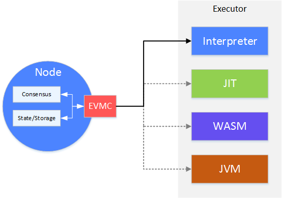

##############################################################
Smart Contracts
##############################################################

Tags: "smart contract" "virtual machine"

----

The execution of transactions is an important function on a blockchain node。The execution of the transaction is to take out the binary code of the smart contract in the transaction and execute it with the executor (Executor _)。The consensus module (Consensus _) removes transactions from the trading pool.(TxPool_)is taken out of the block, packaged into blocks, and the executor is called to execute the transactions in the block.。During the execution of the transaction, the state of the blockchain (State) is modified to form a new block state stored (Storage)。Executor in this process, similar to a black box, the input is the smart contract code, the output is the change of state。

With the development of technology, people began to pay attention to the performance and ease of use of actuators。On the one hand, people hope that smart contracts can be executed faster on the blockchain to meet the needs of large-scale transactions.。On the other hand, people want to develop in a more familiar and better language.。Then there are some alternatives to the traditional actuator (EVM), such as: WASM。

EVMC (Ethereum Client-VM Connector API), Is the interface of the actuator abstracted by Ethereum, designed to be able to interface with various types of actuators。

On the node, the consensus module hands over the packaged blocks to the executor for execution.。When the virtual machine is executed, the reading and writing of the state will in turn operate the state data on the node through the EVMC callback.。

After EVMC's abstraction, FISCO BCOS can interface with more efficient and easy-to-use actuators that will emerge in the future.。Currently, FISCO BCOS supports two contract engines, evm and wasm. As the interpreter of evm, evone supports a smart contract language based on Solidity that can be compiled into evm bytecode.。The wasm engine is implemented using wasmtime and supports contracts that can be compiled into wasm languages, such as [liquid](https://liquid-doc.readthedocs.io/zh_CN/latest/index.html)Toolchains for other languages are being planned.。

.. toctree::
:maxdepth: 1

virtual_machine/evm.md
virtual_machine/precompiled.md
virtual_machine/gas.md

.. _Executor: ./evm.html

.. _Consensus: ../consensus

.. _TxPool: ../architecture/transaction_stream.html

.. _WASM: https://webassembly.org/
