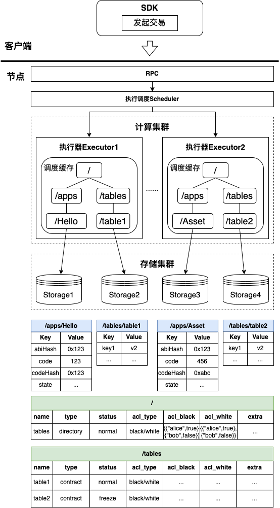
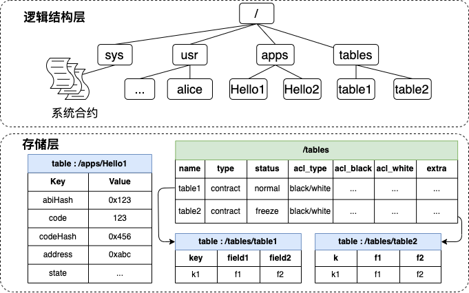
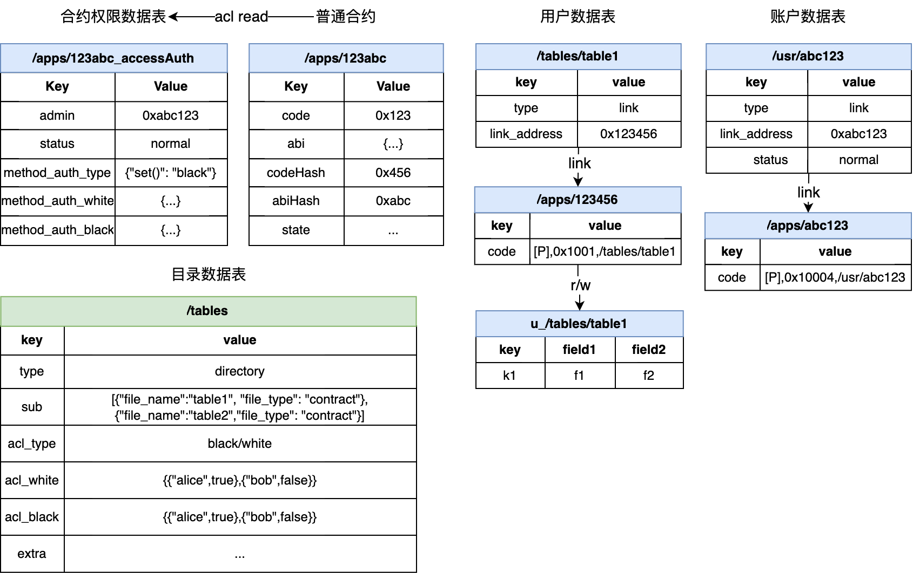
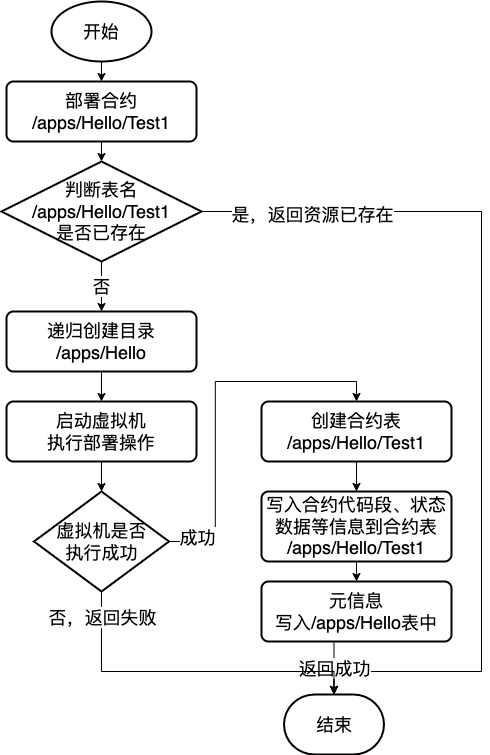
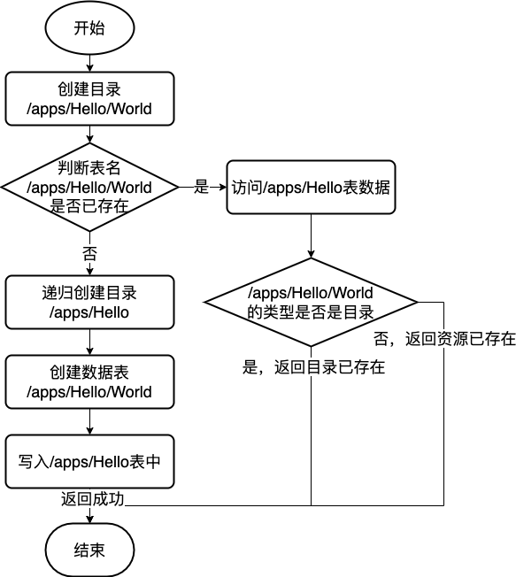

# 18. Contract file system BFS.

Tags: "Contract Directory," "Blockchain File System," "BFS"

----------

"**Everything is a file descriptor**."

FISCO BCOS version 3.x introduces the concept of blockchain contract file system (BFS), similar to Linux VFS, which organizes and manages contract resources in the blockchain using a tree file directory.。

## 1. Use examples

### 1.1 Examples of use

- The user can operate the smart contract through the console similar to the Linux terminal experience

  ```shell
  # Use ls to view resources
  [group0]: /apps> ls
  hello_bfs
  # To create a directory using the mkdir command
  [group0]: /apps> mkdir hello_dir
  Success
  # Use the cd command to return to the previous directory
  [group0]: /apps> cd ..
  
  # To create a soft link to a contract using the ln command
  [group0]: /> ln /apps/hello_bfs/v2 6849f21d1e455e9f0712b1e99fa4fcd23758e8f1
  {
      "code":0,
      "msg":"Success"
  }

  [group0]: /> cd /apps
  
  # Call directly to the soft link of the contract in the path
  [group0]: /apps> call ./hello_bfs/v2 get
  ---------------------------------------------------------------------------------------------
  Return code: 0
  description: transaction executed successfully
  Return message: Success
  ---------------------------------------------------------------------------------------------
  Return value size:1
  Return types: (string)
  Return values:(Hello, World!)
  ---------------------------------------------------------------------------------------------
  # ls soft link to view mapped addresses
  [group0]: /> ls ./hello_bfs/v2
  v2 -> 6849f21d1e455e9f0712b1e99fa4fcd23758e8f1
  
  # Use the tree command to show the resource structure
  [group0]: /> tree /apps
  /apps
  ├─hello_bfs
  │ ├─v1
  │ └─v2
  └─hello_dir
  
  2 directory, 2 contracts.
  
  ```

- Users can call the BFS interface in the smart contract to operate the file system in the blockchain.

  - BFS is a pre-compiled contract. Users can directly call the BFS interface in a smart contract by introducing the fixed address of the BFS pre-compiled contract.。

  - Fixed address is' 0x100e 'in Solidity smart contract and' / sys / bfs' in WASM execution environment。

    ```solidity
    struct BfsInfo {
        string file_name;
        string file_type;
        string[] ext;
    }
    abstract contract BfsPrecompiled {
        // @return return BfsInfo at most 500, if you want more, try list with paging interface
        function list(string memory absolutePath) public view returns (int32, BfsInfo[] memory);

        // for cns compatibility
        function link(string memory name, string memory version, address _address, string memory _abi) public returns (int32);

        function readlink(string memory absolutePath) public view returns (address);
    }
    ```

### 1.2 Detailed use of documentation

The use experience of BFS is mainly reflected in the console. Please refer to the BFS-related operation commands in the console, as well as the precautions and errors when using the BFS commands in the console. Please refer to [link](../operation_and_maintenance/console/console_commands.html#bfs)。

Please refer to [link] for precautions and errors when using the BFS interface called by the contract.(../contract_develop/c++_contract/precompiled_contract_api.html#bfsprecompiled) 。

BFS is supported in both the deployment contract and the call contract. For details, see [deploy command] in the console.(../operation_and_maintenance/console/console_commands.html#deploy)with [call command](../operation_and_maintenance/console/console_commands.html#call)。

## 2. Design Documents

In the blockchain storage architecture, the contract data is stored in a storage table corresponding to the contract address.。When initiating a call to a contract, the executor accesses the storage table corresponding to the contract address from the storage, obtains the code fields in the table, and loads them into the virtual machine for execution.。This is completely feasible in a single-process node, and the cache with storage can also have high execution performance.。However, it is no longer feasible in the microservices modular design architecture of FISCO BCOS version 3.x.。The computing cluster needs to know which storage instance the storage table corresponding to the contract address is mounted on, which is bound to encounter problems such as addressing mapping and mapping synchronization, which is not conducive to the scheduling and partition mounting of the executor.。

Design Objectives:

- Convenient module scheduling and partition mounting, allowing storage mounting for multiple distributed use cases；

- Compared to the CNS centralized contract addressing experience, BFS provides easier for humans to read, understand, and manage partitions**Contract Resource Addressing Experience**；

- Resource path partition management, different partitions have different responsibilities；

- Provides a common interface for users to call, users can operate BFS resources in smart contracts.。

Design Constraints:

- The operating interfaces of BFS are implemented in the form of pre-compiled contracts.；
- BFS maintains a tree-like logical structure of the contract file system, represented as a tree-like multi-level directory layer.；In the actual storage layer, the absolute path is the table name.；
- Resource types in BFS can be simply classified as directory resources, contract resources；
- Users are not allowed to create data at will. Users are only allowed to operate in the '/ apps' and '/ tables' directories.

### 2.1 BFS Partition Management

To facilitate O & M management and partition isolation for different applications, BFS manages the following partitions:

| **Partition Name** | **Path primary purpose** | **Description**                                                                                              |
|------------|------------------|-------------------------------------------------------------------------------------------------------|
| /sys       | System Contract Directory| This directory stores the logical structure of system contracts and does not support changes at this time.。                                                        |
| /apps      | Business Contract Catalog| Users can only create directories and deploy contracts in this directory. Deployment contracts will create paths in this directory, such as / apps / Hello /. Multi-level directories are supported.。 |
| /tables    | User Table Directory| Table contracts created by users are placed in this directory and are visible to the public。                                                            |
| /usr       | User Directory| The user is stored in the user directory as a contract, which binds the user name, public key, permissions, and provides a functional interface.**(Not yet implemented)**     |

Partition restrictions:

- Users are only allowed to create directories under '/ apps /' and '/ tables /'；
- The contract table created by using the underlying KVTable or Table interface will create the user table path in the '/ tables /' directory；
- When users deploy contracts, they add directories to the '/ apps /' directory。

### 2.2 Positioning of BFS in the overall blockchain architecture

When executing the schedule, the parallelizable transactions will be sent to different execution physical machines (here referred to as executors).。In the process of issuing the transaction, the executor will read the data from the cache, and if the cache does not have the data needed for transaction execution, it will read the data from the storage.。When reading the cache, the computing cluster must ensure that the data read by different executors does not conflict (that is, different executors do not read the same data, and if the same data is read, there will be data synchronization problems).。All contract resources in BFS are unique and isolated, ensuring that the resources read by each executor can be isolated from each other in storage.。

The overall architecture diagram is shown below, when executing transactions, the tree file data structure maintained by BFS exists in the cache in the executor, and in the actual storage layer, the absolute path of the resource is the table name in the storage layer.。The executor will be addressed to the corresponding contract storage table through the resource path when executing the contract, and thus to the corresponding storage table through the resource absolute path.。It can be seen that BFS maintains the mapping relationship of < resource path = > storage table > in the blockchain.。

Further, the tree organization of BFS can effectively solve the problem of contract resources in scheduling execution and partition storage, the executors of different partitions can only load the contract state data under a directory during execution, and different storage instances can also be mounted to different directory structures.。



### 2.3 BFS Organizational Structure

BFS maintains the mapping relationship between resource paths and storage tables in a tree structure. In the actual storage layer, the absolute path of contract resources is the table name of the storage table.。

The BFS logical structure diagram is shown below, and the upper part is a sample diagram of the smart contract tree directory structure, which is represented as the logical organization of all resource files.；The second half is the actual performance of the smart contract tree directory in storage, representing the table contents actually stored in storage.。For example, the '/ apps / Hello1' path has a logical structure of '/', '/ apps /', and '/ apps / Hello1'. In the storage structure, '/', '/ apps /', and '/ apps / Hello1' all have a corresponding storage table, and the storage table name is the corresponding absolute path.。



### 2.4 Storage contents of BFS storage table

The resource types in BFS can be simply classified as directory resources and contract resources, in which contract resources can be divided into ordinary contracts, Table contracts, pre-compiled contracts, contract soft links, etc.。The following figure shows all the storage tables involved in BFS:



- The directory resource storage table mainly records the sub-resource name and resource type of the directory path. The storage content is as follows:

  | name   | type      | status | acl_type    | acl_black | acl_white | extra |
  |--------|-----------|--------|-------------|-----------|-----------|-------|
  | apps   | directory | normal | black/white | {...}     | {...}     | ...   |
  | tables | directory | normal | black/white | {...}     | {...}     | ...   |
  | sys    | directory | normal | black/white | {...}     | {...}     | ...   |
  | usr    | directory | normal | black/white | {...}     | {...}     | ...   |

- The contract resource storage table mainly records the status data required by the contract during execution.

  - Ordinary contract, Table contract

    - This type of contract resource storage table mainly stores the 'code' field, as well as other status data.

  | Key   | Value                                    |
  |-------|------------------------------------------|
  | code  | Binary fields loaded into the execution engine at execution time|
  | abi   | ABI field loaded to the execution engine for DAG analysis at execution time|
  | state | ... (Other status data)                       |

  - contract soft link

    - This type of contract resource mainly stores the real contract address corresponding to the soft link and the ABI corresponding to the real contract.

  | Key          | Value                 |
  |--------------|-----------------------|
  | type         | link                  |
  | name         | v1                    |
  | link_address | 0x123456 (Contract Address)|
  | link_abi     | ... (contract ABI)|

  - Precompiled Contracts

    - This type of contract resource is only displayed logically, and there is no actual storage table.

### 2.5 BFS Storage Table Lifecycle

BFS storage table life cycle mainly includes creation, modification, reading, temporarily does not support delete, move and other operations。From the perspective of BFS resource classification, there are three types: the creation and reading of directory resources, the creation and reading of ordinary contracts, and the creation, modification and reading of contract soft links.。

#### 2.5.1 Directory Resource Lifecycle

- When the blockchain creation block is initialized, the on-chain system directories are created: '/', '/ apps', '/ tables', '/ usr', and '/ sys'.。
- When you create a BFS resource, you can create an absolute-path multi-level directory. In this case, a directory resource that does not exist in the absolute path is recursively created. For example, when you create / tables / test / t1, the / tables / test path does not exist.。
- Users can read 'sub _ dir' in directory resources through BFS list interface

#### 2.5.2 Common Contract Resource Life Cycle

- When a user initiates a contract creation request or a contract creation request, a corresponding contract resource table is created in the '/ apps' directory. For example, when a contract 0x123456 is created, a storage table of '/ apps / 123456' is created。
- **It is worth noting that:** The unreadable nature of the address of Solidity is contrary to the BFS readable and visible principle, so the contract address after the deployment of Solidity only generates the contract storage table, and its BFS metadata is not written to the '/ apps' table.。For example, if the address is 0x123456 after the user deploys the contract, the contract storage table '/ apps / 123456' will be created for the contract, but the metadata will not be written to '/ apps', that is, the user calls' list '.(/apps)', will not show subdirectory has' 123456 'this resource。You can use the link operation to bind the Solidity contract address to BFS.。
- When a user initiates a request to create a table contract, a corresponding contract resource table is created in the '/ tables' directory. For example, when a table contract t _ test contract is created, a storage table of '/ tables / t _ test' is created。
- When the contract is executed, the status data in the storage table corresponding to the contract resource is read。
- When deploying a common contract, a contract permission data table is created. For more information, see [Permission Underlying Node Design](./committee_design.html#id15)

#### 2.5.3 Contract Soft Link Resource Life Cycle

- You can create a contract soft link resource through the 'link' interface. The corresponding resource will be created in the '/ apps' directory. For example, when you call link, the parameter is Hello v1 0x123456, the contract name is Hello, v1 is the version number, and 0x123456 is the real contract address. The '/ apps / Hello / v1' contract soft link resource will be created.。
- Similarly, you can use the 'link' interface to overwrite the written contract soft link resource. For example, if the parameter is Hello v1 0x666888 when the link is called again, the written contract soft link resource of '/ apps / Hello / v1' will be overwritten.。
- Users can call the contract soft link directly through the console's' call 'command to call the real contract.。
- The user can call the 'readlink' interface to obtain the real contract address of the contract soft link, and can also read the contract address and ABI when calling the contract.。

### 2.6 BFS main interface implementation

#### 2.6.1 Deployment Contract

When the contract is deployed, it is predetermined that the parent directory of the level directory already exists and information can be written, and then the virtual machine is started to perform the deployment contract creation operation.；After the virtual machine is successfully executed, create a contract table and write the contract code segment, ABI, status data, etc. after the virtual machine is executed to the contract table, and finally record the metadata of the newly deployed contract in the data table of the parent directory。The overall process is shown in the following figure, and the flowchart takes the creation of "/ apps / Hello / World" as an example.。



#### 2.6.2 Creating Folders

When creating a directory, it is determined that the parent directory of the directory at this level already exists and information can be written, and then the metadata of the newly created directory is recorded in the data table of the parent directory.。The overall process is shown in the following figure, and the flowchart takes the creation of "/ apps / Hello / World" as an example.。



## 3. Compatibility Description

### 3.1 Description of BFS compatibility with CNS

FISCO BCOS 3.+ BFS and 2.+The version of the CNS service is similar, providing the chain contract path and contract address, contract version of the mapping relationship between the record and the corresponding query function, to facilitate the caller by memorizing a simple contract name to achieve the call to the chain contract.。Compared with CNS, BFS is a step closer, with a multi-level concept, which can more intuitively show the path hierarchy and facilitate user management.。

In order to adapt the user in 2.+Version has used the code logic of the CNS interface, and BFS provides an interface that is consistent with the CNS effect:

```solidity
struct BfsInfo {
    string file_name;
    string file_type;
    string[] ext;
}
abstract contract BfsPrecompiled {
    // @return return BfsInfo at most 500, if you want more, try list with paging interface
    function list(string memory absolutePath) public view returns (int32, BfsInfo[] memory);
    // for cns compatibility
    function link(string memory name, string memory version, address _address, string memory _abi) public returns    (int32);
    function readlink(string memory absolutePath) public view returns (address);
}
```

- The 'link' interface is the same as the 'insert' parameter of the CNS. A mapping relationship between the contract name / contract version number and the contract address is added and its ABI is recorded.。
- The 'list' interface has the same effect as the 'selectByName' traversal interface of the CNS. All resources in the directory will be returned. The corresponding contract address is in ext [0], and the contract ABI is in ext [1]。It is also compatible with 'selectByNameAndVersion'. If the resource corresponding to the parameter is a soft connection resource, a resource will be returned.。
- The 'readlink' interface is the same as the 'getContractAddress' interface of the CNS. The corresponding contract address is obtained according to the contract name / contract version number.。

**Use example:** Next, the console demonstrates how to use the BFS interface to add, upgrade, traverse, and call contract versions.。

- Create a new contract name and version number:
  - The user creates a BFS soft connection with the contract name Hello and version v1:
  
  ```shell
  # Create a contract softlink with the contract name Hello and the contract version v1
  [group0]: /apps> ln Hello/v1 0x19a6434154de51c7a7406edF312F01527441B561
  {
      "code":0,
      "msg":"Success"
  }
  # The link file is created in the / apps / directory.
  [group0]: /apps> ls ./Hello/v1 
  v1 -> 19a6434154de51c7a7406edf312f01527441b561   
  ```
  
  - At this point, the user has created the contract name Hello and specified the contract version number as v1. At this point, under the BFS directory structure, the path of the newly created soft connection is' / apps / Hello / v1'
- Upgrade Contract Version
  - Users can specify versions corresponding to multiple contract names and can overwrite the existing version numbers
  
  ```shell
  # Create a contract soft link with the contract name Hello and the contract version latest
  [group0]: /apps> ln Hello/latest 0x2b5DCbaE97f9d9178E8b051b08c9Fb4089BAE71b
  {
      "code":0,
      "msg":"Success"
  }
  # The link file is created in the / apps / directory.
  [group0]: /apps> ls ./Hello/latest 
  latest -> 0x2b5DCbaE97f9d9178E8b051b08c9Fb4089BAE71b
  # Version number can be overwritten
  [group0]: /apps> ln Hello/latest  0x0102e8b6fc8cdf9626fddc1c3ea8c1e79b3fce94
  {
      "code":0,
      "msg":"Success"
  }
  ```
  
- Traverse all version numbers of the specified contract name
  - Users can traverse all version numbers of a specified contract name through the list interface.
  
  ```shell
  [group0]: /apps> ls ./Hello
  latest  v1
  ```
  
- Get the address corresponding to the contract name / version number
  
  ```shell
  [group0]: /apps> ls ./Hello/latest
  latest -> 0x0102e8b6fc8cdf9626fddc1c3ea8c1e79b3fce94
  ```

- Call soft connection
  
  ```shell
  [group0]: /apps> call Hello/latest get
  ---------------------------------------------------------------------------------------------
  Return code: 0
  description: transaction executed successfully
  Return message: Success
  ---------------------------------------------------------------------------------------------
  Return value size:1
  Return types: (string)
  Return values:(Hello, World!)
  ---------------------------------------------------------------------------------------------
  ```
