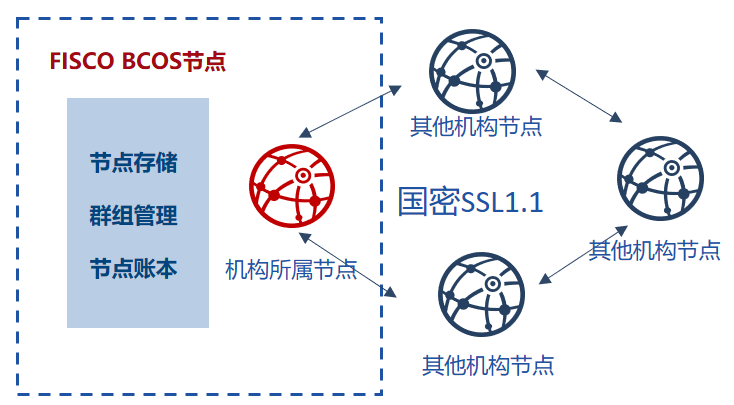

# 12. State Secret Support Program

Tags: "State Secret Algorithm" "SSL" "SM" "

----
## Design Objectives

  In order to fully support domestic cryptography algorithms, the Golden Chain Alliance is based on [Domestic Cryptography Standards](http://www.gmbz.org.cn/main/bzlb.html)It implements the encryption and decryption, signature, signature verification, hash algorithm, and SSL communication protocol, and integrates it into the FISCO BCOS platform to realize the**Commercial passwords recognized by the National Cryptographic Office**full support of。

**The state secret version of FISCO BCOS replaces the cryptographic algorithms of the underlying modules such as transaction signature verification, p2p network connection, node connection, data drop encryption, etc. with the state secret algorithm.**The main features of the state secret version of FISCO BCOS and the standard version are compared as follows:

 |              |   FISCO BCOS Standard Edition|  State Secret Edition FISCO BCOS|
 |:------------:|:--------------------:|:------------------:|
 |   SSL Link| OpenSSL TLSv1.2 Protocol|  State Secret TLSv1.1 Agreement|
 |   Signature Verification|    ECDSA Signature Algorithm|    SM2 Signature Algorithm|
 | message digest algorithm|    SHA-256 SHA-3     |  SM3 Message Digest Algorithm|
 | falling disk encryption algorithm|   AES-256 encryption algorithm|    SM4 Encryption Algorithm|
 |   Certificate Mode|   OpenSSL certificate mode|   State Secret Dual Certificate Mode|
 |  contract compiler| Ethereum Solidity Compiler| State Secret Solidity Compiler|

(Note: the national secret algorithm SM2, SM3, SM4 are based on [domestic cryptography standards](http://www.gmbz.org.cn/main/bzlb.html)开发)

## System framework

The overall framework of the system is shown in the following figure:

## State Secret SSL 1.1 Handshake Establishment Process

The ECDHE _ SM4 _ SM3 cipher suite of State Secret SSL 1.1 is used to establish SSL links for authentication between FISCO BCOS nodes. The differences are shown in the following table:

 |              |                 OpenSSL                  |                 State Secret SSL|
 |:------------:|:----------------------------------------:|:----------------------------------------:|
 |   Encryption Suite| Using ECDH, RSA, SHA-256, AES256 and other cryptographic algorithms|               Adopting the State Secret Algorithm|
 |   PRF algorithm|                 SHA-256                  |                   SM3                    |
 | Key exchange mode|    Transmission elliptic curve parameters and the signature of the current message|         The signature and encryption certificate of the current message.|
 |   Certificate Mode|             OpenSSL certificate mode| The dual certificate model of the State Secret, which is an encryption certificate and a signature certificate, respectively.|

## Data structure differences

The data structure differences between the State Secret Edition and the Standard Edition FISCO BCOS are as follows:

 |  Algorithm Type|                FISCO BCOS Standard Edition|                  State Secret Edition FISCO BCOS|
 |:----------:|:----------------------------------------------:|:--------------------------------------------------:|
 |    Signature| ECDSA (Public key length: 512 bits, private key length: 256 bits) |    SM2 (Length of public key: 512 bits, length of private key: 256 bits)    |
 |    Hash|          SHA3 (Hash string length: 256 bits)           |             SM3 (Hash string length: 256 bits)             |
 | symmetric encryption and decryption|          AES (Encryption Key Length: 256 bits)          |            SM4 (Symmetric key length: 128 bits)            |
 |  Transaction length|    520bits(The identifier is 8bits and the signature length is 512bits.)    | 1024bits(128 bytes, including public key 512bits, signature length 512bits) |
