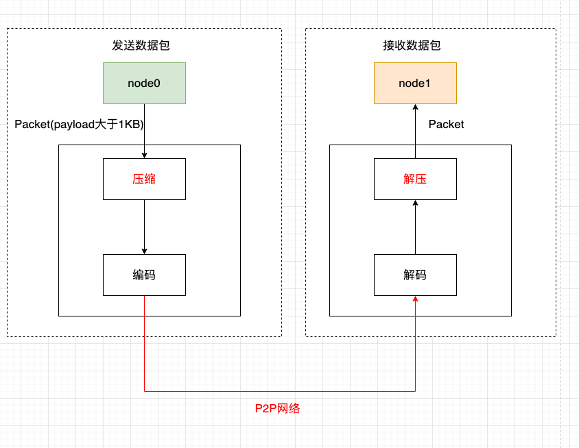
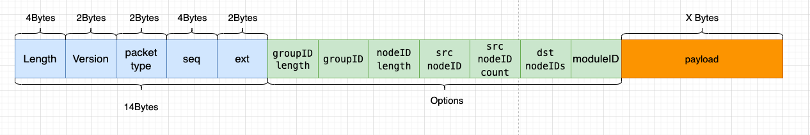
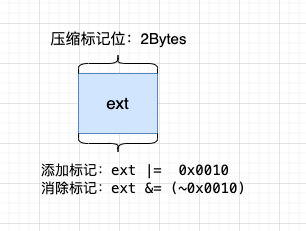

# 13. Network packet compression

tags: "p2p network compression" "data compression"

----

In the external network environment, the performance of the blockchain system is limited by the network bandwidth. In order to minimize the impact of the network bandwidth on the system performance, FISCO BCOS 3.0 supports the p2p network compression function in 'v3.1.0'。The p2p network compression function is enabled by default and does not need to be controlled by a configuration item。

## System framework

Network compression is mainly implemented at the P2P network layer, and the system framework is as follows

Network compression consists of two main processes:

- **Send-side compressed data packets**When the group layer sends data through the P2P layer, if the packet size exceeds 1KB and the receiving node is 3.1.0 or later, the packet is compressed, the tag bit 'ext' is updated, and after encoding, it is sent to the target node；

- **Receiver Decompressed Data Packets**After the node receives the data packet, it decodes it and determines whether the received data packet is compressed according to the flag bit 'ext'. If the data packet is a compressed data packet, it decompresses it and resets the ext flag bit。

## Core implementation

Considering performance, compression efficiency, etc., we chose [Zstd](https://github.com/facebook/zstd)to achieve packet compression and decompression。This section focuses on the implementation of network compression。

### Data compression flag bit

The network packet structure of FISCO BCOS is as follows:

The network data packet mainly includes two parts: packet header and data. The packet header accounts for 14 bytes. The meanings of each field are as follows:

- Length: Packet Length
- Version: Tagged packet version type, primarily for packet version compatibility
- packet type: Packet type marked
- Seq: Packet Sequence Number
- ext: Used to extend the tag to the packet, such as whether the tag packet is of the respond type and whether it is compressed

**The network compression module only compresses network data, not packet headers。**

Considering that compressing and decompressing small data packets cannot save data space and waste performance, in the data compression process, do not compress too small data packets, only compress data packets larger than 'c _ compressThreshold'. 'c _ compressThreshold' defaults to 1024(1KB)；Zstd compression level, we use 1 by default。We use 'ext' as the packet compression flag:

- Add compression marker: ext|=  0x0010
- Eliminate compression marks: ext & = ~ 0x0010

### Process Flow

The following is an example in which a node node0 sends a p2p packet to another node node1 to describe the key processing flow of the p2p network compression module in detail。

**Send-side processing flow**

- Node node0 passes the packet into the P2P layer;
- If P2P determines that the packet of the packet is greater than 'c _ compressThreshold' and the receiving node version supports compression (version 3.1 and later), it calls the compression interface to compress the payload data of the packet；
- The encoding module adds a packet header to the packet and updates the compression tag bit 'ext'。That is, if the packet is a compressed packet, the|=  0x0010`；
- P2P delivers the encoded packet to the destination node。

**Receiving end processing flow**

-After the target machine receives the data packet, the decoding module separates the packet header, and judges whether the network data is compressed by judging the ext field of the packet header, that is, 'm _ ext & 0x0010 = = 0x0010'；
- If the network packet is compressed, call the decompression interface to decompress the payload data；
-reset resets the ext flag bit, that is, 'm _ ext & = ~ 0x0010' to prevent the same packet from being decompressed multiple times。

## Compatibility Description

- **Data Compatibility**Changes that do not involve stored data；
- **Network compatible with rc1**: Forward compatibility, only relase-3.1 and above nodes have network compression function。
