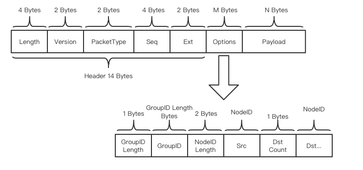

# Peer-to-Peer Network

Tags: "Peer-to-Peer Network" "P2P Module" "Peer-to-Peer Network" "Status Synchronization" "AMOP" "

----
## Design Objectives

FISCO BCOS P2P module provides efficient, universal and secure network communication basic functions, supports unicast, multicast and broadcast of blockchain messages, supports blockchain node status synchronization, and supports multiple protocols。P2P network can be dynamically configured, networking can be dynamically configured；In addition, P2P networks ensure that a single node failure should not affect the entire network communication of the node.

## P2P main function
- Networking dynamic configurable
  
P2P network can be dynamically configured, in the process of system operation to support nodes to dynamically join and exit, networking dynamic configuration.。
  
- Blockchain Node Identification

A blockchain node is uniquely identified by the blockchain node identifier. In FISCOBCOS, the node is uniquely identified by nodeID, and the blockchain node is addressed by the blockchain node identifier on the blockchain network.

- Manage network connections

Maintain long TCP connections between blockchain nodes on the blockchain network, automatically disconnect abnormal connections, and automatically initiate reconnection

- Messaging

Unicast, multicast, or broadcast messages between blockchain nodes in a blockchain network. Each message has a unique identifier.

- State Synchronization

Synchronize status between blockchain nodes

- Network Security

The network module ensures that a single node failure does not affect the entire network communication of the node, and supports the node to restore the original networking function after the recovery of abnormal scenarios.


### Protocol Format



P2P Protocol Format:

| name       | type         | description                          |
| :--------- | :----------- | :----------------------------------- |
| Length     | uint32_t     | Packet length, including header and data|
| Version    | uint16_t     | Protocol Version Information|
| PacketType   | int16_t  | Message type|
| Seq   | uint32_t | Message sequence number, auto-increment, tag message|
| Ext | uint16_t     | Extended Field|
| Options        |   Object| Option Field|
| Payload       |    bytes   |   Load|

Options Format:
| name       | type         | description                          |
| :--------- | :----------- | :----------------------------------- |
| GroupID Length     | uint16_t     | Group ID Length|
| GroupID    | string     | Group ID|
| NodeID Length   | uint16_t  | Node ID Length|
| Src NodeID   | bytes | Message Source Node ID|
| Dst Count | uint16_t     | Number of message destinations|
| NodeIDs        |  array| Destination Node ID List|

## Blockchain Node Identification

The blockchain node identifier is generated by the public key of the ECC algorithm. Each blockchain node must have a unique ECC key pair. The blockchain node identifier uniquely identifies a blockchain node in the blockchain network.

Typically, to join a blockchain network, a node must prepare at least three files:

- node.key node key, in ECC format
- node.crt node certificate, issued by CA
- ca.crt CA certificate, provided by CA

In addition to the unique blockchain node identifier, blockchain nodes can also focus on topics for addressing.

Blockchain node addressing:

- Blockchain Node Identity Addressing

Locate a unique blockchain node in the blockchain network by using the blockchain node identifier

- Topic Addressing

Use a topic to locate a group of nodes in the blockchain network that are interested in the topic.

## Manage network connections

A long TCP connection is automatically initiated and maintained between blockchain nodes. In the event of a system failure or network abnormality, a reconnection is initiated.

When a connection is established between blockchain nodes, the CA certificate is used for authentication

### Connection Establishment Process

```eval_rst
.. mermaid::

    sequenceDiagram
        participant blockchain node A
        participant blockchain node B

        Blockchain Node A-> > Blockchain Node A: Load keys and certificates
        Blockchain Node B-> > Blockchain Node B: Load keys and certificates
        Blockchain Node A-> > Blockchain Node B: Initiate connection
        Blockchain Node B-> > Blockchain Node A: Connection successful
        Blockchain Node B-> Blockchain Node A: Initiate SSL handshake
        Blockchain Node A-> > Blockchain Node A: Get public key from certificate as node ID
        Blockchain Node B-> > Blockchain Node B: Get public key from certificate as node ID
        Blockchain Node B-> Blockchain Node A: Handshake successful, SSL connection established

```

## Messaging

Blockchain inter-node messages support unicast, multicast, and broadcast. Each message has a unique identifier.

- Unicast, where a single blockchain node sends a message to a single blockchain node, addressed by the blockchain node identity
- Multicast: A single blockchain node sends a message to a group of blockchain nodes, using topic addressing
- Broadcast, a single blockchain node sends a message to all blockchain nodes

### unicast process

```eval_rst
.. mermaid::

    sequenceDiagram
        participant blockchain node A
        participant blockchain node B

        Blockchain Node A-> > Blockchain Node A: Filter online nodes based on the node ID
        Blockchain Node A-> > Blockchain Node B: Send Message
        Blockchain Node B-> > Blockchain Node A: Message Packet Back

```

### multicast process

```eval_rst
.. mermaid::

    sequenceDiagram
        participant blockchain node A
        participant blockchain node B
        participant blockchain node C
        participant blockchain node D

        Blockchain Node A-> > Blockchain Node A: Select nodes B and C according to Topic 1
        Blockchain Node A-> > Blockchain Node B: Send Message
        Blockchain Node A-> > Blockchain Node C: Send Message
        Blockchain Node B-> > Blockchain Node B: Select nodes C and D according to Topic 2
        Blockchain Node B-> > Blockchain Node C: Send Message
        Blockchain Node B-> > Blockchain Node D: Send Message
        Blockchain Node C-> > Blockchain Node C: Select node D according to Topic 3
        Blockchain Node C-> > Blockchain Node D: Send Message

```

### Broadcast process

```eval_rst
.. mermaid::

    sequenceDiagram
        participant blockchain node A
        participant blockchain node B
        participant blockchain node C
        participant blockchain node D

        Blockchain Node A-> > Blockchain Node A: Traverse all node IDs
        Blockchain Node A-> > Blockchain Node B: Send Message
        Blockchain Node A-> > Blockchain Node C: Send Message
        Blockchain Node A-> > Blockchain Node D: Send Message
        Blockchain Node B-> > Blockchain Node B: Traverse all node IDs
        Blockchain Node B-> > Blockchain Node C: Send Message
        Blockchain Node B-> > Blockchain Node D: Send Message
        Blockchain Node C-> > Blockchain Node C: Traverse all node IDs
        Blockchain Node C-> > Blockchain Node D: Send Message

```

## State Synchronization

Each node maintains its own state and broadcasts the Seq of the state regularly across the network to synchronize with other nodes.

```eval_rst
.. mermaid::

    sequenceDiagram
        participant blockchain node A
        participant blockchain node B

        Blockchain Node A-> Blockchain Node B: broadcast seq
        Blockchain Node A-> > Blockchain Node A: Determine whether the seq of node B changes
        Blockchain Node A-> > Blockchain Node B: seq change, initiate status query request
        Blockchain Node B-> > Blockchain Node A: Return Node Status
        Blockchain Node A-> > Blockchain Node A: Update Node B's status and seq

```

## AMOP message forwarding process

### Unicast timing diagram

```eval_rst
.. mermaid::

    sequenceDiagram
        participant sdk [Subscriber]

        participant node 0
        
        participant node 1
        
        participant sdk [Publisher]
        
        sdk [Subscriber]-> > Node 0: Subscribe to topic1, type: 0x32
        
        Node 0-> > Node 0: Update topic list
        
        Node 1-> > Node 0: Request a list of topics
        
        Node 0--> > Node 1: Response topic list
        
        sdk [Publisher]-> > Node 1: Unicast message to topic1, type: 0x30
        
        Node 1-> > Node 0: Node forwarding message

        Node 0->>sdk [Subscriber]: Node forwarding message

        sdk [Subscriber]--> > Node 0: Packet back, type: 0x31

        Node 0--> > Node 1: Node forwarding message

        Node 1-->>sdk [Publisher]:Node forwarding message

```

```eval_rst
.. note::

    - Unicast means that if multiple subscribers subscribe to the same topic, the node randomly selects a subscriber to push the message
    - Message publishers and message subscribers need to choose the same topic
    - The return packet after the subscriber receives the message is automatically sent by the sdk, which does not need to be handled by the user. The return packet only indicates that the subscriber has successfully received the message.
    - Publisher receives an error code if there are no subscribers before Publisher pushes the message*100*indicating that no nodes are available in the network

```

### Multicast Timing Diagram

```eval_rst
.. mermaid::

    sequenceDiagram
        participant sdk [Subscriber0]
        
        participant sdk [Subscriber1]

        participant node 0
        
        participant node 1
        
        participant node 2
        
        participant sdk [Publisher]
        
        sdk [Subscriber0]-> > Node 0: Subscribe to topic1, type: 0x32
        
        Node 0-> > Node 0: Update topic list
        
        Node 1-> > Node 0: Request a list of topics
        
        Node 0--> > Node 1: Response topic list
        
        Node 2-> > Node 0: Request a list of topics
        
        Node 0--> > Node 2: Response topic list
        
        sdk [Subscriber1]-> > Node 1: Subscribe to topic1, type: 0x32
        
        Node 1-> > Node 1: Update topic list
        
        Node 0-> > Node 1: Request a list of topics
        
        Node 1--> > Node 0: Response topic list
        
        Node 2-> > Node 1: Request a list of topics
        
        Node 1--> > Node 2: Response topic list
        
        sdk [Publisher]-> > Node 2: Multicast message to topic1, type: 0x35
        
        Node 2-> > Node 0: Node forwarding message

        Node 2-> > Node 1: Node forwarding message
        
        Node 2-->>sdk [Publisher]: Packet back, type: 0x31

        Node 0->>sdk [Subscriber0]: Node forwarding message

        Node 1->>sdk [Subscriber1]: Node forwarding message
        
```

```eval_rst
.. note::

    - Multicast means that if multiple subscribers subscribe to the same topic, the node pushes messages to all subscribers.
    - As long as the network is normal, Publisher can receive the response packet that the node message is pushed successfully even if no subscriber receives the message.

```