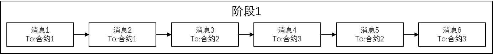
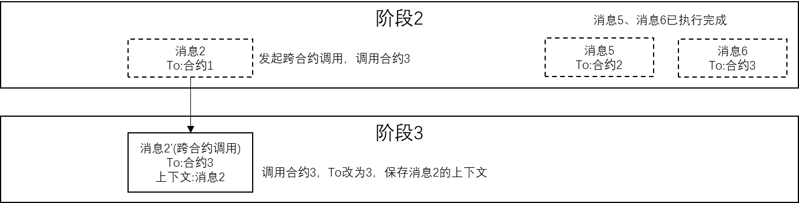

# DMC deterministic multi-contract parallelism

Tags: "Execute" "Parallel Scheduling" "DMC" "Deterministic Parallel Contracts"

----------

## 1. Background

Nowadays, multi-core has gradually become the mainstream of today's CPU. In the future, CPU may integrate more cores and enter the era of many cores.。

Blockchain In order to ensure transaction transactionality, transactions are serialized and thoroughly serialized, first sort transactions, and then execute smart contracts with a single thread to avoid transaction confusion, data conflicts, etc. caused by out-of-order execution.。Even if a server has a multi-core CPU, the operating system supports multi-threaded multi-process, and there are multiple nodes and multiple servers in the network, all transactions are methodically and strictly single-threaded on each computer.。

In FISCO BCOS version 2.0, a DAG parallel solution was introduced to convert the linear execution of transactions into parallel execution of DAG graphs.。In the practical application of the DAG parallel solution, the blockchain can organize a transaction dependency graph based on the mutually exclusive resources that need to be used when each transaction is executed (mutually exclusive means exclusive use of resources, for example, in the above-mentioned transfer problem mutually exclusive resources, it refers to the balance status of each account). In order to prevent the transaction dependency relationship from being looped in the graph, we can specify that the transaction in the transaction list involves the same mutually exclusive。
 
Ideally, all transactions can be parallelized, and the boost of DAG parallelism is equal to the number of cores in the system。

However, any advanced technology has its scope and limitations, and DAG still has improvement points in specific scenarios:

1. DAG parallel requires the blockchain user to provide the mutual exclusion of all resources in advance, in order to analyze the feasible parallel path from the transaction through the mutual exclusion relationship, the analysis of the mutual exclusion relationship is a complex process for the user, once the analysis error, will lead to the serious consequences of inconsistency and consensus in the blockchain.。
1. DAG and behavior to ensure sequential consistency, the selection of mutually exclusive relations must follow the most conservative strategy, when the contract logic is complex, involving a large number of resource access, DAG is difficult to analyze a feasible parallel path, and finally equivalent to serial execution.。

## 2 、 Deterministic Multi-Contract Parallel Scheme (DMC)

The core idea of the deterministic multi-contract parallel scheme (DMC) based on parallel scheduling is to ensure the certainty of mutually exclusive resource access during parallel transaction execution, achieving the following goals.
- Easy to use: The bottom layer of the blockchain automatically enables parallelism, eliminating the need for users to pay attention to parallel logic and providing conflict fields in advance.。
- Efficient: transactions within blocks are not executed repeatedly, with no pre-execution, pre-analysis or retry processes。
- Compatible: This solution can be used regardless of EVM, WASM, Precompiled, or other contracts using any consensus mechanism。

The DMC solution first requires that there is no shared data between smart contracts in the blockchain, each contract has an independent storage space, and other contracts cannot be read and written.。When executing a transaction, DMC splits the different smart contract code blocks called by all transactions in the block into multiple code segments, and the code blocks of multiple different smart contracts are executed in a staggered manner, with the boundaries of the split being cross-contract calls and mutually exclusive resource access.。

In the DMC scheme, multiple transactions calling the same contract are always serial in a global perspective, and DMC allows multiple transactions calling different contracts to be executed in parallel, and since there is no shared data between smart contracts, parallel execution between different contracts can always ensure the consistency of the final result.。When any smart contract makes a cross-contract call or accesses a locked mutex, the DMC suspends the execution of the transaction and waits for all other transactions in the current phase to complete, or for cross-contract calls and access to locked mutex resources. This waiting process is called global synchronization.。For each global synchronization, DMC allocates cross-contract calls and mutually exclusive resource access to transactions according to fixed rules to ensure that the same contract and mutually exclusive resources are not accessed in parallel, and ultimately to ensure the consistency of execution results while achieving parallelism.。

## 3. Brief description of DMC process

### DMC Execution Process
The user inputs a list of transactions to the blockchain system, including transaction 1 to transaction 6。The blockchain system packages transactions into blocks and executes consensus, and the list of transactions within the block is a list of transactions in a determined order, assuming that six transactions are entered, from**Transaction 1 to Transaction 6**；Each transaction invokes a different contract, including**Contract 1 to Contract 3**。

**Phase 1**
- During the consensus process, the blockchain system inputs the block to the DMC scheduler. The DMC scheduler generates an initial phase 1 based on the transaction list in the block and converts all transactions in the block into messages. Phase 1 contains messages corresponding to all transactions in the block.-6。
- At the beginning of each phase, the DMC scheduler constructs a hash table, sequentially and serially traverses all messages in the current phase, extracts the destination contract (To) field of the message, and puts the destination contract field into the hash table.
    - If the destination contract field is successfully placed in the hash table, the message invokes the destination contract for the first time, and the DMC scheduler asynchronously sends the message to any trade executor to execute the message;
    - If there is a conflict when the destination contract field is placed in the hash table, it means that the destination contract for the message call has been called earlier, and the DMC scheduler moves the message to the next stage (stage 2).;

**Phase 2**
- The DMC scheduler traverses the messages in phase 1 and finds that message 2 and message 1 invoke the same contract, message 3 and message 5 invoke the same contract, and message 4 and message 6 invoke the same contract. The DMC scheduler asynchronously sends the messages (message 1, message 3, and message 4) that invoke the contract for the first time to multiple transaction executors for execution, and the others (message 2, message 5, and message 6) move to the。
- Message 1, message 3, and message 4, because they call different contracts respectively, multiple transaction executors can execute these three messages in parallel, and the DMC scheduler will wait for the execution of messages 1, 3, and 4 to complete。

**Phase 3**
- In the process of executing a message, if a cross-contract call occurs within the smart contract corresponding to the message, the transaction executor suspends the execution of the current message, saves the context of the message execution, and generates a new cross-contract call message. The new message contains the previously saved context. The transaction executor sends the new message of the cross-contract call to the DMC scheduler.。
- The DMC scheduler moves the cross-contract call message from the trade executor to the next stage.。
- If the DMC scheduler executes message 2 in phase 2 and the smart contract invoked by the message initiates a cross-contract invocation, and the destination contract of the cross-contract invocation is 3, the transaction executor suspends the execution of message 2, saves the context of message 2, generates a new cross-contract invocation message 2 ', and the transaction executor sends the cross-contract invocation message 2' to the DMC scheduler.。The DMC scheduler puts message 2 'into stage 3, and the DMC scheduler then sends the message to other transaction executors in stage 3.。

**Phase 4**
- After the transaction executor finishes executing the message, if the message contains a context, which is equivalent to a cross-contract call return, the transaction executor restores the context based on the context in the message, generates a new message, and puts the result of the current message execution as the cross-contract call return value in the parameters of the new message, and sends the new message returned by the cross-contract call to the DMC scheduler.。

- The DMC scheduler moves the cross-contract call message from the trade executor to the next stage.。
- If the DMC scheduler finds that the next stage is not empty, it will set the current stage as the next stage and repeat the initial steps, and so on, until all transactions are executed。