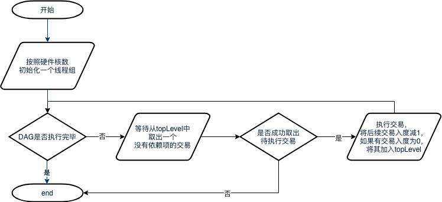

# DAG Transactions Parallel

Tag: "transaction parallel" "" DAG ""

----

## 1 Noun explanation

### 1.1 DAG

An acyclic directed graph is called a directed acyclic graph (**D**irected **A**cyclic **G**raph), or DAG diagram for short。In a batch of transactions, you can identify the mutually exclusive resources that each transaction needs to occupy by a certain method, and then construct a transaction dependency DAG diagram according to the order of transactions in the Block and the occupancy of mutually exclusive resources, as shown in the figure below, all transactions with an entry of 0 (no dependent pre-order tasks) can be executed in parallel.。As shown in the figure below, after topological sorting based on the order of the original transaction list on the left, you can get the transaction DAG on the right。

## 2 Module Architecture

The main processes include:

- Users initiate transactions directly or indirectly through the SDK。Transactions can be transactions that can be executed in parallel and transactions that cannot be executed in parallel.；
- The transaction enters the node's transaction pool and waits for packaging；
- The transaction is packaged into blocks by Sealer and sent to BlockVerifier for verification after consensus.；
- BlockVerifier generates a transaction DAG based on a list of transactions in a block；
- BlockVerifier constructs the execution context and executes the transaction DAG in parallel；
- After the block is verified, the blockchain。

## 3 Important processes

### 3.1 Trading DAG Construction

#### 3.1.1 DAG Data Structure

The DAG data structure used in the scheme is as follows:

Among them:
- Vertex
	- inDegree is used to store the current in-degree of the vertex;
    - OutEdge is used to store the outgoing edge information of the vertex, specifically the ID list of all vertices connected to the outgoing edge。
- DAG：
	- vtxs is used to store a list of all nodes in the DAG；
    - topLevel is a concurrent queue used to store the ID of the node with the current entry of 0, which is accessed concurrently by multiple threads during execution.；
    - totalVtxs: Total number of vertices
    - totalConsume: Total number of vertices that have been executed；
    - void init(uint32_t \_maxSize)Initializes a DAG with a maximum vertex number of maxSize；
    - void addEdge(ID from, ID to): Create a directed edge between vertices from and to；
    - void generate()Construct a DAG structure based on existing edges and vertices；
    - ID waitPop(bool needWait): Wait for a node with an in degree of 0 to be taken out of topLevel；
    - void clear()Clear all node and edge information in the DAG。
- TxDAG:
	- dag: DAG instance
    - exeCnt: Count of transactions that have been executed；
    - totalParaTxs: Total number of parallel transactions；
    - txs: List of parallel transactions
    - bool hasFinished()Returns true if the entire DAG has been executed. Otherwise, returns false;
    - void executeUnit(): Take out a transaction with no upper layer dependencies and execute it.；
#### 3.1.2 Transaction DAG Construction Process

The process is as follows:

1. All transactions in the block are removed from the packaged block.；
2. Initialize a DAG instance with the number of transactions as the maximum number of vertices.；
3. Read out all transactions in order, and if a transaction is parallelizable, parse its conflict domain and check if there are previous transactions that conflict with that transaction, and if so, construct dependent edges between the corresponding transactions；If the transaction is not parallelizable, it is considered that it must be executed after all of the preceding transactions have been executed, thus creating a dependent edge between the transaction and all of its preceding transactions。

### 3.2 DAG execution process

The process is as follows:

1. The main thread will first initialize a thread group of the corresponding size according to the number of hardware cores, and if the number of hardware cores fails, no other threads will be created.；
2. When the DAG has not yet been executed, the thread loop waits for a transaction with a pop in and out degree of 0 from the DAG.。If the transaction to be executed is successfully taken out, the transaction is executed, and after execution, the entry of subsequent dependent tasks is reduced by 1, and if the entry of the transaction is reduced to 0, the transaction is added to the topLevel.；If it fails, the DAG has been executed and the thread exits。