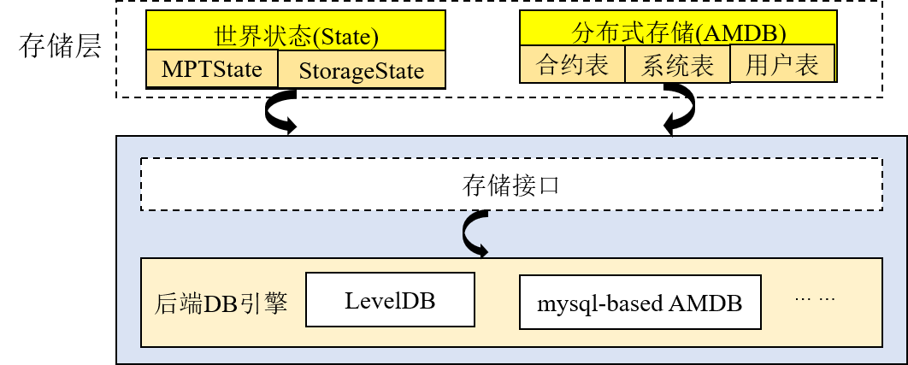

# Group architecture

Tags: "Group Schema" "Schema"

----

Considering the needs of real business scenarios, FISCO BCOS introduces a multi-group architecture, which supports blockchain nodes to start multiple groups, and isolates transaction processing, data storage, and block consensus between groups, ensuring the privacy of the blockchain system while reducing the complexity of system operation and maintenance.。Transactions between different groups can be executed in parallel, improving performance。


```eval_rst
.. note::

    For example:

    All nodes of institutions A, B, and C form a blockchain network to run business 1；After a period of time, institutions A and B start business 2 and do not want the data and transaction processing related to that business to be perceived by institution C.？

    - **1.3 Series FISCO BCOS System** : Agency A and Agency B re-establish a chain to run business 2；The O & M administrator needs two O & M chains to maintain two sets of ports

    - **FISCO BCOS 2.0+** : Institution A and Institution B create a new group to run business 2；The O & M administrator only needs to maintain one chain

    It is clear that FISCO BCOS 2.0 is based on meeting the same privacy protection needs.+Better scalability, operability and flexibility。
```

In a multi-group architecture, the network is shared between groups through [network access and ledger whitelist](../security_control/node_management.md)Achieve network message isolation between ledgers。


Data isolation between groups, each group runs its own consensus algorithm independently, and different groups can use different consensus algorithms.。From the bottom up, each ledger module mainly includes three layers: core layer, interface layer and scheduling layer. These three layers cooperate with each other, and FISCO BCOS can ensure that a single group runs independently and robustly.。

## Core Layer

The core layer is responsible for putting [blocks] of the group(../../tutorial/key_concepts.html#id3)Data, block information, system tables, and block execution results are written to the underlying database.。

Storage is divided into world states(State)and distributed storage(AMDB)Two parts, the world state includes MPTState and StorageState, responsible for storing the status information of transaction execution, StorageState performance is higher than MPTState, but does not store block history information.；AMDB exposes simple queries to the outside(select)Submitted(commit)and update(update)Interface, responsible for operating contract tables, system tables and user tables, with pluggable features, the backend can support a variety of database types, currently supports [RocksDB database](https://github.com/facebook/rocksdb)and MySQL [storage](../storage/storage.md)。




## interface layer

Interface layer includes transaction pool(TxPool), Blockchain(BlockChain)and block executor(BlockVerifier)Three modules。

- **Trading pool(TxPool)**: Interact with the network layer and scheduling layer, responsible for caching transactions broadcast by clients or other nodes, scheduling layer(Mainly synchronization and consensus modules)Remove transactions from the transaction pool for broadcast or block packaging.；

- **Blockchain(BlockChain)**: Interacts with the core layer and the scheduling layer, which is the only entry for the scheduling layer to access the underlying storage.(Synchronization, consensus module)You can query the block height, obtain the specified block, and submit the block through the block link port.；

- **Block Executor(BlockVerifier)**: Interacts with the scheduling layer to execute the blocks passed in from the scheduling layer and returns the block execution results to the scheduling layer.。


## scheduling layer

Scheduling layer includes consensus module(Consensus)and synchronization module(Sync)。

- **Consensus Module**Includes Sealer and Engine threads, responsible for packaging transactions and executing consensus processes, respectively。Sealer thread from trading pool(TxPool)Take the transaction and package it into a new block；The Engine thread executes the consensus process. The consensus process executes the block. After the consensus is successful, the block and the block execution result are submitted to the blockchain.(BlockChain)The blockchain uniformly writes this information to the underlying storage, triggers the transaction pool to delete all transactions contained in the blockchain, and notifies the client of the transaction execution results in the form of callbacks. Currently, FISCO BCOS mainly supports [PBFT](../consensus/pbft.md)and [Raft](../storage/storage.md)consensus algorithm；

- **synchronization module**: responsible for broadcasting transactions and getting the latest blocks,
Given the consensus process, [leader](../consensus/pbft.html#id1)It is responsible for packaging blocks, and the leader may switch at any time. Therefore, it is necessary to ensure that the client's transactions are sent to each blockchain node as much as possible. After the node receives new transactions, the synchronization module broadcasts these new transactions to all other nodes.；Considering that inconsistent machine performance in the blockchain network or the addition of new nodes will cause the block height of some nodes to lag behind that of other nodes, the synchronization module provides the block synchronization function, which sends the latest block height of its own node to other nodes, and other nodes will actively download the latest block when they find that the block height lags behind that of other nodes.。