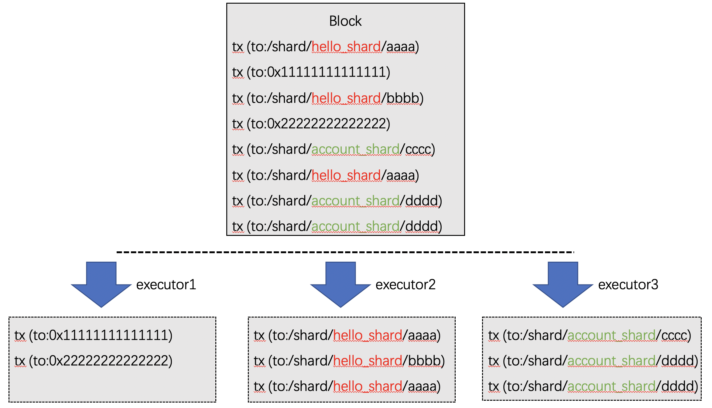

# intra-block fragmentation
Label: "sharding" "shard" "trade execution" "

-------

## Concept

When multiple applications are hosted on a blockchain, the "**intra-block fragmentation**"Technology enables parallelization of inter-application transaction execution。

Grouping contracts on the chain in FISCO BCOS support。When executing transactions within a block, the transactions within a block are split into multiple "**intra-block fragmentation**"Hereinafter referred to as: shards), transactions of the same shard are scheduled to be executed in the same executor.。

## 方案

**Key point**

* Parallel: Different shards within a block are scheduled for parallel execution in different executors.。
* Local: The mutual invocation of contracts within the shard is done directly in the same executor, and the shards do not interfere with each other.。
* Cross-shard: Cross-shard calls are made directly in a block, transparent to the user, and its scheduling is based on the DMC mechanism to avoid heavy SPV proof.。
* Configuration: Users can manage the shards to which contracts belong in the console
* Inheritance: Contracts deployed within a shard belong to the same shard, eliminating tedious shard management operations。

## Implementation

The implementation method is as follows:

* Parallel: Architecture based on [FISCO BCOS](../architecture.md)Implement scheduling of multiple executors。
* Local: inside an executor, executed in parallel using [DAG](./dag.md)。
* Cross-shard: Cross-shard transactions are scheduled using [DMC mechanism](./dmc.md), completed within a block while ensuring consistency and existence。
* Configuration: Based on [BFS](../contract_directory.md)Realize contract shard management, start the console, use the linkShard command to bind the contract to the shard, and use the ls command to view the shard information。
* Inheritance: Contracts deployed within a shard automatically inherit the shard configuration

## Example

shard 1: '/ shard / hello _ shard'

```
/shard/hello_shard/hello1
/shard/hello_shard/hello2
/shard/hello_shard/hello3
```

shard 2: '/ shard / account _ shard'

```
/shard/account_shard/alice
/shard/account_shard/bob
/shard/account_shard/charies
```





## Operation Example

This operation requires the use of the console, please refer to [here](../../operation_and_maintenance/console/console_config.md)Deployment Console。Please refer to here for fragment management operations。

**Deployment contract**

> Deploy two contracts: Asset, HelloWorld

```
[group0]: /apps> deploy Asset 
transaction hash: 0x8dbee4602da3d3435ce73df3778ee975b650cfaf70ce6b53f14db6db478cec10
contract address: 0xcceef68c9b4811b32c75df284a1396c7c5509561
currentAccount: 0x988e6a553f434be3d37786c97abb1fe1f8b7341d

[group0]: /apps> deploy HelloWorld 
transaction hash: 0xcb860822f8d74ac447fc3d18870109a202ff788a6b1ef32970fa53497ba386d5
contract address: 0xd24180cc0fef2f3e545de4f9aafc09345cd08903
currentAccount: 0x988e6a553f434be3d37786c97abb1fe1f8b7341d
```

**Create shard**

> Create two shards: account _ shard and hello _ shard

```
[group0]: /apps> makeShard account_shard
make shard account_shard Ok. You can use 'ls' to check

[group0]: /apps> makeShard hello_shard
make shard hello_shard Ok. You can use 'ls' to check

[group0]: /apps> ls /shards/
account_shard   hello_shard 
```

**Contract Binding Shard**

> Bind the above two contracts to different shards respectively

```
[group0]: /apps> linkShard 0xcceef68c9b4811b32c75df284a1396c7c5509561 account_shard
Add 0xcceef68c9b4811b32c75df284a1396c7c5509561 to account_shard Ok. You can use 'ls' to check

[group0]: /apps> linkShard 0xd24180cc0fef2f3e545de4f9aafc09345cd08903 hello_shard
Add 0xd24180cc0fef2f3e545de4f9aafc09345cd08903 to hello_shard Ok. You can use 'ls' to check
```

**Querying Shard Information**

> Use the getContractShard command to check that the contract is bound to a specific shard

```
[group0]: /apps> getContractShard 0xcceef68c9b4811b32c75df284a1396c7c5509561
/shards/account_shard

[group0]: /apps> getContractShard d24180cc0fef2f3e545de4f9aafc09345cd08903
/shards/hello_shard
```

> the ls command of BFS can also be queried

```
[group0]: /apps> ls /shards/account_shard/
cceef68c9b4811b32c75df284a1396c7c5509561   

[group0]: /apps> ls /shards/hello_shard/
d24180cc0fef2f3e545de4f9aafc09345cd08903 
```

**Call the contract in shard**

> The transaction will be automatically dispatched to the corresponding shard for execution, and different shards will be executed in different executors. This operation is transparent to the user, and the experience is no different from calling an ordinary contract

``` 
[group0]: /apps> call HelloWorld 0xd24180cc0fef2f3e545de4f9aafc09345cd08903 set nice
transaction hash: 0x41637d8eb5907e84fd2bda6303d444bb7b3b9fe8cd85750dc547139710439b6e
---------------------------------------------------------------------------------------------
transaction status: 0
description: transaction executed successfully
---------------------------------------------------------------------------------------------
Receipt message: Success
Return message: Success
Return value size:0
Return types: ()
Return values:()
---------------------------------------------------------------------------------------------
Event logs
Event: {}
```

