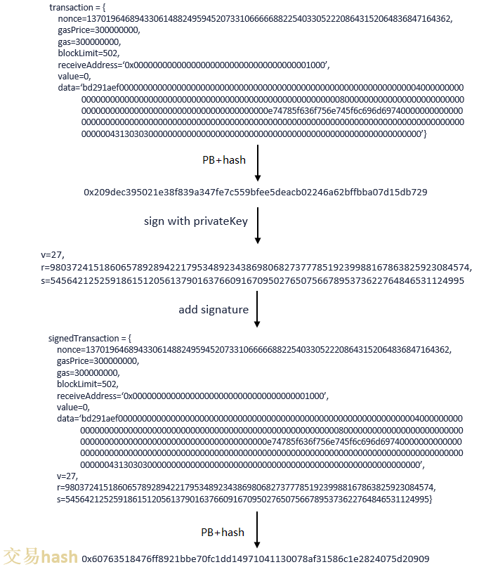

# 3. Core Data Structures

Tags: "data structure" "encoding"

----------

```eval_rst
.. note::
   The implementation of the FISCO BCOS 3.x data and encoding protocol is located in 'bcos-tars-protocol <https://github.com/FISCO-BCOS/FISCO-BCOS/tree/master/bcos-tars-protocol/bcos-tars-protocol>`_
```

FISCO BCOS 3.x defaults to [tars](https://doc.tarsyun.com/#/markdown/TarsCloud/TarsDocs/base/tars-protocol.md)Encoding protocol, this chapter mainly introduces the encoding protocol of FISCO BCOS 3.x basic data structure.。

## 1. Block header data structure

For the definition of tars of block header, please refer to [here](https://github.com/FISCO-BCOS/FISCO-BCOS/blob/master/bcos-tars-protocol/bcos-tars-protocol/tars/Block.tars)。

### 1.1 BlockHeaderData

The fields in the block header that need to be hashed:

|  Field| Type|   Description|
|  ----  | ----  | ----  |
| version  | int |Block Header Version Number|
| parentInfo  | vector<ParentInfo> |Parent block information, including the block height and hash of the parent block|
| txsRoot  | vector<byte> |Hash of all MerkleRoot transactions in the block|
| receiptRoot  | vector<byte> |Hash of all receipts within the block MerkleRoot|
| stateRoot  | vector<byte> |The root hash of all transaction state changes in the block.|
| blockNumber  | long |Block height|
| gasUsed  | string |the sum of gas consumed by all transactions in the block.|
| timestamp  | long |Block Header Timestamp|
| sealer  |  long|ID of the consensus node that generated the block header|
| sealerList  | vector<vector<byte>>  |List of all consensus nodes in the system when generating the block header|
| extraData  | vector<byte> |Extended field, FISCO BCOS is currently only used to record group genesis file information in block 0|
| consensusWeights  | vector<long> |Weight information for all consensus nodes|

### 1.2 BlockHeader

Definition of all fields in the block header:

|  Field| Type|   Description|
|  ----  | ----  | ----  |
|data |BlockHeaderData |The block header is used to calculate the data corresponding to the encoding of all fields of the hash.|
|dataHash |<byte>|The root hash of all transaction state changes in the block.|
|signatureList |vector<Signature>  |Signature list generated after block header consensus is successful|

## 2. Block data structure

The definition of tars for blocks can be found in [here](https://github.com/FISCO-BCOS/FISCO-BCOS/blob/master/bcos-tars-protocol/bcos-tars-protocol/tars/Block.tars)The block can include either the complete block header, transaction, and receipt information, or the Proposal, which can be used as a consensus module, includes only the metadata information of the transaction, as follows:

|  Field| Type|   Description|
|  ----  | ----  | ----  |
|version |int|Optional field, block version number|
|type |int|Optional fields, block type|
|blockHeader |BlockHeader|Optional fields, block header data|
|transactions |vector<Transaction>|Optional fields, transaction list|
|receipts |vector<TransactionReceipt> |Optional fields, transaction receipt list|
|transactionsMetaData |vector<TransactionMetaData> |Optional fields, transaction metadata information|
|receiptsHash |vector<vector<byte>> |Hash list of transaction receipts|
|nonceList |vector<string> |The nonce list of all transactions. In the scenario of block synchronization, as the payload of the block, push the nonce of all transactions to the transaction pool and trigger the nonce update logic|

## 3. Transaction data structure

The definition of tars for transactions can be found [here](https://github.com/FISCO-BCOS/FISCO-BCOS/blob/master/bcos-tars-protocol/bcos-tars-protocol/tars/Transaction.tars)Similar to the block header, the data protocol field of the transaction is also divided into two parts: the field used to calculate the hash and the field that does not participate in the hash calculation.。

### 3.1 TransactionData

defines all the fields in the transaction that are used to calculate the hash, as follows

|  Field| Type|   Description|
|  ----  | ----  | ----  |
|version |int |require, transaction version number|
|chainID |string |require, the chain ID corresponding to the transaction|
|groupID |string |require, the group ID corresponding to the transaction|
|blockLimit |long |require, the blockLimit of the transaction, to prevent duplication of transactions|
|nonce |string |require, a random number provided by the sender of the message to uniquely identify the transaction and also to prevent duplication of transactions|
|to |string | optional, the address of the transaction receiver|
|input |vector<byte> | require, the data related to the transaction, including the functions and parameters called by the transaction.|

The hashWith field (also known as the transaction hash / transaction unique identifier) is generated as follows.



### 3.2 Transaction

Definition of Exchanged Fields:

|  Field| Type|   Description|
|  ----  | ----  | ----  |
| data | TransactionData| optional, the data encoded by the field used by the transaction to calculate the hash|
| dataHash | vector<byte> |optional, transaction hash|
| signature|vector<byte> |optional, the signature of the transaction|
| sender |vector<byte> |optional, the address of the account where the transaction was sent|
| importTime |long | optional, the timestamp when the transaction was sent to the node|
| attribute |int | optional, the attributes of the transaction, used to mark the type of transaction, the parallel conflict domain of the transaction, etc.|
| source |string |optional, the address of the transaction receiver, for DMC scheduling|

### 3.3 TransactionMetaData

Only the transaction metadata information is included in the proposal of the consensus package. The transaction metadata information field is defined as follows:

|  Field| Type|   Description|
|  ----  | ----  | ----  |
|hash |vector<byte> |optional, transaction hash|
|to |string |optional, the address of the transaction receiver|
|source |string |optional, the address of the transaction receiver, for DMC scheduling|
|attribute |unsigned int |optional, the attributes of the transaction, used to mark the type of transaction, the parallel conflict domain of the transaction, etc.|

## 4. Transaction receipt data structure.

The definition of tars for transaction receipts can be found [here](https://github.com/FISCO-BCOS/FISCO-BCOS/blob/master/bcos-tars-protocol/bcos-tars-protocol/tars/TransactionReceipt.tars)Similar to block headers and transactions, the data protocol field of the transaction receipt is also divided into two parts: the field used to calculate the hash and the field that does not participate in the hash calculation.。

### 4.1 LogEntry

Define event log as follows:

|  Field| Type|   Description|
|  ----  | ----  | ----  |
|address |string|The contract address corresponding to the event|
|topic|vector<vector<byte>>|Event topic|
|data|vector<byte>|Data corresponding to the eventlog|

### 4.2 TransactionReceiptData

The field in the transaction receipt used to calculate the hash:

|  Field| Type|   Description|
|  ----  | ----  | ----  |
|version|int|require, transaction receipt version number|
|gasUsed|string|require, the gas consumed by the transaction corresponding to the receipt|
|contractAddress|string|optional, the contract address corresponding to the transaction receipt|
|status|int|require, trade execution status|
|output|vector<byte>|optional, trade execution result output|
|logEntries|vector<LogEntry>|optional, eventlogs generated during trade execution|
|blockNumber|long|require, the height of the block where the transaction receipt is located|

### 4.3 TransactionReceipt

The data structure of the transaction receipt is defined as follows:

|  Field| Type|   Description|
|  ----  | ----  | ----  |
|data|TransactionReceiptData|Encoded data for all fields used to calculate the hash in the transaction receipt|
|dataHash|vector<byte>|Transaction Receipt Code|

The design of block and transaction related data structure ensures that FISCO BCOS has the function of checking data integrity.。Block hash, transaction Merkel tree root, receipt Merkel tree root, status Merkel tree root, parent block information and other fields, can effectively verify the validity and integrity of the block, to prevent data tampering。
In addition, users can obtain block information by calling the relevant interface on the console to verify data consistency.。

### 4.4 Native transactions

FISCO BCOS implements the smallBank contract based on the solidity contract and the pre-compiled version.。Small Bank originated from blockBench and is recognized by the industry and academia as one of the basic tests of blockchain systems. FISCO BCOS defines small Bank's transactions that enable inter-account transfers as native transactions.。
Through the deployment contract smallBank, the final execution with EVM。smallBank also provides a precompiled contract method, which can be implemented by calling the smallBank precompiled contract address.。
