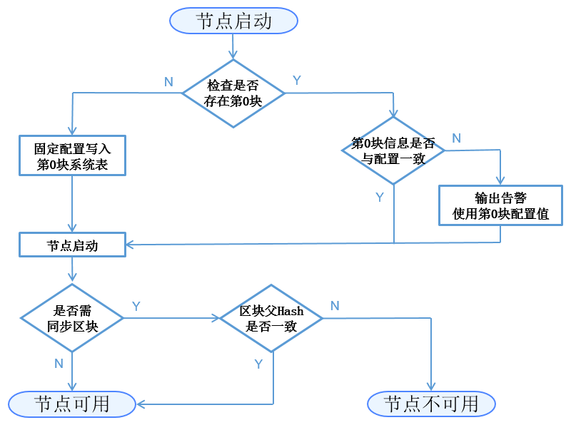

# node admission management

Tags: "security control" "access control" "node admission"

----

This document provides an introductory description of node admission management. For practical methods, see [Operation Document of Node Admission Management](../../manual/node_management.md)。

## Overview

### Single-chain multi-ledger

Blockchain technology is a decentralized, open and transparent distributed data storage technology that can reduce trust costs and achieve safe and reliable data interaction.。However, the transaction data of the blockchain faces the threat of privacy leakage:

- For public chains, a node can join the network at will and get all the data from the global ledger.；
- For the alliance chain, although there is a network access mechanism, the node can obtain the data of the global ledger after joining the blockchain.。

FISCO BCOS, as a consortium chain, raised the issue of on-chain privacy.**Single-chain multi-ledger**the solution of。FISCO BCOS by introducing**GROUP**concept, which expands the alliance chain from the original one-chain one-ledger storage / execution mechanism to a one-chain multi-ledger storage / execution mechanism, and implements data isolation and confidentiality on the same chain based on the group dimension.。


< center > Multi-ledger < / center >

As shown in the figure above, node ABC joins the blue group and jointly maintains the blue ledger; Nodes B and C join the pink group and maintain the pink ledger; Nodes A and B join the yellow group and maintain the yellow ledger。The three groups share common network services, but each group has its own separate ledger storage and transaction execution environment.。The client sends the transaction to a group to which the node belongs, and the transaction and data are agreed and stored within the group, while other groups are unaware of the transaction.。

### node admission mechanism

Based on the introduction of the group concept, node admission management can be divided into**network admission mechanism**和**group access mechanism**。The rules of the admission mechanism are recorded in the configuration. After the node is started, the configuration information is read to judge the admission of the network and group.。

## noun explanation

### Node Type

The nodes discussed in this document are nodes that have completed network admission and are capable of P2P communication.。**Network admission process involves P2P node connection list addition and certificate verification。**

- **Group Node**Node that completes network admission and joins the group。A group node can only be one of a consensus node and an observation node。The consensus node participates in consensus block and transaction / block synchronization, and the observation node only participates in block synchronization.。**The group node admission process involves the sending of transactions that dynamically add or delete nodes.。**

- **free node**Nodes that complete network admission but do not join the group。**Free nodes have not yet passed group admission and do not participate in consensus and synchronization。**

The node relationships are as follows:


< center > node relationships < / center >

### Configuration Type

<table border="3">
<tr bgcolor="#CDCDCD">
  < td > Divide dimensions < / td >
  < td > Configuration type < / td >
  < td > < center > Description < / center > < / td >
</tr>
<tr>
  <td rowspan="2"> Scope of influence < / td >
  < td > Network Configuration < / td > < td > The configuration of a node affects the entire network where the node is located. The node uses the same configuration for the entire network, < br > < B > The file name is config.*</B></td>
</tr>
<tr>
  < td > Group Configuration < / td > The configuration of a < td > node affects the group to which the node belongs. Each group has a configuration, < br > < B > The file name is group.X.*where X is the group number < / B > < / td >
</tr>
<tr>
  <td rowspan="2"> Can I change the < / td > < td > fixed configuration < / td > < td > to use only the first configuration content, and subsequent modifications to the configuration are invalid, < br > < B > The file suffix is .genesis < / B > < / td >
</tr>
<tr>
  < td > Configurable < / td > < td > The configuration can be changed later, the node restart takes effect, and the < br > < B > file suffix is .ini < / B > < / td >
<tr>
  <td rowspan="2"> Storage location < / td > < td > Local storage < / td > < td > The configuration is stored in a local file, which can be modified directly by the user, < br > < B > The user can modify his own file to restart the effective configuration item < / B > < / td >
</tr>
<tr>
  < td > On-chain storage < / td > < td > The configuration is stored on the blockchain, and group consensus is required to modify it. Currently, there is no content that requires network-wide consensus. < br > < B > Configuration items that need to be reset by the new chain or take effect through transaction modification < / B > < / td >
</tr>
</table>

### Node Admission Configuration Item

The configuration items related to node transfer management are:**P2P node connection list**，**Node Certificate**，**CA Blacklist**，**Initial list of group nodes**和**Group Node System Table**。

<table border="3">
<tr bgcolor="#CDCDCD">
  < td > < center > Configuration Item < / center > < / td >
  < td > < center > Function < / center > < / td >
  < td > < center > Scope of influence < / center > < / td >
  < td > < center > Can I change < / center > < / td >
  < td > < center > Storage location < / center > < / td >
</tr>
<tr>
  < td > P2P node connection list < / td > < td > record which nodes this node expects to establish network communication with < / td > < td > network configuration < / td > < td > configurable < / td > < td > local storage < / td >
</tr>
<tr>
  < td > node certificate < / td > < td > proves that it is a node licensed by a trusted third party < / td > < td > network configuration < / td > < td > reconfigurable < / td > < td > local storage < / td >
</tr>
<tr>
  < td > CA Blacklist < / td > < td > Record which nodes this node is prohibited from establishing network communication with < / td > < td > Network Configuration < / td > < td > Configurable < / td > < td > Local Storage < / td >
</tr>
<tr>
  < td > Initial list of group nodes < / td > < td > Record the list of nodes participating in consensus / synchronization during the Genesis block phase < / td > < td > Group configuration < / td > < td > Fixed configuration < / td > < td > < td > Local storage < / td >
</tr>
<tr>
  < td > group node system table < / td > < td > record the list of nodes currently participating in group consensus / synchronization < / td > < td > group configuration < / td > < td > reconfigurable < / td > < td > on-chain storage < / td >
</tr>
</table>

## Module Architecture


< center > Module architecture < / center >

**Configuration item and system module diagram**As above, arrow direction A-> B indicates that the B module depends on the data of the A module, and the B module is initialized later than the A module。

## Core Process

### General initialization process


< center > General initialization process < / center >

### First Initialization Process

When a node is started for the first time, the content of the fixed configuration file is written to block 0 in groups and directly submitted to the chain。The specific logic for initialization is:


< center > Initial Initialization Process < / center >

The configuration content related to node admission management that needs to be written at this stage is:**Initial list of group nodes-> Group Node System Table**。

Description:

- Block 0 of all nodes of the same ledger must be consistent, that is**Fixed Profile**are consistent；
- Each subsequent startup of the node checks whether the 0th block information is consistent with the fixed configuration file.。If the fixed configuration file is modified, the node will output an alarm message when it is started again, but it will not affect the normal operation of the group.。

### CA blacklist-based node connection process

**SSL authentication is used to determine whether nodes are allowed to join a chain.**。All nodes on a chain trust a trusted third party (the issuer of the node certificate)。

FISCO BCOS Requirements Implementation**SSL mutual authentication**。During the handshake process, the node obtains the nodeID of the other node from the certificate provided by the other node and checks whether the nodeID is in its own CA blacklist.。If it exists, close the connection. If it does not exist, create a session.。

CA blacklist mechanism also supports**SSL one-way authentication**After the session is established, the node can obtain the nodeID of the other node from the session for judgment. If the nodeID is in its own CA blacklist, disconnect the established session。

### Node-related types and their conversion operations

three node types (consensus node+Observation node+Free node) can be converted through the relevant interface as follows:


< center > Types of consensus nodes and their conversion operations < / center >

## Interface and configuration description

### Node Profile Hierarchy


< center > Hierarchical relationship of configuration files < / center >

The organization rules for the profile are:**The configuration of each group is independent**、**Fixed configuration and reconfigurable independent**。The files currently in use are**Network Changeable Profile**`config.ini`、**Group Fixed Profile**'group.N. genesis' and**Group Can Change Profile**'group.N.ini ', where' N 'is the group number of the node。对于**Network / Group Changeable Profile**If the value of a configuration item is not explicitly defined in the file, the program will use the default value of the configuration item。

### Configuration file example

对于**Network Changeable Profile**'config.ini ', node admission management involves**P2P node connection list '[p2p]'**、**Node certificate '[network _ security]'**、**CA Blacklist '[certificate _ blacklist]'**。'[certificate _ blacklist]' can be missing。Examples of configuration items are as follows:

```eval_rst
.. note::
    For the convenience of development and experience, the default listening IP address of the p2p module is' 0.0.0.0 '. For security reasons, please change it to a safe listening address according to the actual business network situation, such as: internal network IP or specific external network IP
```

```
[p2p]
    ;p2p listen ip
    listen_ip=0.0.0.0
    ;p2p listen port
    listen_port=30300
    ; ssl or sm ssl
    sm_ssl=false
    nodes_path=./
    nodes_file=nodes.json
    
;certificate blacklist
[certificate_blacklist]
    ;crl.0 should be nodeid, nodeid's length is 128 
    ;crl.0=

;certificate configuration
[network_security]
    ;directory the certificates located in
    data_path=conf/
    ;the node private key file
    key=node.key
    ;the node certificate file
    cert=node.crt
    ;the ca certificate file
    ca_cert=ca.crt
```
对于**Group Fixed Profile**'group.N.genesis', node admission management involves**Initial list of group nodes [consensus]**。Examples of configuration items are as follows:
```
;consensus configuration
[consensus]
    ;consensus algorithm type, now support PBFT(consensus_type=pbft) and Raft(consensus_type=raft)
    consensus_type=pbft
    ;the max number of transactions of a block
    block_tx_count_limit=1000
    ;the node id of consensusers
    node.0=79d3d4d78a747b1b9e59a3eb248281ee286d49614e3ca5b2ce3697be2da72cfa82dcd314c0f04e1f590da8db0b97de466bd08e27eaa13f85df9b60e54d6a1ec8
    node.1=da527a4b2aeae1d354102c6c3ffdfb54922a092cc9acbdd555858ef89032d7be1be499b6cf9a703e546462529ed9ea26f5dd847110ff3887137541bc651f1c32
    node.2=160ba08898e1e25b31e24c2c4e3c75eed996ec56bda96043aa8f27723889ab774b60e969d9bd25d70ea8bb8779b7070521d9bd775dc7636f4b2b800d2fc8c7dd
    node.3=a968f1e148e4b51926c5354e424acf932d61f67419cf7c5c00c7cb926057c323bee839d27fe9ad6c75386df52ae2b30b2e7ba152b0023979d25dee25b20c627f
```

### Group Node System Table Definition

<table border="3">
<tr bgcolor="#CDCDCD">
  <td><center>Field</center></td>
  <td><center>Type</center></td>
  <td><center>Null</center></td>
  <td><center>Key</center></td>
  <td><center>Expain</center></td>
</tr>
< tr > < td > name < / td > < td > string < / td > < td > No < / td > < td > PRI < / td > < td > Each row has the same value. Distributed storage implements full table query based on this key < / td > < / tr >
< tr > < td > type < / td > < td > string < / td > < td > No < / td > < td > < / td > < td > node type (sealer / observer) < / td > < / tr >
< tr > < td > node _ id < / td > < td > string < / td > < td > No < / td > < td > < / td > < td > node NodeID < / td > < / tr >
< tr > < td > enable _ num < / td > < td > string < / td > < td > No < / td > < td > < / td > < td > The block height in effect for this node type < / td > < / tr >
< tr > < td > _ status _ < / td > < td > string < / td > < td > No < / td > < td > < / td > < td > Distributed storage common field, "0" can be deleted with "1" < / td > < / tr >
</table>

### Group System Table Interface Definition

**The group system table implements the whitelist mechanism of the group layer (compared to the blacklist mechanism of the CA blacklist implementation network)**。The group system table provides the following interfaces:

```sol
contract ConsensusSystemTable
{
    / / modify a node to be a consensus node
    function addSealer(string nodeID) public returns(int256);
    / / modify a node as an observation node
    function addObserver(string nodeID) public returns(int256);
    / / Remove the node from the group system table
    function remove(string nodeID) public returns(int256);
}
```

## Functional Outlook

- **Configurable**At present, the modification is restarted to take effect, and the subsequent dynamic loading can be realized, and the modification takes effect in real time.；
- **CA Blacklist**Currently, a node-based blacklist is implemented, and an institution-based blacklist can be considered in the future.。
