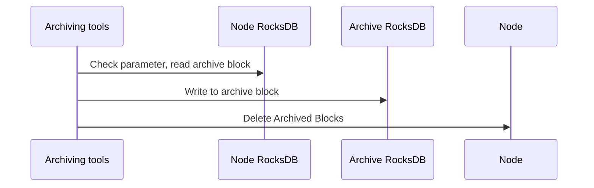

# 11. Data Archiving Design

Tags: "data archiving" "data clipping"

----

## Background Introduction

Blockchain node data will continue to increase over time, and some of these historical blocks and transactions are accessed very infrequently, or even will not be accessed, through data archiving can archive this cold data to cheaper storage devices。The requirements are as follows:

1. Can specify the scope of the archive block
2. Archiving operation does not affect the normal consensus of nodes
3. Archived data can be queried
4. Archived data can be recovered

## Scheme Design

Archive data can be archived to RocksDB and TiKV. Data archived to RocksDB can be copied

### Archive Data Range

Statistics show that the data in a 100w block high FISCO-BCOS 3.0 node accounts for 46.5G (42.7%) of transaction data, 16.5G (15.2%) of receipt data, and 40.3G (37.1%) of status data. In addition, the largest 's _ number _ 2 _ txs' block transaction hash list is only 4.9G (4.9%) of the data that does not affect the basic data, so the archiving。The archive node just cannot obtain the transaction and receipt of the archive block, and other functions are normal。

```bash
s_tables                       size is 661.029MB
s_consensus                    size is 794B
s_config                       size is 210B
s_current_state                size is 137B
s_hash_2_number                size is 53.1716MB
s_number_2_hash                size is 53.1716MB
s_block_number_2_nonces        size is 33.4512MB
s_number_2_txs                 size is 4.94278GB
s_number_2_header              size is 671.36MB
s_hash_2_tx                    size is 46.5201GB
s_hash_2_receipt               size is 16.5311GB
/apps                          size is 40.3474GB
```

The data archiving process is as follows:



### Archive Data Query

Provide query tools, read the archived database, support for reading transactions and receipts based on transaction hashes。

### Archive data re-import

Provide tools to read the archived database and re-import the archived data into the node database。
