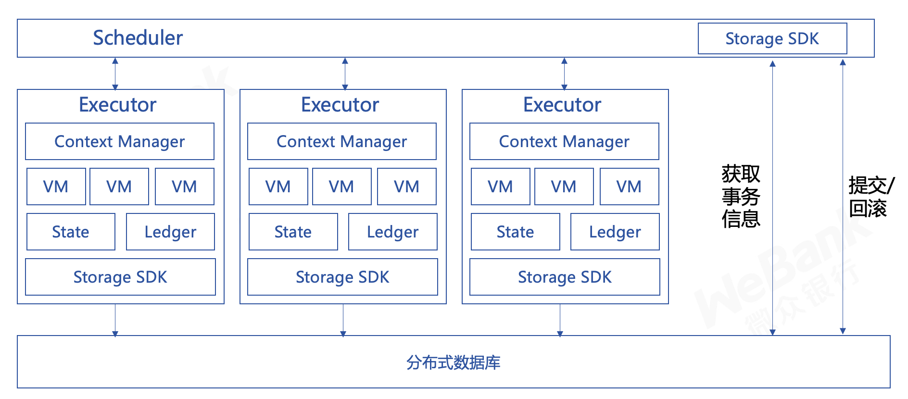
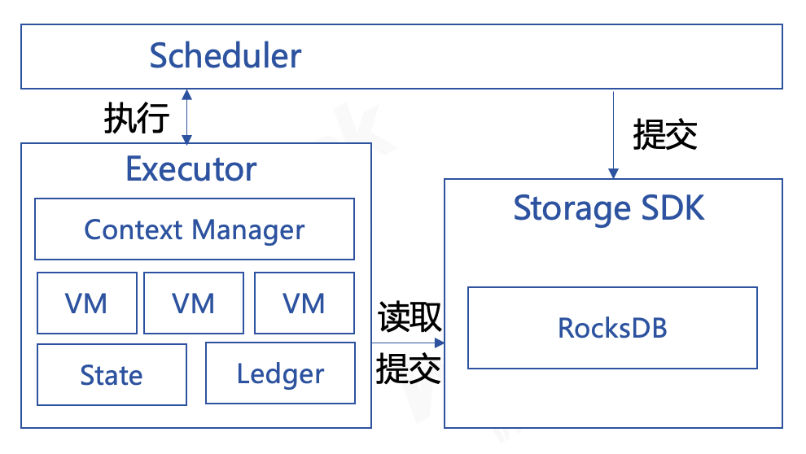

# 6. Storage Design

Tags: "storage" "storage" "transaction"

----------

## 设计

The storage layer needs to be able to meet the different design goals of the three versions of Air, Pro and Max, so we use the same set of interfaces to mask the specific implementation of different versions of storage.。For the Air and Pro versions, the storage layer uses RocksDB to meet its lightweight and high-performance requirements, and for the Max version to support large-scale data storage requirements by accessing a distributed database that can support horizontal expansion, we chose Tikv to ensure multi-copy data consistency and high availability through the Raft protocol.。The overall storage service design is shown in the following figure。



The difference between the Air, Pro and Max versions is that the specific implementation of the 'Storage SDK' used is different. For the Air and Pro versions, the implementation based on RocksDB encapsulation will be created during initialization, while for the Max version, the TiKV encapsulation-based implementation is provided, while retaining the ability to customize storage, users can access other databases based on specific business needs.。

## Max version data commit

In the Max version of FISCO BCOS 3.x, the computing layer consists of multiple execution services. When executing a block, each execution service receives the smart contract execution task assigned by the scheduling layer and returns the execution result to the scheduling layer. The data changes generated during the execution are stored in the memory of each execution service.。

```eval_rst
.. mermaid::

    flowchart TD
        c(Consensus / Synchronization)-->|1-Request Execution Block|s(Scheduling Services)
        s-->|2-Execute transaction|e1(Execution Services)
        s-->|2-Execute transaction|e2(Execution Services)
        e1-->|3-Return Results|s
        e2-->|3-Return Results|s
        s-->|4-Get Status hash|e1
        s-->|4-Get Status hash|e2
        s-->|5-Generate header and receipt|s
        s-->|6-Returns the block execution result|c

```

Contract data is scattered in different execution services, while block headers, block signature lists, receipts and other data are in the scheduling service, and the commit of a block needs to be transactional, which is a typical distributed transaction problem, for which we introduce two-stage transactions to solve, [interface as follows](https://github.com/FISCO-BCOS/bcos-framework/blob/main/interfaces/storage/StorageInterface.h#L104-L128)：

```cpp
class TransactionalStorageInterface : public virtual StorageInterface
{
    virtual void asyncPrepare(const TwoPCParams& params, const TraverseStorageInterface& storage,
        std::function<void(Error::Ptr, uint64_t)> callback) = 0;

    virtual void asyncCommit(
        const TwoPCParams& params, std::function<void(Error::Ptr)> callback) = 0;

    virtual void asyncRollback(
        const TwoPCParams& params, std::function<void(Error::Ptr)> callback) = 0;
};
```

During the commit process, the scheduling service acts as the coordinator of the two-phase transaction, with each execution service acting as a participant to complete the commit of the block together.。

1. Preparation phase:
    When a block begins to be committed, the dispatch service calls the 'asyncPrepare' method of the storage (Storage) object it holds to commit the block, receipt, index, and other data to the storage service.。After 'asyncPrepare' returns the result, the dispatch service notifies all execution services to call the 'asyncPrepare' method of the storage object it holds based on the returned transaction information, committing the state changes held by each execution service to the storage service。
1. Submission phase:
    When the dispatch service collects the successful return of all execution service calls' asyncPrepare ', the dispatch service itself calls the' asyncCommit 'method of the storage object it holds, submits the data to the backend database, and notifies all execution services to call the' asyncCommit 'method.。If an execution service call 'asyncPrepare' fails or times out, the dispatch service itself calls the 'asyncRollback' method of the storage object it holds and notifies all execution services to call the 'asyncRollback' method to roll back the data.。

```eval_rst
.. mermaid::

    flowchart TD
        d(Scheduling Services)-->|1-asyncPrepare|s(Storage Services)
        s-->|2-Returns transaction information|d
        d-->|3-asyncPrepare|e1(Execution Services)
        d-->|3-asyncPrepare|e2(Execution Services)
        e1-->|4-asyncPrepare|s
        e2-->|4-asyncPrepare|s
        e1-->|5-Return Results|d
        e2-->|5-Return Results|d
        d-->|6-asyncCommit/asyncRollback|s

```

## Ari and Pro version data submission

The difference between Air and Pro versions of commit and Max is that on the one hand, the storage service uses RocksDB as the back-end database, on the other hand, the execution service and the scheduling service are in the same process, there is no distributed transaction problem, compared to the Max version of its commit logic is simpler, as shown in the following figure。



The processing logic of the scheduling service and the execution service is the same as that of the Max version, except that in the commit phase, when the scheduling service and the execution service commit data, they hold the same storage object.。


## system storage table

This section describes the storage structure and purpose of the data table stored in the creation block on the basis of pre-written storage.。

| Table Name| Field| Use|
| ----------------------- | ---------------------------------------------- | ---------------------------------------------- |
| s_tables                | value                                          | Record the table structure of the created table|
| s_config                | value, enable_number                           | Record system configuration|
| s_consensus             | value                                          | Record the list of consensus nodes and observation nodes|
| s_current_state         | value                                          | Record current block height, total number of transactions, total number of failed transactions|
| s_hash_2_number         | value                                          | Record block hash to block height mapping|
| s_number_2_hash         | value                                          | Record block height to block hash mapping|
| s_block_number_2_nonces | value                                          | mapping of block height to nonce|
| s_number_2_header       | value                                          | Record the mapping of block height to block header|
| s_number_2_txs          | value                                          | Mapping of Record Block Height to Transaction Hash List|
| s_hash_2_tx             | value                                          | Mapping transaction hashes to transaction objects|
| s_hash_2_receipt        | value                                          | Mapping transaction hashes to transaction receipt objects|
| s_code_binary           | value                                          | Record code hash to code mapping|
| s_contract_abi          | value                                          | Mapping of record code hash to ABI|
| /                       | type,status,acl_type,acl_white,acl_black,extra | BFS Root|
| /apps                   | type,status,acl_type,acl_white,acl_black,extra | Apps directory, where the user's applications are located|
| /tables                 | type,status,acl_type,acl_white,acl_black,extra | Tables directory. Tables created by users through CRUD are in this directory|
| /usr                    | type,status,acl_type,acl_white,acl_black,extra | usr directory, the account addresses that have been set to the status are in this directory|
| /sys                    | type,status,acl_type,acl_white,acl_black,extra | sys directory, system contract table|

