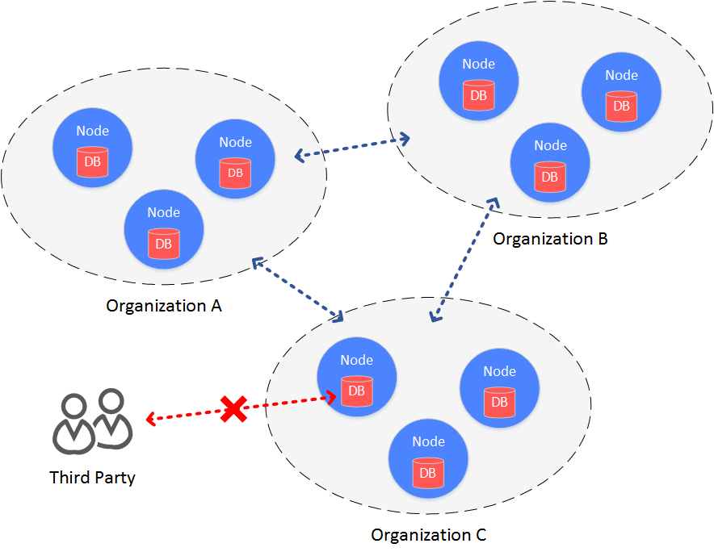

# 10. Data drop encryption

Tags: "Drop Disk Encryption" "Data Encryption" "Data Security" "

----
## Background Introduction

In the architecture of the alliance chain, a blockchain is built between institutions, and data is visible within each institution of the alliance chain。

In some scenarios with high data security requirements, members within the alliance do not want organizations outside the alliance to have access to data on the alliance chain。At this point, you need to access the data on the federation chain。

Access control of federated chain data, which is mainly divided into two aspects

* Access control of communication data on the chain
* Access Control of Node Storage Data

For access control of on-chain communication data, FISCO BCOS is done through node certificates and SSL。The main focus here is on access control for node storage data, i.e., on-disk encryption。



## main idea

Falling disk encryption is performed inside the institution。In the organization's intranet environment, each organization independently encrypts the hard drive data of the node。When the hard disk of the machine where the node is located is taken away from the organization and the node is started on a network outside the organization's intranet, the hard disk data cannot be decrypted and the node cannot be started。And then can't steal the data on the alliance chain。

## Programme architecture


Drop-disk encryption is performed within the organization, and each organization independently manages the security of its own hard drive data。In the intranet, the hard drive data of each node is encrypted。Access to all encrypted data, managed through Key Manager。Key Manager is a service deployed in an organization's intranet to manage node hard disk data access keys。When a node in the intranet is started, it obtains the access key for the encrypted data from the Key Manager to access its own encrypted data。

Cryptographically protected objects include:

* Database stored locally on the node: rocksdb
* Node private key: ssl.key & node.pem (non-state secret), sm _ ssl.key & sm _ enssl.key & node.pem (state secret)

## concrete realization

The specific implementation process is accomplished through the dataKey held by the node itself and the global superKey managed by the Key Manager。

**Node**

* The node uses its own dataKey to encrypt and decrypt the data (Encrypted Space) it manages。
* The node itself does not store the dataKey on the local disk, but stores the encrypted cipherDataKey of the dataKey。
* When the node is started, request the cipherDataKey from the Key Manager to obtain the dataKey。
* The dataKey is only in the node's memory. When the node is closed, the dataKey is automatically discarded。

**Key Manager**

Holds the global superKey, which is responsible for responding to authorization requests when all nodes are started, authorizing。

- Key Manager must be online in real time to respond to node startup requests。
- When the node is started, the cipherDataKey is sent. The key manager decrypts the cipherDataKey with the superKey. If the decryption is successful, the node's dataK is returned to the node。
- The key manager can only be accessed from the intranet. The key manager cannot be accessed from the intranet within the organization


## Program Process

The scheme process is divided into node initial configuration and node safe operation。

### node initial configuration

Before starting a node, you must configure a dataKey for the node

```eval_rst
.. important::
    After the node is generated and before starting, you must decide whether to use disk encryption. Once the node is configured successfully and started normally, it will not be able to switch states。
```

(1) The administrator defines the dataKey of the node, sends the dataKey to the Key Manager, and obtains the cipherDataKey from the Key Manager。

(2) Configure cipherDataKey to the configuration file of the node

(3) Start node

### node security operation

When the node is started, the key manager is used to obtain the dataKey for local data access。

(1) The node starts, reads cipherDataKey from the configuration file, and sends it to the Key Manager。

(2) The key manager receives the cipherDataKey and decrypts the cipherDataKey with the superKey. If the decryption is successful, the decrypted dataKey is returned to the node。

(3) The node gets the dataKey and uses the dataKey to interact with the local data (Encrypted Space)。Decrypt the data read from Encrypted Space with the dataKey to obtain the real data。The data to be written to the Encrypted Space is encrypted with the dataKey and then written to the。

### Why you can protect data？

When the hard disk of a node is accidentally taken outside the intranet environment, the data is not leaked。

(1) When the node is started outside the intranet, the Key Manager cannot be connected. Although there is a cipherDataKey, the dataKey cannot be obtained。

(2) Do not start the node, directly operate on the local data of the node, because the dataKey cannot be obtained, the Encrypted Space cannot be decrypted, and the sensitive data cannot be obtained。

Specific use of disk encryption, can refer to:

- [Deploy Air Edition Drop Disk Encryption](../../tutorial/air/storage_security.md)

## Storage Security

The Air and Pro versions of the storage system use the back-end database RocksDB, which is a high-performance Key-Value database。Design a perfect persistence mechanism, while ensuring performance and security, can be a good support range query。TiKV database for Max version。Both have high reliability and can cope with abnormal scenarios such as node power outages, restarts, and network fluctuations. After abnormal scenarios are restored, data can be read and written normally。
