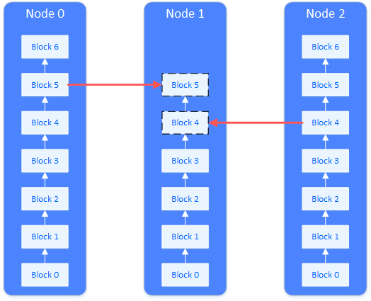
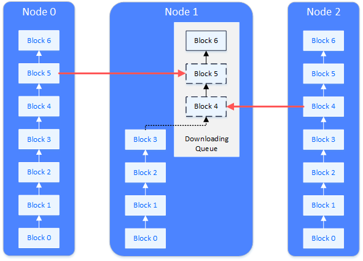

# 5. Synchronization module

Tags: "Block Synchronization" "Transaction Synchronization"

----

Synchronization is a very important function of blockchain nodes。It is an adjunct to consensus and provides the necessary operating conditions for consensus。Synchronization is divided into transaction synchronization and state synchronization。Synchronization of transactions ensures that each transaction arrives correctly at each node。The synchronization of the state ensures that the nodes behind the block can return to the latest state correctly。Only nodes that hold the latest block state can participate in the consensus。

## Transaction Broadcast

Transaction synchronization is to allow transactions on the blockchain to reach all nodes as much as possible。Provides the basis for consensus to package transactions into blocks。

A transaction (tx1) is sent from the client to a node. After receiving the transaction, the node puts the transaction into its own transaction pool (TxPool) for consensus packaging。At the same time, the node broadcasts the transaction to other nodes, which receive the transaction and place it in their own transaction pool。

* For transactions coming from SDK, broadcast to all nodes
* For transactions broadcast from other nodes, put them directly into the trading pool
* A transaction is broadcast only once on a node, and when a duplicate transaction is received, it is not broadcast twice

There is a very small probability that a transaction will not reach a node, which is allowed。The purpose of reaching as many nodes as possible is to allow this transaction to be packaged, agreed upon, and confirmed as soon as possible, and to try to get the results of the transaction to be executed faster。When a transaction does not reach a certain node, it will only make the execution time of the transaction longer and will not affect the correctness of the transaction。In the consensus process, the list of block transactions packaged by the leader is verified, and if there is a lack of transactions locally, the missing transactions are actively requested from the leader。

## State Synchronization

State synchronization is to keep the state of blockchain nodes up to date。The new and old state of the blockchain refers to the old and new data currently held by the blockchain node, that is, the height of the current block held by the node。If the block height of a node is the highest block height of the blockchain, the node has the latest status of the blockchain。Only nodes with the latest state can participate in the consensus for the next new block。

When a new node is added to the blockchain, or a node that has been disconnected restores the network, the block of this node lags behind the other nodes and the state is not up-to-date。At this time, state synchronization is required。As shown in the figure, the node that needs status synchronization (Node 1) will actively request other nodes to download blocks。The entire download process spreads the download load across multiple nodes。

**State synchronization and download queue**

When a blockchain node is running, it regularly broadcasts its highest block height to other nodes。After receiving the block height broadcast from other nodes, the node will compare it with its own block height. If its own block height lags behind this block height, it will start the block download process。

The download of the block is done by request。The node that enters the download process will randomly select the node that meets the requirements and send the block interval to be downloaded。The node that receives the download request will reply to the corresponding block based on the content of the request。

The node that receives the reply block maintains a download queue locally to buffer and sort the downloaded blocks。The download queue is a priority queue in order of block height。Downloaded blocks are continuously inserted into the download queue. When the blocks in the queue can be connected to the current local blockchain of the node, the blocks are removed from the download queue and actually connected to the current local blockchain。

## Synchronization Scene Example

### Transaction Broadcast Scene

The process by which a transaction is broadcast to all nodes:

* A transaction is sent to a node via RPC
* The node receiving the transaction broadcasts the transaction to other nodes in full
* The node receives the broadcast transaction and will not broadcast it again

### Lack of transaction synchronization scenario during consensus validation

In the process of consensus missing trading scenarios:

* After receiving the proposal, the node found that there were missing transactions in the proposal list
* Will actively request the missing transaction from the proposal-initiated node (unicast)
* The packaging node returns the missing transaction after receiving the request (unicast)

### The transaction pool is empty and requests other node transactions

When a node's transaction pool is empty, a scenario in which a node actively requests a transaction is triggered

* Proactively broadcast message packets of onEmptyTxs to all nodes (broadcast)
* After receiving the message packet, other nodes will actively return the transaction to the requesting node (unicast)

### State Synchronization

Broadcast logic when a node is out of a block

* A node out of the block
* This node broadcasts its latest status (latest block high, highest block hash, genesis block hash) to all nodes
* After other nodes receive the peer status, update the peer data managed locally

**Synchronization of group members**

A member of the group was unexpectedly closed at some point, but other members were out of the block, and when this member was started again, it was found that the block was behind the other members:

* Team members start again
* Status packets received from other team members
* Compare to find that your highest block is behind other team members and start the download process
* Divide the different blocks into multiple download request packages according to the interval, send them to multiple team members, load balancing
* Waiting for other nodes to reply to block packets
* Other nodes accept the response, query the block from their own blockchain, and reply to the starting node
* The node receives the block and places it in the download queue
* The node takes the block out of the download queue and writes it to the blockchain
* If the download is not completed, continue the request. If the download is completed, switch the status, enable transaction synchronization, and enable consensus

**Synchronization of new team members**

A non-group member joins a group as a new group member, and this node is started for the first time to synchronize blocks from the original group member:

* Non-members are not registered to the group, but non-members start first
* At this time, I find that I am not in the group. I do not broadcast the status or the transaction. I just wait for other group members to send status messages
* At this time, the new team member does not exist in the team member, and the status will not be broadcast to the new team member
* Administrators add new members to a group
* Members broadcast their status to new members
* The new team member receives the team member status, compares its own block height (0), and starts the download process
* The subsequent download process is the same as the group member block synchronization process
