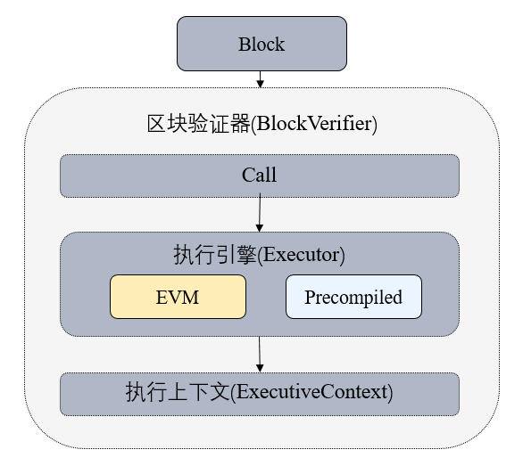

## C++ Engine

Tags: "Precompiled Contracts" "Smart Contracts" "Precompiled"

----

Precompiled contracts provide a way to use C.++The method of writing contracts, which separates contract logic from data, has better performance than solidity contracts, and can be upgraded by modifying the underlying code.。

### Precompiled Contracts vs. Solidity Contracts

| Table Name| Precompiled Contracts| Solidity Contract|
|:---------|:-------------------------------------------|:----------------------------|
| Address| Fixed address, defined in code| Determine when deploying|
| Contract Code| Data is stored in tables, separated from contracts, and contract logic can be upgraded| Contract variables and data are stored in the MPT tree|
| Execute| C++Low-level execution for higher performance and parallelism| EVM virtual machine, serial execution|

### Module Architecture

The architecture of Precompiled is shown in the following figure:
- The block validator determines the type based on the address of the called contract when executing the transaction.。Address 1-4 indicates the Ethereum precompiled contract, address 0x1000-0x10000 is C++Precompiled contracts, other addresses are EVM contracts。



### Key Processes
- When executing a precompiled contract, you first need to get the object of the precompiled contract based on the contract address.。
- Each precompiled contract object implements the 'call' interface, where the specific logic of the precompiled contract is implemented。
- 'call 'obtains the' Function Selector 'and parameters according to the abi code of the transaction, and then executes the corresponding logic。

```mermaid
    graph LR
        Start(Commencement) --> branch1{Precompiled Contracts}
        branch1 --> |Yes|op1 [Get contract object by address]
        branch1 --> |否|op2[EVM]
        op1 --> op3 [parse calling function and parameters]
        op3 --> End(Return execution result)
        op2 --> End(Return execution result)
```

### Interface Definition

Each precompiled contract must implement its own 'call' interface, which accepts two parameters, namely 'TransactionExecutive::Ptr'Execution Context, 'PrecompiledExecResult::Ptr 'execution parameters, which include execution input, external account address, gas usage。['Precompiled' source code](https://github.com/FISCO-BCOS/FISCO-BCOS/blob/76da8909d5/bcos-executor/src/vm/Precompiled.h)。

| Interface Name| Parameter Description| Interface Description|
|:--------------------------------------------------------------------------------------------------------------------------|:--------------------------------------------------------------------------------------|:------------------------------------------------------------------|
| `PrecompiledExecResult::Ptr call(executor::TransactionExecutive::Ptr context,PrecompiledExecResult::Ptr param) override;` | 'context 'is the block execution context, and' param 'is the execution parameters, including the execution input, external account address, and gas usage| Implementation of specific contract interfaces|
| `uint32_t getFuncSelector(std::string const& functionName)`                                                               | 'functionName 'is the function name| Calculate 'Function Select' based on function name|
| `bytesConstRef getParamData(bytesConstRef param)`                                                                         | 'param 'is an abi-encoded parameter| Obtain the abi encoding of the specific parameters of the calling function|
| `uint32_t getParamFunc(bytesConstRef param)`                                                                              | 'param 'is an abi-encoded parameter| Get the 'Function Select' of the called function (the first four bytes of sha3 of the function name)|
