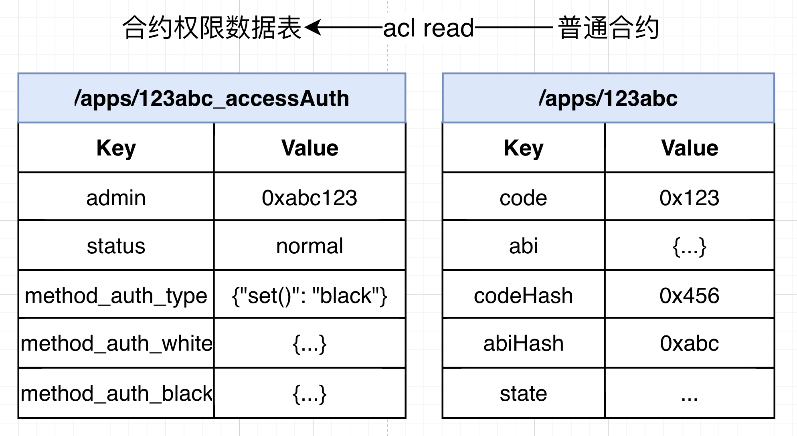

# 4. Contract Life Cycle and Permission Management

Tags: "Contract Management" "Contract Lifecycle" "Deployment Contract" "Call Contract" "Freeze Contract" "Revoke Contract"

----

This document describes the entire life cycle of a contract from development, deployment, invocation, upgrade, freezing, to retirement, as well as the roles and management methods involved in the entire smart contract life cycle。

```eval_rst
.. important::
   For contract lifecycle management, freeze, unfreeze, and revoke operations, and contract deployment call permission control, you need to enable the blockchain permission mode. For more information, see '[Permission Governance User Guide]<https://fisco-bcos-doc.readthedocs.io/zh_CN/latest/docs/develop/committee_usage.html>`_
```

## 1. Smart Contract Development

FISCO BCOS platform supports three smart contract usage forms: Solidity, Liquid, and Precompiled。

- Solidity contract is the same as Ethereum, implemented with Solidity syntax, in FISCO BCOS 3.0+Version 0.4.25 - 0.8.11 Solidity contract supported。
-Liquid is an embedded Domain Specific Language (eDSL) developed by the Microbank blockchain team and fully open source, which can be used to write smart contracts running on the underlying blockchain platform FISCO BCOS。
- Precompiled contracts using C++Development, built into the FISCO BCOS platform, has better performance than the Solidity contract, and its contract interface needs to be predetermined at compile time, suitable for scenarios where logic is fixed but consensus is required。

**Extended reading**

[WeBASE Contract IDE](https://webasedoc.readthedocs.io/zh_CN/latest/)

[Official Solidity Documentation](https://solidity.readthedocs.io/en/latest/)

[Remix Online IDE](https://remix.ethereum.org/)

[Liquid Official Documentation](https://liquid-doc.readthedocs.io/zh_CN/latest/)

[Precompiled Contract Usage Documentation](../contract_develop/c++_contract/index.md)

## 2. Smart contract deployment and invocation

After the user completes the development of the smart contract, the smart contract is deployed on the chain and the call transaction is initiated。Users can use [SDK](./sdk/index.md)Package the compiled contract into a transaction and send it to the FISCO BCOS blockchain node on the chain。The community has provided highly packaged tools that users can use quickly out of the box:

- Use Console: [Console](../operation_and_maintenance/console/index.md)The console wraps the Java SDK, provides command line interaction, and provides developers with node query and management tools。
- Use the Java Contract Generation Tool: [Java Contract Generation Tool](../operation_and_maintenance/console/console_config.html#java)Supports automatic compilation of Solidity and generation of Java files, WASM files compiled by specifying wbc-liquid, and ABI files to generate Java files。

**Extended reading**

[Developing the first Solidity blockchain application](../quick_start/solidity_application.md)

[Developing the First Liquid Blockchain Application](../quick_start/wbc_liquid_application.md)

[Gradle SpringBoot application example](../sdk/java_sdk/spring_boot_starter.md)

[Maven SpringBoot application example](../sdk/java_sdk/spring_boot_crud.md)

## 3. Smart contract data storage

After the smart contract is deployed, the underlying storage structure will create a data table to store the opcode, ABI JSON string, and state status data corresponding to the contract。Among them:

-opcode is a code snippet that can only be generated after compilation, which is loaded into the virtual machine for execution on each call；
-ABI JSON string is an interface file stored for the convenience of external SDK calls, which records the parameter return format of each interface of the smart contract and the parallel conflict field of each interface；
-state state data stores data that needs to be stored persistently at runtime for smart contracts, such as contract member variables。

Create a table named "Directory+Contract address. "Take the address 0x1234567890123456789012345678901234567890 as an example. The stored table name is" / apps / 1234567890123456789012345678901234567890, "where" / apps / "is the fixed prefix of BFS. For details, please refer to [BFS Design Document](../design/contract_directory.md)。

| Key   | Value          |
|-------|----------------|
| abi   | ABI JSON String|
| code  | hexadecimal opcode|
| state | ...            |

## 4. Smart Contract Upgrade

As you can see from Section 3 of this article, each smart contract deployment has a separate address on the chain, which corresponds to a separate storage table in storage。Therefore, smart contract upgrades should also be divided into retained data upgrades and non-retained data upgrades。

- The situation of retaining the old contract data to upgrade is more complicated. The specific solutions are as follows:
  - (Recommended) Users need to actively divide the contract into**logical contract** 和**Data contracts**The data contract is used to store the data that needs to be stored on the chain. The open data read / write interface is used by the logical contract. The logical contract calls the read / write interface of the data contract during calculation。When you need to upgrade, you only need to upgrade the logical contract. The new logical contract calls the old data contract interface, and the old logical contract is no longer used。
  - (Recommended) Equivalent to the extension of the first solution, the data that needs to be stored is stored using the CRUD data interface, and the CRUD data is stored on the chain through node consensus and persistence。For details, please refer to [Developing Applications Using CRUD Precompiled Contracts](../contract_develop/c++_contract/use_crud_precompiled.md), [Develop applications using KV storage precompiled contracts](../contract_develop/c++_contract/use_kv_precompiled.md)
  -By using the delegate call's proxy contract to actively invoke the logical contract, the generated state data is saved in the proxy contract, and the logical contract can be upgraded while keeping the interface unchanged。
-The situation of upgrading without retaining data is simpler. Users will redeploy the upgraded contract and there will be new addresses。The contract based on the new address can be operated by the application, and the data of the new contract will also be used, and the data recorded by the old contract will exist on the chain, so the application needs to actively avoid the new business logic calling the old contract data。

## 5. Smart contract permission management operations

```eval_rst
.. important::
   For information about contract lifecycle management, freeze, unfreeze, and revoke operations, and contract deployment call permission control, you must enable the blockchain permission mode<https://fisco-bcos-doc.readthedocs.io/zh_CN/latest/docs/develop/committee_usage.html>`_
```

After the blockchain permission mode is enabled, each contract deployment creates a contract permission data table in addition to the contract storage data table in the storage layer, which is used to record the contract administrator address, contract status, and contract interface ACL。By default, the administrator address of the contract is the address of the account that initiated the deployment contract operation (if there is a contract creation contract, the contract administrator address is the transaction initiation account tx.origin)。



The contract administrator can operate the contract through the AuthManagerPrecompiled interface. The fixed address is 0x1005。

```solidity
enum Status{
    normal,
    freeze,
    abolish
}
abstract contract AuthManagerPrecompiled {
    / / The contract administrator reads and writes, and resetAdmin only allows the governance committee contract to call
    function getAdmin(address path) public view virtual returns (address);
    function resetAdmin(address path, address admin) public virtual returns (int256);
    / / Read and write permissions of the contract interface
    function setMethodAuthType(address path, bytes4 func, uint8 authType) public virtual returns (int256);
    function openMethodAuth(address path, bytes4 func, address account) public virtual returns (int256);
    function closeMethodAuth(address path, bytes4 func, address account) public virtual returns (int256);
    function checkMethodAuth(address path, bytes4 func, address account) public view virtual returns (bool);
    function getMethodAuth(address path, bytes4 func) public view virtual returns (uint8,string[] memory,string[] memory);
    / / Read and write contract status
    function setContractStatus(address _address, Status _status) public virtual returns(int);
    function contractAvailable(address _address) public view virtual returns (bool);
    
    / / Read and write the deployment contract. The write interface only allows the governance committee to call the contract
    function deployType() public view virtual returns (uint256);
    function setDeployAuthType(uint8 _type) public virtual returns (int256);
    function openDeployAuth(address account) public virtual returns (int256);
    function closeDeployAuth(address account) public virtual returns (int256);
    function hasDeployAuth(address account) public view virtual returns (bool);
}
```

### 5.1 Freezing, unfreezing and abolishing smart contracts

The contract administrator can initiate a transaction on a precompiled contract with a fixed address of 0x1005 and read and write the status of the contract。

When the write operation of the contract status is performed, it will be determined whether the transaction originator msg.sender is the contract administrator of the contract permission table record, and if not, it will be rejected。

```eval_rst
.. important::
   Compatibility Note: Contract lifecycle management revocation can only be performed above node version 3.2。
```

The contract administrator can also freeze contracts through the console. For more information, see [Freeze Contract Command](../operation_and_maintenance/console/console_commands.html#freezecontract)[Order to Unfreeze Contracts](../operation_and_maintenance/console/console_commands.html#unfreezecontract)

### 5.2 Smart Contract Deployment Permission Control

Authority control for deployment contracts will be centrally controlled by a governance committee, which will control deployment authority by vote。After the governance committee's proposal for a deployment permission is approved, the deployment permission write interface of the fixed address 0x1005 precompiled contract will be actively called, and these write interfaces are also limited to the governance committee contract call。

The deployment permissions are recorded in the BFS directory / apps, which represents the write permissions allowed in the / apps directory。

The governance committee can perform operations such as permission control of deployment contracts through the console. For more information, see [Proposal for Setting Deployment Permission Types](../operation_and_maintenance/console/console_commands.html#setdeployauthtypeproposal) , [Open Deployment Permission Proposal](../operation_and_maintenance/console/console_commands.html#opendeployauthproposal) , [Close Deployment Permissions Proposal](../operation_and_maintenance/console/console_commands.html#closedeployauthproposal)

When checking the deployment permissions, the transaction initiation address tx.origin is verified. If you do not have the permissions, the error code -5000 is returned。That is, the user deployment contract and the user deployment contract are verified。

### 5.3 Smart Contract Call Permission Control

The contract administrator can initiate a transaction on a precompiled contract with a fixed address of 0x1005 and read and write the access ACL of the contract interface。

When the write operation of the access ACL of the contract interface is performed, it will be determined whether the transaction originator msg.sender is the contract administrator of the contract permission table record, and if not, it will be rejected。

The contract administrator can access the write operation of the ACL through the console. For more information, see [Contract administrator command](../operation_and_maintenance/console/console_commands.html#setmethodauth)

When checking the contract invocation permission, the transaction initiation address tx.origin and the message sender msg.sender will be verified. If there is no permission, the error code -5000 will be returned。That is, the user invokes the contract, the user invokes the contract through the contract, and the contract invokes the contract。
