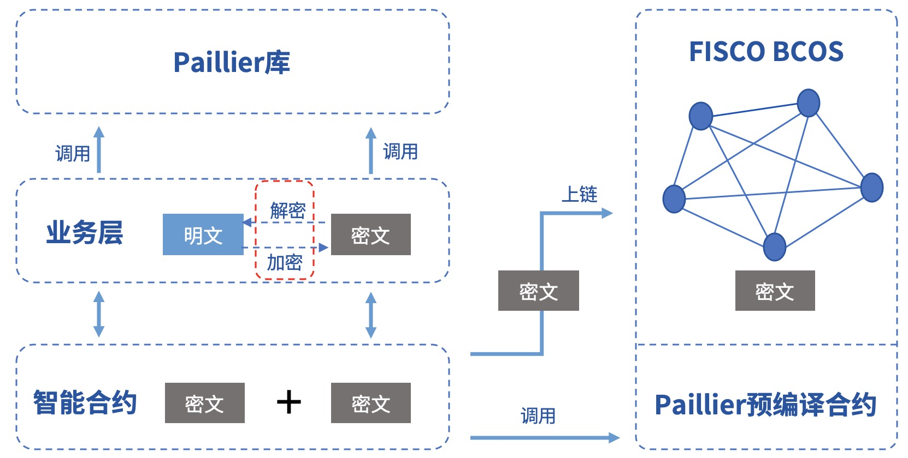
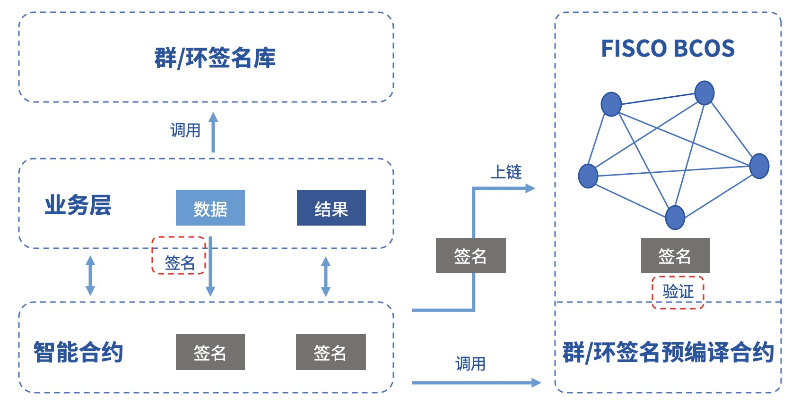
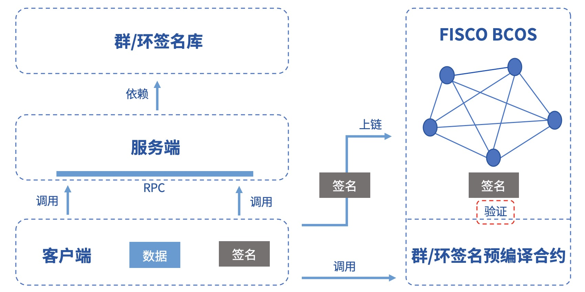

# 8. Use homomorphic encryption with group ring signatures.

Tags: "Privacy Contract" "Privacy Protection" "Contract Development" "" Homomorphic Encryption "" "Ring Signature" "Group Signature" "

----
Privacy protection is a major technical challenge for the alliance chain。In order to protect on-chain data, protect the privacy of alliance members, and ensure the effectiveness of supervision, FISCO BCOS integrates homomorphic encryption and group / ring signature verification functions in the form of pre-compiled contracts, providing a variety of privacy protection methods.。

Sections I and II of the document provide a brief introduction to the homomorphic encryption and group / ring signature algorithms and related application scenarios, respectively, and sections III and IV detail the FISCO BCOS privacy protection module enablement method and call method。


```eval_rst
.. note::
    1. FISCO BCOS 2.3.0+ Support for homomorphic encryption, group signature and ring signature
    2. FISCO BCOS 2.3.0, 2.4.0 and 2.4.1, need to manually compile the binary to enable the privacy protection module
    3. FISCO BCOS 2.5.0+ Privacy protection module enabled by default
```

## homomorphic encryption

### Introduction to Algorithm

homomorphic encryption(Homomorphic Encryption)It is one of the pearls in the field of public key cryptosystems and has been studied for more than forty years.。Its excellent cryptographic features have attracted cryptographers and received widespread attention in the industry.。

- Homomorphic encryption is essentially a public key encryption algorithm that uses the public key pk for encryption and the private key sk for decryption.；
- Homomorphic encryption supports ciphertext computation, i.e. ciphertext generated by the same public key encryption can compute f( )operation, the resulting new ciphertext is decrypted exactly equal to the two original plaintext calculations f( )The result of；
- The homomorphic encryption formula is described as follows:


FISCO BCOS uses the paillier encryption algorithm and supports additive homomorphism.。Paillier's public and private keys are compatible with mainstream RSA encryption algorithms and have low access barriers.。At the same time, paillier, as a lightweight homomorphic encryption algorithm, has a small computational overhead and is easily accepted by the business system.。So after a trade-off between functionality and usability, the paillier algorithm was finally selected.。


### Functional Components

The FISCO BCOS Homomorphic Encryption Module provides the following functional components:

- paillier homomorphic library [GitHub source code](https://github.com/FISCO-BCOS/paillier-lib)/ [Gitee source code](https://gitee.com/FISCO-BCOS/paillier-lib)including Java libraries and C++homomorphic interface。

- Paillier precompiled contracts for smart contracts to call, providing a ciphertext homomorphic operation interface。

### Usage

For businesses that require privacy protection, if simple ciphertext calculation is involved, you can use this module to implement related functions.。All the data on the chain can be encrypted by calling the paillier library, and the ciphertext data on the chain can be added to the ciphertext by calling the paillier precompiled contract, and after the ciphertext is returned to the business layer, the decryption can be completed by calling the paillier library to obtain the execution result.。The specific process is shown in the following figure:



### Application Scenarios

In the alliance chain, different business scenarios need to be matched with different privacy protection policies.。For businesses with strong privacy, such as reconciliations between financial institutions, it is necessary to encrypt asset data。In FISCO BCOS, users can call the homomorphic encryption library to encrypt data, and call the homomorphic encryption precompiled contract when the consensus node executes the transaction to obtain the result of the ciphertext calculation.。


## Group / Ring Signature

### Introduction to Algorithm

**group signature**

group signature(Group Signature)It is a relatively anonymous digital signature scheme that protects the identity of the signer, where the user can sign the message in place of their group, and the verifier can verify that the signature is valid, but does not know which group member the signature belongs to.。At the same time, users cannot abuse this anonymity because the group administrator can open the signature through the group master's private key, exposing the signature's attribution information.。Features of a group signature include:

- Anonymity: Group members use group parameters to generate signatures, others can only verify the validity of the signature, and know that the signer belongs to the group through the signature, but cannot obtain the signer's identity information.；
- Non-forgeability: only group members can generate valid verifiable group signatures；
- Non-linkability: Given two signatures, it is impossible to tell if they are from the same signer；
- Traceability: In the case of regulatory intervention, group owners can obtain the signer's identity by signing.。

**ring signature**

ring signature(Ring Signature)Is a special group signature scheme, but with complete anonymity, that is, there is no administrator role, all members can actively join the ring, and the signature cannot be opened.。The characteristics of ring signatures include:

- Non-forgery: No other member of the ring can forge a true signer's signature；
- Complete anonymity: no group owner, only ring members, others can only verify the validity of the ring signature, but no one can obtain the signer's identity information。

### Functional Components

The FISCO BCOS group / ring signature module provides the following functional components:

- Group / Ring [Signature Library](https://github.com/FISCO-BCOS/group-signature-lib), provides a complete group / ring signature algorithm c++Interface

- Group / ring signature pre-compiled contract for smart contract invocation, providing group / ring signature verification interface。

### Usage

Businesses with signer identity concealment requirements can use this module to achieve related functions.。The signer signs the data by calling the group / ring signature library, then links the signature, the business contract completes the signature verification by calling the group / ring signature precompiled contract, and returns the verification result back to the business layer.。If it is a group signature, the supervisor can also open the specified signature data to obtain the signer's identity.。The specific process is shown in the following figure:



### Application Scenarios

Due to its natural anonymity, group / ring signatures have a wide range of applications in scenarios where the identity of participants needs to be concealed, such as anonymous voting, anonymous auctions, anonymous auctions, etc., and can even be used to implement anonymous transfers in the blockchain UTXO model.。At the same time, because the group signature is traceable, it can be used in scenarios that require regulatory intervention, and the regulator acts as the group owner or entrusts the group owner to reveal the identity of the signer.。

### Development Example

FISCO BCOS specifically provides users with examples of group / ring signature development, including:

- Group / ring signature server: Provides complete group / ring signed RPC services。[GitHub source code](https://github.com/FISCO-BCOS/group-signature-server)[Gitee source code](https://gitee.com/FISCO-BCOS/group-signature-server)

- Group / Ring Signing Client: Call the RPC service to sign the data, and provide signature on the chain and on-chain verification and other functions.。[GitHub source code](https://github.com/FISCO-BCOS/group-signature-client/tree/master-2.0)[Gitee source code](https://gitee.com/FISCO-BCOS/group-signature-client/tree/master-2.0)

The sample framework is shown in the following figure. Please refer to [Client Guide Github Link](https://github.com/FISCO-BCOS/group-signature-client/tree/master-2.0)or [Client Guide Gitee Link](https://gitee.com/FISCO-BCOS/group-signature-client/tree/master-2.0)。



## Enable Method

The FISCO BCOS privacy protection module is implemented via a pre-compiled contract and is enabled by default。

### Build a chain of alliances

[Reference Document] for Building Local 4 Nodes(../quick_start/air_installation.md)。

## Precompiled Contract Interface

The code of the privacy module and the pre-compiled contract developed by the user are located in 'FISCO-BCOS/bcos-executor / src / precompiled / extension 'directory, so the calling method of the privacy module and the precompiled contract developed by the user [calling process](https://fisco-bcos-documentation.readthedocs.io/zh_CN/latest/docs/manual/smart_contract.html#id12)Same, but note:

The pre-compiled contract for the privacy module has been assigned an address and does not need to be registered separately。The list of pre-compiled contracts and address assignments implemented by the privacy module are as follows.

Source code can refer to the link: [GitHub link](https://github.com/FISCO-BCOS/FISCO-BCOS/tree/master/bcos-executor/src/precompiled/extension)[Gitee Link](https://gitee.com/FISCO-BCOS/FISCO-BCOS/tree/master/bcos-executor/src/precompiled/extension)

   | Address| Function| Source code|
   | ------ | ---------- | ------------------------------------------------------------ |
   | 0x5004 | group signature| GroupSigPrecompiled.cpp                                      |
   | 0x5005 | ring signature| RingSigPrecompiled.cpp                                       |
