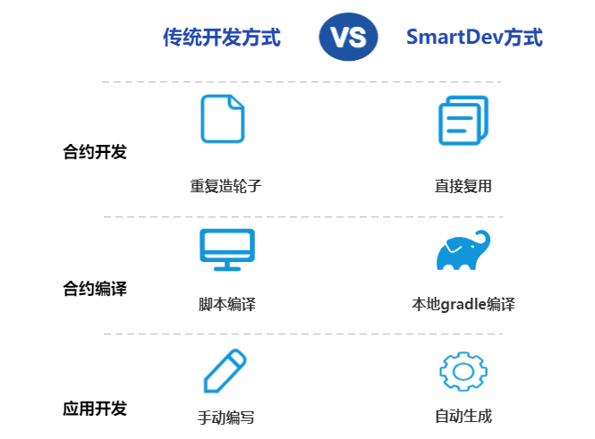
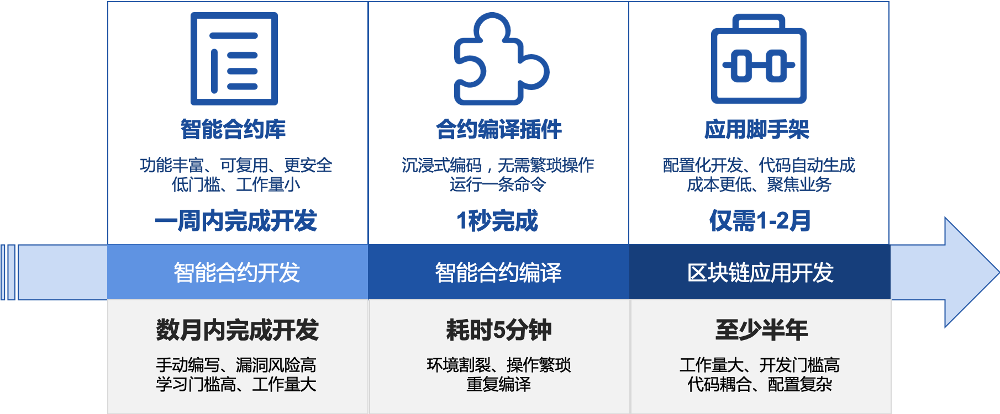
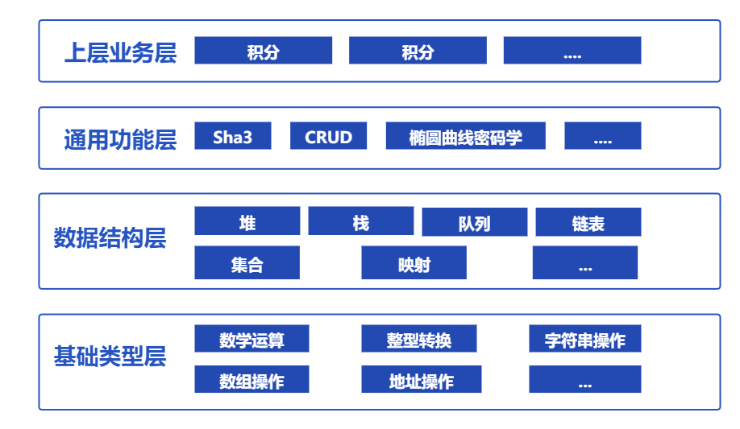
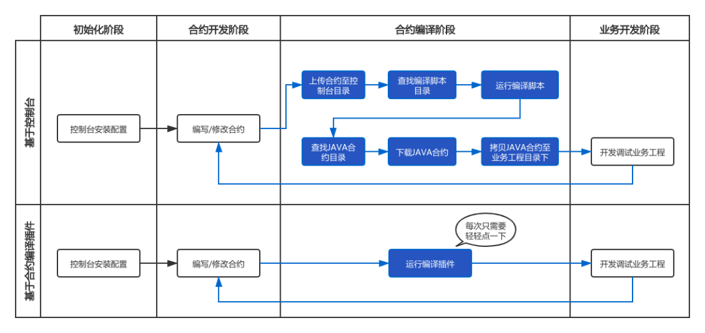
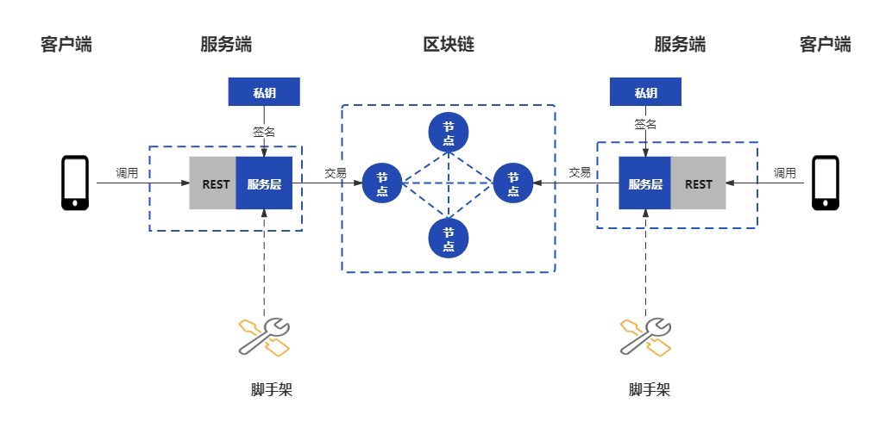
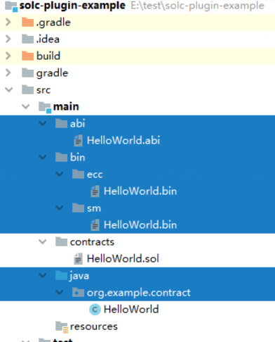
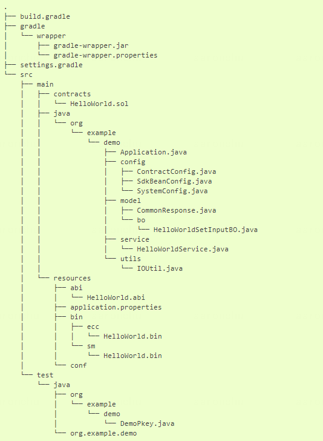

# 6. SmartDev application development components

Tags: "WeBankBlockchain-SmartDev" "Application Development" "Common Components" "Smart Contract Library" "Smart Contract Compilation Plugin" "Application Development Scaffolding" "

----

## Component positioning

After more than ten years of development, blockchain technology has gradually taken root in various industries。But at the same time, from a technical point of view, blockchain application development still has a high threshold, there are many pain points, the user experience in all aspects of application development needs to be improved。

The original intention of WeBankBlockchain-SmartDev application development component is to help developers develop block chain applications efficiently and quickly in an all-round way。SmartDev includes a set of open, lightweight development components, covering smart contract development, debugging, application development and other aspects, developers can freely choose the appropriate development tools according to their own situation, improve development efficiency。

## Design Objectives

In the community, we often hear many questions about the development of blockchain applications:
How to transfer account address and string to each other in solidity code？
Does the existing solidity code support commonly used but relatively complex data structures in high-level languages, such as iterable mapping？
Can you provide a set of reusable and reference smart contract code based on clear application scenarios?？
How Solidity Smart Contracts Compile Quickly to abi and binary Files？
How to quickly compile smart contract code in a blockchain app built with gradle without having to use a compilation script？
How to write a blockchain application after writing a smart contract？
Is it possible to provide a blockchain application code generator that is easy to develop？
How can programming Xiaobai quickly get started with blockchain application development？
...

These issues are both contract development-related and application development-related。Based on such scenarios and combined with its own practical experience, WeBankBlockchain-SmartDev, a blockchain application development component of WeBank, is officially open-sourced. It is expected to start from all aspects of blockchain application development to improve the development efficiency of blockchain applications in multiple dimensions and help developers become "10 times engineers" in blockchain application development。Currently, the entire component is developed based on the solidity language。Recently, the WeBank blockchain has also open-sourced the webankblockchain-liquid (hereinafter referred to as WBC-Liquid) contract language, and we will also adapt the WBC-Liquid language in the future。

The original intention of WeBankBlockchain-SmartDev is to create a low-code component library to help developers develop blockchain applications efficiently and quickly。WeBankBlockchain-SmartDev includes a set of open, lightweight development components, covering contract development, compilation, application development and other aspects, developers can choose the appropriate development tools according to their own situation, improve development efficiency。

From the perspective of contract development, for commonly used functions, there is no need to repeat the wheel, just quote on demand, refer to the code in the "smart contract library," you can introduce the corresponding functions, for the efficiency and safety of contract development escort。For non-basic features, such as business scenarios, we also provide code templates for reuse。

From the perspective of contract compilation, for blockchain applications under development, you no longer need to rely on the console to compile the contract code, just use the contract gradle compilation plug-in to compile in place, and you can immediately get abi, bin and java contracts。These compilations are exported directly to the Java project, eliminating the step of copying and providing a fast, silky experience like developing native Java programs。

From the perspective of application development, from smart contracts to project construction, there is a lot of mechanical and repetitive work, such as creating projects, introducing dependencies, writing configuration code, accessing smart contracts, and writing related entity classes。By contrast, with WeBankBlockchain-SmartDev, developers can choose application development scaffolding。Scaffolding automatically generates project works based on smart contracts。The project already contains the above logic code, developers only need to continue to add business logic code based on the project, focusing on their own business。

## Component Introduction
SmartDev includes a set of open and lightweight development components, covering the development, debugging, and application development of smart contracts, including the SmartDev-Contract, SmartDev-SCGP, and SmartDev-Scaffold。Developers can freely choose the corresponding development tools according to their own situation to improve development efficiency。

### SmartDev - Contract Smart Contract Library
Solidity Smart Contract Code Base。Contains basic types, data structures, common functions, upper-level business and other smart contract libraries。Users can reference and reuse according to actual needs。

Please refer to

- [Github address](https://github.com/WeBankBlockchain/SmartDev-Contract)

- [gitee address](https://gitee.com/WeBankBlockchain/SmartDev-Contract)

- [Document Address](https://smartdev-doc.readthedocs.io/zh_CN/latest/docs/WeBankBlockchain-SmartDev-Contract/index.html)
  
- [Quick Start](https://smartdev-doc.readthedocs.io/zh_CN/latest/docs/WeBankBlockchain-SmartDev-Contract/quick_start.html)

### SmartDev-SCGP (Solidity Compiler Gradle Plugin) Smart Contract Compilation Plugin
The gradle plug-in that compiles the Solidity smart contract code into Java code can compile the smart contract in the project, generate the corresponding Java file, and automatically copy it to the corresponding package directory。 

Please refer to

- [Github address](https://github.com/WeBankBlockchain/SmartDev-SCGP)

- [gitee address](https://gitee.com/WeBankBlockchain/SmartDev-SCGP)

- [Document Address](https://smartdev-doc.readthedocs.io/zh_CN/latest/docs/WeBankBlockchain-SmartDev-SCGP/index.html)
  
- [Quick Start](https://smartdev-doc.readthedocs.io/zh_CN/latest/docs/WeBankBlockchain-SmartDev-SCGP/quick_start.html)

### SmartDev-Scaffold Application Development Scaffold
Based on the configuration of the smart contract file, automatically generate the scaffolding code of the application project, including the smart contract corresponding to the entity class, service class and other content, help users only need to modify and write a small amount of code, you can implement an application, greatly simplifying the development of smart contracts。 

Please refer to

- [Github address](https://github.com/WeBankBlockchain/SmartDev-Scaffold)

- [gitee address](https://gitee.com/WeBankBlockchain/SmartDev-Scaffold)

- [Document Address](https://smartdev-doc.readthedocs.io/zh_CN/latest/docs/WeBankBlockchain-SmartDev-Scaffold/index.html)

- [Quick Start](https://smartdev-doc.readthedocs.io/zh_CN/latest/docs/WeBankBlockchain-SmartDev-Scaffold/quick_start.html)

## Usage Scenarios

### Scenario 1: Smart Contract Development

In the development of smart contracts, from the basic four operations to the upper-level business scenarios, you can use mature, reusable libraries。

Take the four-rule operation as an example, you need to determine whether there is a risk of overflow, at which point you can use the math-related library LibSafeMathForUint256Utils。

Take the data structure as an example, in solidity, the key of the mapping type cannot be iterated, at this time, if you need to use the mapping of the key iteration, you can use the mapping-related library LibBytesMap。

For example, if you want to introduce cryptographic functions such as hashing and signature verification, you can use the Crypto library。

Take the business scenario as an example, if you want to implement the certificate storage function, you can refer to the scenario template Evidence, which incorporates the relevant implementation, which has the effect of throwing bricks and mortar。

### Scenario 2: Contract modification and debugging

In the process of blockchain application development and debugging, it is usually necessary to use abi, bin, java contract, etc. in the project, and debug accordingly based on these contents。If the contract needs to be recompiled for reasons such as adjustments, you don't have to copy the contract into the console to compile it, just run the corresponding gradle directive to generate a new compilation。At the same time, these compilations are directly embedded in the project。As shown in the following figure, after the HelloWorld contract is compiled, the resulting compiled product example:

### Scenario 3: Blockchain application development

If you have written a smart contract, you need to develop a web project that provides a rest interface based on the smart contract。In this case, the user can drag the contract into the scaffold and generate the project with one click。The following figure shows the generated sample project, including the necessary configuration classes, DAO (Data Access Object) related code。Developers only need to make the necessary configuration of the project, and add the corresponding controller and other code, you can easily achieve the above requirements。

