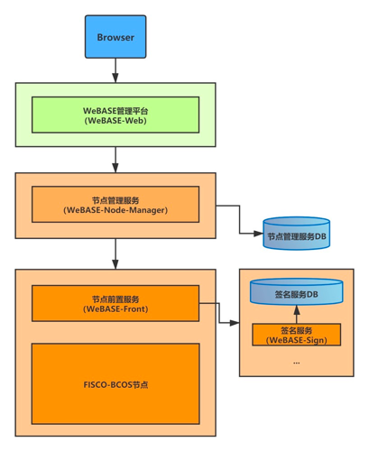

# 15. Blockchain Browser
Tags: "blockchain browser" "graphical"

------

The blockchain browser - WeBASE management platform, which can visualize the data in the blockchain and display it in real time, making it easy for users to obtain the information in the current blockchain in the form of a Web page。Browser version adapted to FISCO BCOS 2.0+and 3.0+The blockchain browser mainly displays the specific information of the data on the chain, which includes: overview information, block information, transaction information, etc。
This document will mainly introduce the functional features of the blockchain browser-WeBASE management platform and its deployment and upgrade methods。

### 1. Functional overview
WeBASE Management Platform Key Features Summary:
- Blockchain Data Overview
- Node Management
- Contract Management
- Private key management
- Application Management
- Systems Management
- System monitoring
- Transaction audit
- Subscribe to events
- Account Management
- Group management
-Mobile Management Desk
- Data monitoring large screen

For detailed description of each function, please refer to [WeBASE Management Platform User Manual](https://webasedoc.readthedocs.io/zh_CN/latest/docs/WeBASE-Console-Suit/index.html)。

### 2. One-click deployment
WeBASE Management Platform Support [One-click Deployment](https://webasedoc.readthedocs.io/zh_CN/lab-dev/docs/WeBASE/install.html), You can quickly build a WeBASE management console environment on the same machine to facilitate users to quickly experience the WeBASE management platform。

One-click deployment will build: node (FISCO-BCOS 3.0+), management platform (WeBASE-Web), node management subsystem (WeBASE-Node-Manager), node front subsystem (WeBASE-Front), signature service (WeBASE-Sign)。
Among them, the construction of the node is optional, you can choose to use the existing chain or build a new chain through the configuration。
The one-click deployment architecture is as follows:

For detailed deployment steps, please refer to [WeBASE One-Click Deployment](https://webasedoc.readthedocs.io/zh_CN/lab-dev/docs/WeBASE/install.html)。