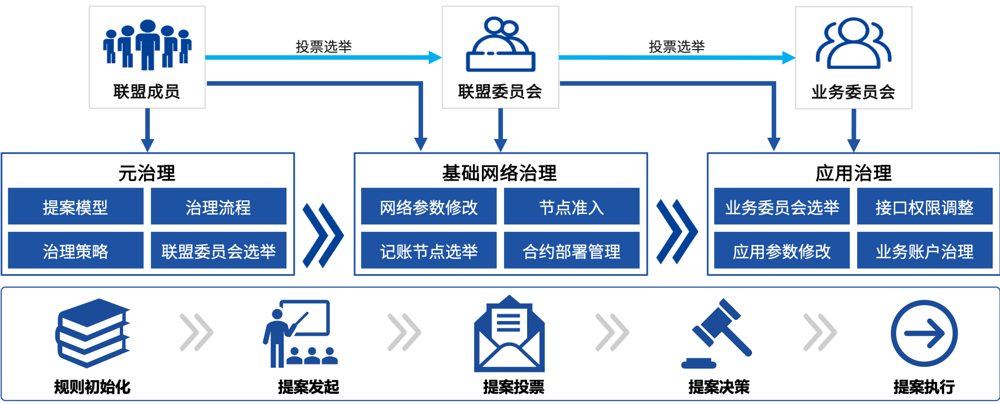
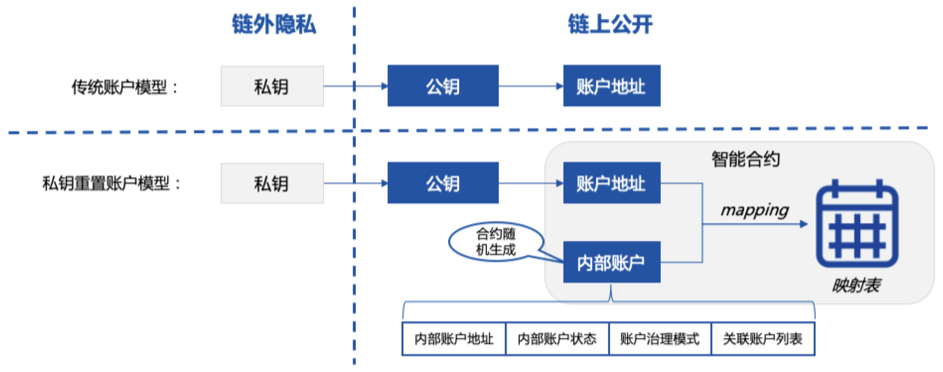
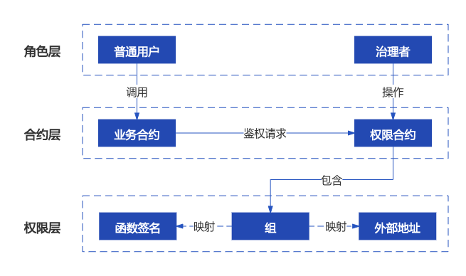
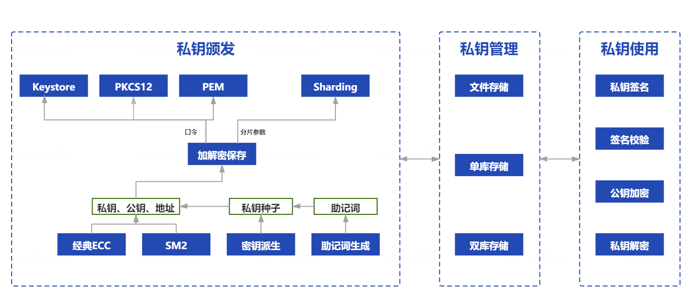
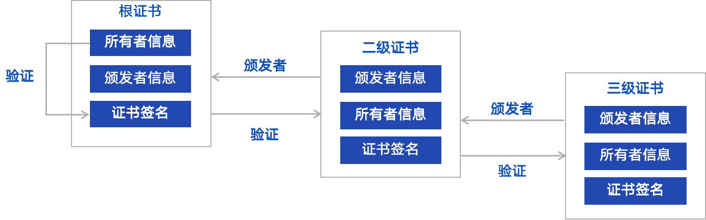

# 12. Multi-party collaborative governance components

Tags: "WeBankBlockchain-Governance" "Blockchain Multi-Party Collaboration Governance" "Common Components" "Account Governance" "Permission Governance" "Private Key Management" "Certificate Management" "

----

## Component positioning
After more than 10 years of development, the basic technical framework of blockchain has been gradually improved, the business carried on the chain is becoming more and more abundant, and more and more participants are participating。Whether multi-party collaboration can be carried out smoothly, whether business frictions can be effectively resolved, and whether past governance strategies and practices can meet the needs of rapid development in the future...... The industry's focus is gradually focusing on these more challenging challenges。

In January 2021, on the basis of years of technical research and application practice, WeBank Blockchain released [White Paper on Blockchain-Oriented Multi-Party Collaborative Governance Framework](https://mp.weixin.qq.com/s?__biz=MzU0MDY4MDMzOA==&mid=2247486381&idx=1&sn=caae41a2241e3b1c2cd58181ef73a1bc&chksm=fb34c250cc434b46b2c1b72299c2eb71e1bd6b7597c341423c5d262f18a6e0af1628e0ba4037&scene=21#wechat_redirect)MCGF (Multilateral Collaborative Governance Framework)。

As a reference architecture for blockchain governance, MCGF comprehensively covers the design specifications, participation roles, core system architecture, functional processes, and application scenarios of blockchain governance。

Its open framework can be adapted to a variety of heterogeneous blockchain underlying networks, and combines management and technical strategies to coordinate on-chain and off-chain governance。At the system level, MCGF supports governance through a variety of tools, components and services。Finally, MCGF designs visual, interactive, multi-terminal perception and operation methods for all participants to provide an excellent user experience。

Blockchain itself pursues multi-party collaboration, and the development of its system and technology cannot be achieved without the support of the community。Adhering to the consistent concept of open source and openness, we sincerely invite partners from various industries to work together to build a blockchain governance system and jointly explore the way of blockchain governance。

We will gradually open source the content of MCGF one by one to benefit the community。This open source list includes a set of out-of-the-box blockchain governance common components (WeBankBlockchain-Governance)。These components are the implementation basis and atomic building blocks of the MCGF framework, reusable and customizable。

They are embedded and run in all parts of the entire MCGF framework, just like the wheels, gears, transmission groups, and sensors on a high-speed car, and work together to help build a governance framework and improve development efficiency。Welcome the community to build and develop more and better high-availability components。

## Design Objectives

In a federated chain based on distributed collaboration, the participants collaborate in a form that is loosely coupled and does not fully trust each other。

In the alliance chain, a variety of mechanisms are designed to help participants build trust and reach consensus, with private keys, certificates, accounts, and permission management all key supporting technologies。

However, the above technology is more complex, in the application effect, but also need more reusable, easy to land tools or components。

We also often hear about issues in the development, use, and governance of affiliate chains:

The concept of private key is complex, and its algorithm types, storage files, and generation methods are numerous, which is difficult to understand and master？

The key on the blockchain node is stored in clear text on the hard disk, there is a great operational risk, is there a solution for secure storage？

Existing blockchain networks are designed with private keys as the control center, what to do in case the private key is leaked or lost？

How to control access to smart contracts at a finer granularity for different businesses in the same blockchain network group？

How to solve the systemic risk caused by improper role setting of blockchain application？

The existing certificate management tools, especially those related to state secrets, are relatively imperfect, and are there any useful tools recommended?？

Certificate management not only involves the generation of certificates, but also includes certificate hosting, issuance, reset, especially in the general trend of certificate validity settings are required to continue to shorten, more need to reset frequently, is there a complete, one-stop solution？

……

Analyzing and summarizing the above problems, it is not difficult to see that there are high thresholds for the management and use of private keys, accounts, permissions, and certificates: developers need to repeatedly and tediously solve the same problem in different scenarios, and users are prone to confusion and discomfort during use, and may even bring security risks and risks to the system due to imperfect governance solutions。

In order to solve the above problems, we have developed a common component of blockchain governance, aiming to provide lightweight decoupling, out-of-the-box, simple and easy-to-use, one-stop blockchain governance capabilities。

- **lightweight decoupling**。All governance components are decoupled from the specific business。Lightweight integration, pluggable without invading the underlying。Through the class library, smart contract, SDK and other ways to provide。Users can deploy and control governance processes even using the chain console。
- **General scenario**。All governance components are aimed at all "just-in-time" scenarios in alliance chain governance, such as the first open source account reset, contract permissions, private key and certificate lifecycle management, accounts, contracts, private keys and certificates are the cornerstones of alliance chain technology and upper-level governance。
- **One-stop shop**。The common components of chain governance are committed to providing a one-stop experience。Take the private key management component as an example, it supports a variety of private key generation methods and formats, covers almost all mainstream scenarios, provides file-based, multi-database and other managed methods, and supports private key derivation, sharding and other encryption methods。
- **Simple and easy to use**。Committed to providing a simple user experience, so that users can easily get started。
WeBankBlockchain-Governance is positioned as a blockchain governance component. It not only hopes to provide tools at the development level, but also hopes to provide blockchain participants with reference cases at the practical level to help improve the governance level of the blockchain industry as a whole。

## Component Introduction
This open source blockchain governance common component consists of private key management component (Governance-Key), account governance component (Governance-Account), permission governance component (Governance-Authority), certificate management component (Governance-Cert) and other components。

Each governance component provides detailed usage documentation。Among them, the account governance component and permission governance component also provide contract code, Java language SDK, contract integration demo and Java version SDK use demo, so that users can freely and flexibly use and integrate based on their own business scenarios。

### WeBankBlockchain-Governance-Account Account Governance Component
Based on the development of smart contracts, it provides full life cycle management of blockchain user accounts, such as account registration, private key reset, freezing, and unfreezing, and supports multiple governance policies such as administrators, threshold voting, and multi-signature system。 

In the existing blockchain design, once the private key is lost, it is impossible to re-operate the corresponding identity。As a result, the account governance component adheres to the concept of "account as the core" and proposes a two-tier account system to solve the pain point of strong binding of private keys and accounts, thus realizing the ability to replace the private key of accounts, which means that even if the private key is lost, the account can be recovered。

In the account governance component, accounts no longer use public key addresses, but a two-tier account system of public key accounts plus internal random accounts。

The account governance component provides a variety of blockchain account governance rules, account life cycle management and other overall solutions, including creating governance accounts, selecting a variety of governance rules, authorizing governance permissions, creating accounts, freezing accounts, unfreezing accounts, replacing private keys, closing accounts and other account life cycle management functions。

Please refer to
- [Github address](https://github.com/WeBankBlockchain/Governance-Account)
- [Gitee Address](https://gitee.com/WeBankBlockchain/Governance-Account)
- [Documentation](https://governance-doc.readthedocs.io/zh_CN/latest/docs/WeBankBlockchain-Governance-Acct/index.html)
- [Quick Start](https://governance-doc.readthedocs.io/zh_CN/latest/docs/WeBankBlockchain-Governance-Acct/quickstart.html)

### WeBankBlockchain-Governance-Authority Permission Governance Component
A generic component that provides access control at the granularity of blockchain accounts, contracts, functions, etc. based on smart contracts。 

With the emergence of blockchain application development cases based on smart contracts, the need for the control and grouping of smart contract permissions in various application development scenarios is becoming more and more urgent。The permission governance component provides permission control at the granularity of blockchain accounts and contract functions based on smart contracts。

The permission governance component supports intercepting illegal calls to contract functions and also supports permission grouping - by configuring the association between functions and groups, you can easily control the permissions of the grouping。Permission control can be achieved by simply introducing the permission contract address into the business code and accessing the judgment interface of the permission contract in the function that requires permission control。

The administrator only needs to operate the permission management contract without adjusting the business contract, and the modification of the permission can take effect in real time。Permission control supports on-demand configuration of blacklist mode and whitelist mode。

In addition, the permission governance component supports multiple permission governance rules, such as one vote pass, threshold vote, and so on。

Please refer to
- [Github address](https://github.com/WeBankBlockchain/Governance-Authority)
- [Gitee Address](https://gitee.com/WeBankBlockchain/Governance-Authority)
- [Documentation](https://governance-doc.readthedocs.io/zh_CN/latest/docs/WeBankBlockchain-Governance-Auth/index.html)
- [Quick Start](https://governance-doc.readthedocs.io/zh_CN/latest/docs/WeBankBlockchain-Governance-Auth/quickstart.html)

### WeBankBlockchain-Governance-Key Private Key Management Component
Provides a common solution for the full life cycle management of private keys such as private key generation, storage, encryption and decryption, signing, and verification。 

The private key management component provides the ability to generate, save, host, and use private keys, covering the entire life cycle of private key use。

This component supports a variety of standard protocols. In terms of private key generation, it supports random number generation, mnemonic generation, and derivative generation；As far as saving is concerned, it supports threshold sharding restore, and also supports exporting in pkcs12 (p12), keystore, pem and other formats；In terms of hosting, multiple trust models can be adapted to meet the diverse needs of enterprise users；In terms of usage, support for private key signature, public key encryption, etc。

The private key management component also provides full support for state secrets。

Please refer to
- [Github address](https://github.com/WeBankBlockchain/Governance-Key)
- [Gitee Address](https://gitee.com/WeBankBlockchain/Governance-Key)
- [Documentation](https://governance-doc.readthedocs.io/zh_CN/latest/docs/WeBankBlockchain-Governance-Key/index.html)
- [Quick Start](https://governance-doc.readthedocs.io/zh_CN/latest/docs/WeBankBlockchain-Governance-Key/corequickstart.html)

### WeBankBlockchain-Governance-Cert Certificate Management Component
Provides a common solution for the full lifecycle management of certificates such as certificate generation, validation, and sub-certificate requests。 

The certificate management component provides the ability to issue, verify, reset, revoke, export and host multi-level certificates in the X509 standard, covering the full life cycle of certificates, and supports a variety of signature algorithms, such as SHA256WITHRSA, SHA256WITHECDSA, SM3WITHSM2 and other signature algorithms, as well as state secret support。

The cert-toolkit component includes two modules, cert-toolkit and cert-mgr. The cert-toolkit provides basic capabilities such as certificate generation and can be used as an independent toolkit。

Please refer to
- [Github address](https://github.com/WeBankBlockchain/Governance-Cert)
- [Gitee Address](https://gitee.com/WeBankBlockchain/Governance-Cert)
- [Documentation](https://governance-doc.readthedocs.io/zh_CN/latest/docs/WeBankBlockchain-Governance-Cert/index.html)
- [Quick Start](https://governance-doc.readthedocs.io/zh_CN/latest/docs/WeBankBlockchain-Governance-Cert/start.html)
  
## Usage Scenarios

###Private key management scenario
Private key is indispensable in the design system of block chain。But the private key itself is difficult to understand, difficult to use, more difficult to keep, the management cost is huge, seriously weakened the use of blockchain experience。

An effective tool for private key management in the actual scenario of the existing blockchain is still missing。Private key management is generally difficult, high learning costs, poor user experience and other issues。

The private key management component provides a series of rich and independent private key management methods, and users can choose the appropriate solution according to their needs。

**Private key generation**: Users can use mnemonic methods to generate。On the one hand, mnemonic words are composed of words, which are relatively easy to remember and reduce the difficulty of memorizing and expressing。On the other hand, if you use separate private keys for different scenarios, it will increase the cost of memory and the risk of loss, at this time you can use the private key derivation function, users only need to keep the root private key, in different scenarios the root private key will derive different sub-private keys。

**Private key hosting**After obtaining the private key, you can choose to export it to a format such as keystore or pkcs12 after password encryption, or you can hand it over to an enterprise organization for hosting；You can also choose to split into several sub-slices and distribute them to different devices for storage。

**Private key usage**After obtaining the private key, the user can use the private key to sign transactions, use the public key to encrypt the private key to decrypt, etc。

### Account Governance Scenarios
The private key itself is easy to lose and leak。Economic losses due to loss of private keys are common。Driven by huge economic interests, security attacks and thefts of private keys are also emerging。How to reset the user's private key and protect the user's asset security is the bottom line of blockchain promotion。

The account governance component is designed to provide a self-consistent account governance mechanism based on smart contracts to achieve the effect of private key changes without changing identity。The account governance component supports both the meta-governance of the Alliance Chain Governance Committee and governance scenarios based on the specific business applications of the Alliance Chain。

Alliance Chain Governance Board Account Governance: There is a unique risk in traditional centralized solutions。In the alliance chain, a polycentric governance committee is often used to avoid a single point of risk。Members of the Alliance Chain Governance Committee can rely on governance contracts to perform management functions and vote and vote on matters。

However, there is still a risk of disclosure or loss of private keys associated with committee members。The account governance component can be applied to the account governance of the Alliance Chain Governance Committee, and the accounts of the Alliance Chain Governance Committee members are also managed by the account governance component。

Blockchain depository business account governance: Users can use the current private key to open an account in the account governance component to generate an internal identity。The business system can rely on this internal identity, for example, in a depository business contract, the record of the data is bound to that internal identity。

When you need to modify the private key, you can modify the private key by voting through the associated account or governance committee, and apply for binding the old identity with the new private key, so that you can continue to operate the old identity with the new private key, while the old private key is invalidated。

### Permission governance scenario

In application development, the lack of a security mechanism will inevitably have serious consequences。On the one hand, blockchain applications need to refine security access control to the level of contract function granularity；On the other hand, grouping permissions for different users to prevent loopholes such as transaction overreach and avoid being attacked by hackers is also a rigid need for blockchain application security。

The permission governance component provides business permission governance tools, including grouping information for different accounts and permissions for different groups。Permission configuration meets various requirements, allowing developers to quickly integrate permission control functions for their smart contract applications。Typical functions are as follows:
- **Account Grouping**You can group account addresses and set permissions for the group to reuse the group。
- **Black and White List Mode**: Supports two permission modes of black and white lists. Administrators or governance committees can set a function to be accessed only by members of a group, or only allow accounts outside the group to access。
- **Cross-Contract**Allows you to configure permissions across contracts. For example, you can set a group member to be prohibited by functions in multiple contracts at the same time。
- **Lightweight Access**The business contract does not need to know these complex permission configurations, but only needs to call the interception interface of the permission contract in its own function. When the user calls the function, the business contract will automatically submit the call information context to the permission system for judgment and interception。

### Certificate Management Scenarios
Certificate is the cornerstone of network security in the enterprise authentication management of the alliance chain。The disadvantages of certificate operation and use experience will endanger the participants of the entire alliance chain network, affecting mutual trust and business security。

For example, FISCO BCOS network adopts CA-oriented admission mechanism, uses the certificate format of x509 protocol, supports any multi-level certificate structure, and ensures information confidentiality, authentication, integrity and non-repudiation。

The certificate management component provides a solution for certificate lifecycle management, standardizes the certificate issuance process, supports certificate hosting, and supports multiple signature algorithms for personal or enterprise use。Take certificate management and toolkit usage as an example:

**On-chain node admission certificate management**: The issuance of certificates for nodes on the chain is completed by the certificate management component, which can be integrated or deployed independently, and the service is managed by the authority。

During chain initialization, the deployer can call the interface to complete the generation of the root certificate。The new authority or node can query the root certificate and submit a sub-certificate request through the query interface provided by the certificate management component。The root certificate manager can choose to issue sub-certificates from the list of requests through the query。Through the certificate management component for certificate management, you can standardize the issuance process, improve efficiency。

**Certificate Toolkit Use**The cert-toolkit in the certificate management component can be referenced in the project as an independent JAVA toolkit instead of the command line to complete the generation and issuance of certificates。Enterprise or personal projects can integrate certificate management components as a certificate issuance toolkit。
