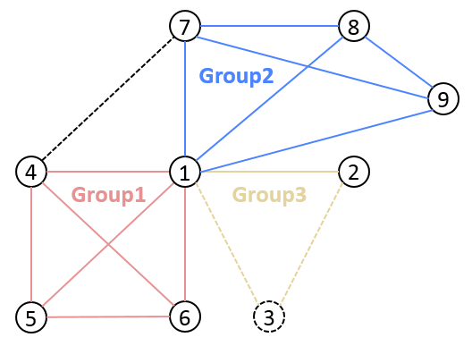

# Team Member Node Management

Tags: "node management" "exit group" "free node" "observer node" "consensus node" "

----
FISCO BCOS introduces [free nodes, observer nodes and consensus nodes](../design/security_control/node_management.html#id6)The three node types can be converted to each other through the console。

* Team Member
  * Consensus node: The node that participates in the consensus and owns all the data of the group (consensus nodes are generated by default when the chain is connected)。
  * Observer nodes: nodes that do not participate in consensus, but can synchronize data on the chain in real time。
* Non-members
  * Free node: node that has been started and is waiting to join the group。In a temporary node state, can not get the data on the chain。

## Operation command

The console provides the**[addSealer](./console/console_commands.html#addsealer)** 、**[addObserver](./console/console_commands.html#addobserver)** 和**[removeNode](./console/console_commands.html#removenode)** Three types of commands convert the specified node into a consensus node, an observer node, and a free node, and can be used to**[getSealerList](./console/console_commands.html#getsealerlist)**、**[getObserverList](./console/console_commands.html#getobserverlist)** 和**[getNodeIDList](./console/console_commands.htmml#getnodeidlist)** View the list of consensus nodes, the list of observer nodes, and the list of all nodes in the current group。

- addSealer: Sets the corresponding node as a consensus node based on the node NodeID；
- addObserver: Set the corresponding node as the observation node based on the node NodeID.；
- removeNode: Sets the corresponding node as a free node based on the node's NodeID.；
- getSealerList: View the list of consensus nodes in a group；
- getObserverList: View the list of observation nodes in a group；
- getNodeIDList: View the NodeIDs of all other nodes to which the node is connected。

Example:
Convert the specified node into a consensus node, an observer node, and a free node. The main operation commands are as follows:

```eval_rst
.. important::

    Before node admission operations, ensure that:

     - The node ID of the operation node exists. You can run cat conf / node.nodeid in the node directory to obtain the node ID.
     - The consensus of all nodes in the blockchain that the node joins is normal: the node with normal consensus will output+++Log
```

```bash
# Obtain the node ID (set the node directory to ~ / nodes / 192.168.0.1 / node0 /)
$ cat ~/fisco/nodes/192.168.0.1/node0/conf/node.nodeid
7a056eb611a43bae685efd86d4841bc65aefafbf20d8c8f6028031d67af27c36c5767c9c79cff201769ed80ff220b96953da63f92ae83554962dc2922aa0ef50

# Connecting to the console(Set the console in the ~ / fisco / console directory)
$ cd ~/fisco/console

$ bash start.sh

# Converts a specified node to a consensus node
[group0]> addSealer 7a056eb611a43bae685efd86d4841bc65aefafbf20d8c8f6028031d67af27c36c5767c9c79cff201769ed80ff220b96953da63f92ae83554962dc2922aa0ef50
# Querying the Consensus Node List
[group0]> getSealerList
[
	7a056eb611a43bae685efd86d4841bc65aefafbf20d8c8f6028031d67af27c36c5767c9c79cff201769ed80ff220b96953da63f92ae83554962dc2922aa0ef50
]

# Converts the specified node to an observer node
[group0]> addObserver 7a056eb611a43bae685efd86d4841bc65aefafbf20d8c8f6028031d67af27c36c5767c9c79cff201769ed80ff220b96953da63f92ae83554962dc2922aa0ef50

# Querying the Observer Node List
[group0]> getObserverList
[
	7a056eb611a43bae685efd86d4841bc65aefafbf20d8c8f6028031d67af27c36c5767c9c79cff201769ed80ff220b96953da63f92ae83554962dc2922aa0ef50
]

# Converts a specified node to a free node
[group0]> removeNode 7a056eb611a43bae685efd86d4841bc65aefafbf20d8c8f6028031d67af27c36c5767c9c79cff201769ed80ff220b96953da63f92ae83554962dc2922aa0ef50

# Querying the Node List
[group0]> getNodeIDList
[
	7a056eb611a43bae685efd86d4841bc65aefafbf20d8c8f6028031d67af27c36c5767c9c79cff201769ed80ff220b96953da63f92ae83554962dc2922aa0ef50
]
[group0]> getSealerList
[]
[group0]> getObserverList
[]

```

## Operation Case

The group expansion operation and node withdrawal operation are described in detail below in combination with specific operation cases.。The expansion operation is divided into two phases, namely**Join Node to Network**、**Add node to group**。The exit operation is also divided into two phases for the**Exit node from group**、**Exit node from network**。

### Operation mode

- Modify node configuration: The node restarts after modifying its own configuration. The operations involved include**Join / exit of network, inclusion / removal of CA blacklist**。
- Transaction consensus on-chain: The node sends on-chain transactions to modify the configuration items that require group consensus. The operations involved include**Modification of node type**。Currently, the way to send transactions is the precompiled service interface provided by the console and SDK.。
- RPC query: Use the curl command to query information on the chain. The operations involved include**Querying Group Nodes**。


### Operation steps

This section will take the following figure as an example to describe the above expansion operation and network withdrawal operation.。The dotted line indicates that the nodes can communicate with each other, and the solid line indicates that the nodes have a group relationship on the basis of communication, and different colors distinguish different group relationships.。The following figure shows a network with three groups, where group Group3 has three nodes。Whether Group3 has intersection nodes with other groups does not affect the generality of the following operations。



< center > Group Examples < / center >
For example, the related node information of Group3 is as follows:

Node 1 has a directory name of 'node0' and an IP port of 127.0.0.1:30400, nodeID first four bytes for b231b309...

Node 2 has a directory name of 'node1' and an IP port of 127.0.0.1:30401, nodeID first four bytes for aab37e73...

Node 3 has a directory name of 'node2' and an IP port of 127.0.0.1:30402, the first four bytes of nodeID are d6b01a96...

#### Node A joins the network

Scene description:

Node 3 was not originally in the network and now joins the network。

Operation sequence:

1. Enter the nodes directory at the same level, pull down and execute 'gen _ node _ cert.sh' to generate the node directory. The directory name is node2. There is a 'conf /' directory in node2.；

```
# Get Script
$ curl -#LO https://raw.githubusercontent.com/FISCO-BCOS/FISCO-BCOS/master-2.0/tools/gen_node_cert.sh && chmod u+x gen_node_cert.sh
# Execution,-c is the ca path provided by the generated node, agency is the organization name,-o is the directory name of the node to be generated (if it is a state secret node, use the-g parameters)
$ ./gen_node_cert.sh -c nodes/cert/agency -o node2
```

```eval_rst
.. note::
    - If you cannot download for a long time due to network problems, try 'curl-#LO https://gitee.com/FISCO-BCOS/FISCO-BCOS/raw/master-2.0/tools/gen_node_cert.sh`
```

2. Copy node2 to 'nodes / 127.0.0.1 /' and the same level as other node directories ('node0' and 'node1')；
```
$ cp -r ./node2/ nodes/127.0.0.1/
```

3. Enter 'nodes / 127.0.0.1 /' and copy 'node0 / config.ini', 'node0 / start.sh', and 'node0 / stop.sh' to the node2 directory;

```
$ cd nodes/127.0.0.1/
$ cp node0/config.ini node0/start.sh node0/stop.sh node2/
```

4. Modify 'node2 / config.ini'。For the '[rpc]' module, modify 'channel _ listen _ port' and 'jsonrpc _ listen _ port'；For the '[p2p]' module, modify 'listen _ port' and add its own node information to 'node.'；

```
$ vim node2/config.ini
[rpc]
    ;rpc listen ip
    listen_ip=127.0.0.1
    ;channelserver listen port
    channel_listen_port=20302
    ;jsonrpc listen port
    jsonrpc_listen_port=8647
[p2p]
    ;p2p listen ip
    listen_ip=0.0.0.0
    ;p2p listen port
    listen_port=30402
    ;nodes to connect
    node.0=127.0.0.1:30400
    node.1=127.0.0.1:30401
    node.2=127.0.0.1:30402
```

5. Node 3 copies' node1 / conf / group.3.genesis' of node 1 (including**Initial list of group nodes**) and 'node1 / conf / group.3.ini' to the 'node2 / conf' directory without modification；
```
$ cp node1/conf/group.3.genesis node2/conf/
$ cp node1/conf/group.3.ini node2/conf/
```

6. Run 'node2 / start.sh' to start node 3；
```
$ ./node2/start.sh
```

7. Confirm that the connection between node 3 and node 1 and node 2 has been established, and the operation of joining the network is completed。

```
# Before you open the DEBUG level log, view the number of nodes connected to the node (node2) and the information about the connected nodes (nodeID).
# The following log shows that node node2 has established a connection with two nodes (the first 4 bytes of nodeID of the node are b231b309 and aab37e73)
$ tail -f node2/log/log*  | grep P2P
debug|2019-02-21 10:30:18.694258| [P2P][Service] heartBeat ignore connected,endpoint=127.0.0.1:30400,nodeID=b231b309...
debug|2019-02-21 10:30:18.694277| [P2P][Service] heartBeat ignore connected,endpoint=127.0.0.1:30401,nodeID=aab37e73...
info|2019-02-21 10:30:18.694294| [P2P][Service] heartBeat connected count,size=2
```

```eval_rst
.. note::
    - If whitelists are enabled, ensure that all nodes have been configured in the whitelists in the config.ini of all nodes, and refresh the whitelist configuration to the nodes correctly.。Reference to CA Black and White List；
    - The rest of the configuration of config.ini copied from node 1 remains unchanged；
    - In theory, nodes 1 and 2 do not need to modify their own P2P node connection list to complete the expansion of node 3.；
    - The group selected in step 5 is recommended to be the group that node 3 needs to join later.；
    - It is recommended that you add the information of node 3 to the P2P node connection list of config.ini of nodes 1 and 2 and restart nodes 1 and 2 to maintain the fully interconnected state of all nodes in the network.。
```

#### Node A exits the network

Scene description:

Node 3 is already in the network, communicating with Node 1 and Node 2, and is now out of the network。

Operation sequence:

1. For node 3, set its own**P2P node connection list**Clear the content and restart node 3；

```
# Execute in the node2 directory
$ ./stop.sh
$ ./start.sh
nohup: appending output to ‘nohup.out’
```

2. For nodes 1 and 2, take node 3 from its own**P2P node connection list**remove (if any), restart nodes 1 and 2；

3. Confirm that the original connection between node 3 and node 1 (and 2) has been disconnected, and the exit network operation is complete。

```eval_rst
.. note::
    - **Node 3 needs to exit the group before exiting the network. The exit order is guaranteed by the user, and the system no longer checks**；
    - The network connection is initiated by the node. If step 2 is missing, node 3 can still sense the P2P connection request initiated by node 1 and node 2 and establish a connection. You can use the CA blacklist to avoid this situation.。
    - If the whitelist is enabled, you must delete the whitelist configuration of the exit node from the config.ini of all nodes and correctly swipe the new whitelist configuration into the node.。Reference to CA Black and White List。
```

#### Node A joins the group

Scene description:

Group Group3 The original node 1 and node 2, the two nodes in turn out of the block, now add node 3 to the group。

Operation sequence:

1. Node 3 joins the network；
2. Use the console addSealer to set node 3 as based on the nodeID of node 3.**consensus node**；
3. Use the console getSealerList to check whether the consensus node of group3 contains the nodeID of node 3. If yes, join the group.。

```eval_rst
.. note::
    - The NodeID of node 3 can be obtained by using 'cat nodes / 127.0.0.1 / node2 / conf / node.nodeid'.；
    - When node 3 is started for the first time, the initial list of configured group nodes is written to the group node system table. After block synchronization,**The group node system table of each group node is consistent**；
    - **Node 3 needs to complete the network access before performing the operation of joining the group. The system checks the operation sequence.**；
    - **The group fixed profile of node 3 must be the same as that of nodes 1 and 2.**。
```

#### A node exits the group

Scene description:

Group Group3 The original node 1, node 2, and node 3, the three nodes in turn out of the block, now the node 3 out of the group。

Operation sequence:

1. Use the console removeNode to set node 3 as based on the NodeID of node 3.**free node**；
2. Use the console getSealerList to check whether the consensus node of group3 contains the nodeID of node 3. If it has disappeared, the exit group operation is complete.。

Supplementary note:

```eval_rst
.. note::
    - Node 3 can perform an exit operation as a consensus node or an observer node。
```
