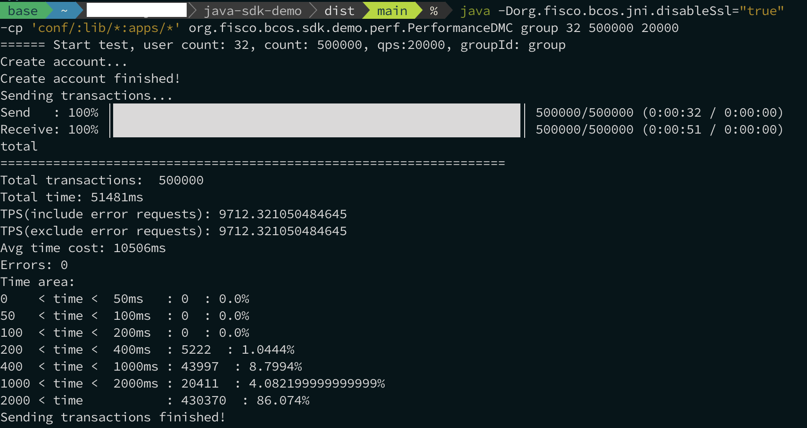

# 9. Stress Test Guide

Tags: "Stress Test" "Java SDK Demo"

----

## Stress testing via Java SDK demo

Java SDK Demo is based on [Java SDK](./sdk/java_sdk/index.md)Benchmark test collection for stress testing FISCO BCOS nodes。Java SDK Demo provides contract compilation, which can convert Solidity contract files into Java contract files, and also provides sample stress test programs for transfer contracts, CRUD contracts, and AMOP functions.。

### Step 1. Install the JDK

The test program in the Java SDK demo can be run in an environment where JDK 1.8 ~ JDK 14 is deployed. Before executing the test program, make sure that the required JDK version is installed.。Take the example of installing OpenJDK 11 on an Ubuntu system:

  ```shell
# Install open JDK 11
$ sudo apt install openjdk-11-jdk
# Verify Java Version
$ java --version
# Output the following:
# openjdk 11.0.10 2021-01-19
# OpenJDK Runtime Environment (build 11.0.10+9-Ubuntu-0ubuntu1.20.04)
# OpenJDK 64-Bit Server VM (build 11.0.10+9-Ubuntu-0ubuntu1.20.04, mixed mode, sharing)
  ```

### Step 2. Compile the source code

  ```shell
# Download source code
$ git clone https://github.com/FISCO-BCOS/java-sdk-demo
$ cd java-sdk-demo
# Compile source code
$ bash gradlew build 
  ```

  ```eval_rst
  .. note::

      When the network cannot access GitHub, call the://gitee.com/FISCO-BCOS/java-sdk-Download the source code at demo。
  ```

### Step 3. Configure Demo

Before using the Java SDK demo, you must first configure the Java SDK, including certificate copy and port configuration. For more information, see [here](./sdk/java_sdk/quick_start.md)For more information, see [SDK Connection Certificate Configuration].(../cert_config.md)。Take FISCO BCOS 3.x Air as an example:

  ```shell
  # Copy Certificate(Assuming that the SDK certificate is located in the ~ / fisco / nodes / 127.0.0.1 / sdk directory, change the path according to the actual situation)
  $ cp -r ~/fisco/nodes/127.0.0.1/sdk/* conf

  # Copy Configuration File
  # Note:
  #   The default RPC port of the FISCO BCOS blockchain system is 20200. If you modify this port, modify the [network.peers] configuration option in config.toml.
  $ cp conf/config-example.toml conf/config.toml
  ```

### Step 4. Perform the sample stress test procedure

Java SDK Demo provides a series of stress testing programs, including serial transfer contract stress testing and parallel transfer contract stress testing.

**Note: The following stress test programs are all EVM node execution environments. For more information about node configuration, see [Node Configuration](../tutorial/air/config.md)**

  ```shell
# Enter dist directory
$ cd dist

# multi-contract-Intra-Contract Parallel Transfer Contract:
# groupId: Group ID of pressure test
# userCount: Number of accounts created, recommended (4 to 32)
# count: Total transaction volume of pressure measurement
# qps: Pressure measurement QPS
java -cp 'conf/:lib/*:apps/*' org.fisco.bcos.sdk.demo.perf.PerformanceDMC [groupId] [userCount] [count] [qps]


# multi-contract-Cross-Contract Parallel Transfer
# groupId: Group ID of pressure test
# userCount: Number of accounts created, recommended (4 to 32)
# count: Total transaction volume of pressure measurement
# qps: Pressure measurement QPS
java -cp 'conf/:lib/*:apps/*' org.fisco.bcos.sdk.demo.perf.PerformanceTransferDMC [groupId] [userCount] [count] [qps]


# Pressure measurement serial transfer contract:
# count: Total transaction volume of pressure measurement
# tps: Pressure measurement QPS
# groupId: Group ID of pressure test
java -cp 'conf/:lib/*:apps/*' org.fisco.bcos.sdk.demo.perf.PerformanceOk [count] [tps] [groupId]


# Pressure Test Parallel Transfer Contract
# --------------------------
# Add account based on Solidity parallel contract parallelok:
# groupID: Group ID of pressure test
# count: Total transaction volume of pressure measurement
# tps: Pressure measurement QPS
# file: Save the file name of the generated account
$ java -cp 'conf/:lib/*:apps/*' org.fisco.bcos.sdk.demo.perf.ParallelOkPerf [parallelok] [groupID] [add] [count] [tps] [file]
# Add account based on precompiled parallel contract precompiled
# (Meaning of parameters as above)
java -cp 'conf/:lib/*:apps/*' org.fisco.bcos.sdk.demo.perf.ParallelOkPerf [precompiled] [groupID] [add] [count] [tps] [file]
# --------------------------
# Initiate transfer transaction pressure measurement based on Solidity parallel contract parallelok
# groupID: Group ID of pressure test
# count: Total transaction volume of pressure measurement
# tps: QPS of pressure measurement
# file: Transfer User File
$ java -cp 'conf/:lib/*:apps/*' org.fisco.bcos.sdk.demo.perf.ParallelOkPerf [parallelok] [groupID] [transfer] [count] [tps] [file]
# Initiate Transfer Pressure Measurement Based on Precompiled Parallel Contract Precompiled
$ java -cp 'conf/:lib/*:apps/*' org.fisco.bcos.sdk.demo.perf.ParallelOkPerf [precompiled] [groupID] [transfer] [count] [tps] [file]


# Pressure Test Parallel SmallBank Transfer Contract
# --------------------------
# Add account based on Solidity parallel contract SmallBank(Add):
# groupID: Group ID of pressure test
# contractsNum: Number of DMC parallel threads, set according to the number of test machine cores
# count: Total transaction volume of pressure measurement
# tps: Pressure measurement QPS
# file: Save the file name of the generated account
# parallel: true or false, whether the DAG is enabled
java -cp 'conf/:lib/*:apps/*' org.fisco.bcos.sdk.demo.perf.PerformanceSmallBank [groupId] [solidity] [add] [contractsNum] [count] [qps] [file] [parallel(true/false)].
# Add account based on precompiled parallel contract precompiled
# (Meaning of parameters as above)
java -cp 'conf/:lib/*:apps/*' org.fisco.bcos.sdk.demo.perf.PerformanceSmallBank [groupId] [precompiled] [add] [contractsNum] [count] [qps] [file] [parallel(true/false)].
# --------------------------
# Initiate transfer transaction based on Solidity parallel contract SmallBank(Transfer):
# groupID: Group ID of pressure test
# contractsNum: Number of DMC parallel threads, set according to the number of test machine cores
# count: Total transaction volume of pressure measurement
# tps: QPS of pressure measurement
# file: Transfer User File
java -cp 'conf/:lib/*:apps/*' org.fisco.bcos.sdk.demo.perf.PerformanceSmallBank [groupId] [solidity] [transfer] [contractsNum] [count] [qps] [file] [parallel(true、false)].
# Initiate Transfer Pressure Measurement Based on Precompiled Parallel Contract Precompiled
java -cp 'conf/:lib/*:apps/*' org.fisco.bcos.sdk.demo.perf.PerformanceSmallBank [groupId] [precompiled] [transfer] [contractsNum] [count] [qps] [file] [parallel(true、false)].


# Pressure Measurement Parallel CpuHeavy Contract
# --------------------------
# Pressure Measurement Based on Precompiled Parallel Contract Pressure Measurement CpuHeavy:
# groupID: Group ID of pressure test
# contractsNum: Number of DMC parallel threads, set according to the number of test machine cores
# count: Total transaction volume of pressure measurement
# tps: Pressure measurement QPS
# parallel: true or false, whether the DAG is enabled
# sort array size: Fast array length, default is 100000
 java -cp 'conf/:lib/*:apps/*' org.fisco.bcos.sdk.demo.perf.PerformanceCpuHeavy [groupId] [solidity] [contractsNum] [count] [qps] [parallel(true/false)] [sort array size(default 100000)].
# Precompiled-based parallel contract pressure measurement CpuHeavy
# (Meaning of parameters as above)
java -cp 'conf/:lib/*:apps/*' org.fisco.bcos.sdk.demo.perf.PerformanceCpuHeavy [groupId] [precompiled] [contractsNum] [count] [qps] [parallel(true/false)] [sort array size(default 100000)].


# KVTable contract pressure measurement
# count: Total transaction volume of pressure measurement
# tps: Pressure measurement QPS
# groupId: pressure test group
# useKVTable: KV flag value of pressure test, true is set method, false is get method
# valueLength: Length of test data, 256 by default
$ java -cp 'conf/:lib/:apps/' org.fisco.bcos.sdk.demo.perf.PerformanceKVTable [count] [tps] [groupId] [useKVTable] [valueLength]
  ```
**The following are stress tests for the WASM environment**

```shell
# Pressure Test Parallel Transfer Contract
# --------------------------
# Add an account based on the Liquid parallel contract parallelok:
# groupID: Group ID of pressure test
# count: Total transaction volume of pressure measurement
# tps: Pressure measurement QPS
# file: Save the file name of the generated account
java -cp 'conf/:lib/*:apps/*' org.fisco.bcos.sdk.demo.perf.ParallelLiquidPerf [groupId] [add] [count] [tps] [file]

# Initiating Transfer Transaction Pressure Measurement Based on Liquid Parallel Contract parallelok
# groupID: Group ID of pressure test
# count: Total transaction volume of pressure measurement
# tps: QPS of pressure measurement
# file: Transfer User File
java -cp 'conf/:lib/*:apps/*' org.fisco.bcos.sdk.demo.perf.ParallelLiquidPerf [groupId] [transfer] [count] [tps] [file]
```

### Example of pressure test

Example test environment:

- Hardware Condition: Apple M1 Max(10 cores CPU)，32GB LPDDR5 RAM，1T SSD
- System version: macOS 12.0.1
- Compilation environment: clang-1300.0.29.3，cmake 3.22.1
- FISCO BCOS version: master branch, Git Commit: c0e9dadb6e7ad1bbaf3128a27803226fb7ba6a9a, build type: Darwin / appleclang / release

#### Pressure Test Material Preparation

Build the four-node environment of FISCO BCOS Air version. Refer to the link: [Build the FISCO BCOS Alliance Chain of Air Version](../quick_start/air_installation.md)

If the source code is compiled to generate fisco-bcos binary, add '-DCMAKE _ BUILD _ TYPE = Release ', compile**Release**Binary version for higher performance and better pressure test performance。

```shell
# linux
cmake3 .. -DCMAKE_BUILD_TYPE=Release -DBUILD_STATIC=ON

# macOS
export SDKROOT=/Library/Developer/CommandLineTools/SDKs/MacOSX.sdk && CC=/usr/bin/clang CXX=/usr/bin/clang++ && cmake .. -DCMAKE_BUILD_TYPE=Release -DBUILD_STATIC=ON
```

After the setup is completed, you can see that a four-node environment has been created:

```shell
tree -L 2 ～/fisco/nodes
~/fisco/nodes
├── 127.0.0.1
│  ├── ca
│  ├── fisco-bcos
│  ├── node0
│  ├── node1
│  ├── node2
│  ├── node3
│  ├── sdk
│  ├── start_all.sh
│  └── stop_all.sh
└── ca
```

Before starting the four nodes, modify the limit on the number of transaction blocks of the Genesis block, and change the log level of all node configurations to INFO, configure the number of RPC threads to test the number of CPU cores of the machine, and disable the SSL communication of the node. For node configurations, please refer to here: [Introduction to Node Configuration](../tutorial/air/config.md)。Take node0 for example:

```shell
# Modify the config.genesis configuration of node0 and increase the number of block _ tx _ count _ limit to 2000
vim ～/fisco/nodes/127.0.0.1/node0/config.genesis
```

```ini
[consensus]
    consensus_type=pbft

    ; Modify the value to 2000, the default is 1000
    ; the max number of transactions of a block
    block_tx_count_limit=2000

    consensus_timeout=3000
    leader_period=1
    node.0=18325b7816386b0986a00e1059219ffe898059cfc4b8496551c7262d09836e3901ef1ad68f3a72b311628292c535680800b31ec2772d1d240b658fcdd3a658af: 1
    node.1=4fcf0ebaaa1e5646519142ff91b937618cfd3d4c9571071cb02dbab19a5da95b1d70dcc7b87620290826fb734f46e7bbf3dde9f6071cd31b16ca17301e3a6ae8: 1
    node.2=05daa92decd4144b31332ee1356c1a7f68f83b88cbbe8d5e0d141a0598b4ec2d2199adea18ce0a311b3d11001ef1121a8500b5fb33e1bef268600789bae1650e: 1
    node.3=027f25b1597d363babe412962b05995d56033636cb061737beeb7e9a6c811e19f1fccf763acc8271ba542eb4fe5d798e9b06ce0e28ef73285e7b86778ad879ca: 1
```

If the node has already been started, you need to delete the data in the data directory of the node and restart the node to modify the creation block configuration.。

```shell
# Modify the config.ini configuration of node0
vim ～/fisco/nodes/127.0.0.1/node0/config.ini
```

Configure the number of RPC threads to test the number of CPU cores of the machine and disable the SSL communication of the node:

```ini
[rpc]
    listen_ip=0.0.0.0
    listen_port=20200
    ; The number of threads is configured to test the number of CPU cores of the machine
    thread_count=4
    sm_ssl=false
    ; Open this item
    disable_ssl=true
```

Change the node log level to INFO:

```ini
[log]
    enable=true
    log_path=./log
    ; Level changed to INFO
    level=INFO
    max_log_file_size=200
```

Increase the limit on the number of trading pools if the pressure measurement volume is large。If the total number of transactions in the pressure test is 500000, set 'limit' to be greater than 500000, otherwise the node will report a 'txpoolIsFull' error。The default is 15000, and the following sets the transaction pool size to 1500000。

```ini
[txpool]
    ; size of the txpool, default is 15000
    limit=1500000
```

After the configuration is complete, start the four nodes:

```shell
cd ～/fisco/nodes/127.0.0.1
bash start_all.sh
try to start node0
 node0 start successfully
try to start node1
 node1 start successfully
try to start node2
 node2 start successfully
try to start node3
 node3 start successfully
```

Continue to prepare the pressure measurement program, this example uses' java-sdk-demo 'for stress testing, please refer to the first section of this article for details: [link](./stress_testing.html#jdk)I will not repeat it here.。

Configure the Java SDK demo to send transactions to four nodes:

```shell
# Enter Java-sdk-Configuration item of demo
vim ~/fiso/java-sdk-demo/dist/conf/config.toml
```

Configure four nodes. The IP addresses and ports are based on the actual conditions:

```toml
[network]
peers=["127.0.0.1:20200", "127.0.0.1:20201", "127.0.0.1:20202", "127.0.0.1:20203"]    # The peer list to connect
```

After configuring the Java SDK demo, change the log level of the Java SDK to ERROR:

```shell
# Enter Java-sdk-log configuration entry of demo
vim ~/fiso/java-sdk-demo/dist/conf/log4j2.xml
vim ~/fiso/java-sdk-demo/dist/conf/clog.ini
```

Modify the log level:

- log4j2.xml

```xml
<Loggers>
    <Root level="error">
      <AppenderRef ref="Demo"/>
    </Root>
</Loggers>
```

- clog.ini

```ini
[log]
    enable=true
    log_path=./log
    stat_flush_interval=60
    ; Modified to error
    ; info debug trace
    level=error
    max_log_file_size=200
```

#### Start Stress Test

Back to Java-sdk-demo 'After compiling the environment, run the following command to start the pressure test:

The stress test here is to deploy 32 Account Solidity contracts to the group group and send 500,000 transactions with a QPS of 20,000。

```shell
cd ~/fiso/java-sdk-demo/dist/
java -cp 'conf/:lib/*:apps/*' org.fisco.bcos.sdk.demo.perf.PerformanceDMC group 32 500000 20000
```

#### Test Results

Stress test results:



- A total of 500,000 transactions were initiated, the time to send to the node was 32 seconds, and the time to collect all transaction receipts was 51 seconds。
- TPS is 9712.321050484645 (transactions / sec)
