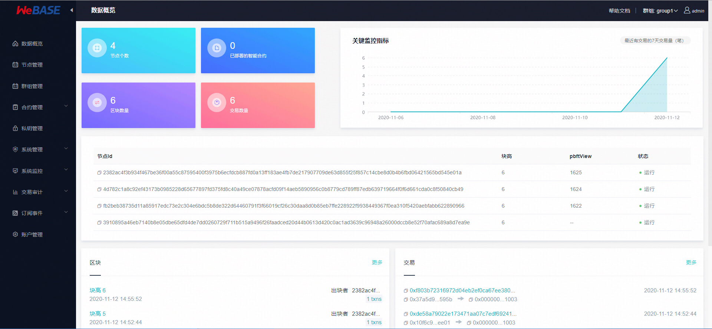
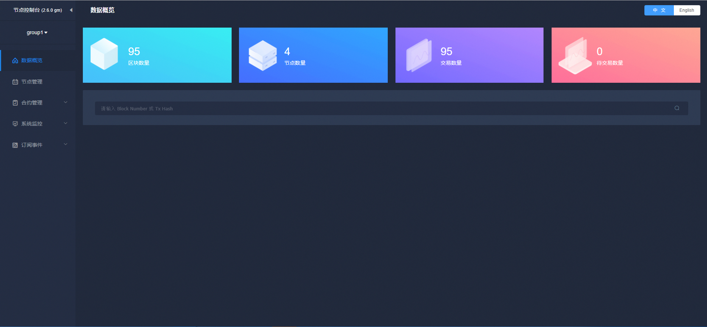

# 6. Blockchain management platform

Tags: "WeBASE" "Middleware Platform" "Node Management" "System Monitoring" "System Management" "

----

```eval_rst
.. important::
    Related Software and Environment Release Notes！'Please check < https://fisco-bcos-documentation.readthedocs.io/zh_CN/latest/docs/compatibility.html>`_
```

WeBank's open source self-developed blockchain middleware platform - [WeBASE(WeBank Blockchain Application Software Extension)](https://webasedoc.readthedocs.io/zh_CN/latest/) It is a middleware platform built between blockchain applications and FISCO BCOS nodes.。WeBASE shields the complexity of the underlying blockchain, reduces the threshold for blockchain use, and greatly improves the development efficiency of blockchain applications, including subsystems such as node front, node management, transaction links, data export, and web management platforms.。Users can select subsystems for deployment according to their business needs, and can further experience the rich interactive experience, visual smart contract development environment IDE。

The WeBASE Management Platform is a set of management FISCO consisting of four WeBASE subsystems-Toolset for the BCOS Alliance Chain。For more information, please refer to [WeBASE Management Platform User Manual](https://webasedoc.readthedocs.io/zh_CN/latest/) 。

## Main functions

1. Overview of Blockchain Data
2. Node management
3. Contract Management
4. Private key management
5. Systems Management
6. System monitoring
7. Transaction Audit
8. Subscribe to Events
9. Account Management
10. Group Management

## Construction of WeBASE Management Platform

For building, please refer to [WeBASE One - click Deployment Document](https://webasedoc.readthedocs.io/zh_CN/latest/docs/WeBASE/install.html)。



### [WeBASE Quick Start](https://webasedoc.readthedocs.io/zh_CN/latest/docs/WeBASE-Install/developer.html)

Developers only need to build nodes and node pre-services.(WeBASE-Front)via WeBASE-Front contract editor for contract editing, compilation, deployment, debugging。Build can refer to ["WeBASE Quick Start Document"](https://webasedoc.readthedocs.io/zh_CN/latest/docs/WeBASE-Install/developer.html)。


### [WeBASE Console](https://webasedoc.readthedocs.io/zh_CN/latest/docs/WeBASE/install.html)

Through the WeBASE one-click script, you can build a basic environment of WeBASE, which can facilitate users to experience the core functions of WeBASE, such as block browsing, node viewing, contract IDE, system management, node monitoring, transaction audit, and private key management.。For building, please refer to [WeBASE One - click Deployment Document](https://webasedoc.readthedocs.io/zh_CN/latest/docs/WeBASE/install.html)。

### [WeBASE Other](https://webasedoc.readthedocs.io/zh_CN/latest)

Other WeBASE components can refer to [WeBASE Documentation](https://webasedoc.readthedocs.io/zh_CN/latest)

[build_chain_code]:https://github.com/FISCO-BCOS/FISCO-BCOS/blob/master-2.0/manual/build_chain.sh
