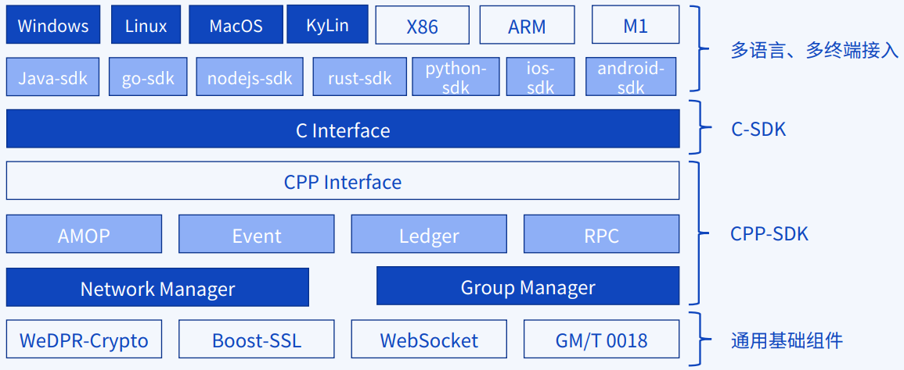

# 1. Multilingual SDK

Tag: "SDK"

----

```eval_rst
.. important::
    Related Software and Environment Release Notes！'Please check < https://fisco-bcos-documentation.readthedocs.io/zh_CN/latest/docs/compatibility.html>`_
```

FISCO BCOS 3.x version of the multilingual SDK is designed with**Hierarchical architecture**implementation, from bottom to top, into the generic base component layer, CPP- SDK layer, C-SDK layer, multi-language, multi-terminal access layer。The core functionality is determined by the underlying CPP-SDK implementation, the upper layer of multi-language simple adaptation access, this way can quickly adapt to access multi-language SDK。

- **Common Foundation Components**Encapsulating encryption algorithms, communication protocols, network protocols, encryption machine protocols；
- **CPP-SDK layer**: Based on the common basic components, realize the network management, group management, AMOP communication, event mechanism, ledger and RPC interface related to blockchain connection, using C.++Way to Encapsulate CPP-SDK；
- **C-SDK layer**: Based on CPP-The SDK wraps another layer of C interface call mode C-SDK；
- **Multi-language, multi-terminal access layer**: through c-The SDK interface can be quickly adapted to Java, golang, nodejs, python, rust, iOS, Android and other multi-language SDK, and compatible with Windows, Linux, macOS, KyLin multi-operating system and X86, ARM (including M1) and other platforms。

The layered architecture diagram of the SDK is as follows:


