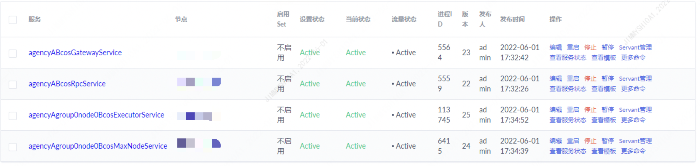
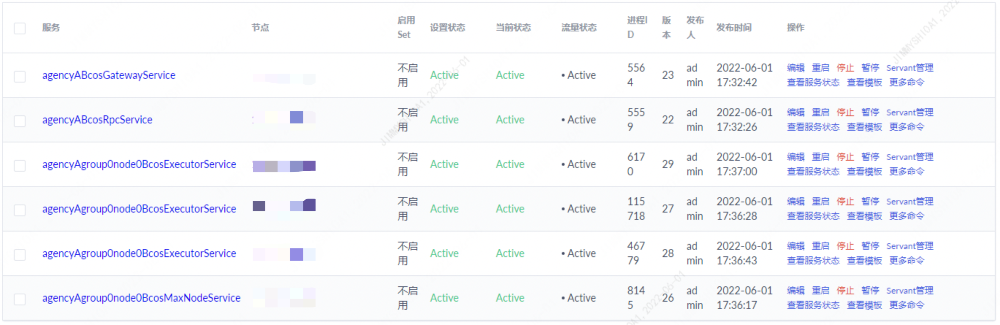
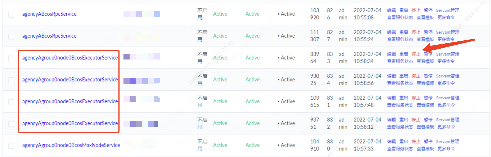

# Deployment Tools BcosBuilder

Tags: "Max version of the blockchain network" "deployment tool"

------------

```eval_rst
.. important::
    The deployment tool BcosBuilder aims to enable users to deploy and use the FISCO BCOS Pro / max version of the blockchain as quickly as possible. Its functions include: deploying / starting / shutting down / updating / scaling RPC services, Gateway services, and blockchain node services。
```

FISCO BCOS provides the 'BcosBuilder' tool to help users quickly deploy, start, stop, update and scale the FISCO BCOS Max version of the blockchain consortium chain, which can be downloaded directly from the release tags of FISCO BCOS。

'BcosBuilder 'provides some configuration templates in the' max / conf 'directory to help users quickly complete the deployment and expansion of the Max version blockchain。This chapter introduces the configuration items of 'BcosBuilder' in detail from three perspectives: tars service configuration items, blockchain deployment configuration items, and blockchain expansion configuration items。

## 1 tars service configuration item

- `[tars].tars_url`: The URL for accessing the tars web console. The default value is' http '://127.0.0.1:3000`。
- `[tars].tars_token`: To access the token of the tars service, you can use the [admin] ->User Center ->[token management] token application and query。
- `[tars].tars_pkg_dir`: Path to place the Max version binary package. The default path is binary /. If this configuration item is configured, the FISCO BCOS Pro version binary is obtained from the specified directory by default for service deployment, expansion, and other operations。

The following is an example of a configuration item for the tars service:

```shell
[tars]
tars_url = "http://127.0.0.1:3000"
tars_token = ""
tars_pkg_dir = "binary/"
```

## 2 Deployment configuration of blockchain service

Configuration items related to blockchain service deployment mainly include chain configuration items, RPC / Gateway service configuration items, and blockchain node service configuration items. The configuration template is located in the 'conf / config-deploy-example.toml' path of 'BcosBuilder / max'。

### 2.1 Chain Configuration Item

Chain configuration items are located in the configuration '[chain]' and mainly include:

- `[chain].chain_id`: The ID of the chain to which the blockchain service belongs. The default value is' chain0 '**Cannot include all special characters except letters and numbers**;
- `[chain].rpc_sm_ssl`: The type of SSL connection used between the RPC service and the SDK client. If the value is set to 'false', RSA encryption is used；If it is set to 'true', it indicates that the state-secret SSL connection is used. The default value is' false ';
- `[chain].gateway_sm_ssl`: SSL connection type between Gateway services. Set to 'false' to use RSA encryption；Set to 'true' to indicate that a state-secret SSL connection is used. The default value is' false ';
- `[chain].rpc_ca_cert_path`: The path of the CA certificate of the RPC service. If a complete CA certificate and CA private key are available in this path, the 'BcosBuilder' deployment tool generates the RPC service SSL connection certificate based on the CA certificate in this path；Otherwise, the 'BcosBuilder' deployment tool generates a CA certificate and issues an SSL connection certificate for the RPC service based on the generated CA certificate;
- `[chain].gateway_ca_cert_path`:  The CA certificate path of the Gateway service. If there is a complete CA certificate and CA private key in this path, the 'BcosBuilder' deployment tool generates the Gateway service SSL connection certificate based on the CA certificate in this path；Otherwise, the 'BcosBuilder' deployment tool generates a CA certificate and issues an SSL connection certificate for the Gateway service based on the generated CA certificate;

The chain ID is' chain0 '. The configuration items for RSA encrypted connections between RPC and SDK and between Gateway services are as follows:

```shell
[chain]
chain_id="chain0"
# the rpc-service enable sm-ssl or not, default disable sm-ssl
rpc_sm_ssl=false
# the gateway-service enable sm-ssl or not, default disable sm-ssm
gateway_sm_ssl=false
# the existed rpc service ca path, will generate new ca if not configurated
#rpc_ca_cert_path=""
# the existed gateway service ca path, will generate new ca if not configurated
#gateway_ca_cert_path=""
```

### 2.2 Institutional Service Configuration Item

The organization service configuration item is located in '[[agency]]'. The main configuration information of the organization's disk placement encryption and the etcd cluster information used to provide the primary and secondary services are as follows:

- `[[agency]].name`: Name of institution;
- `[[agency]].failover_cluster_url`: The access address of the etcd cluster used to provide automated master / standby services. You can reuse the 'tikv' pd cluster**Ensure that RPC / Gateway / blockchain nodes within the organization can access the etcd cluster**;
- `[[agency]].enable_storage_security`: Whether the RPC / Gateway service in the organization is enabled;
- `[[agency]].key_center_url`: If the disk encryption service is enabled, configure the URL of the 'Key Manager' through this configuration item;
- `[[agency]].cipher_data_key`: If the disk encryption service is enabled, configure the encryption key through this configuration item

### 2.3 RPC Service Configuration Item

```eval_rst
.. note::
   -When deploying an RPC service to multiple machines, make sure that the tarsnode service is installed on these machines. For tarsnode deployment, please refer to 'here<https://doc.tarsyun.com/#/markdown/TarsCloud/TarsDocs/installation/node.md>`_
```

RPC service configuration items are located in '[[agency]]. [agency.rpc]'. An organization can deploy an RPC service, and a chain can contain multiple organizations. The main configuration items include:

- `[[agency]].[agency.rpc].deploy_ip`: The deployment IP address of the RPC service. If multiple IP addresses are configured, the RPC service is deployed on multiple machines to achieve the goal of parallel expansion。
- `[[agency]].[agency.rpc].listen_ip`: The listening IP address of the RPC service. The default value is' 0.0.0.0'。
- `[[agency]].[agency.rpc].listen_port`: The listening port of the RPC service. The default value is 20200。
- `[[agency]].[agency.rpc].thread_count`: Number of worker threads in RPC service process, default is' 4'。


The configuration for deploying RPC services for agency 'agencyA' is as follows:

```ini
[[agency]]
name = "agencyA"
failover_cluster_url = "172.25.0.3:2379"
# enable data disk encryption for rpc/gateway or not, default is false
enable_storage_security = false
# url of the key center, in format of ip:port, please refer to https://github.com/FISCO-BCOS/key-manager for details
# key_center_url =
# cipher_data_key =

    [agency.rpc]
    # You can deploy multiple IP addresses. You must ensure that the tarsnode service is installed on the machine corresponding to each IP address
    deploy_ip=["172.25.0.3"]
    # RPC Service Listening IP
    listen_ip="0.0.0.0"
    # RPC service listening port
    listen_port=20200
    # Number of worker threads
    thread_count=4
```

### 2.4 Gateway Service Configuration Item

RPC service configuration items are located in '[[agency]]. [agency.gateway]'. An organization can deploy one Gateway service and a chain can deploy multiple Gateway services. The main configuration items include:

- `[[agency]].[agency.gateway].deploy_ip`: The deployment IP address of the Gateway service. If multiple IP addresses are configured, the Gateway service is deployed on multiple machines to achieve the goal of parallel expansion。
- `[[agency]].[agency.gateway].listen_ip`: The listening IP address of the Gateway service. The default value is' 0.0.0.0'。
- `[[agency]].[agency.gateway].listen_port`: The listening port of the Gateway service. The default value is' 30300'。
- `[[agency]].[agency.gateway].peers`: Connection information for all Gateway services。

A sample configuration for deploying the Gateway service for agency 'agencyA' is as follows:

```ini
[[agency]]
name = "agencyA"
failover_cluster_url = "172.25.0.3:2379"
# enable data disk encryption for rpc/gateway or not, default is false
enable_storage_security = false
# url of the key center, in format of ip:port, please refer to https://github.com/FISCO-BCOS/key-manager for details
# key_center_url =
# cipher_data_key =

    [agency.gateway]
    deploy_ip=["172.25.0.3"]
    listen_ip="0.0.0.0"
    listen_port=30300
    peers=["172.25.0.3:30300", "172.25.0.3:30301"]
```

### 2.5 Blockchain Node Service Configuration Item: Group Configuration

```eval_rst
.. note::
    Blockchain group configuration cannot be modified。
```

Each blockchain node service in the blockchain of FISCO BCOS Pro belongs to a group. Therefore, before deploying a blockchain node, you must first configure the group information. The group configuration items are located in '[[group]]', as follows:

- `[[group]].group_id`: The ID of the group to which the blockchain node belongs. The default value is "group."。
- `[[group]].sm_crypto`: Whether the node ledger adopts the signature, signature verification, hash, or encryption algorithm of the national secret type. The default value is' false'。


The group configuration also includes configurations related to the Genesis block:
- `[[group]].leader_period`: The number of blocks that each leader can package consecutively. The default value is 5;
- `[[group]].block_tx_count_limit`: The maximum number of transactions that can be included in each block, which defaults to 1000;
- `[[group]].consensus_type`: Consensus algorithm type. Currently, only the 'pbft' consensus algorithm is supported;
- `[[group]].gas_limit`: The maximum amount of gas consumed during the run of each transaction. The default value is 300000000;
- `[[group]].vm_type`: The type of virtual machine running on a blockchain node. Currently, two types are supported: 'evm' and 'wasm'. A group can run only one type of virtual machine. Some nodes cannot run EVM virtual machines and some nodes cannot run WASM virtual machines;
- `[[group]].auth_check`: To enable the permission governance mode, please refer to the link [Permission Governance User Guide](../../develop/committee_usage.md);
- `[[group]].init_auth_address`: When permission governance is enabled, specify the account address of the initialization governance committee. For permission usage documents, please refer to the link: [Permission Governance Usage Guide](../../develop/committee_usage.md);
- `[[group]].compatibility_version`: The data-compatible version number. The default value is 3.0.0. You can upgrade the data-compatible version when running the 'setSystemConfigByKey' command in the console。

```ini
[[group]]
group_id="group0"
# the genesis configuration path of the group, will generate new genesis configuration if not configurated
# genesis_config_path = ""
# VM type, now only support evm/wasm
vm_type="evm"
# use sm-crypto or not
sm_crypto=false
# enable auth-check or not
auth_check=false
init_auth_address=""

# the genesis config
# the number of blocks generated by each leader
leader_period = 1
# the max number of transactions of a block
block_tx_count_limit = 1000
# consensus algorithm now support PBFT(consensus_type=pbft)
consensus_type = "pbft"
# transaction gas limit
gas_limit = "3000000000"
# compatible version, can be dynamically upgraded through setSystemConfig
# the default is 3.0.0
compatibility_version="3.0.0"
```

### 2.6 Blockchain Node Service Configuration Item: Deployment Configuration

The blockchain node service deployment configuration item is located in '[[agency]]. [[agency.group]]. [[agency.group.node]]', as follows:
- `[[agency]].[[agency.group]].[[agency.group.node]].node_name`: The name of the node service, which is not configured in the service deployment scenario**If this option is configured, make sure that the service names of different node services are not duplicated**;
- `[[agency]].[[agency.group]].[[agency.group.node]].deploy_ip`: BcosMaxNodeService node service deployment ip address of Max node
- `[[agency]].[[agency.group]].[[agency.group.node]].executor_deploy_ip`: BcosExecutoerService service deployment ip of Max node
- `[[agency]].[[agency.group]].[[agency.group.node]].pd_addrs`: The pd access address of the TiKV cluster,**Each Max node must be connected to an independent TiKV cluster. TiKV clusters cannot be shared by different Max nodes**;
- `[[agency]].[[agency.group]].[[agency.group.node]].key_page_size`: The granularity of the KeyPage. The default value is 10KB;
- `[[agency]].[[agency.group]].[[agency.group.node]].enable_storage_security`: Whether to enable disk placement encryption. The default value is false;
- `[[agency]].[[agency.group]].[[agency.group.node]].key_center_url`: If disk encryption is enabled, the url of the key-manager can be configured here
- `[[agency]].[[agency.group]].[[agency.group.node]].cipher_data_key`: If disk encryption is enabled, configure the data encryption key here
- `[[agency]].[[agency.group]].[[agency.group.node]].monitor_listen_port`: The listening port of the monitoring service, which is' 3902 'by default
- `[[agency]].[[agency.group]].[[agency.group.node]].monitor_log_path`: Path of the blockchain node logs to be monitored

The blockchain node service configuration example is as follows:
```ini
[[agency]]
name = "agencyA"
   [[agency.group]]
        group_id = "group0"
        [[agency.group.node]]
        node_name = "node0"
        # the tikv storage pd-addresses
        pd_addrs="172.25.0.3:2379"
        key_page_size=10240
        deploy_ip = ["172.25.0.3"]
        executor_deploy_ip=["172.25.0.3"]
        monitor_listen_port = "3901"
        # the tikv storage pd-addresses
        # monitor log path example:"/home/fisco/tars/framework/app_log/"
        monitor_log_path = ""
```

## 3 Block chain service expansion configuration

'BcosBuilder / max 'provides blockchain node service expansion and RPC / Gateway service expansion functions. The configuration template for blockchain node service expansion is in the' conf / config-node-expand-example.toml 'path, and the configuration template for RPC / Gateway service expansion is in the' conf / config-service-expand-example.toml 'path。

### 3.1 RPC Service Expansion Configuration

In FISCO BCOS Pro version blockchain, an RPC service can contain multiple RPC service nodes. BcosBuilder provides the RPC service scaling function, which can scale out RPC service nodes based on existing RPC services. The configuration options are mainly located in the configurations of '[chain]' and '[[agency]]. [agency.rpc]', mainly including:

- `[chain].chain_id`: The ID of the chain to which the expanded RPC service belongs;
- `[chain].rpc_sm_ssl`: Whether the expanded RPC service and SDK client use the state-secret SSL connection;
- `[chain].rpc_ca_cert_path`: Specify the path to the CA certificate and CA private key of the expanded RPC service;
- `[[agency]].[agency.rpc].deploy_ip`: Deployment IP of Scaled RPC Service;
- `[[agency]].[agency.rpc].listen_ip`: Specify the listening IP address of the expanded RPC service;
- `[[agency]].[agency.rpc].listen_port`: Specify the listening port of the expanded RPC service;
- `[[agency]].[agency.rpc].thread_count`: Number of worker threads for an expanded RPC service;

The following is an example of how to configure 'agencyA' RPC service 'agencyABcosRpcService' to '172.25.0.5':

```ini
[chain]
chain_id="chain0"
rpc_sm_ssl=false
gateway_sm_ssl=false
# the ca path of the expanded rpc service
# must ensure that the path configuration is correct, otherwise the ssl verification will fail
rpc_ca_cert_path="generated/rpc/chain0/ca"
# the ca path of the expanded gateway service
# must ensure that the path configuration is correct, otherwise the ssl verification will fail
gateway_ca_cert_path="generated/gateway/chain0/ca"

[[agency]]
name = "agencyA"
failover_cluster_url = "172.25.0.3:2379"
# enable data disk encryption for rpc/gateway or not, default is false
enable_storage_security = false
# url of the key center, in format of ip:port, please refer to https://github.com/FISCO-BCOS/key-manager for details
# key_center_url =
# cipher_data_key =

    [agency.rpc]
    deploy_ip=["172.25.0.5"]
    listen_ip="0.0.0.0"
    listen_port=10200
    thread_count=4
```

### 3.2 Configuration of Gateway Service Expansion

Similar to the RPC service, the scaling configuration options of the Gateway service are mainly located in the configurations of '[chain]' and '[[agency]]. [agency.gateway]', mainly including:
- `[chain].chain_id`: The ID of the chain to which the expanded Gateway service belongs;
- `[chain].gateway_sm_ssl`: Whether the state-secret SSL connection is used between the expanded Gateway service and the SDK client;
- `[chain].gateway_ca_cert_path`: Specify the path of the CA certificate and the CA private key of the extended Gateway service;
- `[[agency]].[agency.gateway].deploy_ip`: Deployment IP address of the scaled-out Gateway service;
- `[[agency]].[agency.gateway].listen_ip`: The listening IP address of the Gateway service node. The default value is' 0.0.0.0';
- `[[agency]].[agency.gateway].listen_port`: The listening port of the Gateway service. The default value is' 30300';
- `[[agency]].[agency.gateway].peers`: The connection information of the Gateway service. You must configure the connection IP address and connection port information of all Gateway service nodes。

The following is an example of how to configure the 'agencyA' Gateway service 'agencyABcosGatewayService' to '172.25.0.5':

```ini
[chain]
chain_id="chain0"
rpc_sm_ssl=false
gateway_sm_ssl=false
# the ca path of the expanded rpc service
# must ensure that the path configuration is correct, otherwise the ssl verification will fail
rpc_ca_cert_path="generated/rpc/chain0/ca"
# the ca path of the expanded gateway service
# must ensure that the path configuration is correct, otherwise the ssl verification will fail
gateway_ca_cert_path="generated/gateway/chain0/ca"

[[agency]]
name = "agencyA"
# enable data disk encryption for rpc/gateway or not, default is false
enable_storage_security = false
# url of the key center, in format of ip:port, please refer to https://github.com/FISCO-BCOS/key-manager for details
# key_center_url =
# cipher_data_key =

    [agency.gateway]
    deploy_ip=["172.25.0.5"]
    listen_ip="0.0.0.0"
    listen_port=40300
    peers=["172.25.0.3:30300", "172.25.0.3:30301", "172.25.0.5:40300"]
```

### 3.3 Block chain node expansion configuration

'BcosBuilder / max 'provides the blockchain node expansion function to expand new blockchain node services for a specified group. The blockchain node expansion configuration template is located in the' conf / config-node-expand-example.toml 'path**chain configuration**和**Scale-out deployment configuration**, as follows:

- `[chain].chain_id`: The ID of the chain to which the expanded blockchain node belongs;
- `[[group]].group_id`: Group ID of the expansion node;
- `[[group]].genesis_config_path`: Path to configure the Genesis block of the scaling node;
- `[[group]].sm_crypto`: Whether the scaling node is a state secret node. The default value is' false ';
- `[[agency]].[[agency.group]].group_id`: Group ID of the scaling node;
- `[[agency]].[[agency.group.node]].node_name`: The service name of the expanded blockchain node**Cannot conflict with the service name of an existing blockchain node**;
- `[[agency]].[[agency.group.node]].deploy_ip`: Deployment IP address of the expanded blockchain node service;
- `[[agency]].[[agency.group.node]].pd_addrs`: The pd access address of the TiKV cluster corresponding to the expansion node,**Each Max node must be connected to an independent TiKV cluster. TiKV clusters cannot be shared by different Max nodes**;
- `[[agency]].[[agency.group.node]].executor_deploy_ip`: BcosExecutoerService service deployment ip of Max node;
- `[[agency]].[[agency.group.node]].enable_storage_security`: Whether disk encryption is enabled on the expansion node;
- `[[agency]].[[agency.group.node]].key_center_url`: The url of the key-manager. You need to configure the;
- `[[agency]].[[agency.group.node]].cipher_data_key`: Data disk encryption key. You need to configure the data disk encryption key in the disk encryption scenario。

The following is an example of how to scale up the blockchain node named 'node2' to '172.25.0.5' for the 'group0' group of the 'agencyA' organization:
```ini
[[agency]]
name = "agencyA"
    [[agency.group]]
        group_id = "group0"

        [[agency.group.node]]
        # expand the existed-max-node
        node_name = "node1"
        # the tikv storage pd-addresses
        pd_addrs="172.25.0.3:2379"
        key_page_size=10240
        deploy_ip = ["172.25.0.5"]
        executor_deploy_ip=["172.25.0.3"]
        # enable data disk encryption for bcos node or not, default is false
        enable_storage_security = false
        # url of the key center, in format of ip:port, please refer to https://github.com/FISCO-BCOS/key-manager for details
        # key_center_url =
        # cipher_data_key =
```

### 3.4 Block chain actuator expansion configuration

Traditional blockchain nodes are deployed on a machine, and the execution rate of transactions is limited by the performance of a machine。The Max version of FISCO BCOS supports the deployment of transaction executors in blockchain nodes on multiple machines**Multi-machine parallel execution of intra-block transactions**The transaction processing performance of a single blockchain node is greatly expanded。At the same time, multiple transaction actuators also improve the stability of the system, only one actuator can work online。

'BcosBuilder / max 'provides the blockchain node expansion function to expand new blockchain node services for a specified group. The blockchain node expansion configuration template is located in the' conf / config-node-expand-example.toml 'path**chain configuration**和**Scale-out deployment configuration**。The relevant configuration items of the transaction executor are as follows. We can configure multiple executors for each node:

* `[[agency]].[[agency.group.node]].executor_deploy_ip`

When the max version is built, the multi-machine architecture of executor is built. At this time, you can see that the executor process is running through the tars console, and it is not the same as the node process



#### Expansion operation

Can expand more executor

``` bash
# After the Max node is built, edit config-node-expand-example.toml to add more executors
cd tools/BcosBuilder/max/
vim config-node-expand-example.toml
```

Modify 'executor _ deploy _ ip' in the file to add more machine ip addresses to deploy executor

> Only one executor can be deployed on one machine (one IP)

``` toml
# As originally
executor_deploy_ip=["172.25.0.3"]
# More can be added
executor_deploy_ip=["172.25.0.3","172.25.0.4","172.25.0.5"]  # an executor of the node is deployed under each ip address
```

Call script to expand capacity

``` bash
python3 build_chain.py chain -c config-node-expand-example.toml -o expand -t executor
```

After success, you can see more executors in the active state on the dashboard page of tars



#### Management Operations

After scaling, you can stop or restart the executor through the tars console。After an executor is stopped or restarted, there is no need to restart the corresponding blockchain node process. The node automatically rebuilds the transaction execution context with all online executors。The multi-machine deployment of the transaction executor improves the performance of the transaction execution while also improving the stability of the system。



### TiKV Expansion

Max nodes are recommended to use the cluster version of TIKV in the production environment. TiKV cluster version can be used as the back end of the node to easily and simply achieve scale-out and scale-out。Specific expansion and contraction operation instructions [please refer to official documents](https://docs.pingcap.com/zh/tidb/dev/scale-tidb-using-tiup)。
