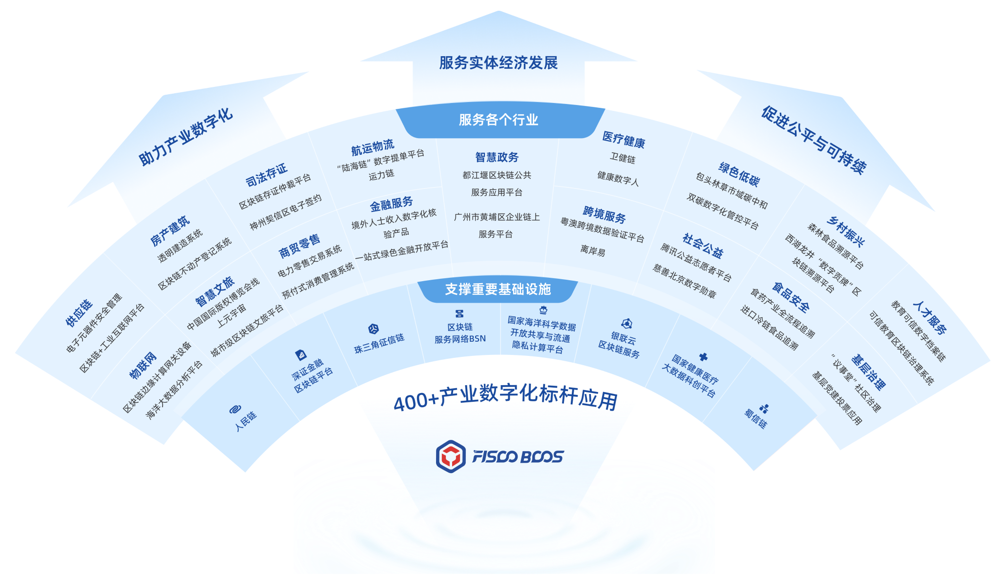

Please select the version of FISCO BCOS according to your requirements and confirm that the peripheral components match their versions。

.. container:: row 
   
   .. container:: card-holder-bigger

         .. container:: card-bigger

            .. image:: _static/images/FISCO_BCOS_Logo_3_0.png

            .. raw:: html
         
               

                   
                  <h style="font-size: 18px;"><b><a href="https://fisco-bcos-doc.readthedocs.io/zh-cn/latest/index.html">Version 3.0 of this document: High performance, easy expansion, high availability</a></b></h>
                     
               

               

            .. raw:: html
         
               

                   
                  <h style="font-size: 18px;"><b><a href="https://fisco-bcos-documentation.readthedocs.io/zh-cn/latest/#"> ====>> Switch to version 2.0 document</a></b></h>
                    
               

               

.. container:: row 

   .. raw:: html
        
      

       

##############################################################
FISCO BCOS 3.0 Technical Documents
##############################################################

FISCO BCOS:KZ /) is a stable, efficient and secure blockchain underlying platform, and its usability has been tested by widely used practices。The open source community is now 5,000+Enterprises and Institutions, 400+Industrial digital benchmarking applications, covering cultural copyright, judicial services, government services, Internet of Things, finance, smart communities, real estate construction, community governance, rural revitalization and other fields。

FISCO BCOS open source community is committed to building an open and diversified open source alliance chain ecology, so far, the open source community has gathered more than 100,000 members to build and govern together, and has developed into one of the largest and most active domestic open source alliance chain ecosystems, in which many outstanding community members who contribute to community construction and code have emerged。As of 2023, the open source community has identified 63 MVPs, and these outstanding contributors are either applying FISCO BCOS technology to various applications to help digitize the industry, or preaching in multiple channels to spread the spirit of the open source community further afield。

.. image:: images/community/mvp_review_2023.png
   :align: center
   :alt: FISCO BCOS 2023 MVP of the Year

.. note::
   This technical document is applicable to FISCO BCOS 3.x version. For FISCO BCOS 2.x stable technical document, please refer to 'FISCO BCOS 2.x technical document(stable) <https://fisco-bcos-documentation.readthedocs.io/zh_CN/latest/>`_

   FISCO BCOS 3.x version source code is located in the 'master' branch, please refer to 'here<https://github.com/FISCO-BCOS/FISCO-BCOS/tree/master>`_
   FISCO BCOS 2.x source code is located in the 'master-2.0' branch, please refer to 'here<https://github.com/FISCO-BCOS/FISCO-BCOS/tree/master-2.0>`_

.. container:: row

   .. container:: card-holder

      .. container:: card rocket

         .. raw:: html

             
            <h style="font-size: 22px;">&nbsp;&nbsp;&nbsp;&nbsp;&nbsp;&nbsp;&nbsp;&nbsp;&nbsp;&nbsp;&nbsp;&nbsp;Quick Start</h>
              

         - 'Understanding the FISCO BCOS Blockchain<./docs/introduction/introduction.html>`_
         - 'FISCO BCOS 3.X NEW FEATURES<./docs/introduction/change_log/index.html>`_
         - 'Building the first blockchain network<./docs/quick_start/air_installation.html>`_
         - 'Develop the first Solidity blockchain application<./docs/quick_start/solidity_application.html>`_
         - 'Develop the first webankblockchain-liquid blockchain application<./docs/quick_start/wbc_liquid_application.html>`_

   .. container:: card-holder

      .. container:: card manuals

         .. raw:: html

             
            <h style="font-size: 22px;">&nbsp;&nbsp;&nbsp;&nbsp;&nbsp;&nbsp;&nbsp;&nbsp;&nbsp;&nbsp;&nbsp;&nbsp;Development Tutorial</h>
              

         - 'Air version blockchain network building<./docs/tutorial/air/index.html>`_
         - 'Pro version blockchain network building<./docs/tutorial/pro/index.html>`_
         - 'Light Node Build<./docs/tutorial/lightnode.html>`_
         - `FISCO BCOS Java SDK <./docs/sdk/java_sdk/index.html>`_

   .. container:: card-holder-bigger

      .. container:: card-bigger rocket

         .. raw:: html

             
            <h style="font-size: 22px;">&nbsp;&nbsp;&nbsp;&nbsp;&nbsp;&nbsp;&nbsp;&nbsp;&nbsp;&nbsp;&nbsp;&nbsp;Using Tools</h>
              

         .. container:: tools

            .. raw:: html

               
               

                   
                  <h style="font-size: 18px;"><b><a href="./docs/tutorial/air/build_chain.html">Development and Deployment Tool: Blockchain Network Rapid Deployment Tool</a></b></h>
                    
                  
The development and deployment tool is a scripting tool for developers to quickly build FISCO BCOS blockchain networks。

               

               

         .. raw:: html

            

         .. container:: tools

            .. raw:: html

               

                   
                  <h style="font-size: 18px;"><b><a href="./docs/develop/console/index.html">Command Line Interactive Console: Node Query and Management Tools</a></b></h>
                    
                  
The command line interactive console is a tool for developers to query and manage nodes。The console has a wealth of commands, including querying blockchain status, managing blockchain nodes, deploying and invoking contracts, and more。In addition, the console provides a contract compilation tool that allows users to quickly and easily compile Solidity contract files into Java contract files。

               

               
               

         .. raw:: html

            

         .. container:: tools

            .. raw:: html

               
               

                  <h style="font-size: 18px;"><b><a href="./docs/components/webase.html">Graphical blockchain management tool</a></b></h>
                    
                  
WeBankBlockchain WeBASE(WeBank Blockchain Application Software Extension, WBC-WeBASE) is a set of tools for managing the FISCO-BCOS alliance chain。WBC-WeBASE provides a graphical management interface, shielding the complexity of the underlying blockchain, reducing the threshold for blockchain use, and greatly improving the development efficiency of blockchain applications, including subsystems such as node front, node management, transaction links, data export, and web management platforms。

               

               

                 

         .. raw:: html

            

         .. container:: tools

            .. raw:: html

               

                  <h style="font-size: 18px;"><b><a href="./docs/components/data_index.html">Common Components of Data Governance: Unlocking Data Value</a></b></h>
                    
                  
The full name of the data governance common component is "WeBankBlockchain-Data Data Data Governance Common Component," which is a stable, efficient and secure blockchain data governance component solution that can seamlessly adapt to the underlying platform of the FISCO BCOS blockchain。It consists of the Data Export component(Data-Export), Data Warehouse Components(Data-Stash)Data Reconciliation Component(Data-Reconcile)These three independent, pluggable, flexible assembly components, out of the box, flexible and convenient, easy to secondary development。

               

               
               

            .. raw:: html

               

         .. container:: tools

            .. raw:: html

               
               

                  <h style="font-size: 18px;"><b><a href="./docs/components/governance_index.html">Blockchain multi-party collaborative governance component: opening a new starting point for governance practice</a></b></h>
                    
                  
WeBankBlockchain-Governance is a lightweight, easy-to-use, common scenario and one-stop blockchain governance component solution。 First open source account governance components(Governance-Account), Permission Governance Components(Governance-Auth)Private key management component(Governance-Key)and Certificate Management Components (Governance-Cert)。The above components all provide deliverables such as deployable smart contract code, easy-to-use SDK and reference landing practice Demo。

               

               

            .. raw:: html

               

         .. container:: tools

            .. raw:: html

               

                  <h style="font-size: 18px;"><b><a href="./docs/components/smartdev_index.html">Blockchain application development components: enabling low-code development</a></b></h>
                    
                  
The WeBankBlockchain-SmartDev application development component includes an open and lightweight set of development components covering the development, debugging, and application development of smart contracts, including the SmartDev-Contract, SmartDev-SCGP, and SmartDev-Scaffold。Developers can freely choose the corresponding development tools according to their own situation to improve development efficiency。

               

               
               

   .. container:: card-holder

      .. container:: card ref

         .. raw:: html

             
            <h style="font-size: 22px;">&nbsp;&nbsp;&nbsp;&nbsp;&nbsp;&nbsp;&nbsp;&nbsp;&nbsp;&nbsp;&nbsp;&nbsp;System Design</h>
              

         - 'System Architecture<./docs/design/architecture.html>`_
         - 'Two-stage parallel Byzantine consensus<./docs/design/consensus/consensus.html>`_
         - 'Contract File System BFS<./docs/design/contract_directory.html>`_
         - 'More design documentation<./docs/design/index.html>`_

   .. container:: card-holder

      .. container:: card rocket

         .. raw:: html

             
            <h style="font-size: 22px;">&nbsp;&nbsp;&nbsp;&nbsp;&nbsp;&nbsp;&nbsp;&nbsp;&nbsp;&nbsp;&nbsp;&nbsp;Community Resources</h>
              

         - 'Github Home Page<https://github.com/FISCO-BCOS/FISCO-BCOS>`_
         - 'Contribution Code<https://mp.weixin.qq.com/s/_w_auH8X4SQQWO3lhfNrbQ>`_
         - 'Feedback Questions<https://github.com/FISCO-BCOS/FISCO-BCOS/issues>`_
         - 'Application Case Set<https://mp.weixin.qq.com/s/cUjuWf1eGMbG3AFq60CBUA>`_
         - 'WeChat Group<https://github.com/FISCO-BCOS/FISCO-BCOS-DOC/blob/release-2/images/community/WeChatQR%2Ejpg>'_,' public number<https://github.com/FISCO-BCOS/FISCO-BCOS-DOC/blob/release-2/images/community/OfficialAccountsQR%2Ejpg>`_

   .. container:: card-holder-bigger

      .. container:: card-bigger rocket

         .. raw:: html

                
               <h style="font-size: 22px;">&nbsp;&nbsp;&nbsp;&nbsp;&nbsp;&nbsp;&nbsp;&nbsp;&nbsp;&nbsp;&nbsp;&nbsp;More open source tools</h>
                 

               

         .. container:: tools

            .. raw:: html

            - **FISCO BCOS Enterprise Financial Alliance Chain Underlying Platform**: `[GitHub] <https://github.com/FISCO-BCOS/FISCO-BCOS>`_ `[Gitee] <https://gitee.com/FISCO-BCOS>'_' [Documentation]<https://fisco-bcos-documentation.readthedocs.io/zh_CN/latest/index.html>`_
            - **Blockchain Middleware Platform**：`[GitHub] <https://github.com/WeBankFinTech/WeBASE>`_ `[Gitee] <https://gitee.com/WeBank/WeBASE>'_' [Documentation]<https://webasedoc.readthedocs.io/>`_
            - **Blockchain-based Entity Identity and Trusted Data Exchange Solution for WeIdentity**: `[GitHub] <https://github.com/WeBankFinTech/WeIdentity>`_ `[Gitee] <https://gitee.com/WeBank/WeIdentity>'_' [Documentation]<https://weidentity.readthedocs.io/>`_
            - **WeDPR Instant and Available, Scenario-Based Privacy Protection Efficient Solution Suite and Services**：`[GitHub] <https://github.com/WeBankBlockchain/WeDPR-Lab-Core>`_ `[Gitee] <https://gitee.com/WeBankBlockchain/WeDPR-Lab-Crypto>'_' [Documentation]<https://wedpr-lab.readthedocs.io/>`_
            - **WeCross Blockchain Cross-Chain Collaboration Platform**: `[GitHub] <https://github.com/WeBankBlockchain/WeCross>`_ `[Gitee] <https://gitee.com/WeBank/WeCross>'_' [Documentation]<https://wecross.readthedocs.io/>`_
            - **Truora Trusted Oracle Service**：`[GitHub] <https://github.com/WeBankBlockchain/Truora>`_ `[Gitee] <https://gitee.com/WeBankBlockchain/Truora>'_' [Documentation]<https://truora.readthedocs.io/>`_
            - **Webankblockchain-liquid (WBC-Liquid) Smart Contract Programming Language Software**：`[GitHub] <https://github.com/WeBankBlockchain/liquid>`_ `[Gitee] <https://gitee.com/WeBankBlockchain/liquid>'_' [Documentation]<https://liquid-doc.readthedocs.io/>`_
            - **WeBankBlockchain-Data Data Governance Common Components**：
               - Data-Stash Data Warehouse Component: '[GitHub]<https://github.com/WeBankBlockchain/Data-Stash>`_ `[Gitee] <https://gitee.com/WeBankBlockchain/Data-Stash>'_' [Documentation]<https://data-doc.readthedocs.io/zh_CN/stable/docs/WeBankBlockchain-Data-Stash/index.html>`_
               -Data-Export data export component: '[GitHub]<https://github.com/WeBankBlockchain/Data-Export>`_ `[Gitee] <https://gitee.com/WeBankBlockchain/Data-Export>'_' [Documentation]<https://data-doc.readthedocs.io/zh_CN/stable/docs/WeBankBlockchain-Data-Export/index.html>`_
               - Data-Reconcile data reconciliation component: '[GitHub]<https://github.com/WeBankBlockchain/Data-Reconcile>`_ `[Gitee] <https://gitee.com/WeBankBlockchain/Data-Reconcile>'_' [Documentation]<https://data-doc.readthedocs.io/zh_CN/stable/docs/WeBankBlockchain-Data-Reconcile/index.html>`_
            - **WeBankBlockchain-Governance Multiparty Governance Collaboration Component**：
               -Governance-Account Account governance component: '[GitHub]<https://github.com/WeBankBlockchain/Governance-Account>`_ `[Gitee] <https://gitee.com/WeBankBlockchain/Governance-Account>'_' [Documentation]<https://governance-doc.readthedocs.io/zh_CN/latest/docs/WeBankBlockchain-Governance-Acct/index.html>`_
               -Governance-Authority permission governance component: '[GitHub]<https://github.com/WeBankBlockchain/Governance-Authority>`_ `[Gitee] <https://gitee.com/WeBankBlockchain/Governance-Authority>'_' [Documentation]<https://governance-doc.readthedocs.io/zh_CN/latest/docs/WeBankBlockchain-Governance-Auth/index.html>`_
               -Governance-Key private key management component: '[GitHub]<https://github.com/WeBankBlockchain/Governance-Key>`_ `[Gitee] <https://gitee.com/WeBankBlockchain/Governance-Key>'_' [Documentation]<https://governance-doc.readthedocs.io/zh_CN/latest/docs/WeBankBlockchain-Governance-Key/index.html>`_
               -Governance-Cert certificate management component: '[GitHub]<https://github.com/WeBankBlockchain/Governance-Cert>`_ `[Gitee] <https://gitee.com/WeBankBlockchain/Governance-Cert>'_' [Documentation]<https://governance-doc.readthedocs.io/zh_CN/latest/docs/WeBankBlockchain-Governance-Cert/index.html>`_
            - **WeEvent distributed event-driven architecture based on blockchain**：`[GitHub] <https://github.com/WeBankFinTech/WeEvent>`_ `[Gitee] <https://gitee.com/WeBank/WeEvent>'_' [Documentation]<https://weevent.readthedocs.io/>`_
            - **WeBankBlockchain - SmartDev Blockchain Application Development Tool**：
               -SmartDev-Contract smart contract library component: '[GitHub]<https://github.com/WeBankBlockchain/SmartDev-Contract>`_ `[Gitee] <https://gitee.com/WeBankBlockchain/SmartDev-Contract>'_' [Documentation]<https://smartdev-doc.readthedocs.io/zh_CN/latest/docs/WeBankBlockchain-SmartDev-Contract/index.html>`_
               - SmartDev - SCGP contract compilation plugin: '[GitHub]<https://github.com/WeBankBlockchain/SmartDev-SCGP>`_ `[Gitee] <https://gitee.com/WeBankBlockchain/SmartDev-SCGP>'_' [Documentation]<https://smartdev-doc.readthedocs.io/zh_CN/latest/docs/WeBankBlockchain-SmartDev-SCGP/index.html>`_
               -SmartDev-Scaffold Application Development Scaffold: '[GitHub]<https://github.com/WeBankBlockchain/SmartDev-Scaffold>`_ `[Gitee] <https://gitee.com/WeBankBlockchain/SmartDev-Scaffold>'_' [Documentation]<https://smartdev-doc.readthedocs.io/zh_CN/latest/docs/WeBankBlockchain-SmartDev-Scaffold/index.html>`_
            - **DDCMS Distributed Data Collaboration Management Solution:**：`[GitHub] <https://github.com/WeBankBlockchain/DDCMS>`_ `[Gitee] <https://gitee.com/WeBankBlockchain/DDCMS>'_' [Documentation]<https://ddcms-docs.readthedocs.io/en/latest/>`_

.. toctree::
   :hidden:
   :maxdepth: 1
   :caption: Platform Introduction

   docs/introduction/introduction.md
   docs/introduction/key_feature.md
   docs/introduction/function_overview.md
   docs/introduction/change_log/index.rst

.. toctree::
   :hidden:
   :maxdepth: 1
   :caption: Quick Start

   docs/quick_start/hardware_requirements.md
   docs/quick_start/air_installation.md
   docs/quick_start/solidity_application.md
   docs/quick_start/wbc_liquid_application.md

.. toctree::
   :hidden:
   :maxdepth: 1
   :caption: Contract Development

   docs/contract_develop/solidity_develop.md
   docs/contract_develop/c++_contract/index.md
   docs/contract_develop/Liquid_develop.md
   docs/contract_develop/contracts_IDE_develop.md
   docs/contract_develop/opcode_diff.md

.. toctree::
   :hidden:
   :maxdepth: 1
   :caption: SDK Tutorial

   docs/sdk/index.md
   docs/sdk/java_sdk/index.md
   docs/sdk/c_sdk/index.md
   docs/sdk/go_sdk/index.rst
   docs/sdk/python_sdk/index.rst
   docs/sdk/nodejs_sdk/index.rst
   docs/sdk/rust_sdk/index.md
   docs/sdk/cpp_sdk/index.md
   docs/sdk/csharp_sdk/index.md
   docs/sdk/cert_config.md

.. toctree::
   :hidden:
   :maxdepth: 1
   :caption: Hooking Tutorial

   docs/tutorial/air/index.md
   docs/tutorial/pro/index.md
   docs/tutorial/max/index.md
   docs/tutorial/lightnode.md
   docs/tutorial/compile_binary.md
   docs/tutorial/support_os.md
   docs/tutorial/docker.md

.. toctree::
   :hidden:
   :maxdepth: 1
   :caption: application development

   docs/develop/index.md
   docs/develop/api.md
   docs/develop/account.md
   docs/develop/contract_life_cycle.md
   docs/develop/console_deploy_contract.md
   docs/develop/console/index.md
   docs/develop/smartdev_index.md
   docs/develop/amop.md
   docs/develop/privacy.md
   docs/develop/contract_safty_practice.md

.. toctree::
   :hidden:
   :maxdepth: 1
   :caption: Block chain operation and maintenance

   docs/operation_and_maintenance/build_chain.md
   docs/operation_and_maintenance/light_monitor.md
   docs/operation_and_maintenance/console/index.md
   docs/operation_and_maintenance/storage_tool.md
   docs/operation_and_maintenance/data_archive_tool.md
   docs/operation_and_maintenance/webase.md
   docs/operation_and_maintenance/committee_usage.md
   docs/operation_and_maintenance/add_new_node.md
   docs/operation_and_maintenance/stress_testing.md
   docs/operation_and_maintenance/upgrade.md
   docs/operation_and_maintenance/upgrade_guide.md
   docs/operation_and_maintenance/data_index.md
   docs/operation_and_maintenance/governance_index.md
   docs/operation_and_maintenance/log/index.md
   docs/operation_and_maintenance/operation_and_maintenance.md

.. toctree::
   :hidden:
   :maxdepth: 1
   :caption: Use of higher-order functions

   docs/advanced_function/safety.md
   docs/advanced_function/wecross.md
   docs/advanced_function/distributed_identity.md
   docs/advanced_function/distributed_event.md
   docs/advanced_function/trusted_oracle.md
   docs/advanced_function/privacy_protect.md

.. toctree::
   :hidden:
   :maxdepth: 1
   :caption: FISCO BCOS Design Principles

   docs/design/architecture.md
   docs/design/tx_procedure.md
   docs/design/protocol_description.md
   docs/design/consensus/index.rst
   docs/design/sync.md
   docs/design/storage/storage.md
   docs/design/parallel/index.md
   docs/design/virtual_machine/index.rst
   docs/design/committee_design.md
   docs/design/storage/storage_security.md
   docs/design/storage/archive.md
   docs/design/guomi.md
   docs/design/network_compress.md
   docs/design/security_control/index.rst
   docs/design/hsm.md
   docs/design/compatibility.md
   docs/design/cns_contract_name_service.md
   docs/design/contract_directory.md
   docs/design/boostssl.md
   docs/design/amop_protocol.md
   .. docs/design/amop_protocol.md

.. toctree::
   :hidden:
   :maxdepth: 1
   :caption: Community Resources

   docs/community/MVP_list_new.md
   docs/community/contributor_list_new.md
   docs/community/pr.md
   dcos/community/partner_list_new.md
   docs/articles/index.md
   docs/community/join_fiscobcos.md
   docs/community/app_example.md
