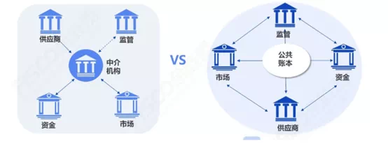
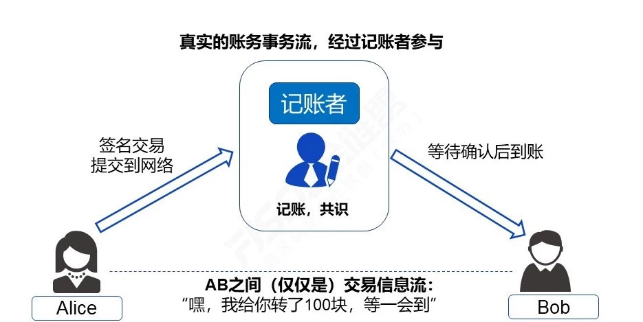

# 区块链上的交易真的是“点对点”吗？

作者：张开翔｜FISCO BCOS 首席架构师

**区块链上的交易是点对点的，不需要中心实体来维护交易**。这是很多为区块链摇旗呐喊的文章常用的开篇语，斩钉截铁，毋庸置疑，让人有种“**一入区块链，宛如面对面**”的错觉。

字面上的点对点和面对面

其实这句话有一定的迷惑性，如果精确地将“**中心实体**”定义为类似当下的一些强中介（这里不讨论这种模式的好坏），貌似说得通，毕竟区块链上没有物理上隔断各参与方的中介存在。

星型结构和公共账本互连模式对比

但如果到此为止，很容易给人“区块链上的交易就是‘点对点’了”的误导，而模糊了下述事实：实际上任何区块链系统都需要**共识节点，或者称为“记账者”或“矿工”**来打包和确认交易。即使是plasma、闪电/雷电网络等方案，也只是让参与者在特定通道上，直接或间接地交换账务信息流，最终结算或者纠纷处理，还是得回到主链上进行共识完成流程。

“矿工”这种存在，从理念上可以说是“去中心化”的，因为矿工不止一个，所以“没有中心实体”这句话看起来对，但矿工的“去中心化”事实上是一种**不确定性**，公链上的矿工已经出现了明显的集中趋势，或者类似“**21个长老**”这种被去中心化信徒诟病的卡特尔组织已经萌芽，其去中心化程度和安全性，某种程度上取决于“社区”博弈或某个大神的运作。

围绕着“矿工”的网络生态

而在效率和体验上，“古典”去中心化记账的服务质量很难说是可靠的，一旦出现热点交易状况，那么长达几天的网络堵塞、交易延迟、交易手续费飞涨都是常见的事情，一笔几美金的价值转换，手续费可能要上百美金。同时，做为普通小散韭菜用户，基本上没有机会去投诉或推动你期望的服务质量提升，连客服渠道都是找不到的，毕竟是“去中心化”嘛。

如果用户是使用区块链钱包或客户端交易，那么更别提“点对点”了，非轻客户端类型的钱包客户端，实际上是把交易发给了服务器，服务器来代理，将交易提交到区块链网络上。这还算是好的，只要钱包服务商不闹妖就问题不大。

如果是交易所的客户端，那很多情况就是在交易所的**业务数据库**里记一笔，连区块链网络都不碰。在缺乏监管、运营水平又参差不齐的“交易所”行业里，这种模式既“中心化”，又面临严峻的道德和安全风险，而“去中心化交易所”则是把中介角色交给了链上智能合约和矿工，理论上更加透明，但在效率、流程方面，依旧说不上是“点对点”。

如果用户干脆自己安装节点，直接加入到网络里，又是什么情况呢？

物理上，因为连接模型的约束（常见的Gossip模型只连接少数“邻居”节点），仅仅从网络层面看，你和交易对手大概率也是不会直连的，而是经过多次转发后，双方才能“碰头”，这是P2P网络的基本特性，并不是“字面上”的“点对点”。如果转发链路上有什么幺蛾子，那也是不确定性的。

一般来说，反复广播转发的网络模型里，在严谨地选择路由、验证连接邻居的前提下，信息到达率还是可以保障的。这里的“点对点”，事实上是广义的桥接型多跳连接（雷电/闪电网络也类似），这种模型不可避免的有一定的传输冗余和延迟率。事实上，被我们熟知的“P2P下载网络”，如果要达到飞一般的速度体验，是依赖普通节点之外的中心化服务器来加速的。

话说回来，就算物理网络建立了点对点连接，交易事务层面上还是要等待记账者（矿工）收拢交易打包，共识确认和同步区块，一笔交易才算完成了，这个过程中“物理直连”并不涉及经济模型方面的意义。

综上所述，所谓的“点对点”更像一句口号，其真实含义需要穿透表象来理解。对普通用户来说，他们理解的最朴素的“点对点”，是**面对面地把钱塞到对方手里**，一次握手即完成交易。而用户把交易发出去，无论下一步是到银行、支付公司、还是“分布式账本”，对普通用户来说，从本质上讲都是一种**委托交易**。

一手交钱一手交货

字面上的“点对点”交易

事实上的分布式账本

在这种格局下，“**面对面**”是不存在的，私密一定程度上也是不存在的。信息不给到记账者，怎么记账？零知识、环签名等重武器并不是每条链都配备的，追求全面隐私保护的链，计算和架构都会更加复杂，我们会另外分析。

最后，想想当下移动支付各种顺畅体验，银行大额转账秒级短信通知，区块链字面上所谓的“**点对点**”，真是说得美好，而现实骨感呢。

所以，如果读文章时，看到以吹嘘区块链是“点对点”这个slogan为立论基准，建议读者先理清楚他这里的“点对点”究竟说的是什么语境下的“点对点”。我心目中的分布式账本，真正的意义并不在于“点对点”，而是“可靠可信可控”，通过博弈和协作，多方共同实现的价值网络，让每个参与角色在其中都有其存在感。

当区块链系统能达到或接近现有中心化交易系统的速度和交互体验，包括**7\24高可用的多活多方记账、秒级延迟确认、快速达成最终一致性、并发处理能力又足够高、交易成本足够低、对公对私都有明确的QoS约定和兜底容灾容错方案**，而且区块链先天的分布式架构体系上有群体规模效应，可防作恶、防篡改，可监管，那么才算是**“多中心”信任背书、透明协作**的靠谱分布式交易系统。不喊口号、实干为主的联盟链目标，更贴近这个方向。

