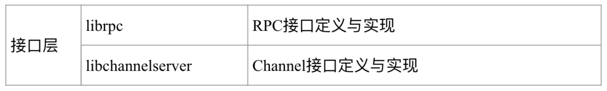
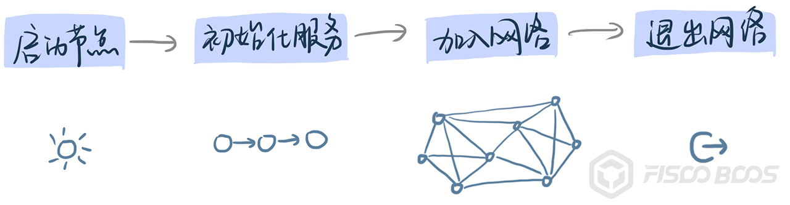
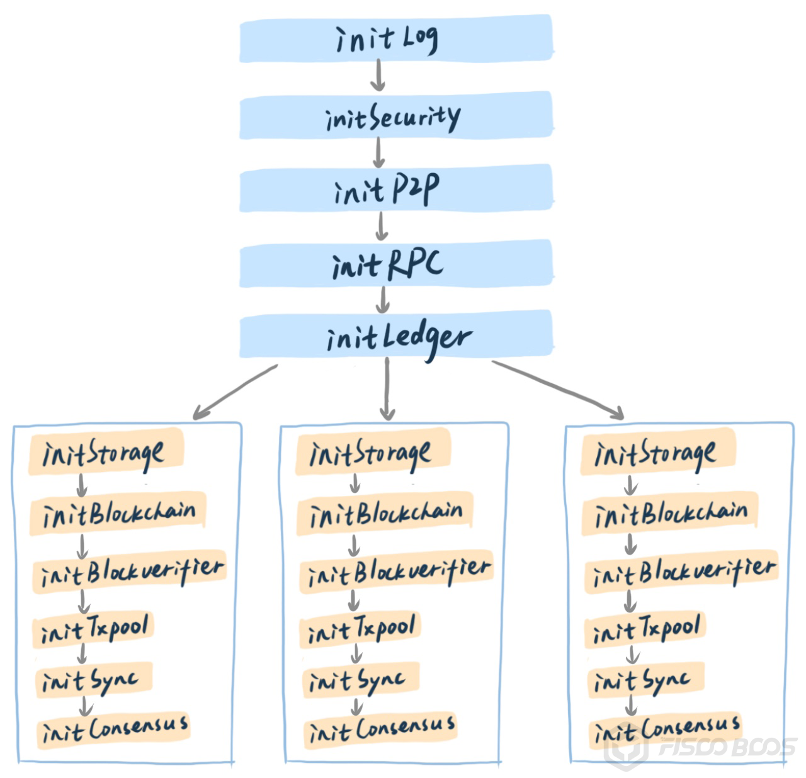

# 带你读源码：四大视角多维走读区块链源码

作者：李辉忠｜FISCO BCOS 高级架构师

## 引子

区块链作为「新基建」的重要组成部分，越来越受技术爱好者关注。区块链极客信奉“code is law”，相信通过代码可以构筑一个可信的世界。

而作为一门综合学科技术，区块链建立在数学、密码学、计算机原理、分布式网络和博弈论等众多基础学科之上，底层代码动辄数十万行，如果没有摸清门道，要完全掌握这些代码是极具挑战的。

本文希望给读者一个走读区块链源码的方法，让读者面对区块链底层项目时可以从容地说出“show me the code”。

## 基础知识储备

区块链是一门综合学科，涉及多个专业领域，涵括多方面的基础知识，在深度研究区块链之前需要做一定广度的知识储备。注意，这里说的是广度，并非深度，也就是说你只需要大概知道这些基础知识的基本原理与作用即可。

- 密码学相关：理解哈希、对称加密、非对称加密以及数字签名的基本原理和作用；
- 计算机操作系统相关：理解多进程、多线程、互斥、并行等相关概念和作用；
- 数据结构相关：理解队列、堆栈、树等基本数据结构和使用场景；
- 计算机网络相关：理解TCP/IP、心跳包、消息流等基本概念；
- 数据库相关：理解数据库基本概念，了解KV数据库的基本原理；
- 计算机原理相关：理解程序编译、解析、执行和字节码、虚拟机等概念；
- 分布式系统相关：理解点对点网络、分布式一致性、CAP等相关概念和基本原理；
- 程序开发相关：掌握相关的编程语言、构建工具等，理解项目构建基本流程。

## 多维走读

在储备了相关的基础知识之后，你就可以打开一份真正的区块链底层代码了，一般通过git clone可以快速下载到项目代码。

但是，面对数十万行的代码，该从何看起呢？

一个优秀的区块链底层项目，必然有一份优秀的工程代码，这份代码有其合理的组织结构与纹理逻辑。走读代码应效仿庖丁解牛，先摸清区块链的基本结构和逻辑，再开始走读，可以达到事半功倍的效果。

本文推荐要从四个不同视角进行走读，站在自己的需求角度出发去看代码，而不要被巨量的代码所左右。这四个角度为功能视角、系统视角、用户视角和开发视角，分别从逻辑层面、运行层面、使用层面和开发层面厘清代码架构和关键算法。

## 功能视角

在深入一份区块链底层代码之前，首先要通过其官网、技术文档、github wiki等渠道获取项目设计文档，了解其基本功能设计。

一般每个项目都会提供核心功能列表、总体架构图、功能模块图等介绍文档，通过这些介绍可以掌握项目基本功能。即使你真的找不到也不打紧，大部分区块链底层项目在功能设计层面的差异较小，核心功能模块也大致相同。

以FISCO BCOS为例，基础层代码如下：

核心层核心代码如下：

接口层核心代码如下：

从功能视角出发，先定位核心功能模块的代码位置，再仔细深入各个功能代码，从单个功能模块内，也可继续递归采用功能视角拆分法，广度遍历直至了解全貌。

## 系统视角

系统视角从整个区块链网络运行角度，关注区块链节点全生命周期所参与的系统行为。

关注点包括从敲下启动节点的命令开始，节点经历了哪些初始化环节，之后又是如何与其他节点建立点对点网络，以及完成分布式协作的。

由于不同区块链在部署架构上略有差异，系统运行方式也有所不同，但万变不离其宗，系统视角来看，每个区块链系统都要经历节点初始化、建立点对点网络、完成分布式交互的过程。

从系统视角看区块链，首先要关注初始化工作。以FISCO BCOS为例，区块链节点启动从main函数入口进入，通过libinitializer模块初始化并启动各模块，启动顺序如下：

通过启动顺序可以知道FISCO BCOS的一个重要特性——支持多群组账本，每个群组是一个独立的Ledger模块，每个Ledger具有独立的存储、同步、共识处理功能。

完成初始化工作同时，系统将会启动若干线程（或者进程、协程，原理类似），这些线程包括网络监听、共识、消息同步等，可以结合代码分析与系统命令查看运行节点配合确定有哪些关键线程，搞清楚关键线程的工作机制就可以基本掌握区块链系统运行机制。

以FISCO BCOS为例，节点启动之后的关键线程以及他们之间的关系如下：

初始化完成之后，网络模块的Host线程将根据配置列表，主动与其他节点建立连接，并且持续监听来自其他节点的连接；Sync线程开始相互发送区块高度，发现高度低于其他节点则开启下载逻辑；RPC与Channel线程等待客户端发送请求，将收到的交易塞入txpool；Sealer线程从txpool获取交易，Consensus线程则开始处理共识消息包。

如此，整个区块链系统有条不紊地运转，完成客户端请求与分布式协作。

##  用户视角

用户视角关注操作接口和交易生命周期，关注访问区块链的接口和协议设计、编解码方式、核心数据结构、错误码规范等，还会关注如何发送一笔交易到链上，交易在链上又经历了哪些处理流程，直到达成全网共识。

一般区块链底层项目都会给出交互协议的说明文档，通常实现包括JsonRPC、gRPC、Restful等不同类型的交互协议。

不同项目的交互接口会有所不同，但大都会包含发送交易、部署合约、调用合约、查看区块、查看交易以及回执、查看区块链状态等接口。不同项目的数据编码也会有所不同，有些采用Json，有些采用protobuf等。

当从技术文档中了解清楚交互协议、接口、编解码和错误码等设计细节之后，接下来最重要的是通过发送交易、部署合约、调用合约这些关键接口，对代码进行抽丝剥茧，贯穿交易整个生命周期，从而搞清楚区块链底层最核心的逻辑。

以FISCO BCOS为例，通过多个模块相互协作，完成交易整个生命周期的处理：

##  开发视角

开发视角关注的是整个代码工程，包括第三方依赖，源码模块之间的相互关系，单元测试框架和测试用例，编译和构建方式，持续集成和benchmark，以及如何参与社区源码贡献等等。

不同语言都有相应推荐的编译构建方式以及单测框架，通常在区块链项目源码目录可以快速定位到第三方依赖库，比如以cmake构建的C++项目有CmakeLists.txt文件，go项目有go.mod文件，rust项目有cargo.toml文件等。

以FISCO BCOS为例，从CmakeLists.txt可以看到依赖库包括：

项目核心源码包括fisco-bcos程序入口代码，以及libxxx的各模块代码，根据模块的名字可以快速识别其对应功能，这里也体现了一个项目源码质量的高低，高质量的代码应该是“代码即注释”。

单元测试代码在test目录，采用boost的单元测试框架，子目录unittests中单测代码与源码目录一一对应，非常容易找到源码对应的单元测试代码。

构建和持续集成工具代码在tools目录，子目录ci中维护了多个不同场景的持续集成用例，在github提交的每一个pr（pull request）都会触发这些持续集成用例，当且仅当每个用例成功通过方可允许合入pr。

关于FISCO BCOS的代码规范和贡献方式，在CODING_STYLE.md和CONTRIBUTING.md文件中有详细描述，鼓励社区用户积极参与贡献。

## 总结

区块链涉及领域和知识较多，需要深入源码细节，才能真正完全掌握区块链核心技术。所谓“重剑无锋，大巧不工”，掌握源码走读的基本方法论，才能在巨量代码前，面不改色心不跳。

本文提出从功能、系统、用户和开发四个不同视角进行区块链底层代码走读的方法，一般来说，依次选择不同视角进行走读是比较推荐的方式，也可以根据个人喜好和能力模型选择视角顺序。

最后，本文所举示例皆为FISCO BCOS，但这套走读方法可以适用于任何其他区块链底层项目，希望本文对你有所帮助。