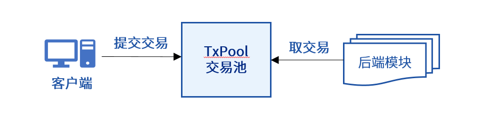
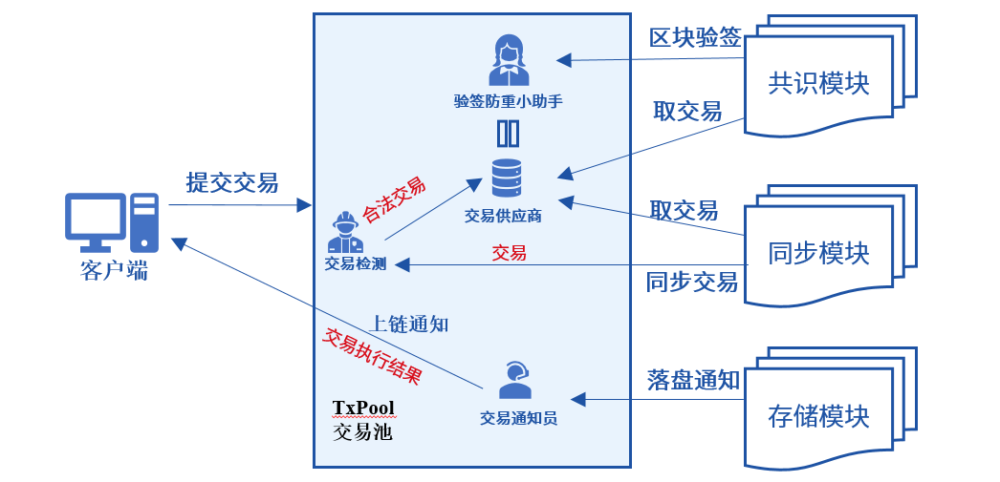

# FISCO BCOS中交易池及其优化策略

作者：陈宇杰｜FISCO BCOS 核心开发者

**作者语**

FISCO BCOS区块链系统中，交易上链之前，均存储在交易池中。交易池是区块链小能手，一方面担任质检员的职务，将所有非法交易拒之门外；一方面担任供应商的职责，向共识模块输送合法交易；还负责向客户端推送上链通知。可以说，FISCO BCOS区块链系统的交易池异常忙碌，其性能会直接影响区块链系统性能。本文就带领大家揭开交易池面纱，了解交易池多重身份，并一起领会FISCO BCOS区块链系统中的交易池如何在多重角色间游刃有余。

------

## 初识交易池

如上图所示，FISCO BCOS区块链系统中，接收存储客户端发送的交易是交易池基本职责，这些交易是共识模块打包交易和同步模块广播交易的“原材料”。交易池需要保证这些交易“原材料”的质量，对交易合法性进行验证。当然，为了防止DOS攻击，FISCO BCOS对交易池容量进行了限制，当交易池内交易数目超过容量限制后，会拒绝客户端发送的新交易。

## 交易池的重要性

FISCO BCOS区块链系统中，交易池作为关键系统模块，同时肩负着和SDK以及后端多个模块的交互，本节就以交易池的多重职责为切入点，和大家一起看看交易池有多忙。

### 交易池的四重职责

上图展示了交易从客户端发出到上链整个生命周期里，交易池所扮演的多重角色：

- **交易质量检测员**：交易放入交易池前，检测交易的有效性，有效的交易必须满足：①签名有效；② 非重复交易；③ 非已上链交易。
- **交易供应商**：存储合法交易，为后端模块提供交易“原材料”。
- **验签防重小助手**：为共识模块提供区块验签接口，仅验证在交易池内未命中交易，提升共识区块验证效率。
- **交易上链通知员**：交易上链成功后，将交易执行结果通知到客户端。

交易池作为区块链核心模块，身兼四职，每笔交易处理流程中，均需与后端三个模块、内部四个模块以及客户端进行多达八次交互，确实是异常忙碌。

### 交易池的作用

下面就以区块链节点交易处理生命周期为例，详细了解交易池各重角色在其中所起的作用。

如上图，客户端发送的交易到节点会被流水线式处理，每条流水均需有五个处理流程：

- **交易检测**：客户端发送的交易发送到节点后，首先要经过交易池的质量检测员的检验，交易池仅会把签名有效、不重复、未上链的交易放入交易池内。
- **交易存储**：交易过了“质量检测”后，被存储交易池内，此时交易池身负“供应商”的角色，共识模块从交易池内获取新交易用于打包成区块；同步模块从交易池内获取新增交易，广播给所有其他共识节点。
- **交易打包&&交易共识**：共识模块从交易池内获取合法交易，打包成新区块，并广播到所有其他共识节点，其他共识节点收到打包的新区块后，为了保证区块的合法性，会验证区块内每笔交易签名。考虑到交易验签是非常耗时的操作，且新区块内交易有极大概率在其他节点交易池内命中，为了提升共识验证效率，交易验签防重小助手此时派上了用场，它会仅验证新区块中未在本地交易池命中的交易签名。
- **交易提交**：交易共识达成后，会调用存储模块，将交易及其执行结果提交到区块链数据库。
- **交易通知**：交易上链成功后，交易池的上链通知员将交易执行结果通知给客户端。

在交易从发出到上链的整个生命周期里，每个过程都有交易池的参与，因此交易池对于整个区块链系统非常重要，交易池每个处理过程都直接影响了区块链系统性能。

## 交易池优化

通过前面介绍，我们了解到FISCO BCOS区块链系统的交易池异常忙碌，并且直接影响了区块链系统性能，本节就来详细说说交易池的优化历程和优化方法。

### 优化交易处理流水线效率

通过上面交易处理流水线示意图可看出，交易池参与了交易处理的每个流程，因此交易池每个处理流程都对系统性能影响很大。FISCO BCOS区块链系统采用拆分且并行执行交易验证任务、交易异步通知策略来优化交易流水线处理效率。

### 优化交易验证效率

FISCO BCOS rc2引入并行交易后，FISCO BCOS开发者们发现压测过程中共识模块每个区块经常无法打满交易，偶尔还会出现共识模块出空块、等待交易池提供新交易的现象。排查发现，交易池作为交易检测员任务太重，既要验证交易签名，又要检查交易是否重复、是否已上链，导致向交易供应商提供交易效率非常低，经常出现交易供不应求的情况，严重影响了区块链系统TPS。

下图描述了这种供不应求的现象：

为了打破交易池供不应求的困局，优化交易流水线处理效率，FISCO BCOS区块链系统引入专门的交易验签模块，并将“交易检测员”的“验证签名”职责分担给了这个新模块，且为了进一步提升交易存储效率，交易验签模块并行对交易进行验证。优化交易处理流水线后，“交易检测员”的工作负担轻了很多，交易供应商完全能满足共识模块的交易需求，而且还留有部分存货。

优化处理流水线后，"交易检测员"的重活被"人力充足"的"验签模块"分担了，系统性能显著提升：采用并行交易压测，FISCO BCOS区块链系统性能突破了1W。

### 交易异步通知

通过前面的介绍，大家了解到交易池还承担着交易通知的职责，"交易通知员"也是个忙碌的角色，它需要在收到区块落盘信号后，将所有上链交易通知给客户端，当且仅当共识模块确认上一轮共识的上链交易都会被通知到后，共识模块才会开始下一轮共识，交易同步推送无疑会拖慢共识流程。为了进一步优化流水线处理效率，FISCO BCOS区块链系统采用了交易异步通知策略：存储模块将交易通知结果放置于交易通知队列后直接返回，共识模块直接开始下一轮共识流程，与此同时，交易通知模块将交易执行结果依次返回给客户端。

如下图所示：

采用交易异步通知策略后，交易通知不会阻塞共识流程，大约能提升10%的系统性能。

### 双缓存队列

FISCO BCOS 2.1之后，FISCO BCOS团队认真统计了每个区块的处理时间，觉得系统性能还有继续上升的空间，于是决定继续优化性能，进一步提升FISCO BCOS区块链系统的处理能力。

当存储模块和执行模块性能优化到极致后，可是最终的压测结果总是不符合预期。经过排查发现交易池又出现了供不应求的情况，只是这种供不应求是客户端引起的，客户端发送交易后，大量线程阻塞在等待交易验证通过，返回交易哈希，无法空出更多线程发送新交易。

为了提升节点对客户端的响应速度，从而提升客户端交易发送速率，FISCO BCOS区块链系统在“交易供应商”持有的交易储存队列基础上，引入了交易预缓冲区，存放客户端发送到节点的交易，并直接对客户端进行响应。

交易预缓冲区会持续将缓存的交易送到"验签模块"和"交易检测员"处进行验证，验证通过的交易最终会被放入到真正的交易队列供交易供应商调度，如下图所示：

这种双缓存队列机制，大大提升了交易池对客户端的响应速度，客户端也可以持续腾出线程继续发送新交易，优化后，客户端发送性能更高，交易池供大于求。

## 小结

交易池很忙，FISCO BCOS区块链系统中，交易池更忙，它被用来验证交易、存储交易、防止交易重复验签、向客户端推送交易执行结果等。交易池很重要，FISCO BCOS区块链系统中，交易池更重要，任务繁重的"交易检测员"会大大降低交易插入速率，导致交易供不应求；没有"交易预缓冲区"的交易池会阻塞客户端交易发送线程，降低客户端交易发送速率；交易同步推送，会损耗10%左右的系统性能... ...

在性能优化的道路上，交易池性能优化一直会被排在重要的位置。