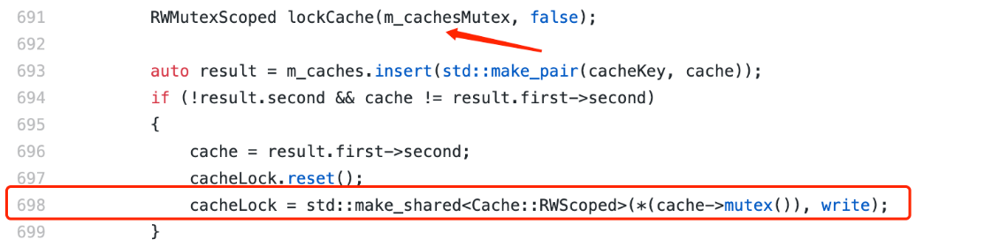
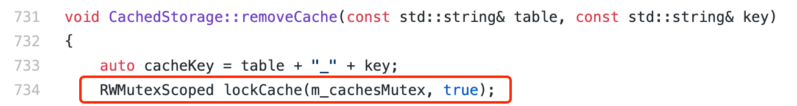
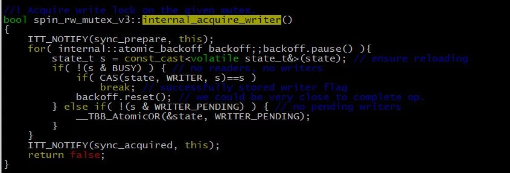
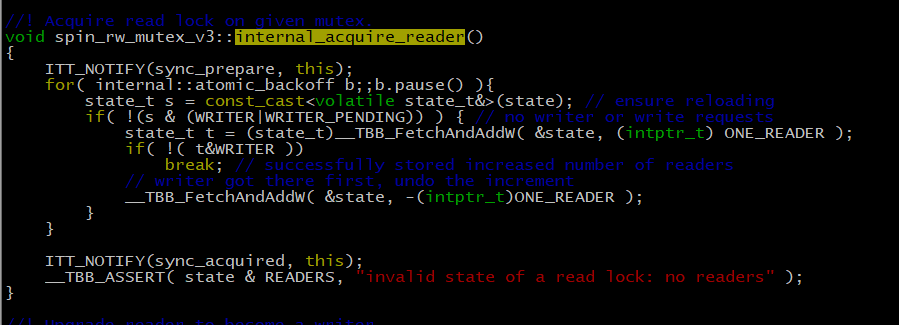

# 记一次CachedStorage中死锁的调试经历

作者：李陈希｜FISCO BCOS 核心开发者

在整合FISCO BCOS非国密单测与国密单测的工作中，我们发现CachedStorage的单测偶然会陷入卡死的状态，且可在本地持续复现。复现方式为循环执行CachedStorage单测200次左右，便会发生一次所有线程均陷入等待状态、单测无法继续执行的情况，我们怀疑在CachedStroage中发生了死锁，故对此进行调试。

## Debug思路

中医治病讲究望闻问切，调试bug同样需要遵循寻找线索、合理推断、验证解决的思路。

### 观察线程栈

在死锁发生时，使用/usr/bin/sample工具（mac平台环境下）将所有的线程的栈打印出来，观察各线程的工作状态。从所有线程的线程栈中观察到有一个线程（此处称为T1）卡在CachedStorage.cpp的第698行的touchCache函数中，点击参考[具体的代码实现](https://github.com/FISCO-BCOS/FISCO-BCOS/blob/release-2.3.0-bsn/libstorage/CachedStorage.cpp)。

从代码片段中可以看到，T1在第691行已经获得了m_cachesMutex的读锁：代码RWMutexScoped(some_rw_mutex, false)的意思是获取某个读写锁的读锁；相应地，代码RWMutexScoped(some_rw_mutex, true)的意思是获取某个读写锁的写锁，这里的RWMutex是一个Spin Lock。

随后在第698行处尝试获取某个cache的写锁。除了T1，还有另外一个线程（此处称为T2）卡在CachedStorage.cpp的第691行的touchCache函数中：

从代码片段中可以看到，T2在第681行已经获得了某个cache的写锁，随后在第691行处尝试获取m_cachesMutex的读锁。 继续观察后还发现若干线程卡在CachedStorage.cpp第673行的touchCache函数中：

最后还有一个Cache清理线程（此处称为T3）卡在CachedStorage.cpp的第734行的removeCache函数中：

从代码片段中可以看到，这些线程均没有持任何锁资源，只是在单纯地尝试获取m_cachesMutex的写锁。

### 读写饥饿问题

初期分析问题时，最诡谲的莫过于：在T1已经获取到m_cachesMutex读锁的情况下，其他同样试图获取m_cachesMutex读锁的线程竟然无法获取到。但是看到T3线程此时正努力尝试获取m_cachesMutex写锁，联想到读写锁饥饿问题，我们认为其他线程获取不到读锁的问题根源很可能就在T3。

所谓读写锁饥饿问题是指，在多线程共用一个读写锁的环境中，如果设定只要有读线程获取读锁，后续想获取读锁的读线程都能共享此读锁，则可能导致想获取写锁的写线程永远无法获得执行机会（因为读写锁一直被其他读线程抢占）。为了解决饥饿问题，部分读写锁会在某些情况下提高写线程的优先级，即由写线程先占用写锁，而其他读线程只能在写线程后乖乖排队直到写线程将读写锁释放出来。

在上述问题中， T1已经获取了m_cachesMutex的读锁，若此时T3恰好获得时间片并执行到CachedStorage.cpp的第734行，会因获取不到m_cachesMutex的写锁而卡住，随后其他线程也开始执行并到了获取m_cachesMutex读锁的代码行。若读写防饥饿策略真的存在，那这些线程（包括T2）的确会在获取读锁阶段卡住，进而导致T2无法释放cache锁，从而T1无法获取到cache锁，此时所有线程均会陷入等待中。

在这个前提下，似乎一切都能解释得通。上述流程的时序图如下所示：

我们找到了TBB中Spin RW Lock的实现代码，如下图所示：

获取写锁：

获取读锁：

在获取写锁的代码中，可以看到写线程如果没有获取到写锁，会置一个WRITER_PENDING标志位，表明此时正有写线程在等待读写锁的释放，其他线程请勿打扰。

而获取的读锁代码中，也可以看到，如果读线程发现锁上被置了WRITER_PENDING标志位，就会老实地循环等待，让写线程优先去获取读写锁。这里读写锁的行为完美符合之前对读写锁防饥饿策略的推测，至此真相大白。既然找到了问题起因，那解决起来就容易多了。在CachedStorage的设计中，Cache清理线程优先级很低，调用频率也不高（约1次/秒）,因此给予它高读写锁优先级是不合理的，故将removeCache函数获取m_cachesMutex写锁方式做如下修改：

修改后，获取写锁方式跟获取读锁类似：每次获取写锁时，先try_acquire，如果没获取到就放弃本轮时间片下次再尝试，直到获取到写锁为止，此时写线程不会再去置WRITER_PENDING标志位，从而能够不影响其他读线程的正常执行。

相关代码已提交至2.5版本中，该版本将很快与大家见面，敬请期待。

### 实现效果

修改前循环执行CachedStorage单测200次左右便会发生死锁；修改后循环执行2000+次仍未发生死锁，且各个线程均能有条不紊地工作。

## 经验总结

从这次调试过程中，总结了一些经验与大家分享。

首先，分析死锁问题最有效的仍然是“两步走”方法，即通过pstack、sample、gdb等工具看线程栈，推测导致发生死锁的线程执行时序。这里的第二步需要多发挥一点想象力。以往的死锁问题往往是两个线程间交互所导致，教科书上也多以两个线程来讲解死锁四要素，但在上述问题中，由于读写锁的特殊性质，需要三个线程按照特殊时序交互才可以引发死锁，算是较为少见的情况。

其次，『只要有线程获取到读锁，那其他想获取读锁的线程一定也能获取读锁』的思维定势是有问题的。至少在上面的问题中，防饥饿策略的存在导致排在写线程后的读线程无法获取读锁。但本文的结论并非放之四海而皆准，要不要防饥饿、怎么防饥饿在各个多线程库的实现中有着不同的取舍。有的文章提到过某些库的实现就是遵循『读线程绝对优先』规则，那这些库就不会遇到这类问题，所以仍然需要具体问题具体分析。