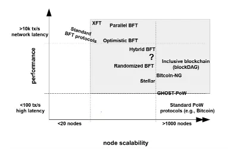
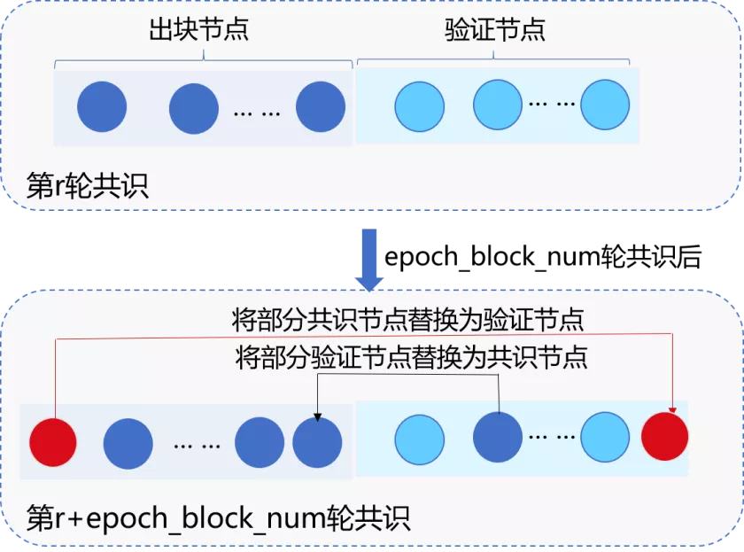

# 我们为什么这样设计RPBFT？

作者：陈宇杰｜FISCO BCOS 核心开发者

## 前言

共识模块是区块链系统的引擎，在保证各区块链节点数据一致性方面起到至关重要的作用。FISCO BCOS引入可插拔的共识引擎后，同时支持PBFT和Raft两种共识算法，相较于采用POW共识算法的区块链系统，交易确认时延更低、吞吐量更高，可满足当前大部分联盟链系统的性能需求。

PBFT共识算法更因其可容忍拜占庭错误而天然适用于区块链系统。可PBFT共识算法也存在可扩展性低的问题。FISCO BCOS团队从2019年开始一直致力于研究新的共识算法，以同时保障区块链系统的性能和可扩展性。FISCO BCOS 2.3版本中发布的RPBFT共识算法为研究成果之一。本文将详细介绍RPBFT共识算法的设计目的与其中的技术实现。

## PBFT共识算法挑战

介绍RPBFT共识算法之前，先来看看PBFT共识算法的挑战，以及学术界的对应解决方案。PBFT共识算法起源于上世纪。1999年，Miguel Castro(卡斯特罗)和Barbara Liskov(利斯科夫)提出PBFT共识算法，将BFT算法复杂度从指数级降到多项式级，使得PBFT共识算法就可应用于实际系统中。不同于POW共识算法，PBFT基于分布式一致性原理保障分布式系统最终一致性。由于摒弃了算力，PBFT共识算法性能更高、交易确认时延更低，加之基于密码学技术的防作恶机制，天然适用于联盟区块链系统。可PBFT共识算法也有"软肋"，从其三阶段共识流程得以一窥。

从上图可看出，PBFT共识流程中，节点之间需要相互广播共识消息包，且网络复杂度与节点数目的平方成正比，严重限制了PBFT的可扩展性。

下图整理自IBM研究员Marko调研，反映了采用不同共识算法的区块链系统节点规模与交易延迟之间的关系：

从中可看出，BFT类共识算法性能很高，但其支撑的节点规模最多不超过1000。2019年，HotStuff成为各区块链平台争相研究的共识算法，相对于PBFT，HotStuff具备算法简单、网络复杂度与节点规模成线性关系等多种优势。下图是HotStuff的核心流程：

由于HotStuff复杂度仍然与节点规模成正比，没法从根本上解决共识算法可扩展性问题，且HotStuff每个阶段都依赖于Leader收集、广播消息包，Leader会成为每轮共识的瓶颈。基于以上调研，FISCO BCOS团队先后实现了PBFT分组共识算法、HotStuff共识算法。但随着节点规模的增加，这些共识算法的性能、吞吐率逐渐下降。因此，我们开始探索一种不会因节点数量增加而导致区块链系统性能快速线性下降的共识机制，RPBFT共识算法在这种情况下应运而生。

## RPBFT共识算法核心思想

RPBFT共识算法的目标是在保障区块链系统性能、安全性的前提下，将共识算法网络复杂度与共识节点规模解耦，提升区块链系统的可扩展性。为实现这个目标，FISCO BCOS团队参考DPOS思路，在大节点规模下，随机选取部分节点作为“共识委员节点”参与每轮PBFT共识，由于共识委员节点数目固定、与节点规模无关，因此RPBFT共识算法可扩展性更强。此外，为了保障系统安全、防止共识委员节点联合作恶，RPBFT算法会周期性地替换共识委员节点，如下图所示

## RPBFT共识算法实现方案

RPBFT算法主要包括2个系统参数：

- epoch_sealer_num：每轮共识过程中参与共识的节点数目，可通过控制台发交易方式动态配置该参数。
- epoch_block_num: 共识节点替换周期，为防止选取的共识节点联合作恶，RPBFT每出epoch_block_num个区块，会替换若干个共识委员节点，可通过控制台发交易的方式动态配置该参数。

这两个配置项记录在系统配置表中，配置表主要包括配置关键字、配置对应的值、生效块高三个字段，其中生效块高记录了配置最新值的最新生效块高，例：在100块发交易将epoch_sealer_num和epoch_block_num分别设置为4和10000，此时系统配置表如下：

| key              | value | enable_num |
| ---------------- | ----- | ---------- |
| epoch_sealer_num | 4     | 101        |
| epoch_block_num  | 10000 | 101        |

RPBFT共识算法核心算法流程如下:

### 确定各共识节点编号IDX

对所有共识节点的NodeID进行排序，如下图，节点排序后的NodeID索引即为该共识节点编号：

### 链初始化

链初始化时，RPBFT需要选取epoch_sealer_num个共识节点到共识委员中参与共识，目前初步实现是选取索引为0到epoch_sealer_num-1的节点参与前epoch_block_num个区块共识。

### 共识委员节点运行PBFT共识算法

选取的epoch_sealer_num个共识委员节点运行PBFT共识算法，验证节点同步并验证这些验证节点共识产生的区块，验证步骤包括：

- 校验区块签名列表：每个区块必须至少包含三分之二共识委员节点的签名
- 校验区块执行结果：本地执行结果须与共识委员产生的区块执行结果一致

### 动态替换共识委员节点列表

为保障系统安全性，RPBFT算法每出epoch_block_num个区块后，会在共识委员列表中剔除若干个节点，并加入若干个验证节点，下面以每epoch_block_num个区块剔除一个节点为例：

在目前的RPBFT算法实现中，共识委员列表节点被轮流替换为验证节点，设当前有序的共识委员会节点列表为CommitteeSealersList，共识节点总数为N，则共识epoch_block_num个区块后，会将CommitteeSealersList[0]剔除出共识委员列表，并加入索引为(CommitteeSealersList[0].IDX + epoch_sealer_num) % N的验证节点。第i轮替换周期，将CommitteeSealersList[i % epoch_sealer_num]剔除出共识委员列表，加入索引为(CommitteeSealersList[i%epoch_sealer_num].IDX + epoch_sealer_num) % N的验证节点。

## RPBFT网络优化

考虑到Prepare数据包较大，占网络开销大头，为了进一步提升RPBFT共识算法可扩展性，我们在FISCO BCOS 2.3引入了Prepare包广播优化。将Leader因广播Prepare包产生的出带宽流量分摊给其下属子节点，即：Leader产生Prepare包后，沿着树状拓扑将数据包传播给其他节点，如下图所示：

为保证在节点断连情况下开启树状广播时，Prepare包仍能到达每个节点，RPBFT引入了基于状态包的容错机制，如下图所示： 

主要流程包括：

1. 节点A收到Prepare后，随机选取33%节点广播Prepare包状态，记为prepareStatus，包括{blockNumber, blockHash, view, idx}。

2. 节点B收到节点A随机广播过来的prepareStatus后，判断节点A的Prepare包状态是否比节点B当前Prepare包localPrepare状态新。主要判断依据包括：

   (1) prepareStatus.blockNumber是否大于当前块高

   (2) prepareStatus.blockNumber是否大于localPrepare.blockNumber

   (3) prepareStatus.blockNumber等于localPrepare.blockNumber情况下，prepareStatus.view是否大于localPrepare.view

   以上任意一个条件成立，都说明节点A的Prepare包状态比节点B的状态新。

3. 若节点B的状态落后于节点A，且节点B与其父节点断连，则节点B向节点A发出prepareRequest请求，请求相应的Prepare包。

4. 若节点B的状态落后于节点A，但节点B与其父节点相连，若节点B最多等待100ms(可配)后，状态仍然落后于节点A，则节点B向节点A发出prepareRequest请求，请求相应的Prepare包。

5. 节点B收到节点A的prepareRequest请求后，向其回复相应的Prepare消息包。

6. 节点A收到节点B的Prepare消息包后，执行handlePrepare流程处理收到的Prepare包。

区块落盘后，为降低多个验证节点、观察节点向共识委员节点同步区块时，共识委员节点的网络出带宽对网络可扩展性的影响，RPBFT采用了区块状态树状广播策略，详细可参考[FISCO BCOS同步模块的优化策略](https://mp.weixin.qq.com/s?__biz=MzA3MTI5Njg4Mw==&mid=2247485447&idx=1&sn=2bb8fa3dcf9f9276154ce83f9a75be82&scene=21#wechat_redirect)。

## RPBFT算法优化展望

FISCO BCOS 2.3初步实现了RPBFT共识算法，消除了节点规模对共识算法复杂度的影响。但目前实现的RPBFT共识算法，仍有待改进的地方，诸如：共识委员节点选取替换规则比较简单等。未来计划引入VRF可验证随机数算法来实现私密、随机、非交互式的共识委员节点选取方法，欢迎大家体验并反馈意见。

## 小结

本文介绍了BFT类算法的挑战以及FISCO BCOS团队在共识算法领域探索的初步成果。分布式系统共识是大而复杂的领域，FISCO BCOS 2.3发布的RPBFT算法目前仅解耦了节点规模对网络复杂度的影响，是实现高安全、可扩展共识算法的第一步，未来还会引入VRF算法来保证共识委员节点选取的安全性，敬请期待。