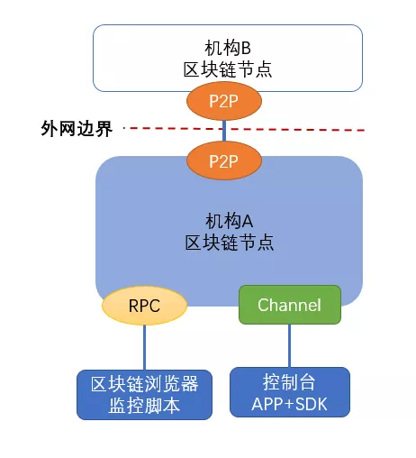
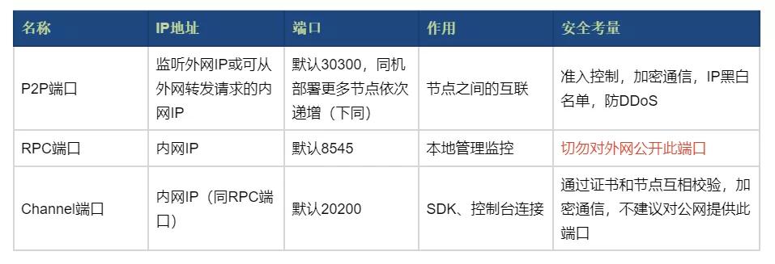

# FISCO BCOS网络端口讲解

作者：张开翔｜FISCO BCOS 首席架构师

**作者语**

区块链网络由多个互相连接的节点构成，每个节点又与客户端浏览器监控工具等相连；理清各种网络端口的存在，达成网络畅通的同时又保证安全是建立区块链网络的基础。
同时，在搭链的过程中有一些热点问题，比如为什么节点开了这么多端口？或者为什么网络不通？节点无法连接？没有共识出块？正所谓"通则不痛"，**网络畅通才能链接一切**。

本期文章讲的就是网络端口互通这点事，作者从FISCO BCOS的网络端口、FISCO BCOS 2.0的典型网络配置、设计网络安全组的一些策略等角度进行了解析。

## FISCO BCOS 2.0网络的三类端口

FISCO BCOS 2.0的网络包括P2P端口、RPC端口、Channel端口。




### 1.P2P端口

P2P端口，用于区块链节点之间的互联，包括机构内的多个节点，以及多机构间节点和节点的互联。如果其他节点在机构外，那么这个连接要监听公网地址，或者监听内网，且由连接公网的网关（如nginx）转发网络连接。
节点之间的连接会由联盟链的准入机制控制，节点之间连接依赖节点证书验证，以排除未经许可的危险连接。这个链路上的数据通过SSL方式加密，采用高强度密钥，可以有效的保护通信安全。

[P2P网络详细设计](https://fisco-bcos-documentation.readthedocs.io/zh_CN/latest/docs/design/p2p/p2p.html)

[网络安全和准入控制](https://fisco-bcos-documentation.readthedocs.io/zh_CN/latest/docs/design/security_control/index.html)

### 2.Channel端口

Channel端口，控制台和客户端SDK连接Channel端口，互相之间要通过证书认证，只有经过认证的客户端才能向节点发起请求，通信数据也是采用SSL方式加密。Channel端口使用了TCP的长连接，用心跳包检测和保持存活，通信效率较高，支持AMOP协议的点对点通信，功能相当灵活强大。
Channel端口应只监听内网IP地址，供机构内其他的应用服务器通过SDK连接，不应监听外网地址或接受公网的连接，以免发生不必要的安全的问题，也不要只监听本地地址（127.0.0.1或localhost），否则其他应用服务器将无法连接到节点上。

[SDK文档](https://fisco-bcos-documentation.readthedocs.io/zh_CN/latest/docs/sdk/index.html)

[AMOP协议](https://fisco-bcos-doc.readthedocs.io/zh_CN/latest/docs/design/amop_protocol.html)

### 3. RPC端口

RPC是客户端与区块链系统交互的一套协议和接口，用户通过RPC接口可查询区块链相关信息（如块高、区块、节点连接等）和发送交易。

RPC端口接受JSON-RPC格式的请求，格式比较直观清晰，采用CURL、JavaScript、Python、Go等语言都可以组装JSON格式的请求，发送到节点来处理。当然发送交易时，要在客户端实现交易签名。要注意的是，RPC连接没有做证书验证，且网络传输默认是明文的，安全性相对不高，建议只监听内网端口，用于监控、运营管理，状态查询等内部的工作流程上。目前监控脚本，区块链浏览器连接的是RPC端口。

[RPC端口文档](https://fisco-bcos-doc.readthedocs.io/zh_CN/latest/docs/develop/api.html)

## 一个FISCO BCOS 2.0的典型网络配置

FISCO BCOS 2.0一个典型网络配置如下所示，可以看到RPC和Channel端口共用一个IP，P2P连接单独监听一个IP，即一个区块链节点使用2个IP和3个端口。 

节点下的config.ini文件：

```
[rpc]listen_ip=127.0.0.1channel_listen_port=20200jsonrpc_listen_port=8545[p2p]listen_ip=0.0.0.0listen_port=30300
```

## 几种计算机的典型网络地址

**1、特殊地址**：0.0.0.0，表示监听本机所有的地址，包括本地、内网、公网（如有）地址，也就是全面放开，来者不拒。除非为了方便且确信安全，一般不应监听这个地址。

**2、本机地址**：127.0.0.1（有的配置可以写成localhost），只有同在本机上的其他进程才能连接到这个地址，其他机器一律连不过来。FISCO BCOS有的示例脚本为了安全和简易起见，默认写的是这个地址，包括build_chain脚本默认配置等。用户有时会发现其他机器运行客户端程序连不过来，大概率是这个原因，或者也可以检查下网络策略是否开通了互联，建议可以用系统的 telnet 【ip】【port】命令来先快速检测下是否能联通。

**3、内网地址**：通常192.168.xxx.xxx, 172.xxx.xxx.xxx，10.xxx.xxx.xxx开头的地址是内网地址，如监听这个地址，则只有同一局域网的其他机器可以访问它。

**4、外网地址**：暴露在互联网上的公网地址，或者可以从机构外部网络访问的地址，总之是外部服务器能连接的就是外部地址。

## 设计网络安全组的一些策略

在不同的网络拓扑上，可能牵涉这样的情况：服务器虽然可以访问外网，但是是由网关、路由器、NAT转发的，这时就需要了解具体的网络结构，进行配置了。如监听一个内网地址，把这个内网地址和监听的端口配置到转发器上，同样也可以接收来自外网的连接。

在网络安全方面，需要仔细的设计网络安全组策略，IP和端口黑白名单，精确的进行双向的连接控制。包括不限于以下策略：

- **1、设置外部IP白名单**，只有这些外部IP（一般是建立了联盟的其他机构）能连接过来；
- **2、设置IP黑名单**，拒绝某些特定IP的连接，而不用等它连接到节点才进行准入控制判断；
- **3、控制RPC端口**，（如8545端口）只对本机开放，其他内网外网服务器都连不到这个端口；
- **4、控制Channel端口**，只对某一个内网网段或某几个IP开放，把自己的应用部署到开放的网段或IP对应的服务器上，内网其他应用不能访问区块链节点；
- **5、但凡有外网端口**，建议设置防DDoS的措施，避免频繁连接、海量并发连接攻击。

## 总结

三种网络端口的IP地址、端口、作用、安全考量



------

### 群友问答

**Q**：节点间采用P2P通讯，同时采用SSL认证，每个节点如何获取和验证链接节点的公钥证书、预置根证书和证书链？节点跟其他节点通讯时，哪方做Server，哪方做Client？

**A**：在创建链的时候，就分配了链的根证书；每个节点跟其他节点通讯时，互为Server Client。

**Q**：外网IP建议布防DDoS攻击，这是一种标准的中心化的防御逻辑。区块链的实现逻辑是去中心化，攻击单个节点是否变得没有意义？机构能不能布置更多的节点？

**A**：关于DDoS的问题，对联盟链来说，一个机构一般部署两个节点，要是被攻击可能是会影响该机构的业务，但不至于影响全网。机构可以布置多个节点，比如4个、5个或者10个。

感谢参与本次话题讨论的小伙伴们！开源社区，因你们更美！

**欢迎更多朋友加入FISCO BCOS官方技术交流群，参与更多话题交流**。（进群请扫描下方二维码添加小助手【FISCOBCOS010】）


